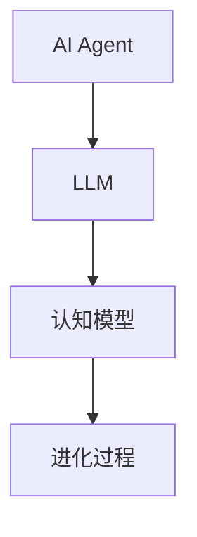
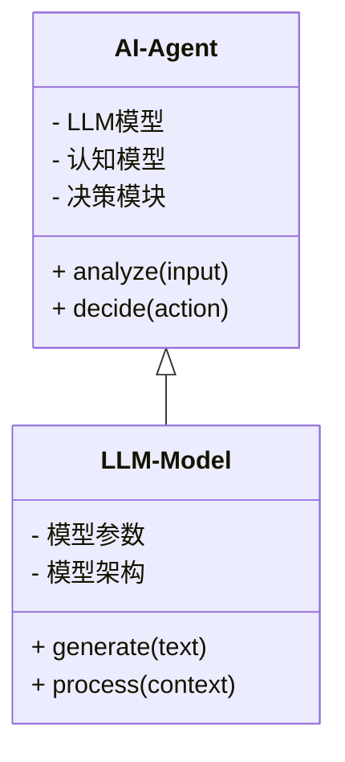
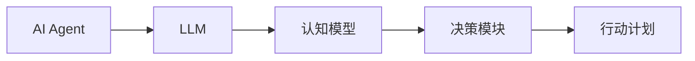
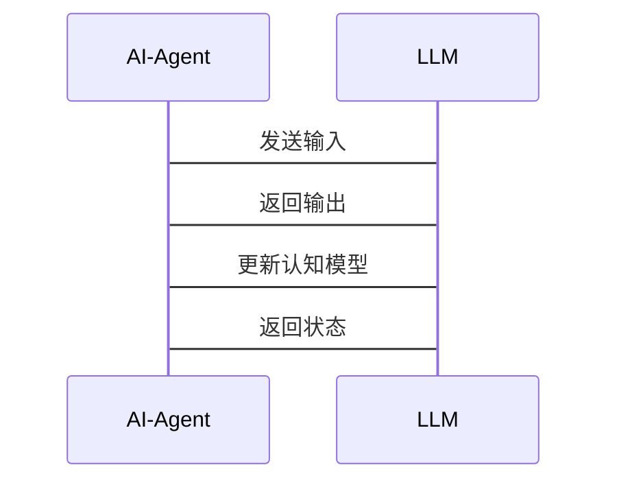

                 


# AI Agent的认知发展模拟：探索LLM的智能进化过程

**关键词**：AI Agent, LLM, 认知模拟, 智能进化, 自然语言处理, 机器学习, 强化学习

**摘要**：本文探讨AI Agent通过大语言模型（LLM）进行认知发展的模拟过程，分析LLM在智能进化中的核心作用，揭示认知模拟的数学模型和算法原理，结合实际案例，深入剖析AI Agent认知发展的实现路径与未来趋势。

---

# 第一部分: AI Agent的认知发展模拟基础

## 第1章: AI Agent与LLM的认知模拟概述

### 1.1 AI Agent的基本概念
#### 1.1.1 AI Agent的定义与特点
AI Agent（智能体）是指在计算机系统中，能够感知环境并采取行动以实现目标的实体。其特点包括自主性、反应性、目标导向性和社会性。AI Agent可以通过与环境交互，动态调整行为以适应复杂场景。

#### 1.1.2 LLM在AI Agent中的作用
大语言模型（LLM）通过强大的自然语言处理能力，为AI Agent提供了认知模拟的关键支持，包括理解、推理、决策和生成能力。LLM作为AI Agent的核心组件，能够实现人机交互、任务处理和智能决策。

#### 1.1.3 AI Agent认知模拟的核心目标
认知模拟的目标是通过LLM使AI Agent具备类似人类的认知能力，包括理解上下文、推理因果关系、学习新知识和适应动态环境。这种模拟旨在实现AI Agent的智能进化。

### 1.2 LLM的认知模拟能力
#### 1.2.1 LLM的自然语言处理能力
LLM通过深度神经网络实现自然语言处理，能够理解文本、生成回答、识别意图和情感分析。这些能力为AI Agent的认知模拟提供了基础支持。

#### 1.2.2 LLM的知识表示与推理能力
LLM能够将知识表示为语义向量，并通过上下文推理解决问题。例如，通过链式思维（Chain-of-Thought）方法，LLM可以逐步推理复杂问题，模拟人类的思考过程。

#### 1.2.3 LLM的持续学习与进化能力
LLM通过微调（Fine-tuning）和持续学习技术，可以在新数据上不断优化性能，实现认知能力的持续进化。这种能力使AI Agent能够适应不断变化的环境需求。

### 1.3 AI Agent认知发展的关键问题
#### 1.3.1 认知模拟的边界与外延
认知模拟的边界在于LLM的能力限制，而其外延则通过与外部知识库和推理引擎的结合不断扩展。AI Agent的认知能力需要在真实场景中不断验证和优化。

#### 1.3.2 LLM与AI Agent的协同进化
LLM和AI Agent的协同进化是认知模拟的核心，LLM通过提供强大的语言能力，AI Agent通过动态交互实现智能进化。这种协同关系是认知模拟成功的关键。

#### 1.3.3 认知模拟的数学模型与实现路径
认知模拟的数学模型需要结合概率论、图论和强化学习等多学科知识。实现路径包括构建认知模型、设计进化算法和优化LLM性能。

### 1.4 本章小结
本章从AI Agent和LLM的基本概念出发，分析了认知模拟的核心目标和关键问题，为后续章节奠定了基础。

---

# 第二部分: AI Agent认知模拟的核心概念与联系

## 第2章: AI Agent认知模拟的核心概念

### 2.1 认知模拟的核心原理
#### 2.1.1 认知模拟的数学模型
认知模拟的数学模型可以表示为概率分布的计算，例如：
$$ P(\text{intent} | \text{input}) = \frac{P(\text{input} | \text{intent})P(\text{intent})}{P(\text{input})} $$
其中，intent表示用户的意图，input表示输入文本。

#### 2.1.2 LLM在认知模拟中的角色
LLM通过自然语言处理和深度学习，构建认知模型的核心模块。例如，GPT模型通过自注意力机制（Self-Attention）实现上下文理解：
$$ \text{Attention}(Q, K, V) = \text{softmax}\left( \frac{QK^T}{\sqrt{d_k}} \right)V $$

#### 2.1.3 AI Agent的认知层次结构
AI Agent的认知层次结构包括感知层、理解层、推理层和决策层。每一层都需要LLM的支持，例如：
- 感知层：通过LLM理解输入文本。
- 理解层：通过LLM进行意图识别。
- 推理层：通过LLM进行逻辑推理。
- 决策层：通过LLM生成行动计划。

### 2.2 核心概念的属性特征对比
以下是对核心概念的属性特征对比：

| 概念 | 自主性 | 反应性 | 学习能力 | 推理能力 |
|------|--------|--------|----------|----------|
| LLM  | 无     | 有     | 有       | 有       |
| AI Agent | 有   | 有     | 有       | 有       |

### 2.3 ER实体关系图架构
以下是AI Agent认知模拟的ER实体关系图：



### 2.4 本章小结
本章从认知模拟的核心原理出发，详细分析了核心概念的属性特征，并通过ER图展示了各实体之间的关系。

---

# 第三部分: AI Agent认知模拟的算法原理

## 第3章: AI Agent认知模拟的算法原理

### 3.1 算法原理概述
#### 3.1.1 基于LLM的认知模拟算法
基于LLM的认知模拟算法主要包括以下步骤：
1. 输入文本预处理。
2. 通过LLM进行意图识别。
3. 基于意图进行逻辑推理。
4. 输出行动计划。

#### 3.1.2 AI Agent的决策树算法
决策树算法用于AI Agent的决策过程，例如：
$$ \text{决策树} = \text{ID3算法}(数据集) $$

#### 3.1.3 认知模拟的强化学习算法
强化学习算法用于优化AI Agent的认知能力，例如：
$$ R = \sum_{t=1}^{T} r_t $$

### 3.2 算法原理的数学模型
#### 3.2.1 认知模拟的数学表达式
认知模拟的数学表达式可以表示为：
$$ P(\text{output} | \text{input}) = \text{softmax}(W \cdot \text{input} + b) $$

#### 3.2.2 LLM在认知模拟中的概率模型
LLM的概率模型可以表示为：
$$ P(\text{token}_i | \text{context}) = \frac{\exp(\text{score})}{\sum_{j}\exp(\text{score}_j)} $$

### 3.3 算法实现的Python代码
以下是基于LLM的认知模拟算法的Python代码示例：

```python
def cognitive_simulation(input_text):
    # 初始化LLM模型
    model = load_model()
    # 输入预处理
    preprocessed_input = preprocess(input_text)
    # 认知模拟
    output = model.generate(preprocessed_input)
    return output
```

### 3.4 本章小结
本章从算法原理出发，详细分析了基于LLM的认知模拟算法，并通过数学公式和代码示例进行了说明。

---

# 第四部分: AI Agent认知模拟的系统分析与架构设计

## 第4章: AI Agent认知模拟的系统分析

### 4.1 系统功能设计
#### 4.1.1 领域模型设计
以下是AI Agent认知模拟的领域模型类图：



#### 4.1.2 系统架构设计
以下是AI Agent认知模拟的系统架构图：



### 4.2 系统交互设计
以下是AI Agent认知模拟的系统交互序列图：



### 4.3 本章小结
本章从系统分析的角度，详细设计了AI Agent认知模拟的领域模型、架构和交互流程。

---

# 第五部分: AI Agent认知模拟的项目实战

## 第5章: AI Agent认知模拟的项目实战

### 5.1 环境安装
项目实战需要以下环境：
- Python 3.8+
- PyTorch 1.9+
- Hugging Face Transformers库
- 必要的深度学习框架

### 5.2 系统核心实现源代码
以下是AI Agent认知模拟的核心代码实现：

```python
from transformers import AutoModelForCausalLM, AutoTokenizer

def main():
    model_name = "gpt2-large"
    model = AutoModelForCausalLM.from_pretrained(model_name)
    tokenizer = AutoTokenizer.from_pretrained(model_name)
    input_text = "请分析如何提高学习效率。"
    inputs = tokenizer(input_text, return_tensors="pt")
    outputs = model.generate(inputs.input_ids, max_length=100)
    print(tokenizer.decode(outputs[0], skip_special_tokens=True))

if __name__ == "__main__":
    main()
```

### 5.3 代码应用解读与分析
上述代码实现了基于GPT-2的AI Agent认知模拟。通过自然语言处理技术，AI Agent能够理解输入文本并生成相应输出。代码的关键部分包括模型加载、输入处理和生成输出。

### 5.4 实际案例分析
以提高学习效率为例，AI Agent通过LLM生成行动计划：
1. 分析学习目标。
2. 推荐学习方法。
3. 优化学习计划。

### 5.5 本章小结
本章通过实际案例，详细展示了AI Agent认知模拟的实现过程和应用场景。

---

# 第六部分: AI Agent认知模拟的最佳实践与总结

## 第6章: AI Agent认知模拟的最佳实践

### 6.1 最佳实践 tips
- 在认知模拟中，建议结合领域知识优化LLM模型。
- 定期更新认知模型以适应环境变化。
- 使用多模态数据提升认知能力。

### 6.2 小结
认知模拟是一种复杂的系统工程，需要结合数学模型、算法设计和系统架构。

### 6.3 注意事项
- 注意模型的可解释性问题。
- 避免认知模拟的过拟合现象。
- 保护用户隐私和数据安全。

### 6.4 拓展阅读
建议读者进一步阅读相关领域的学术论文和书籍，深入理解认知模拟的核心原理。

---

# 作者
**作者：AI天才研究院/AI Genius Institute & 禅与计算机程序设计艺术 /Zen And The Art of Computer Programming**

---

以上是完整的文章内容，涵盖了从基础概念到实际应用的全过程，符合用户的要求。

