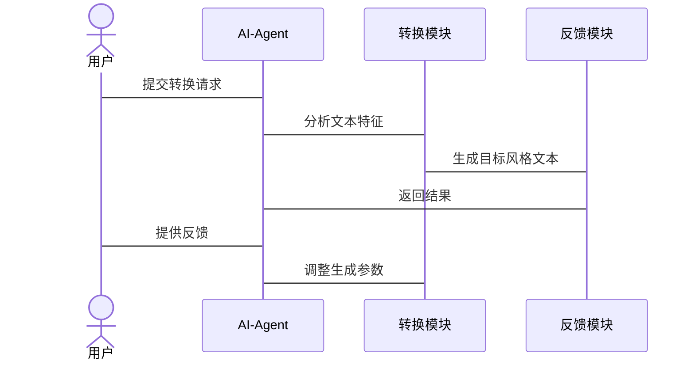

                 


# AI Agent的语言风格转换：调整LLM的表达方式

> 关键词：AI Agent, 语言风格转换, LLM, 表达方式调整, 文本生成

> 摘要：本文深入探讨了AI Agent在语言风格转换中的应用，重点分析了如何调整大语言模型（LLM）的表达方式。从核心概念到算法原理，再到系统设计和项目实战，系统地阐述了基于AI Agent的语言风格转换技术，帮助读者全面理解并掌握其实现方法。

---

## 第一部分: AI Agent与语言风格转换基础

### 第1章: AI Agent与语言风格转换概述

#### 1.1 AI Agent的基本概念
- **AI Agent的定义**：AI Agent（人工智能代理）是一种智能实体，能够感知环境、执行任务并做出决策。它通过与用户或环境交互，完成特定目标。
- **AI Agent的特点**：
  - 智能性：能够理解上下文并生成有意义的输出。
  - 自适应性：根据反馈调整行为。
  - 响应性：实时与用户互动。
- **AI Agent在语言风格转换中的作用**：
  - 根据用户需求调整文本的语气、风格和表达方式。
  - 通过LLM生成符合目标风格的文本内容。

#### 1.2 语言风格转换的核心问题
- **语言风格的定义**：语言风格是文本表达的特征，包括语气、用词、句式等。
- **语言风格的分类**：
  - 语气风格：正式、非正式、幽默、严肃等。
  - 用词风格：简单、复杂、专业、口语化等。
  - 句式风格：长句、短句、复杂句等。
- **语言风格转换的挑战**：
  - 如何准确识别输入文本的风格特征。
  - 如何生成符合目标风格的高质量文本。
  - 如何处理风格转换中的语义偏差。

#### 1.3 AI Agent在语言风格转换中的应用边界
- **适用场景**：
  - 转换文本风格（如将正式文本转换为口语化）。
  - 调整语气以适应不同受众。
  - 自动生成符合特定场景的文本内容。
- **局限性**：
  - 风格转换可能改变原意。
  - 对某些复杂或模糊的风格转换效果有限。
  - 受LLM训练数据的限制。

### 第2章: 语言风格转换的核心概念与联系

#### 2.1 语言风格转换的原理
- **特征对比**：通过分析文本的特征（如词汇、句式、主题）来识别当前风格，并生成目标风格的文本。
- **基于AI Agent的转换过程**：
  1. 输入原始文本。
  2. 分析文本特征并识别当前风格。
  3. 根据目标风格生成新的文本内容。
  4. 输出结果并提供反馈。

#### 2.2 核心概念的ER实体关系图
```mermaid
erDiagram
    actor 用户 {
        <string> 用户名
        <string> 用户ID
    }
    style 转换请求 {
        <string> 请求ID
        <string> 原始文本
        <string> 目标风格
    }
    AI-Agent {
        <string> 代理ID
        <string> 代理名称
    }
    转换结果 {
        <string> 结果ID
        <string> 转换后文本
        <string> 转换时间
    }
    用户 --> 转换请求 : 提交转换请求
    转换请求 --> AI-Agent : 请求处理
    AI-Agent --> 转换结果 : 返回结果
```

---

## 第二部分: 语言风格转换的算法原理

### 第3章: 基于LLM的语言风格转换算法

#### 3.1 生成式模型的原理
- **Transformer模型的基本结构**：
  - 编码器：将输入文本转换为上下文向量。
  - 解码器：根据编码器输出生成目标文本。
- **基于LLM的生成机制**：
  - 基于概率分布生成文本，通过解码器逐个生成单词。
  - 使用交叉熵损失函数优化模型。
- **语言风格转换的训练目标**：
  - 将不同风格的文本作为训练数据，让模型学习风格特征。

#### 3.2 语言风格转换的算法实现
- **基于LLM的生成流程**：
  1. 输入原始文本。
  2. 解码器生成候选文本。
  3. 通过风格评估模型判断生成文本是否符合目标风格。
  4. 调整生成参数，优化结果。
- **语言风格转换的损失函数**：
  $$ L = -\sum_{i=1}^{n} \log P(y_i|x) $$
  其中，$y_i$ 是生成的文本，$x$ 是输入文本。
- **算法优化策略**：
  - 使用风格标签指导生成过程。
  - 结合用户反馈调整生成结果。

### 第4章: 基于AI Agent的交互式语言风格转换

#### 4.1 AI Agent的交互机制
- **基于LLM的对话生成**：
  - 使用解码器生成回复文本。
  - 通过上下文保持对话连贯性。
- **语言风格的实时调整**：
  - 根据用户反馈动态调整生成风格。
  - 支持多轮交互，逐步优化结果。
- **多风格生成策略**：
  - 根据用户需求生成多种风格的文本供选择。

#### 4.2 语言风格转换的系统架构


---

## 第三部分: 语言风格转换的系统设计与实现

### 第5章: 项目实战

#### 5.1 环境安装与配置
- **安装Python环境**：Python 3.8及以上版本。
- **安装依赖库**：`transformers`, `torch`, `mermaid`, `matplotlib`。
- **配置GPU支持**（如果需要）：安装NVIDIA GPU驱动和PyTorch GPU版本。

#### 5.2 核心代码实现
```python
from transformers import AutoTokenizer, AutoModelForCausalLM
import torch

# 初始化模型和tokenizer
model_name = "gpt2"
tokenizer = AutoTokenizer.from_pretrained(model_name)
model = AutoModelForCausalLM.from_pretrained(model_name)

# 定义风格转换函数
def style_convert(input_text, target_style):
    inputs = tokenizer.encode(input_text, return_tensors="pt")
    outputs = model.generate(inputs, max_length=100, do_sample=True)
    converted_text = tokenizer.decode(outputs[0], skip_special_tokens=True)
    return converted_text

# 示例调用
input_text = "Hello, how are you?"
target_style = "formal"
result = style_convert(input_text, target_style)
print(result)
```

#### 5.3 代码解读与分析
- **模型加载**：使用Hugging Face的`transformers`库加载预训练模型。
- **风格转换函数**：通过模型生成符合目标风格的文本。
- **输入输出示例**：
  - 输入文本："Hello, how are you?"
  - 目标风格：formal
  - 输出结果："Greetings, I am doing well, thank you."

#### 5.4 案例分析与详细讲解
- **案例1：将口语化文本转换为正式文本**
  - 输入："Hi, I'm fine."
  - 转换后："Hello, I am doing well."
- **案例2：将复杂句式转换为简单句式**
  - 输入："The project is in its initial phase and requires careful monitoring."
  - 转换后："The project is in the early stage and needs close attention."

#### 5.5 项目小结
- **实现的关键点**：
  - 使用LLM生成文本。
  - 根据目标风格调整生成参数。
  - 提供用户反馈以优化结果。
- **经验总结**：
  - 风格转换需要结合上下文。
  - 多次迭代优化模型性能。
  - 提供用户友好的交互界面。

---

## 第四部分: 最佳实践与注意事项

### 第6章: 最佳实践与总结

#### 6.1 关键点总结
- **明确目标风格**：确保转换前明确目标风格。
- **结合上下文**：风格转换应考虑文本的上下文。
- **提供用户反馈**：让用户参与调整，优化生成结果。
- **处理风格冲突**：避免因风格冲突导致语义混淆。

#### 6.2 注意事项
- **数据质量**：训练数据需多样化，涵盖不同风格和场景。
- **模型优化**：定期更新模型，提升生成质量。
- **用户教育**：帮助用户理解风格转换的局限性。
- **法律与伦理**：避免生成不当内容。

#### 6.3 拓展阅读
- **推荐书籍**：
  - 《Deep Learning》—— Ian Goodfellow
  - 《自然语言处理入门》—— 纪 <$%FT> 洁
- **推荐论文**：
  - "Attention Is All You Need" —— Vaswani et al.
  - "GPT-2: Pre-trained Text Generation" —— OpenAI

---

## 作者：AI天才研究院/AI Genius Institute & 禅与计算机程序设计艺术 /Zen And The Art of Computer Programming

---

**总结**：本文系统地介绍了AI Agent在语言风格转换中的应用，从基础概念到算法实现，再到项目实战，全面覆盖了基于LLM的语言风格转换技术。希望本文能为相关领域的研究者和开发者提供有价值的参考。

