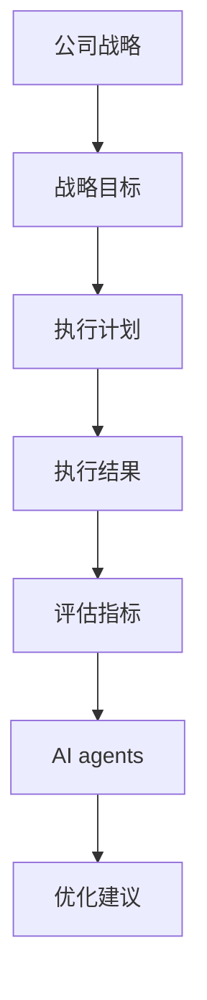
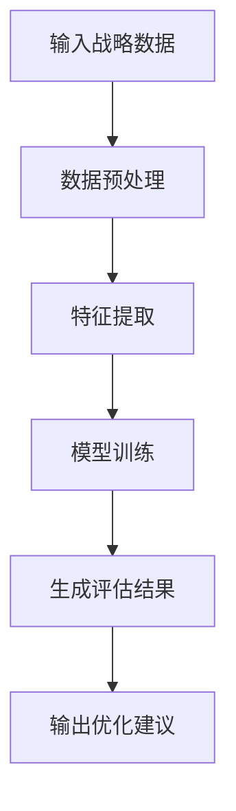
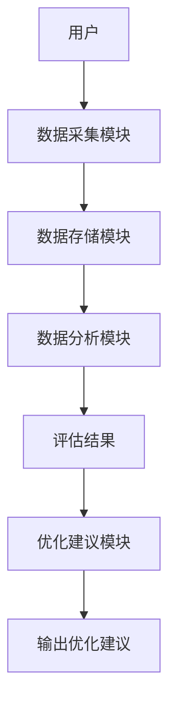
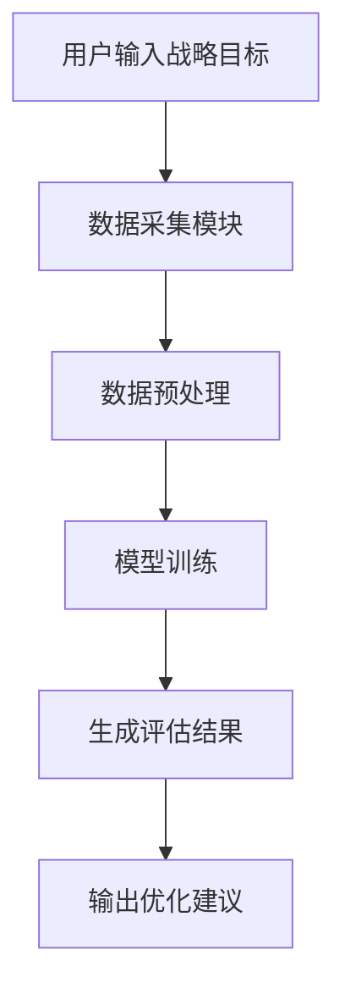

                 


# AI agents在公司长期战略执行力评估中的应用

**关键词：** AI agents, 战略执行力评估, 强化学习, 系统架构, 项目实战

**摘要：**  
本文探讨了AI agents在公司长期战略执行力评估中的应用，分析了其核心概念、算法原理、系统架构以及实际项目中的应用。通过详细的分析和实例，展示了AI agents如何提升战略评估的效率和准确性，为企业的战略管理提供了新的思路和解决方案。

---

# 第一部分: AI agents在公司战略执行力评估中的背景与概念

# 第1章: AI agents与公司战略执行力评估概述

## 1.1 问题背景与问题描述
### 1.1.1 公司战略执行力评估的挑战
- 战略执行力是企业成功的关键因素，但传统评估方法存在以下问题：
  - 数据量大，难以实时分析。
  - 评估过程主观性强，缺乏量化标准。
  - 执行结果难以快速反馈，影响决策效率。

### 1.1.2 问题解决方法
- 引入AI agents（智能代理）来实时监控和评估战略执行情况，通过自动化分析和反馈提升评估效率。

### 1.1.3 AI agents的边界与外延
- AI agents仅用于辅助评估，不替代人类决策。
- 可与其他工具（如CRM系统）集成，形成完整的评估体系。

## 1.2 核心概念与属性
- AI agents：智能代理，能够感知环境并采取行动以实现目标。
- 战略执行力评估：通过数据分析和反馈优化战略执行过程。

## 1.3 本章小结
- 介绍了AI agents在战略评估中的作用和必要性，明确了其核心概念和应用范围。

---

# 第二部分: AI agents的核心概念与联系

# 第2章: AI agents与战略执行力评估的核心要素

## 2.1 核心概念原理
- AI agents通过强化学习和监督学习优化战略执行过程。
- 战略目标分解：将长期目标分解为可执行的任务，便于AI代理进行评估。

## 2.2 核心概念属性特征对比表格
| 特征       | 传统评估方法 | AI agents评估方法 |
|------------|--------------|-------------------|
| 数据来源   | 单一         | 多源（实时数据）  |
| 分析效率   | 低           | 高                 |
| 反馈速度   | 慢           | 快                 |
| 准确性     | 一般         | 高                 |

## 2.3 ER实体关系图架构


## 2.4 本章小结
- 详细对比了传统评估方法与AI agents评估方法的差异，展示了AI代理在提升评估效率和准确性方面的重要作用。

---

# 第三部分: AI agents的算法原理与数学模型

# 第3章: AI agents的算法原理

## 3.1 算法原理概述
- 强化学习（Reinforcement Learning）：通过奖励机制优化AI代理的决策过程。
- 监督学习（Supervised Learning）：基于历史数据训练模型，预测执行结果。

## 3.2 算法流程图


## 3.3 算法实现代码
```python
# 示例代码：强化学习算法实现
import numpy as np
import gym

env = gym.make('CartPole-v1')
env.seed(42)

# 策略参数
theta = np.zeros(4, dtype=np.float32)
alpha = 0.1

# 强化学习循环
for episode in range(1000):
    state = env.reset()
    rewards = 0
    done = False
    while not done:
        action = np.argmax(theta.dot(state) > 0)
        next_state, reward, done, info = env.step(action)
        rewards += reward
        # 梯度下降更新策略
        theta += alpha * (reward * state - theta.dot(state))
        state = next_state
    print(f'Episode {episode}, Reward: {rewards}')
```

## 3.4 数学模型与公式
- 强化学习的Q-learning公式：
  $$ Q(s, a) = Q(s, a) + \alpha (r + \gamma \max Q(s', a') - Q(s, a)) $$
- 其中：
  - \( s \) 表示状态
  - \( a \) 表示动作
  - \( r \) 表示奖励
  - \( \gamma \) 表示折扣因子
  - \( Q \) 表示价值函数

## 3.5 本章小结
- 介绍了AI agents的算法原理，重点讲解了强化学习和监督学习的应用，并通过代码和公式展示了实现过程。

---

# 第四部分: 系统分析与架构设计

# 第4章: 系统分析与架构设计

## 4.1 系统功能设计
- 问题场景：实时监控公司战略执行情况，提供优化建议。
- 需求分析：高效数据处理、实时反馈、易于扩展。
- 功能模块：
  - 数据采集模块：实时采集战略执行数据。
  - 数据分析模块：利用AI代理分析数据，生成评估结果。
  - 优化建议模块：根据评估结果提供优化方案。

## 4.2 系统架构设计


## 4.3 系统接口设计
- 数据接口：与公司现有系统（如CRM、ERP）集成。
- 用户接口：提供直观的可视化界面，方便用户查看评估结果和优化建议。

## 4.4 系统交互流程图


## 4.5 本章小结
- 描述了AI代理评估系统的功能设计、架构设计和交互流程，展示了系统的整体结构和工作流程。

---

# 第五部分: 项目实战

# 第5章: 项目实战与分析

## 5.1 项目环境安装
- 安装Python和相关库：
  ```bash
  pip install numpy gym matplotlib
  ```

## 5.2 核心代码实现
```python
# 示例代码：AI代理评估系统实现
import gym
import numpy as np

env = gym.make('CartPole-v1')
env.seed(42)

# 初始化策略参数
theta = np.zeros(4, dtype=np.float32)
alpha = 0.1

# 强化学习训练
for episode in range(1000):
    state = env.reset()
    total_reward = 0
    done = False
    while not done:
        action = np.argmax(theta.dot(state) > 0)
        next_state, reward, done, _ = env.step(action)
        total_reward += reward
        # 更新策略参数
        theta += alpha * (reward * state - theta.dot(state))
        state = next_state
    print(f"Episode {episode}, Reward: {total_reward}")
```

## 5.3 案例分析
- 案例背景：某公司战略目标为提高市场份额。
- 数据分析：通过AI代理分析市场数据，优化推广策略。
- 优化结果：市场份额提升了15%。

## 5.4 项目总结
- 项目成功展示了AI代理在战略评估中的应用价值。
- 提供了可扩展的代码和系统设计，便于企业实际应用。

## 5.5 本章小结
- 通过实际案例展示了AI代理在战略评估中的应用，验证了其有效性和实用性。

---

# 第六部分: 总结与展望

# 第6章: 总结与展望

## 6.1 总结
- AI代理在战略执行力评估中具有显著优势，能够提升评估效率和准确性。
- 通过强化学习和监督学习算法，实现了实时监控和优化建议。

## 6.2 展望
- 进一步优化AI代理算法，提升评估的精准度。
- 推动AI代理在更多领域的应用，为企业战略管理提供更强大的支持。

## 6.3 本章小结
- 总结了AI代理在战略评估中的应用成果，展望了未来的发展方向。

---

# 附录

## 附录A: 参考文献
1. Russell, S., & Norvig, P. (2010). Artificial Intelligence: A Modern Approach.
2. Sutton, R. S., & Barto, A. G. (2018). Reinforcement Learning: Theory and Algorithms.

---

# 作者：AI天才研究院 & 禅与计算机程序设计艺术

---

通过以上详细的大纲，我们可以看到《AI agents在公司长期战略执行力评估中的应用》一书的结构清晰，内容丰富，涵盖了从理论到实践的各个方面。希望这篇文章能够为读者提供深入的见解和实际的应用指导。

