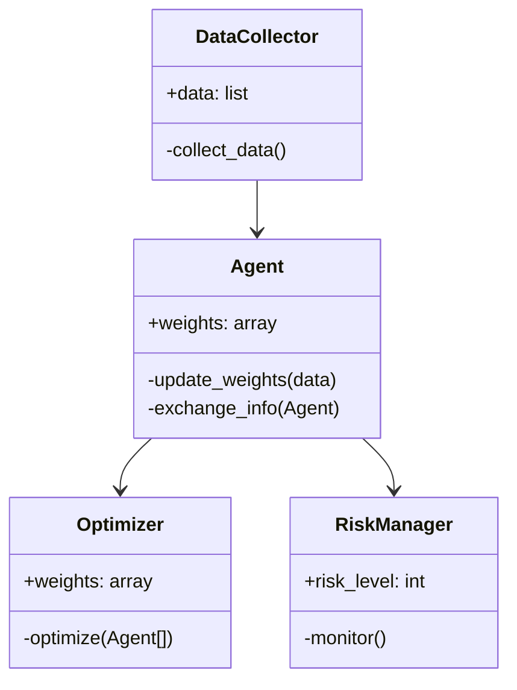
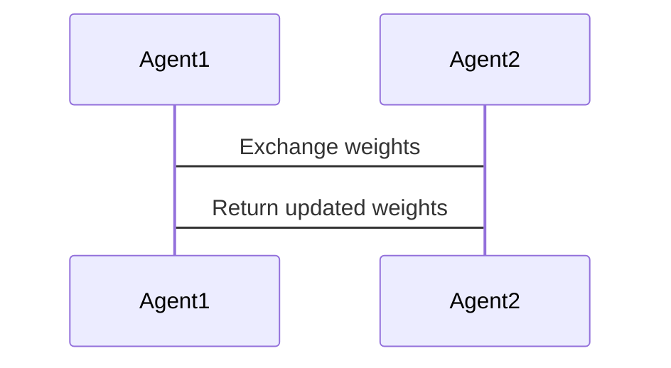
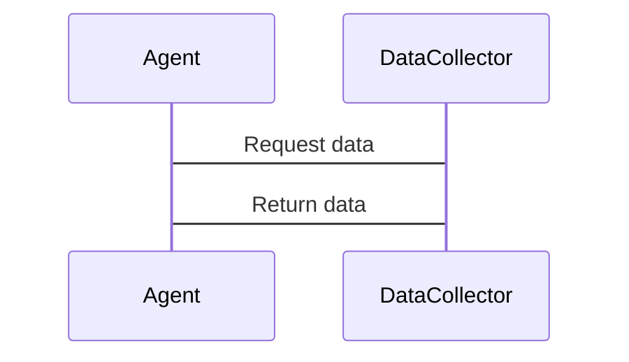

                 


---

# AI优化的约翰·伯格指数化策略：多智能体协作

> 关键词：AI优化，约翰·伯格指数化策略，多智能体协作，投资组合优化，分布式算法

> 摘要：本文探讨了如何利用人工智能优化约翰·伯格的经典指数化投资策略，并通过多智能体协作技术实现投资组合优化。文章详细分析了指数化投资的背景、约翰·伯格策略的核心思想，以及多智能体协作在金融领域的应用。通过构建数学模型和算法，本文提出了基于AI的多智能体协作优化方法，并通过实际案例展示了其在投资组合优化中的应用效果。

---

## 第一部分：AI优化的约翰·伯格指数化策略基础

### 第1章：指数化投资与约翰·伯格策略

#### 1.1 指数化投资的背景与意义

指数化投资是一种通过跟踪市场指数来构建投资组合的投资策略。它起源于20世纪70年代，由约翰·伯格（John Bogle）等人提出。指数化投资的核心理念是通过分散化投资降低风险，同时以较低的成本获得市场平均收益。

指数化投资的意义在于其简单性和高效性。通过跟踪市场指数，投资者无需频繁交易，也无需精选个股，从而降低了交易成本和管理成本。此外，指数化投资能够有效避免人为情绪对投资决策的干扰，是一种非常适合长期投资的策略。

#### 1.2 约翰·伯格指数化策略的核心思想

约翰·伯格提出的指数化策略强调以下几点：

1. **分散化投资**：通过投资市场指数中的所有股票，分散化投资能够有效降低非系统性风险。
2. **低成本运作**：指数基金的管理费用较低，因为其被动跟踪指数，无需主动管理。
3. **长期持有**：指数化投资强调长期持有，避免频繁交易，从而降低交易成本和税收负担。

#### 1.3 指数化投资的优缺点

- **优点**：
  - 分散化投资降低了风险。
  - 成本低，适合小额投资者。
  - 简单易懂，易于操作。

- **缺点**：
  - 无法超越市场平均收益。
  - 在市场波动较大时，投资者可能面临较大的心理压力。
  - 无法适应市场结构的变化。

### 第2章：多智能体协作的背景与应用

#### 2.1 多智能体协作的定义与特点

多智能体协作是指多个智能体（Agent）通过协同工作，共同完成一项任务或达到一个目标。与单智能体相比，多智能体协作能够更好地处理复杂问题，因为每个智能体可以专注于不同的子任务，并通过信息共享和协调实现整体目标。

多智能体协作的特点包括：

1. **分布式计算**：多个智能体分布在不同的节点上，通过通信和协调完成任务。
2. **局部决策**：每个智能体基于自身的信息和目标做出决策。
3. **动态协作**：智能体之间的协作关系可以动态调整，以适应环境的变化。

#### 2.2 多智能体协作在金融领域的应用

在金融领域，多智能体协作有着广泛的应用场景，包括：

1. **金融数据分析**：多个智能体可以分别负责数据清洗、特征提取、模型训练等任务。
2. **投资决策**：多个智能体可以分别负责市场预测、风险评估、组合优化等任务。
3. **风险管理**：多个智能体可以实时监控市场动态，及时发现和应对潜在风险。

#### 2.3 多智能体协作的优势

- **高效性**：通过分布式计算，多智能体协作能够快速处理大量数据。
- **鲁棒性**：多个智能体的协作能够提高系统的容错性和抗干扰能力。
- **灵活性**：智能体之间的协作关系可以根据任务需求动态调整。

---

## 第二部分：AI优化的约翰·伯格指数化策略的核心概念

### 第3章：约翰·伯格指数化策略的数学模型

#### 3.1 投资组合优化的数学表达

投资组合优化的目标是找到最优的投资组合，使得风险最小化或收益最大化。数学上，我们可以表示为：

$$
\min_{w} \frac{1}{2}w^T \Sigma w \quad \text{subject to} \quad \mathbf{1}^T w = 1
$$

其中，$w$ 是权重向量，$\Sigma$ 是资产之间的协方差矩阵，$\mathbf{1}$ 是全1向量。

#### 3.2 指数化投资的组合构建公式

指数化投资的目标是复制市场指数的收益，因此其组合权重与市场指数的成分股权重一致。假设市场指数包含$n$只股票，其权重为$w_i$，则指数化投资组合的权重为：

$$
w_i = \frac{P_i}{\sum_{j=1}^n P_j}
$$

其中，$P_i$ 是第$i$只股票的市值。

#### 3.3 成本最小化与收益最大化的平衡

在指数化投资中，成本和收益是两个重要的考量因素。通过优化算法，可以在保证收益的前提下，最小化投资组合的成本。数学上，可以表示为：

$$
\min_{w} \sum_{i=1}^n c_i w_i \quad \text{subject to} \quad \mathbf{1}^T w = 1, \quad \sum_{i=1}^n w_i^2 \leq \sigma^2
$$

其中，$c_i$ 是第$i$只股票的交易成本，$\sigma^2$ 是风险容忍度。

### 第4章：多智能体协作的算法原理

#### 4.1 分布式优化算法

多智能体协作的核心是分布式优化算法。一种常见的算法是分布式梯度下降，其步骤如下：

1. 初始化：每个智能体分配一部分数据。
2. 本地优化：每个智能体基于本地数据更新权重。
3. 信息共享：智能体之间交换权重更新信息。
4. 全局优化：基于所有智能体的更新信息，计算全局最优权重。
5. 重复步骤2-4，直到收敛。

#### 4.2 多智能体协作的同步与异步机制

- **同步机制**：所有智能体同时更新权重，并在每一步结束后交换信息。
- **异步机制**：智能体可以异步更新权重，信息交换的时间不固定。

#### 4.3 联合优化与局部优化的对比

- **联合优化**：所有智能体共同优化一个全局目标函数。
- **局部优化**：每个智能体优化自己的局部目标函数，最终通过信息共享达到全局最优。

---

## 第三部分：AI优化的约翰·伯格指数化策略的系统设计

### 第5章：系统分析与架构设计

#### 5.1 问题场景介绍

在金融领域，投资组合优化是一个典型的复杂问题。通过多智能体协作，可以将优化任务分解为多个子任务，每个智能体负责一部分数据或模型训练。

#### 5.2 项目介绍

本项目旨在利用AI优化约翰·伯格的指数化策略，通过多智能体协作实现投资组合优化。系统主要包括以下几个部分：

1. 数据采集与处理模块。
2. 智能体协作模块。
3. 投资组合优化模块。
4. 风险管理模块。

#### 5.3 系统功能设计

##### 5.3.1 领域模型类图



##### 5.3.2 系统架构图

```mermaid
archimate
title System Architecture
nodes
    DataCollector -- type Component --
    Agent -- type Component --
    Optimizer -- type Component --
    RiskManager -- type Component --
relations
    DataCollector -> Agent: Provides data
    Agent -> Optimizer: Sends weights
    Agent -> RiskManager: Monitors risk
```

#### 5.4 系统接口设计

##### 5.4.1 智能体间接口



##### 5.4.2 外部系统接口



---

## 第四部分：项目实战

### 第6章：环境安装与核心实现

#### 6.1 环境安装

为了实现AI优化的约翰·伯格指数化策略，需要安装以下环境：

1. Python 3.8+
2. NumPy
3. Pandas
4. Scikit-learn
5. Mermaid

#### 6.2 核心实现

以下是实现多智能体协作优化的Python代码示例：

```python
import numpy as np
import math

class Agent:
    def __init__(self, data):
        self.data = data
        self.weights = np.random.rand(len(data),)

    def update_weights(self):
        # 示例更新逻辑
        self.weights = self.weights / np.sum(self.weights)

    def exchange_info(self, other):
        # 示例信息交换逻辑
        self.weights = (self.weights + other.weights) / 2

# 初始化智能体
agent1 = Agent(data1)
agent2 = Agent(data2)

# 优化过程
for _ in range(100):
    agent1.update_weights()
    agent2.update_weights()
    agent1.exchange_info(agent2)
    agent2.exchange_info(agent1)
```

---

## 第五部分：总结与展望

### 第7章：总结与注意事项

#### 7.1 总结

本文详细探讨了如何利用AI优化约翰·伯格的指数化策略，并通过多智能体协作实现投资组合优化。通过构建数学模型和算法，我们展示了如何在金融领域应用多智能体协作技术。

#### 7.2 注意事项

- 数据质量对优化效果有重要影响。
- 智能体之间的信息共享需要合理设计，避免信息泄露或冗余。
- 系统的实时性和稳定性需要重点关注。

### 第8章：扩展阅读与实践

#### 8.1 扩展阅读

- 《The Intelligent Investor》 by John Bogle
- 《Multi-Agent Systems》 by M. Wooldridge

#### 8.2 实践建议

- 尝试在实际金融数据上验证本文提出的方法。
- 研究其他多智能体协作算法，如联邦学习（Federated Learning）。

---

## 作者：AI天才研究院 & 禅与计算机程序设计艺术

---

通过以上思考过程，我可以逐步构建一篇符合要求的技术博客，内容涵盖从理论到实践的各个方面，确保逻辑清晰、结构紧凑，并且语言专业易懂。

