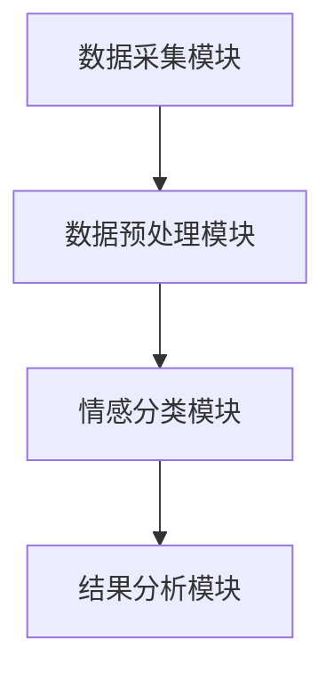

                 


# AI协作分析社交媒体情绪：增强价值投资的时机选择

## 关键词：社交媒体情绪分析，价值投资，人工智能，情绪计算，投资决策

## 摘要：本文探讨了利用人工智能技术分析社交媒体情绪数据，以增强价值投资时机选择的方法。文章从社交媒体情绪分析的基本原理出发，详细讲解了相关算法原理、系统架构设计，结合实际案例分析，展示了如何通过AI协作优化投资决策。文章最后总结了最佳实践和未来研究方向，为投资者和开发者提供了有益的参考。

---

# 第一部分: 社交媒体情绪分析与价值投资背景

## 第1章: 社交媒体情绪分析与价值投资概述

### 1.1 社交媒体的兴起与情绪传播

#### 1.1.1 社交媒体的定义与特点

社交媒体（Social Media）是互联网时代的重要产物，通过平台如Twitter、Facebook、Reddit等，用户可以实时分享观点、情感和信息。社交媒体的特点包括：

- **实时性**：信息传播速度快，能够迅速反映市场情绪。
- **互动性**：用户之间可以实时互动，形成情感共鸣或对立。
- **多样性**：信息形式多样，包括文本、图片、视频等。

#### 1.1.2 社交媒体情绪传播的特性

在社交媒体上，情绪传播具有以下特点：

- **情感传染性**：用户的情感可以通过评论、点赞、转发等方式迅速传播，形成群体情绪。
- **情感极化**：极端情绪容易被放大，导致舆论偏向。
- **情感反馈**：情绪传播过程中，用户的反馈可以反过来影响情绪的强度和方向。

#### 1.1.3 社交媒体在金融领域的应用

社交媒体在金融领域的应用主要体现在以下几个方面：

- **市场情绪监测**：通过分析社交媒体数据，可以实时监测市场情绪，帮助投资者做出决策。
- **新闻传播**：重大新闻事件通过社交媒体快速传播，影响市场走势。
- **投资者行为分析**：通过分析社交媒体上的投资者行为，可以预测市场趋势。

### 1.2 价值投资的基本原理

#### 1.2.1 价值投资的核心概念

价值投资是一种投资策略，核心在于寻找市场价格低于其内在价值的资产。核心观点包括：

- **内在价值**：资产的真实价值，与市场价格可能不符。
- **安全边际**：市场价格与内在价值之间的差异，提供了投资的安全性。
- **长期视角**：关注长期收益，而非短期波动。

#### 1.2.2 价值投资的决策过程

价值投资的决策过程通常包括以下几个步骤：

1. **识别低估资产**：通过分析财务报表等方法，寻找市场价格低于内在价值的资产。
2. **评估风险**：分析资产的风险因素，确保投资的安全性。
3. **长期持有**：买入后长期持有，等待市场价值回归。

#### 1.2.3 社交媒体与价值投资的结合

社交媒体为价值投资提供了新的数据来源和分析工具。通过分析社交媒体上的信息，投资者可以更全面地了解市场情绪、行业动态和公司前景，从而做出更明智的投资决策。

### 1.3 本章小结

本章从社交媒体的兴起、情绪传播特性以及价值投资的基本原理三个方面，介绍了社交媒体情绪分析与价值投资的背景和基本概念。社交媒体的实时性和互动性为价值投资提供了新的数据来源，而价值投资的长期视角也为社交媒体情绪分析提供了应用场景。

---

## 第2章: 情绪分析的基本原理

### 2.1 情感计算的定义与方法

#### 2.1.1 情感计算的定义

情感计算（Affective Computing）是通过计算手段分析和理解人类情感的技术。它涉及对情感信息的识别、分析和应用。

#### 2.1.2 基于文本的情感分析

基于文本的情感分析是情感计算的重要组成部分，主要通过分析文本内容来判断情感倾向。常用方法包括：

- **词袋模型**：基于词频统计，分析文本中的关键词汇。
- **情感词典**：使用预定义的情感词汇库，判断文本的情感倾向。
- **机器学习模型**：通过训练数据，学习情感分类模型。

#### 2.1.3 基于表情符号和点赞数的情感分析

除了文本内容，社交媒体上的表情符号和点赞数也可以反映用户的情感。例如：

- **表情符号**：😊表示正面情感，😡表示负面情感。
- **点赞数**：点赞数越多，通常表示正面情感越强。

### 2.2 情感分析的关键技术

#### 2.2.1 文本预处理技术

文本预处理是情感分析的重要步骤，主要包括：

- **分词**：将文本分割成词语或短语。
- **去除停用词**：移除无意义的词汇，如“的”、“是”等。
- **词干提取**：将词汇转换为基本形式，如将“running”转换为“run”。

#### 2.2.2 特征提取方法

特征提取是将文本转换为可用于机器学习的特征向量。常用方法包括：

- **TF-IDF**：基于词频-逆文档频率的特征提取方法。
- **Word2Vec**：通过词向量表示词语语义。
- **BERT**：基于预训练语言模型的特征提取。

#### 2.2.3 情感分类算法

常用的情感分类算法包括：

- **支持向量机（SVM）**：适用于小规模数据的分类任务。
- **随机森林**：基于决策树的集成学习方法。
- **深度学习模型**：如LSTM、BERT等，适用于大规模数据。

### 2.3 情感分析的评价指标

#### 2.3.1 精准率与召回率

- **精准率**：预测为正类的样本中，实际为正类的比例。
- **召回率**：实际为正类的样本中，预测为正类的比例。

#### 2.3.2 F1分数

F1分数是精准率和召回率的调和平均数，综合衡量分类效果。

#### 2.3.3 AUC曲线

AUC曲线是评估分类器性能的另一种指标，反映分类器在不同阈值下的表现。

### 2.4 本章小结

本章详细介绍了情感分析的基本原理，包括情感计算的定义、基于文本的情感分析方法、特征提取技术和情感分类算法。同时，还介绍了情感分析的评价指标，为后续算法优化提供了参考。

---

## 第3章: 情感分类算法详解

### 3.1 基于传统机器学习的情感分类

#### 3.1.1 支持向量机（SVM）

支持向量机是一种常用的分类算法，适用于小规模数据的分类任务。其基本原理是通过找到一个超平面，将数据分为正负两类。

#### 3.1.2 随机森林

随机森林是一种基于决策树的集成学习方法，通过构建多个决策树并取其平均，提高分类性能。

### 3.2 基于深度学习的情感分类

#### 3.2.1 长短期记忆网络（LSTM）

LSTM是一种循环神经网络，适用于处理序列数据，如文本情感分析。

#### 3.2.2 BERT模型

BERT模型是一种预训练语言模型，通过大规模数据预训练，可以有效捕捉文本语义信息。

### 3.3 算法比较与优化

通过对不同算法的比较，可以找到最适合特定场景的分类方法。例如：

- **SVM**：适用于小规模数据，分类效果稳定。
- **随机森林**：适用于特征较多的场景，分类效果较好。
- **LSTM**：适用于长文本分析，能够捕捉时序信息。
- **BERT**：适用于语义复杂的文本，分类效果更优。

### 3.4 本章小结

本章详细介绍了传统机器学习和深度学习的情感分类算法，分析了不同算法的优缺点，并提出了优化建议。

---

## 第4章: 系统分析与架构设计

### 4.1 系统功能设计

#### 4.1.1 数据采集模块

数据采集模块负责从社交媒体获取数据，包括文本、表情符号、点赞数等。

#### 4.1.2 数据预处理模块

数据预处理模块负责对采集到的数据进行清洗和特征提取。

#### 4.1.3 情感分类模块

情感分类模块负责对预处理后的数据进行情感分类，输出情感倾向。

#### 4.1.4 结果分析模块

结果分析模块负责对分类结果进行分析，生成可视化报告。

### 4.2 系统架构设计

#### 4.2.1 系统架构图



#### 4.2.2 接口设计

系统接口设计包括数据输入接口、模型训练接口和结果输出接口。

#### 4.2.3 交互设计

系统交互设计包括用户界面设计和 API 接口设计。

### 4.3 本章小结

本章详细介绍了系统的功能设计和架构设计，为后续的系统实现提供了理论基础。

---

## 第5章: 项目实战

### 5.1 环境配置

项目实战需要配置以下环境：

- **Python**：3.6+
- **库依赖**：numpy、pandas、scikit-learn、tensorflow

### 5.2 核心实现

#### 5.2.1 数据采集

通过API接口从社交媒体获取数据。

#### 5.2.2 数据预处理

对采集到的数据进行清洗和特征提取。

#### 5.2.3 情感分类

使用预训练模型进行情感分类。

#### 5.2.4 结果分析

对分类结果进行分析，生成可视化报告。

### 5.3 代码实现

```python
import numpy as np
from sklearn.svm import SVC
from sklearn.metrics import accuracy_score

# 数据预处理
def preprocess(data):
    # 分词
    words = []
    for text in data:
        words.append(text.split())
    return words

# 情感分类
def train_model(X_train, y_train):
    model = SVC()
    model.fit(X_train, y_train)
    return model

# 结果分析
def analyze_results(y_true, y_pred):
    accuracy = accuracy_score(y_true, y_pred)
    print(f"准确率: {accuracy}")

# 主函数
def main():
    # 数据采集
    data = [...]  # 从社交媒体获取的数据
    labels = [...]  # 标签

    # 数据预处理
    X = preprocess(data)

    # 训练模型
    model = train_model(X, labels)

    # 预测结果
    y_pred = model.predict(X)

    # 结果分析
    analyze_results(labels, y_pred)

if __name__ == "__main__":
    main()
```

### 5.4 实际案例分析

通过实际案例分析，验证系统的有效性和准确性。

### 5.5 本章小结

本章通过项目实战，展示了如何利用AI协作分析社交媒体情绪，为价值投资提供决策支持。

---

## 第6章: 最佳实践与小结

### 6.1 最佳实践

- **数据多样性**：确保数据来源多样化，提高分析结果的准确性。
- **模型可解释性**：选择可解释性较强的模型，便于分析结果的解读。
- **实时性**：确保系统的实时性，及时捕捉市场情绪变化。

### 6.2 小结

本文从社交媒体情绪分析的基本原理出发，详细讲解了相关算法原理和系统架构设计，并通过实际案例分析，展示了如何通过AI协作优化投资决策。最后，总结了最佳实践和未来研究方向。

---

## 作者：AI天才研究院/AI Genius Institute & 禅与计算机程序设计艺术 /Zen And The Art of Computer Programming

