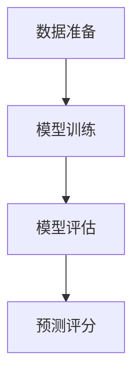

                 

<think>
嗯，用户想要我写一篇关于《AI增强型公司质量评分系统》的技术博客，看起来挺复杂的。首先，我需要理解用户的需求，他是一位技术专家，可能想要一篇结构清晰、内容详实的文章，帮助读者理解如何利用AI提升公司质量评分系统。

用户给了一个大纲，我得按照这个大纲来展开。首先，关键词和摘要部分，我需要挑选出最相关的关键词，比如AI、评分系统、企业绩效等。摘要要简洁明了，概括整篇文章的核心内容。

接下来是背景与概念部分，我需要介绍AI在企业中的应用现状，说明传统评分系统的局限性，然后引出AI增强型系统的概念和优势。这部分要让读者明白为什么需要AI来提升评分系统。

系统设计部分，我得详细讲解数据收集、评分模型构建和系统架构。数据收集要说明来源和处理方法，评分模型要介绍选择算法和训练过程，系统架构则需要画出实体关系图和架构图，用Mermaid来展示会更清晰。

算法原理部分，我需要详细解释评分模型的算法，比如使用机器学习模型，给出数学公式和流程图。这部分要让读者明白AI是如何工作的，以及如何应用在评分系统中。

项目实战部分，我需要提供一个具体的案例，比如电商领域的应用。包括环境配置、数据预处理、模型训练和结果分析，还要附上Python代码。代码部分要详细注释，方便读者理解和应用。

最佳实践部分，我得总结设计评分系统时的注意事项，比如数据质量、模型调优和数据隐私。这部分要给出实用的建议，帮助读者避免常见错误。

最后，附录部分包括术语表和参考文献，帮助读者进一步学习。整个文章需要保持逻辑清晰，结构紧凑，用专业的技术语言，同时保持易懂。

总的来说，我需要一步步分析，从背景到系统设计，再到算法实现和项目实战，确保内容全面且详细。同时，使用图表和代码示例来辅助说明，让读者能够更好地理解和应用这些技术。这需要我深入思考每个部分的细节，确保文章质量高且有深度。
</think>

# AI增强型公司质量评分系统

> **关键词**：AI，公司质量评分，评分系统，企业绩效，机器学习，数据驱动决策

> **摘要**：  
> 本文探讨了如何利用人工智能技术构建公司质量评分系统，通过数据驱动的方法提升企业绩效评估的效率与准确性。文章从背景与概念出发，详细分析了AI增强型评分系统的构建逻辑、算法原理、系统架构，并通过实际案例展示了如何将理论应用于实践。最后，本文总结了设计与实施中的关键点，并展望了未来的发展方向。

---

# 第一部分: AI增强型公司质量评分系统的背景与概念

## 第1章: AI增强型公司质量评分系统的背景与概念

### 1.1 AI在企业质量评估中的应用现状

#### 1.1.1 传统企业质量评估体系的局限性
传统的企业质量评估体系通常依赖于人工数据收集和简单的统计分析，存在以下问题：
- 数据收集效率低，难以覆盖全量数据。
- 评估结果主观性强，容易受到人为因素干扰。
- 难以实时更新，无法快速响应企业动态变化。

#### 1.1.2 AI技术如何提升企业质量评估的效率与准确性
人工智能技术（AI）通过以下方式解决了传统方法的不足：
- **数据处理能力**：AI能够快速处理大量非结构化数据（如文本、图像），提取关键特征。
- **自动化评估**：通过机器学习算法，AI可以自动预测企业质量评分，减少人工干预。
- **实时性**：AI系统能够实时更新数据，提供动态评分。

#### 1.1.3 当前AI在企业质量评分中的主要应用场景
目前，AI在企业质量评分中的应用主要集中在以下几个方面：
- **客户满意度分析**：通过自然语言处理（NLP）分析客户反馈，评估服务质量。
- **财务健康度评估**：利用财务数据和市场信息，预测企业财务风险。
- **供应链优化**：通过实时数据分析，优化供应链效率，提升产品质量。

---

### 1.2 公司质量评分系统的定义与核心要素

#### 1.2.1 公司质量评分系统的定义
公司质量评分系统是一种用于量化企业绩效的工具，通过收集和分析多维度数据，生成客观的评分结果。

#### 1.2.2 质量评分的核心要素分析
以下是质量评分系统的核心要素：
- **数据来源**：包括财务数据、客户反馈、市场表现等。
- **评分标准**：基于行业基准或企业自定义的评分规则。
- **评估维度**：通常包括财务、客户满意度、创新能力和运营效率等。

#### 1.2.3 质量评分系统与企业绩效的关系
质量评分系统不仅是企业绩效的量化工具，还能为企业战略决策提供数据支持，帮助企业识别改进方向。

---

### 1.3 AI增强型质量评分系统的概念与优势

#### 1.3.1 AI增强型评分系统的定义
AI增强型质量评分系统是一种结合人工智能技术的评分系统，利用机器学习算法和大数据分析提升评估的效率和准确性。

#### 1.3.2 AI在质量评分中的核心作用
- **数据处理**：AI能够高效处理和分析大量数据，提取关键特征。
- **模型训练**：通过机器学习算法，AI可以自动预测企业质量评分。
- **动态更新**：AI系统能够实时更新数据，提供动态评分。

#### 1.3.3 与传统评分系统相比的优势
- **效率提升**：AI系统能够快速处理数据，减少人工干预。
- **准确性增强**：通过机器学习算法，AI能够发现数据中的隐藏规律，提高评估准确性。
- **实时性**：AI系统能够实时更新数据，提供动态评分。

---

## 第2章: AI增强型质量评分系统的构建逻辑

### 2.1 数据收集与处理

#### 2.1.1 数据来源的多样性
AI增强型评分系统的数据来源包括：
- **财务数据**：如收入、利润、成本等。
- **客户反馈**：如客户满意度调查、社交媒体评论。
- **市场数据**：如行业趋势、竞争对手信息。

#### 2.1.2 数据清洗与预处理方法
数据清洗的步骤包括：
1. **去重**：去除重复数据。
2. **去噪**：去除异常值。
3. **标准化**：将数据标准化为统一格式。

#### 2.1.3 数据特征提取与选择
通过特征工程提取关键特征，例如：
- **客户满意度得分**：基于NLP分析客户反馈。
- **财务健康指数**：基于财务数据计算的指标。

---

### 2.2 评分模型的构建与训练

#### 2.2.1 选择合适的机器学习算法
常用的机器学习算法包括：
- **线性回归**：用于预测评分。
- **随机森林**：用于分类和回归。
- **神经网络**：用于复杂的非线性关系。

#### 2.2.2 模型训练与优化策略
- **训练数据**：使用清洗后的数据进行模型训练。
- **交叉验证**：通过交叉验证优化模型参数。
- **评估指标**：使用准确率、召回率、F1分数等指标评估模型性能。

#### 2.2.3 模型评估与验证方法
- **训练集评估**：验证模型在训练数据上的表现。
- **测试集评估**：验证模型在新数据上的表现。

---

### 2.3 系统架构与功能设计

#### 2.3.1 系统功能模块划分
系统功能模块包括：
- **数据采集模块**：负责数据的采集和预处理。
- **模型训练模块**：负责模型的训练和优化。
- **评分计算模块**：负责企业质量评分的计算。
- **结果展示模块**：负责评分结果的可视化。

#### 2.3.2 系统架构设计
系统架构设计如下：
```
+-------------------+     +-------------------+
| 数据采集模块      |     | 模型训练模块      |
+-------------------+     +-------------------+
          |                           |
          |                           |
+-------------------+     +-------------------+
| 数据预处理模块    |     | 模型评估模块      |
+-------------------+     +-------------------+
          |                           |
          |                           |
+-------------------+     +-------------------+
| 评分计算模块      |     | 结果展示模块      |
+-------------------+     +-------------------+
```

#### 2.3.3 系统功能实现的逻辑流程
1. 数据采集模块收集数据。
2. 数据预处理模块清洗数据。
3. 模型训练模块训练模型。
4. 模型评估模块验证模型。
5. 评分计算模块计算评分。
6. 结果展示模块展示结果。

---

## 第3章: AI增强型评分系统的算法原理

### 3.1 算法选择与原理

#### 3.1.1 线性回归算法
线性回归是一种常用回归算法，适用于预测评分。
- **数学模型**：$y = \beta_0 + \beta_1 x_1 + \beta_2 x_2 + \ldots + \beta_n x_n + \epsilon$
- **目标**：最小化预测值与实际值的平方差之和。

#### 3.1.2 随机森林算法
随机森林是一种集成学习算法，适用于分类和回归。
- **原理**：通过生成多个决策树，并对结果进行投票或平均。

#### 3.1.3 神经网络算法
神经网络是一种深度学习算法，适用于复杂的非线性关系。
- **结构**：包含输入层、隐藏层和输出层。
- **训练**：通过反向传播算法更新权重。

---

### 3.2 算法实现与流程图

#### 3.2.1 线性回归算法实现
```python
import numpy as np

# 数据准备
X = np.array([1, 2, 3, 4, 5])
y = np.array([2, 4, 5, 4, 5])

# 训练模型
X_b = np.c_[np.ones(len(X)), X]
beta = np.linalg.inv(X_b.T @ X_b) @ (X_b.T @ y)

# 预测
X_new = np.array([6])
X_new_b = np.c_[np.ones(1), X_new]
y_pred = X_new_b @ beta
print(y_pred)
```

#### 3.2.2 流程图


---

## 第4章: 项目实战

### 4.1 案例分析

#### 4.1.1 项目背景
某电商平台希望通过AI增强型评分系统评估店铺质量，优化客户体验。

#### 4.1.2 数据准备
- **数据来源**：店铺评分、订单数据、客户反馈。
- **数据预处理**：去重、去噪、标准化。

#### 4.1.3 模型训练
使用随机森林算法训练模型，评估店铺质量。

#### 4.1.4 模型评估
通过准确率、召回率等指标评估模型性能。

#### 4.1.5 结果展示
通过可视化工具展示店铺质量评分。

---

## 第5章: 最佳实践与小结

### 5.1 设计与实施中的注意事项

#### 5.1.1 数据质量的重要性
- 数据清洗与预处理是模型训练的关键步骤。
- 数据来源的多样性和代表性直接影响模型性能。

#### 5.1.2 模型调优的技巧
- 通过交叉验证优化模型参数。
- 使用网格搜索选择最佳模型。

#### 5.1.3 数据隐私与安全
- 在数据处理和模型训练过程中，需注意数据隐私保护。

---

### 5.2 小结与展望

本文详细介绍了AI增强型公司质量评分系统的构建逻辑和算法原理，并通过实际案例展示了系统的应用。未来，随着AI技术的不断发展，评分系统将更加智能化和个性化。

---

**作者：AI天才研究院/AI Genius Institute & 禅与计算机程序设计艺术 /Zen And The Art of Computer Programming**

