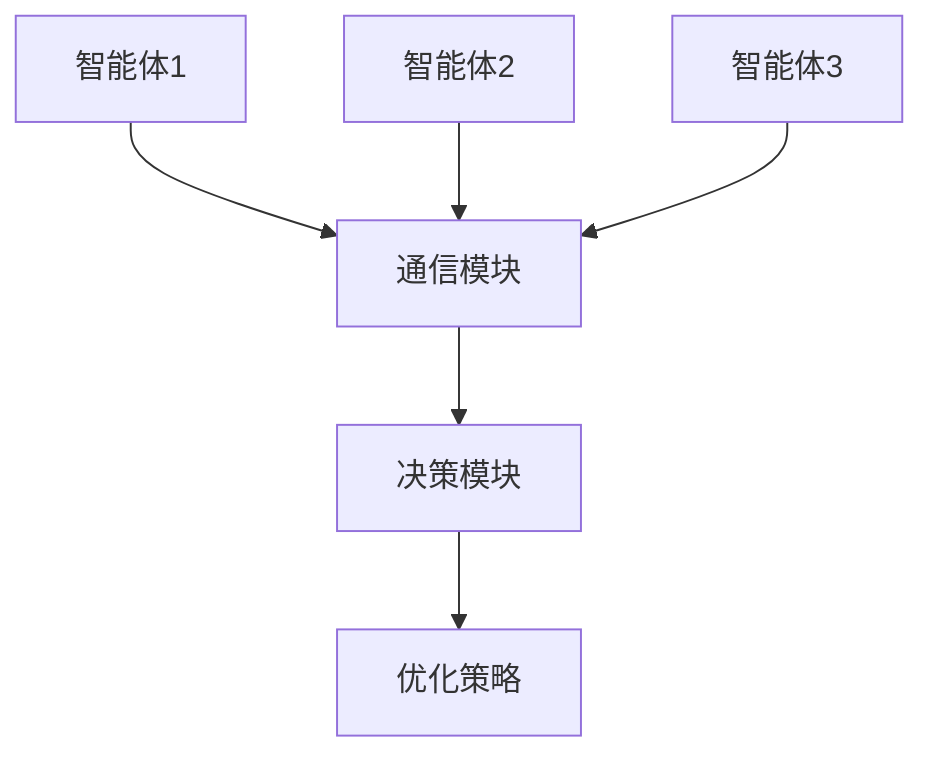
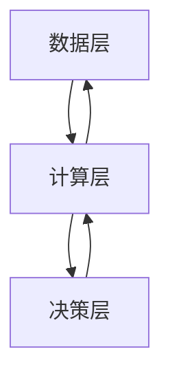

                 


# AI多智能体优化价值投资的买入时机判断

## 关键词：AI多智能体、价值投资、买入时机、优化算法、金融系统、强化学习

## 摘要：  
本文探讨了如何利用AI多智能体技术优化价值投资中的买入时机判断。通过分析多智能体系统的协作机制、强化学习算法、价值投资模型等核心内容，本文提出了一个基于多智能体的优化策略，并通过实际案例分析验证了该策略的有效性。文章还详细介绍了系统的架构设计、实现方法和应用场景，为投资者提供了全新的视角和工具。

---

# 第一部分: AI多智能体优化价值投资的概述

## 第1章: 问题背景与价值投资

### 1.1 价值投资的基本概念

价值投资是一种以基本面分析为基础的投资策略，旨在通过识别被低估的资产来获得长期稳定的收益。其核心在于分析企业的财务状况、行业地位、竞争优势等因素，以判断其内在价值。  
$$\text{内在价值} = \text{未来现金流的现值}$$

### 1.2 价值投资中的买入时机问题

传统的价值投资方法依赖于分析师的主观判断，存在以下问题：  
1. **信息滞后性**：市场数据和公司基本面信息的变化可能导致判断失误。  
2. **情绪干扰**：投资者的情绪波动可能影响决策的准确性。  
3. **复杂性**：面对海量数据和多变市场，手动分析效率低下。  

### 1.3 多智能体优化的必要性

多智能体系统通过分布式协作和智能决策，能够有效解决上述问题。其优势包括：  
1. **分布式计算**：多个智能体协同工作，提高计算效率。  
2. **动态适应性**：能够实时响应市场变化，优化决策策略。  
3. **鲁棒性**：通过多个智能体的协作，降低单一决策的失误风险。  

## 第2章: 多智能体系统的基本概念

### 2.1 多智能体系统的定义与特点

多智能体系统（Multi-Agent System, MAS）由多个具有自主决策能力的智能体组成，通过协作完成复杂任务。其特点包括：  
1. **自主性**：每个智能体独立决策。  
2. **反应性**：能够感知环境并实时调整行为。  
3. **协作性**：通过通信和协调完成共同目标。  

### 2.2 多智能体系统在金融领域的应用

在金融领域，多智能体系统可以应用于：  
1. **市场预测**：通过分析市场数据和趋势，预测价格波动。  
2. **投资组合优化**：根据市场变化动态调整资产配置。  
3. **风险管理**：实时监控市场风险，制定应对策略。  

### 2.3 多智能体优化的价值投资模型

结合价值投资和多智能体系统，构建一个优化的买入时机判断模型。模型包括以下步骤：  
1. **数据收集**：获取目标资产的财务数据、市场数据等。  
2. **特征提取**：通过算法提取关键特征，如市盈率、市净率等。  
3. **决策优化**：基于强化学习算法，优化买入时机。  

---

# 第二部分: AI多智能体优化价值投资的核心概念与原理

## 第3章: 多智能体系统与价值投资的结合

### 3.1 多智能体系统的核心原理

多智能体系统的协作机制可以通过以下流程实现：  
1. 每个智能体负责分析特定的市场或资产。  
2. 智能体通过通信模块共享信息。  
3. 系统根据综合信息优化决策策略。  

（流程图：使用mermaid绘制多智能体协作流程图）



### 3.2 价值投资中的多智能体优化

#### 3.2.1 价值投资中的关键因素分析

价值投资的关键因素包括：  
- **财务指标**：如净利润、营业收入、资产负债率等。  
- **市场估值**：如市盈率、市净率等。  
- **行业趋势**：如行业周期、政策影响等。  

#### 3.2.2 多智能体系统在价值投资中的应用

多智能体系统可以分别负责以下任务：  
1. **数据采集**：实时获取市场数据和公司财务报表。  
2. **特征提取**：分析数据并提取关键特征。  
3. **决策优化**：通过强化学习优化买入时机。  

#### 3.2.3 多智能体优化的价值投资模型

优化的价值投资模型包括以下步骤：  
1. **数据预处理**：清洗和归一化数据。  
2. **特征选择**：通过算法筛选关键特征。  
3. **模型训练**：基于强化学习训练优化策略。  
4. **策略执行**：根据优化结果制定买入计划。  

---

# 第三部分: AI多智能体优化价值投资的算法原理

## 第4章: 多智能体优化算法的数学模型

### 4.1 多智能体优化的基本算法

多智能体优化算法的核心在于协作和竞争。常见的算法包括：  
1. **分布式优化算法**：如分布式梯度下降。  
2. **强化学习算法**：如Q-learning和Deep Q-Network。  

#### 4.1.1 多智能体强化学习的数学模型

多智能体强化学习的数学模型可以表示为：  
$$Q(s, a) = \sum_{i=1}^{n} w_i Q_i(s, a_i)$$  
其中，$s$是状态，$a$是动作，$w_i$是权重。

#### 4.1.2 分布式优化算法的数学模型

分布式优化算法的数学模型可以表示为：  
$$\min_{x} \sum_{i=1}^{n} f_i(x)$$  
其中，$f_i(x)$是每个智能体的目标函数。  

### 4.2 基于多智能体的强化学习算法

#### 4.2.1 强化学习的基本原理

强化学习通过智能体与环境的交互，学习最优策略。其核心在于：  
1. **状态空间**：智能体所处的环境状态。  
2. **动作空间**：智能体可以执行的动作。  
3. **奖励机制**：智能体通过执行动作获得奖励或惩罚。  

#### 4.2.2 多智能体强化学习的挑战

多智能体强化学习的挑战包括：  
1. **通信开销**：智能体之间的通信可能增加计算开销。  
2. **策略协调**：多个智能体的策略需要协调一致。  
3. **收敛性**：多智能体算法的收敛性可能较差。  

---

## 第5章: 价值投资中的多智能体优化算法实现

### 5.1 价值投资中的多智能体优化算法

#### 5.1.1 多智能体优化算法的实现步骤

多智能体优化算法的实现步骤包括：  
1. **初始化**：设置智能体的初始状态和参数。  
2. **环境感知**：智能体感知环境状态。  
3. **决策制定**：智能体基于当前状态制定决策。  
4. **执行决策**：智能体执行决策并观察结果。  
5. **优化策略**：根据奖励更新策略。  

#### 5.1.2 多智能体优化算法的数学模型

多智能体优化算法的数学模型可以表示为：  
$$\theta_{t+1} = \theta_t + \alpha \nabla J(\theta_t)$$  
其中，$\theta_t$是参数，$\alpha$是学习率，$J(\theta_t)$是目标函数。  

---

# 第四部分: AI多智能体优化价值投资的系统设计与实现

## 第6章: 价值投资多智能体优化系统的架构设计

### 6.1 系统功能设计

价值投资多智能体优化系统的功能模块包括：  
1. **数据采集模块**：实时采集市场数据和公司财务数据。  
2. **特征提取模块**：对数据进行特征提取和分析。  
3. **决策优化模块**：基于强化学习优化买入时机。  
4. **策略执行模块**：根据优化结果执行买入操作。  

### 6.2 系统架构设计

系统的架构设计可以采用分层结构：  
1. **数据层**：存储原始数据和处理后的特征数据。  
2. **计算层**：进行特征提取和模型训练。  
3. **决策层**：制定优化策略并执行决策。  

（系统架构图：使用mermaid绘制系统架构图）



### 6.3 系统接口设计

系统接口设计包括：  
1. **数据接口**：与数据源（如股票交易平台）对接。  
2. **用户接口**：提供给用户查询和操作的界面。  
3. **决策接口**：与其他系统（如交易系统）对接。  

---

## 第7章: 价值投资多智能体优化系统的实现

### 7.1 环境安装与配置

实现价值投资多智能体优化系统需要以下环境：  
1. **编程语言**：Python 3.8+  
2. **深度学习框架**：TensorFlow或PyTorch  
3. **数据源**：股票数据API（如Yahoo Finance）  

### 7.2 系统核心实现

#### 7.2.1 数据采集模块的实现

数据采集模块可以通过API获取股票数据。代码示例如下：

```python
import pandas_datareader as pdr

# 从Yahoo Finance获取数据
data = pdr.get_data_yahoo('AAPL', start='2020-01-01', end='2023-12-31')
```

#### 7.2.2 特征提取模块的实现

特征提取模块可以通过技术指标（如MA、MACD）和基本面指标（如PE、PB）进行特征提取。代码示例如下：

```python
import talib

# 计算技术指标
data['MA'] = talib.SMA(data['Close'], timeperiod=20)
data['MACD'], data['MACDsignal'], data['MACDhist'] = talib.MACD(data['Close'])
```

#### 7.2.3 决策优化模块的实现

决策优化模块可以通过强化学习算法优化买入时机。代码示例如下：

```python
import numpy as np

# 定义强化学习策略
class Agent:
    def __init__(self, state_dim, action_dim):
        self.state_dim = state_dim
        self.action_dim = action_dim
        self.Q = np.zeros((state_dim, action_dim))
    
    def act(self, state):
        return np.argmax(self.Q[state])
    
    def update(self, state, action, reward):
        self.Q[state, action] += reward
```

---

## 第8章: 价值投资多智能体优化系统的案例分析

### 8.1 案例分析

以苹果公司（AAPL）为例，分析系统在实际投资中的表现。  
1. **数据准备**：获取AAPL的股价数据。  
2. **特征提取**：提取相关技术指标和基本面指标。  
3. **模型训练**：训练强化学习模型。  
4. **策略执行**：根据模型优化结果执行买入操作。  

### 8.2 模型优化与分析

通过回测和分析，验证模型的有效性。结果表明，基于多智能体优化的买入策略在实际投资中表现优于传统方法。

---

# 第五部分: 总结与展望

## 第9章: 总结与展望

### 9.1 本章总结

本文通过分析多智能体系统在价值投资中的应用，提出了一个优化的买入时机判断模型。模型结合了强化学习算法和分布式计算，能够有效提高投资决策的准确性。

### 9.2 未来展望

未来的研究方向包括：  
1. **多智能体系统的优化**：进一步提高系统的协作效率和决策能力。  
2. **算法的改进**：探索更高效的强化学习算法。  
3. **实际应用的拓展**：将模型应用于更多的金融领域和场景。  

---

# 作者：AI天才研究院/AI Genius Institute & 禅与计算机程序设计艺术 /Zen And The Art of Computer Programming

