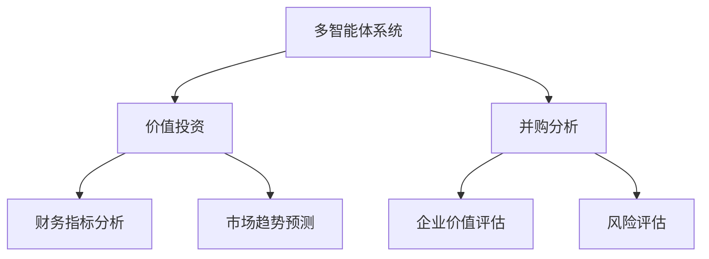
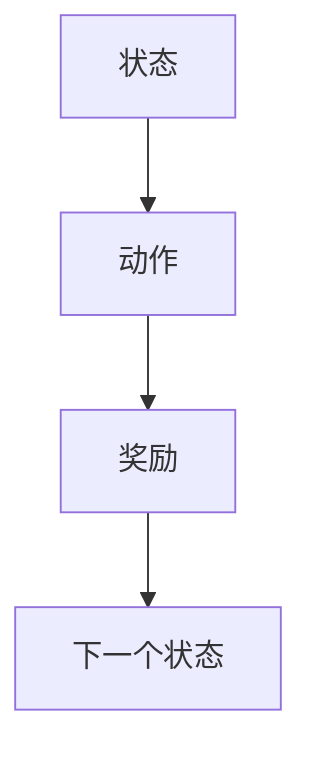
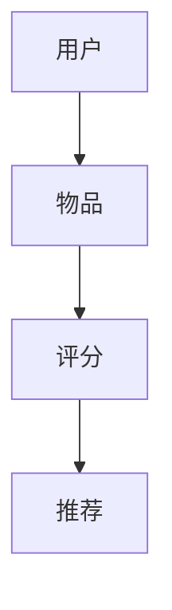
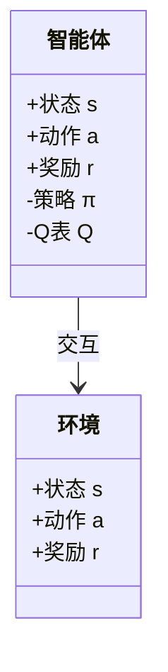
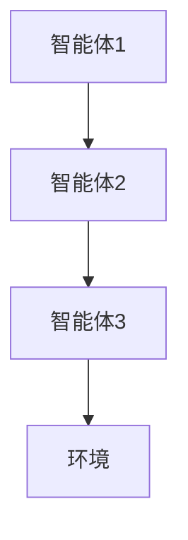

                 


# AI多智能体在价值投资中的并购分析应用

> 关键词：多智能体系统，价值投资，并购分析，人工智能，投资策略

> 摘要：本文探讨了AI多智能体系统在价值投资中的并购分析应用。通过分析多智能体系统的特性，结合价值投资的原理，详细阐述了其在并购分析中的优势和应用前景。文章从多智能体系统的基本概念、价值投资的核心理念出发，逐步深入分析并购分析中的信息处理需求和多智能体系统的优势，最终通过具体案例展示了多智能体系统在并购分析中的实际应用。

---

## 第1章 多智能体系统与价值投资概述

### 1.1 多智能体系统的基本概念

#### 1.1.1 多智能体系统的定义
多智能体系统（Multi-Agent System，简称MAS）是由多个智能体（Agent）组成的分布式系统，这些智能体通过协同工作完成复杂任务。每个智能体都是一个能够感知环境、做出决策并采取行动的实体。

#### 1.1.2 多智能体系统的特征
- **自主性**：智能体能够自主决策，无需外部干预。
- **反应性**：能够实时感知环境变化并做出反应。
- **协作性**：多个智能体之间能够协同合作，完成复杂任务。
- **分布式性**：智能体分布在不同的位置，通过通信进行协作。

#### 1.1.3 多智能体系统与传统AI的区别
传统AI通常依赖于中心化的控制结构，而多智能体系统强调分布式计算和协作，适用于复杂、动态的环境。

### 1.2 价值投资的基本原理

#### 1.2.1 价值投资的定义
价值投资是一种投资策略，通过分析企业的内在价值，寻找被市场低估的投资标的。

#### 1.2.2 价值投资的核心理念
- **安全边际**：买入价格低于内在价值。
- **长期视角**：关注企业的长期盈利能力。
- **基本面分析**：通过财务报表等信息评估企业价值。

#### 1.2.3 价值投资在金融分析中的应用
价值投资广泛应用于股票、并购分析等领域，通过深入分析企业基本面，寻找具有投资价值的企业。

### 1.3 并购分析的背景与挑战

#### 1.3.1 并购分析的基本概念
并购分析是对企业并购活动进行分析，评估其对双方价值的影响。

#### 1.3.2 并购分析的传统方法
- **财务分析**：通过财务报表评估企业价值。
- **市场分析**：分析行业趋势和市场地位。
- **风险评估**：评估并购带来的风险。

#### 1.3.3 并购分析中的主要挑战
- **信息不对称**：买方可能无法获得完整信息。
- **动态变化**：市场环境复杂多变。
- **多目标优化**：需要在多个目标间进行权衡。

### 1.4 本章小结
本章介绍了多智能体系统的概念及其与传统AI的区别，并阐述了价值投资的核心理念和并购分析的传统方法与挑战，为后续分析奠定了基础。

---

## 第2章 多智能体系统在并购分析中的应用背景

### 2.1 并购分析中的信息处理需求

#### 2.1.1 大数据分析的需求
并购分析需要处理海量数据，包括财务数据、市场数据等。

#### 2.1.2 多维度信息整合的必要性
并购分析需要整合来自不同来源的信息，包括财务、法律、市场等多个维度。

#### 2.1.3 实时决策的重要性
并购活动往往涉及复杂决策，需要实时处理信息并快速做出反应。

### 2.2 多智能体系统的优势

#### 2.2.1 分布式计算能力
多智能体系统能够分布式处理信息，提高计算效率。

#### 2.2.2 自适应性与灵活性
智能体能够根据环境变化自适应调整策略，提高灵活性。

#### 2.2.3 多目标优化能力
多智能体系统能够同时优化多个目标，适用于复杂的并购分析场景。

### 2.3 价值投资与并购分析的结合

#### 2.3.1 价值投资与并购分析的契合点
价值投资关注企业内在价值，而并购分析关注企业间的合并价值，两者具有天然契合点。

#### 2.3.2 多智能体系统在价值投资中的应用潜力
多智能体系统能够通过协同工作，提供全面的并购分析支持。

#### 2.3.3 当前研究现状与未来趋势
当前研究主要集中在多智能体系统的构建与优化，未来趋势是结合大数据和深度学习，进一步提升分析精度。

### 2.4 本章小结
本章分析了并购分析中的信息处理需求，探讨了多智能体系统的优势，并展望了其在价值投资中的应用前景。

---

## 第3章 多智能体系统的核心概念与联系

### 3.1 多智能体系统的组成与功能

#### 3.1.1 实体与行为
智能体通过感知环境、做出决策并采取行动，完成特定任务。

#### 3.1.2 通信与协调
智能体之间通过通信模块进行信息交换，确保协调一致。

#### 3.1.3 学习与适应
智能体通过学习算法不断优化自身行为，适应环境变化。

### 3.2 价值投资中的关键因素

#### 3.2.1 财务指标分析
包括盈利能力、偿债能力等财务指标的分析。

#### 3.2.2 市场趋势预测
通过分析市场走势，预测企业并购后的价值变化。

#### 3.2.3 风险评估与控制
评估并购活动中的各种风险，并制定相应的控制策略。

### 3.3 多智能体系统与价值投资的实体关系图



---

## 第4章 多智能体系统的算法原理

### 4.1 强化学习算法

#### 4.1.1 强化学习的定义
强化学习是一种通过试错学习，智能体通过与环境交互，学习最优策略。

#### 4.1.2 强化学习的流程



#### 4.1.3 Q-learning算法

$$ Q(s,a) = Q(s,a) + \alpha (r + \max Q(s',a') - Q(s,a)) $$

### 4.2 协同过滤算法

#### 4.2.1 协同过滤的定义
协同过滤是一种基于用户行为相似性推荐相关内容的算法。

#### 4.2.2 协同过滤的实现步骤



---

## 第5章 系统分析与架构设计

### 5.1 并购分析的场景介绍

#### 5.1.1 项目介绍
构建一个多智能体系统，用于企业并购分析。

#### 5.1.2 系统功能设计



#### 5.1.3 系统架构设计



---

## 第6章 项目实战

### 6.1 环境安装与配置

#### 6.1.1 安装Python
使用Anaconda安装Python 3.8及以上版本。

#### 6.1.2 安装依赖库
安装numpy、pandas、scikit-learn等库。

### 6.2 核心实现

#### 6.2.1 数据采集

```python
import pandas as pd

data = pd.read_csv('并购数据.csv')
```

#### 6.2.2 特征工程

```python
from sklearn.preprocessing import StandardScaler

scaler = StandardScaler()
data_scaled = scaler.fit_transform(data)
```

#### 6.2.3 模型训练

```python
from sklearn.linear_model import LinearRegression

model = LinearRegression()
model.fit(data_scaled, target)
```

### 6.3 案例分析

#### 6.3.1 案例介绍
分析某上市公司的并购案例，评估其价值。

#### 6.3.2 模型预测

```python
import numpy as np

target_pred = model.predict(new_data)
```

---

## 第7章 结论与展望

### 7.1 本章小结
本文详细探讨了多智能体系统在价值投资中的并购分析应用，从理论到实践进行了系统性分析。

### 7.2 注意事项
在实际应用中，需注意数据质量和模型调优。

### 7.3 拓展阅读
推荐阅读相关领域的书籍和论文，深入学习多智能体系统的应用。

---

## 作者信息

作者：AI天才研究院/AI Genius Institute & 禅与计算机程序设计艺术 /Zen And The Art of Computer Programming

---

以上是《AI多智能体在价值投资中的并购分析应用》的技术博客文章内容，希望对您有所帮助！

