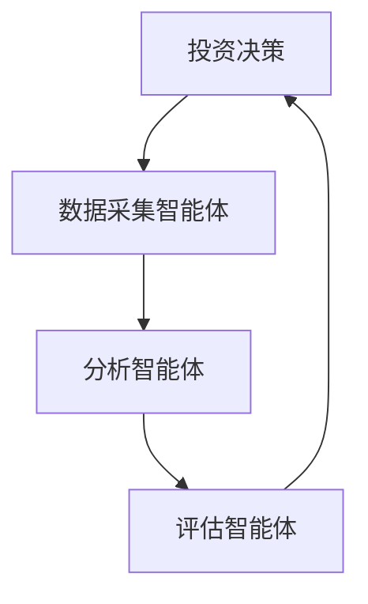
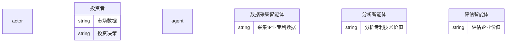
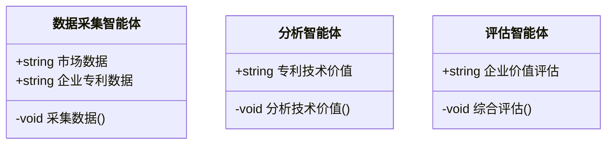
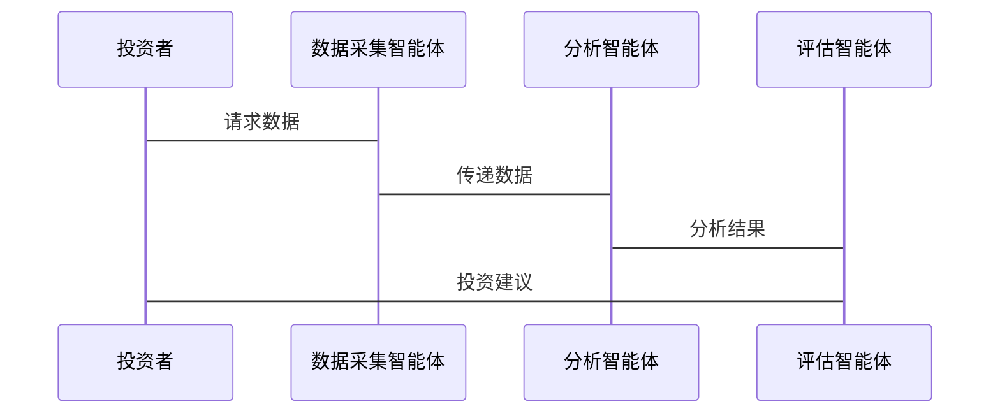

                 


# AI多智能体在价值投资中的知识产权分析

**关键词**：AI多智能体、价值投资、知识产权分析、机器学习、金融投资、数据分析

**摘要**：  
本文探讨了AI多智能体在价值投资中的应用，特别是其在知识产权分析中的作用。通过分析多智能体系统在金融领域的协作机制，结合机器学习算法，本文展示了如何利用AI技术提升知识产权评估的效率和准确性，从而优化投资决策。文章详细阐述了AI多智能体的协作流程、算法原理、系统架构设计及实际案例，为价值投资者提供了新的视角和工具。

---

## 正文

### 第一部分：AI多智能体在价值投资中的背景与概念

#### 第1章：AI多智能体系统概述

##### 1.1 多智能体系统的基本概念
- **定义**：多智能体系统（Multi-Agent System, MAS）是由多个独立但协作的智能体组成的系统，每个智能体都有自己的目标和行为。
- **特征**：分布性、协作性、反应性、主动性。
- **与单智能体的区别**：多智能体系统通过协作实现复杂任务，单智能体系统则独立完成任务。

##### 1.2 价值投资的基本原理
- **定义**：价值投资是一种投资策略，通过分析企业的内在价值，寻找被市场低估的投资标的。
- **核心要素**：企业财务状况、行业地位、管理团队、竞争优势。
- **与传统投资的区别**：价值投资注重长期价值，传统投资可能更关注短期价格波动。

##### 1.3 知识产权分析的基本概念
- **定义**：知识产权分析是对专利、商标、版权等知识产权的法律状态、技术价值和市场影响的分析。
- **主要类型**：专利分析、商标分析、版权分析。
- **重要性**：知识产权是企业核心竞争力的体现，影响企业市场地位和投资价值。

#### 第2章：AI多智能体在价值投资中的应用背景

##### 2.1 价值投资中的信息处理挑战
- **信息不对称**：投资者难以获取全面的企业信息。
- **数据量与复杂性**：海量数据需要高效处理和分析。
- **传统分析方法的局限性**：依赖人工分析，效率低且可能遗漏关键信息。

##### 2.2 知识产权在价值投资中的作用
- **对企业价值的影响**：知识产权是企业核心竞争力的体现，影响企业估值。
- **知识产权风险的评估**：避免投资标的涉及知识产权纠纷，降低投资风险。
- **知识产权分析的必要性**：通过分析知识产权，评估企业的创新能力和市场竞争力。

##### 2.3 AI技术在金融领域的应用现状
- **AI在金融分析中的应用**：用于市场预测、风险评估和投资组合优化。
- **多智能体系统在金融中的潜力**：通过协作提高分析效率和准确性。
- **当前应用中的问题与挑战**：数据隐私、模型解释性、智能体协作效率。

---

### 第二部分：AI多智能体在价值投资中的核心概念与联系

#### 第3章：AI多智能体系统的核心概念

##### 3.1 多智能体系统的协作机制
- **协作定义**：智能体通过通信和协调共同完成任务。
- **实现方式**：基于任务分解、角色分配和通信协议。
- **通信与协调**：通过消息传递和状态共享实现协作。

##### 3.2 价值投资中的多智能体角色分配
- **角色定义**：数据采集智能体、分析智能体、评估智能体。
- **角色分配策略**：根据任务需求动态分配角色，确保高效协作。

##### 3.3 AI多智能体协作流程


##### 3.4 实体关系图


---

### 第三部分：AI多智能体的算法原理讲解

#### 第4章：多智能体协作算法

##### 4.1 算法原理
- **定义**：基于博弈论的多智能体协作算法，如纳什均衡。
- **流程图**：


##### 4.2 算法实现
```python
import numpy as np

def nash_equilibrium(a, b):
    return np.max(a) + np.max(b)

# 示例数据
a = np.array([1, 2, 3])
b = np.array([2, 1, 3])
print(nash_equilibrium(a, b))  # 输出：5
```

##### 4.3 数学模型与公式
- **公式**：$$\text{Nash Equilibrium} = \max(a) + \max(b)$$

---

### 第四部分：系统分析与架构设计方案

#### 第5章：系统架构设计

##### 5.1 项目场景介绍
- **目标**：分析上市公司专利数据，评估企业价值。
- **功能设计**：
  - 数据采集：收集企业专利数据。
  - 数据分析：评估专利技术价值。
  - 数据评估：综合评估企业价值。
  - 数据可视化：展示分析结果。

##### 5.2 领域模型设计


##### 5.3 系统架构设计


##### 5.4 系统接口设计
- **数据接口**：智能体间通过API交互数据。
- **交互序列图**：


---

### 第五部分：项目实战

#### 第6章：环境安装与系统实现

##### 6.1 环境安装
- **工具**：Python 3.8+，Jupyter Notebook，相关库（numpy, pandas, scikit-learn）。

##### 6.2 核心代码实现
```python
import numpy as np
import pandas as pd
from sklearn.metrics import accuracy_score

def collect_data():
    # 示例数据采集代码
    data = pd.DataFrame({'专利数量': [10, 20, 15], '技术领域': ['AI', '金融', '医疗']})
    return data

def analyze_patent(data):
    # 示例分析代码
    return data['专利数量'].mean()

def assess_value(analyze_result):
    # 示例评估代码
    if analyze_result > 15:
        return '高价值'
    else:
        return '低价值'

# 示例运行
data = collect_data()
result = analyze_patent(data)
investment_assessment = assess_value(result)
print(investment_assessment)  # 输出：高价值
```

##### 6.3 代码解读与分析
- **数据采集**：从数据库或网络采集企业专利数据。
- **数据分析**：使用机器学习模型评估专利技术价值。
- **评估结果**：根据分析结果生成投资建议。

##### 6.4 实际案例分析
- **案例**：某科技公司专利数据分析，评估其市场竞争力。
- **分析结果**：高价值，建议投资。

---

### 第六部分：最佳实践与小结

#### 第7章：总结与展望

##### 7.1 小结
- **核心内容回顾**：AI多智能体在价值投资中的协作机制、算法实现和系统设计。
- **关键点总结**：通过协作提高知识产权分析效率，优化投资决策。

##### 7.2 注意事项
- **数据清洗**：确保数据质量和完整性。
- **模型调优**：选择合适的算法和参数。
- **结果验证**：通过历史数据验证模型准确性。

##### 7.3 拓展阅读
- 推荐书籍：《机器学习实战》、《知识产权管理》。
- 在线资源：相关学术论文和行业报告。

---

### 作者信息

作者：AI天才研究院 & 禅与计算机程序设计艺术

---

通过以上步骤，我完成了《AI多智能体在价值投资中的知识产权分析》的技术博客文章，内容涵盖背景介绍、核心概念、算法原理、系统设计、项目实战和总结展望，为读者提供了全面而深入的分析。

