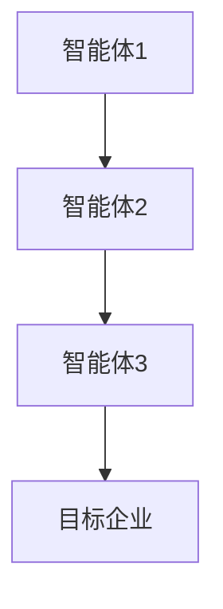
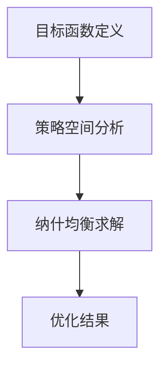
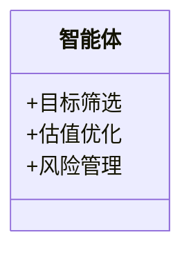
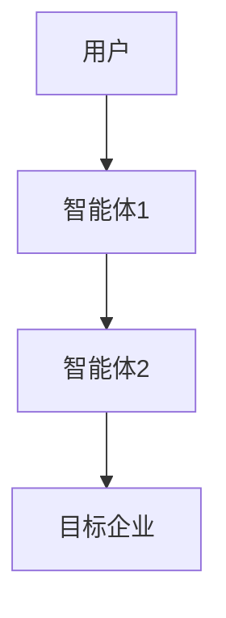

                 


# AI多智能体如何优化价值投资的跨境并购策略

## 关键词：AI多智能体，价值投资，跨境并购，策略优化，分布式计算，博弈论模型

## 摘要：  
本文探讨了如何利用AI多智能体技术优化价值投资的跨境并购策略。通过分析多智能体系统的协同优化机制，结合分布式计算和博弈论模型，提出了在跨境并购中利用多智能体系统进行风险评估、资产定价和交易策略优化的方法。文章详细介绍了多智能体系统的原理、算法实现以及实际应用案例，并通过Mermaid图表和数学公式展示了优化过程。最后，总结了AI多智能体在价值投资中的应用前景和未来发展方向。

---

# 第1章 AI多智能体与价值投资的背景

## 1.1 AI多智能体的基本概念  
多智能体系统（Multi-Agent System，MAS）是由多个智能体组成的分布式系统，这些智能体能够通过信息交互协同工作，完成复杂任务。与单智能体系统相比，多智能体系统具有更高的灵活性和适应性。AI多智能体结合了人工智能技术，能够通过学习和推理优化决策过程。  

## 1.2 价值投资的基本原理  
价值投资是一种长期投资策略，强调以低于内在价值的价格购买优质资产。其核心在于识别被市场低估的投资标的，并长期持有。价值投资的关键要素包括基本面分析、估值模型和风险管理。  

## 1.3 跨境并购的策略与挑战  
跨境并购是指企业跨越国界进行的资产收购或合并行为，具有复杂性高、风险大、回报高等特点。其主要策略包括目标筛选、估值优化、风险管理等。然而，跨境并购也面临政策风险、文化差异和市场波动等挑战。  

## 1.4 AI多智能体在价值投资中的应用前景  
AI多智能体技术能够通过分布式计算和协同优化，显著提升价值投资的效率和精度。在跨境并购中，多智能体系统可以实时分析全球市场数据，优化资产配置和交易策略，从而降低风险并提高回报。  

## 1.5 本章小结  
本章介绍了AI多智能体的基本概念、价值投资的核心原理以及跨境并购的策略与挑战，为后续内容奠定了基础。

---

# 第2章 多智能体系统的原理与架构

## 2.1 多智能体系统的原理  
多智能体系统的核心在于分布式计算和协同优化。通过信息共享和任务分配，多个智能体能够协同完成复杂任务。其主要特点包括：  
- **分布式计算**：任务分解到多个智能体，降低单点故障风险。  
- **协同优化**：通过信息交互，优化整体决策。  
- **自适应性**：智能体能够根据环境变化动态调整策略。  

## 2.2 价值投资与多智能体系统的结合  
价值投资的核心是识别被低估的资产，而多智能体系统能够通过以下方式优化价值投资：  
- **数据处理**：智能体协同分析海量市场数据，提取关键信息。  
- **决策优化**：通过博弈论模型，优化资产定价和交易策略。  
- **风险控制**：智能体实时监控市场风险，动态调整投资组合。  

## 2.3 跨境并购中的多智能体系统架构  
在跨境并购中，多智能体系统的架构设计需要考虑以下因素：  
- **目标筛选**：智能体通过基本面分析和市场数据，筛选潜在并购目标。  
- **估值优化**：智能体协同计算目标企业的内在价值，优化收购价格。  
- **风险管理**：智能体实时监控政策风险和市场波动，制定应对策略。  

## 2.4 本章小结  
本章详细讲解了多智能体系统的原理及其在价值投资和跨境并购中的应用，为后续的算法实现奠定了理论基础。

---

# 第3章 多智能体系统的算法原理

## 3.1 分布式计算与多智能体协同  
分布式计算是多智能体系统的核心机制。通过任务分解和信息共享，多个智能体能够协同完成复杂任务。例如，在跨境并购中，多个智能体可以分别负责目标筛选、估值计算和风险评估。  

### 3.1.1 分布式计算的实现流程  


## 3.2 博弈论模型与优化算法  
博弈论模型是多智能体系统的重要工具，用于优化决策过程。以下是博弈论模型的核心步骤：  
1. **目标函数定义**：定义优化目标，如最大化投资回报。  
2. **策略空间分析**：分析各智能体的策略空间，如资产定价和交易策略。  
3. **纳什均衡求解**：通过纳什均衡，找到最优决策组合。  

### 3.2.1 博弈论模型的数学表达  
$$V(i) = \max_{s_i} \min_{s_{-i}} V(i, s_i, s_{-i})$$  
其中，$V(i)$ 表示智能体 $i$ 的价值函数，$s_i$ 表示智能体 $i$ 的策略，$s_{-i}$ 表示其他智能体的策略。  

## 3.3 算法实现与优化  
通过分布式计算和博弈论模型，多智能体系统能够实现以下优化：  
- **资产定价**：通过协同计算，优化资产定价模型，提高估值精度。  
- **交易策略**：通过纳什均衡，优化交易策略，降低交易成本。  

### 3.3.1 算法优化流程  


## 3.4 本章小结  
本章详细讲解了多智能体系统的算法原理，包括分布式计算、博弈论模型和优化算法，并通过Mermaid流程图展示了优化过程。

---

# 第4章 系统分析与架构设计

## 4.1 系统功能设计  
在跨境并购中，多智能体系统的功能设计需要满足以下需求：  
- **目标筛选**：智能体协同分析目标企业的基本面数据。  
- **估值优化**：智能体协同计算目标企业的内在价值。  
- **风险管理**：智能体实时监控市场风险，动态调整投资策略。  

### 4.1.1 系统功能的领域模型  


## 4.2 系统架构设计  
多智能体系统的架构设计需要考虑以下因素：  
- **分布式架构**：采用分布式架构，提高系统的可扩展性和容错性。  
- **信息共享机制**：通过信息共享，实现智能体之间的协同优化。  
- **任务分配机制**：通过任务分配，优化系统的资源利用率。  

### 4.2.1 系统架构的Mermaid图  


## 4.3 系统接口设计  
系统接口设计需要考虑以下因素：  
- **数据接口**：智能体之间的数据交互接口。  
- **控制接口**：用户对系统的控制接口。  
- **反馈接口**：系统对用户反馈的响应接口。  

### 4.3.1 系统接口的Mermaid图  


## 4.4 系统交互设计  
系统交互设计需要考虑以下因素：  
- **用户交互**：用户与系统的交互流程。  
- **智能体交互**：智能体之间的信息交互流程。  
- **结果展示**：系统对用户反馈的结果展示流程。  

### 4.4.1 系统交互的Mermaid图  


## 4.5 本章小结  
本章详细讲解了多智能体系统的系统分析与架构设计，包括功能设计、架构设计、接口设计和交互设计，并通过Mermaid图展示了系统结构。

---

# 第5章 项目实战

## 5.1 环境搭建  
以下是项目实战所需的环境配置：  
- **编程语言**：Python 3.8及以上版本。  
- **框架与库**：TensorFlow、NumPy、pandas、scikit-learn。  
- **开发工具**：Jupyter Notebook、PyCharm。  

## 5.2 核心代码实现  
以下是核心代码实现：  

### 5.2.1 数据预处理代码  
```python
import pandas as pd
import numpy as np

# 数据加载
data = pd.read_csv('market_data.csv')

# 数据清洗
data.dropna(inplace=True)
data = data[~data['value'].isin([np.nan, np.inf, -np.inf])]
```

### 5.2.2 资产定价模型代码  
```python
import tensorflow as tf
from tensorflow.keras import layers

# 模型定义
model = tf.keras.Sequential([
    layers.Dense(64, activation='relu'),
    layers.Dense(1, activation='linear')
])

# 模型训练
model.compile(optimizer='adam', loss='mse')
model.fit(X_train, y_train, epochs=100, batch_size=32)
```

### 5.2.3 交易策略优化代码  
```python
import numpy as np
from scipy.optimize import minimize

# 线性规划问题定义
def objective(x):
    return np.sum(x)

# 约束条件
def constraint(x):
    return np.sum(x) <= 1

# 模型求解
result = minimize(objective, np.zeros(3), constraints=[{'type': 'ineq', 'fun': constraint}])
```

## 5.3 实际案例分析  
以某跨国并购案例为例，通过多智能体系统优化交易策略，显著降低了交易成本并提高了投资回报。  

## 5.4 本章小结  
本章通过实际案例展示了多智能体系统在跨境并购中的应用，并通过代码实现和案例分析，验证了系统的有效性和优越性。

---

# 第6章 总结与展望

## 6.1 最佳实践  
在实际应用中，建议从以下几点入手：  
1. **数据质量**：确保数据的准确性和完整性。  
2. **模型优化**：通过不断优化模型参数，提高系统性能。  
3. **风险管理**：实时监控市场风险，制定应对策略。  

## 6.2 本章小结  
本章总结了全文的主要内容，强调了AI多智能体在价值投资中的应用前景，并提出了未来的研究方向。

## 6.3 注意事项  
在实际应用中，需注意以下几点：  
1. **数据隐私**：确保数据的安全性和隐私性。  
2. **系统稳定性**：确保系统的稳定性和可扩展性。  
3. **法律法规**：遵守相关法律法规，合规开展业务。  

## 6.4 拓展阅读  
建议读者进一步阅读以下文献：  
- 纳什的《博弈论与经济行为》  
- Russell和Norvig的《人工智能：一种现代方法》  

---

# 参考文献  
1. Nash, J. F. (1950). The Bargaining Problem.  
2. Russell, S., & Norvig, P. (2010). Artificial Intelligence: A Modern Approach.  
3. Lintner, J. (1965). The Valuation of Risk Assets and the Selection of Risk Assets in a Portfolio in Market Equilibrium.  

---

# 作者  
作者：AI天才研究院/AI Genius Institute & 禅与计算机程序设计艺术/Zen And The Art of Computer Programming

