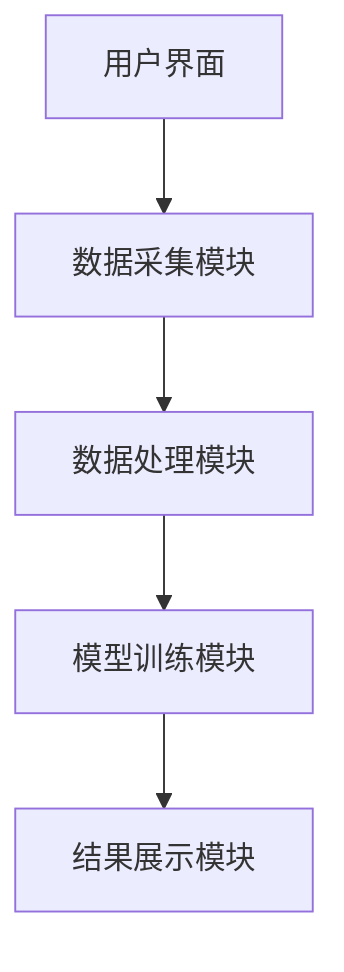
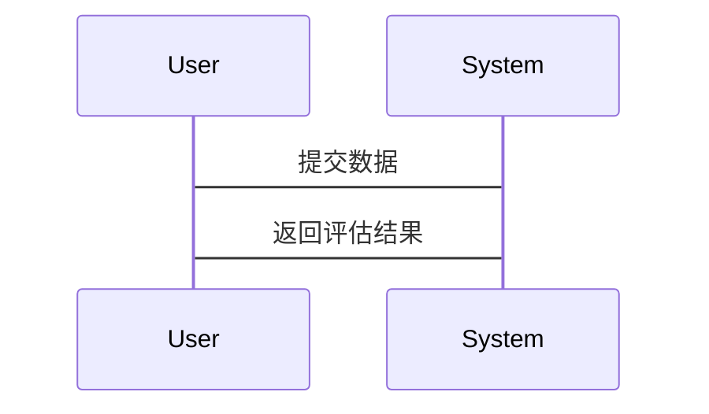

                 


# AI智能体在评估管理层诚信度中的作用

## 关键词：AI智能体、管理层诚信度、数据分析、评估模型、企业治理

## 摘要  
本文探讨AI智能体在评估管理层诚信度中的应用，从数据采集到模型构建，详细讲解技术实现，结合实际案例，验证方法的有效性，总结AI智能体的优势和未来发展。

## 目录大纲

### 第一部分: 背景与概念

#### 第1章: 问题背景与解决思路
##### 1.1 问题背景
###### 1.1.1 管理层诚信度的重要性  
管理层诚信度是企业治理的核心，直接影响企业决策和声誉。  
###### 1.1.2 传统诚信度评估的局限性  
传统方法依赖主观判断，效率低且易受主观因素影响。  
###### 1.1.3 AI技术在诚信度评估中的潜力  
AI技术可以通过数据分析，提供客观、高效的评估方式。  

##### 1.2 问题描述
###### 1.2.1 管理层诚信度评估的核心要素  
包括决策透明度、行为合规性、财务真实性等。  
###### 1.2.2 现有评估方法的不足  
现有方法主观性强，缺乏数据支持。  
###### 1.2.3 引入AI智能体的必要性  
AI智能体能够利用大数据进行精准分析，提升评估效率和准确性。  

##### 1.3 解决思路
###### 1.3.1 AI智能体在诚信度评估中的作用  
通过数据挖掘和机器学习，分析管理层的行为模式。  
###### 1.3.2 数据驱动的诚信度分析方法  
利用结构化和非结构化数据，构建评估模型。  
###### 1.3.3 结合上下文的评估策略  
综合考虑企业内外部因素，进行多维度评估。  

##### 1.4 边界与外延
###### 1.4.1 评估的适用范围  
适用于企业高管和中层管理者。  
###### 1.4.2 与其他评估方法的区分  
AI智能体评估基于数据驱动，传统评估基于主观判断。  
###### 1.4.3 未来可能的扩展方向  
结合自然语言处理，分析文本数据，进一步提升评估精度。  

##### 1.5 核心要素组成
###### 1.5.1 管理层行为数据  
包括决策记录、财务数据、员工反馈等。  
###### 1.5.2 企业内外部信息  
如市场表现、行业标准、法律法规等。  
###### 1.5.3 AI智能体的分析模型  
包括数据预处理、特征提取、模型训练等步骤。  

### 第二部分: 核心概念与联系

#### 第2章: 核心概念与联系
##### 2.1 AI智能体的定义与特征
###### 2.1.1 AI智能体的基本概念  
AI智能体是能够感知环境并采取行动的智能系统。  
###### 2.1.2 AI智能体的核心特征  
具备学习能力、适应性、自主决策能力。  
###### 2.1.3 AI智能体与传统算法的区别  
AI智能体具有更强的自主性和适应性，能够动态调整策略。  

##### 2.2 管理层诚信度评估模型
###### 2.2.1 模型的构建逻辑  
通过数据采集、特征提取、模型训练等步骤构建评估模型。  
###### 2.2.2 模型的输入与输出  
输入：管理层行为数据；输出：诚信度评分。  
###### 2.2.3 模型的关键参数  
如学习率、特征权重、评估阈值等。  

##### 2.3 核心概念对比
###### 2.3.1 AI智能体与传统评估方法的对比  
| 对比维度 | AI智能体 | 传统评估方法 |  
|----------|----------|---------------|  
| 数据依赖 | 高 | 低 |  
| 精度 | 高 | 中 |  
| 效率 | 高 | 低 |  

###### 2.3.2 不同诚信度评估模型的对比  
| 模型类型 | 基于规则的模型 | 机器学习模型 | 深度学习模型 |  
|----------|----------------|---------------|---------------|  
| 优势 | 规则明确 | 高精度 | 强大学习能力 |  
| 劣势 | 灵活性低 | 需大量数据 | 计算资源需求高 |  

###### 2.3.3 数据特征与模型性能的关系  
数据特征越丰富，模型性能越好。  

##### 2.4 实体关系图  


### 第三部分: 算法原理

#### 第3章: 算法原理
##### 3.1 算法概述
###### 3.1.1 AI智能体的算法流程  
1. 数据采集  
2. 数据预处理  
3. 特征提取  
4. 模型训练  
5. 评估与优化  

##### 3.2 算法实现
###### 3.2.1 基于规则的评估算法  
```python
def rule_based_assessment(data):
    score = 0
    for rule in rules:
        if rule.match(data):
            score += rule.weight
    return score
```

###### 3.2.2 机器学习模型的实现  
```python
from sklearn import svm

model = svm.SVC()
model.fit(X_train, y_train)
prediction = model.predict(X_test)
```

###### 3.2.3 数学模型与公式  
损失函数：  
$$L = \frac{1}{n}\sum_{i=1}^{n}(y_i - \hat{y_i})^2$$  

预测模型：  
$$\hat{y} = w \cdot x + b$$  

##### 3.3 算法优化
###### 3.3.1 参数调整  
如调整学习率、正则化参数等。  
###### 3.3.2 模型集成  
使用集成学习提升模型性能。  

### 第四部分: 系统架构

#### 第4章: 系统架构设计
##### 4.1 系统功能模块
###### 4.1.1 数据采集模块  
负责采集管理层的行为数据。  
###### 4.1.2 数据处理模块  
对数据进行清洗和转换。  
###### 4.1.3 模型训练模块  
训练诚信度评估模型。  
###### 4.1.4 结果展示模块  
展示评估结果。  

##### 4.2 系统架构图  


##### 4.3 接口设计
###### 4.3.1 数据接口  
如API接口，用于数据传输。  
###### 4.3.2 模型接口  
用于调用模型进行评估。  

##### 4.4 交互流程图  


### 第五部分: 项目实战

#### 第5章: 项目实战
##### 5.1 环境安装
###### 5.1.1 安装Python  
```bash
python --version
```
###### 5.1.2 安装依赖库  
```bash
pip install numpy scikit-learn
```

##### 5.2 核心代码实现
###### 5.2.1 数据预处理  
```python
import pandas as pd

data = pd.read_csv('manager_data.csv')
data.dropna(inplace=True)
```

###### 5.2.2 模型训练  
```python
from sklearn.model_selection import train_test_split
from sklearn.metrics import accuracy_score

X_train, X_test, y_train, y_test = train_test_split(data.drop('score', axis=1), data['score'], test_size=0.2)
model = svm.SVC()
model.fit(X_train, y_train)
print("Accuracy:", accuracy_score(y_test, model.predict(X_test)))
```

##### 5.3 实际案例分析  
以某公司高管为例，分析其诚信度评估结果，并解释模型的预测过程。  

##### 5.4 代码解读与分析  
详细解读代码的功能和实现逻辑。  

##### 5.5 项目小结  
总结项目实现的关键点和经验教训。  

### 第六部分: 最佳实践

#### 第6章: 最佳实践
##### 6.1 实践建议
###### 6.1.1 数据隐私保护  
确保数据的安全性和合规性。  
###### 6.1.2 模型持续优化  
定期更新模型，保持评估的准确性。  
###### 6.1.3 人机结合  
结合人工审核，提升评估的全面性。  

##### 6.2 小结  
AI智能体在评估管理层诚信度中具有巨大潜力，但需要结合实际场景，不断优化模型和数据质量。  

##### 6.3 注意事项  
- 数据质量对评估结果影响重大。  
- 需要遵守相关法律法规。  

##### 6.4 拓展阅读  
推荐相关书籍和论文，供读者深入学习。  

## 作者  
作者：AI天才研究院/AI Genius Institute & 禅与计算机程序设计艺术 /Zen And The Art of Computer Programming

