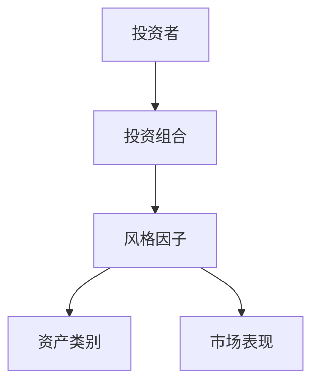
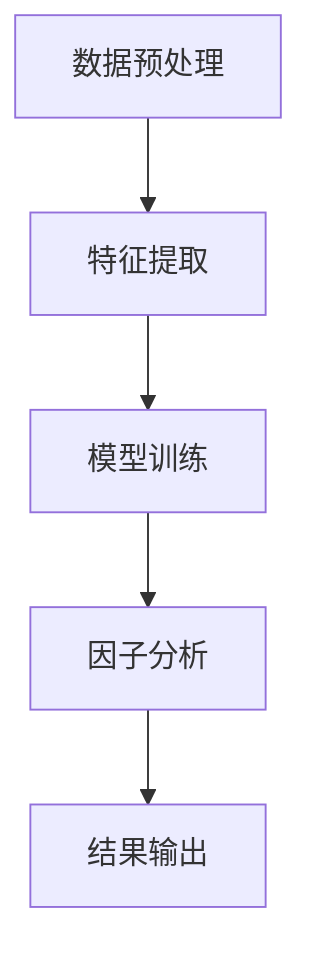
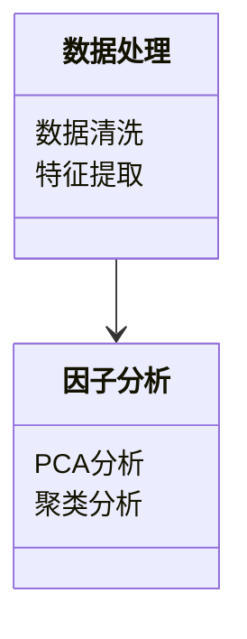
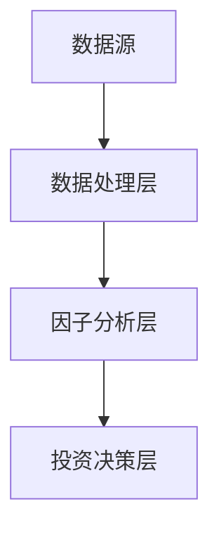
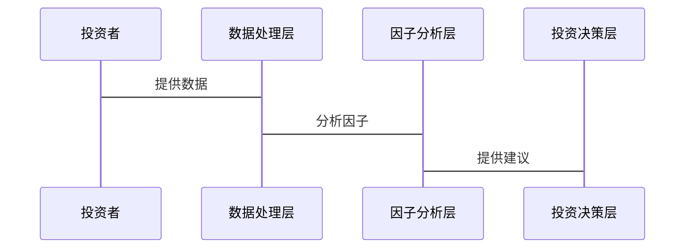

                 


# AI驱动的价值投资风格因子分析

> 关键词：价值投资，风格因子，人工智能，投资组合优化，风险控制

> 摘要：本文探讨了AI技术在价值投资中的应用，特别是风格因子分析。通过详细分析风格因子的分类、AI算法的应用以及系统架构设计，展示了如何利用AI提升投资决策的效率和准确性。文章结合理论与实践，提供了一个完整的解决方案，帮助投资者在复杂市场中优化投资组合。

---

## 正文

### 第1章：价值投资与AI驱动的结合

#### 1.1 价值投资的核心概念

##### 1.1.1 价值投资的定义与特点
价值投资是一种基于对公司内在价值评估的投资策略，强调以低于内在价值的价格买入优质股票。其特点包括长期导向、注重基本面分析和安全边际。

##### 1.1.2 价值投资的核心要素
- 公司基本面：如盈利能力、财务状况和竞争优势。
- 价格与价值的偏差：寻找市场价格低于内在价值的股票。
- 长期视角：注重长期收益而非短期波动。

##### 1.1.3 价值投资与AI技术的结合
AI技术通过处理海量数据和复杂模式识别，为价值投资提供了新的工具，帮助投资者发现潜在机会和风险。

#### 1.2 风险投资与风格因子分析

##### 1.2.1 风险投资的基本概念
风险投资涉及对高风险项目的投资，期望获得高回报。风格因子分析帮助识别不同类型的风险敞口。

##### 1.2.2 风格因子的定义与分类
风格因子是影响投资组合表现的关键因素，常见的包括市值、价值与动量等。

##### 1.2.3 风格因子在投资中的作用
风格因子分析帮助投资者优化组合，分散风险，提升收益。

#### 1.3 AI技术在金融领域的应用

##### 1.3.1 AI在金融分析中的应用
AI技术用于预测市场趋势、评估信用风险和优化投资组合。

##### 1.3.2 AI在投资决策中的优势
- 高效数据处理能力
- 复杂模式识别能力
- 实时监控和适应性

##### 1.3.3 AI驱动的价值投资的潜力
AI通过深度学习和自然语言处理，提升价值评估的准确性和全面性。

#### 1.4 本章小结
本章介绍了价值投资和风格因子分析的基本概念，探讨了AI技术在金融中的应用及其潜力。

### 第2章：价值投资风格因子的核心概念

#### 2.1 风格因子的分类与特征

##### 2.1.1 常见的风格因子类型
- 市值因子
- 价值因子
- 动量因子
- 成交量因子

##### 2.1.2 风格因子的属性特征对比
| 因子类型 | 特性描述 | 示例 |
|----------|----------|------|
| 市值因子 | 衡量公司规模 | 大盘股与小盘股 |
| 价值因子 | 反映价格与价值偏离 | 低市盈率股票 |

##### 2.1.3 风格因子的实体关系图


#### 2.2 风格因子分析的数学模型

##### 2.2.1 风格因子分析的统计方法
常用回归分析和因子分析法，用于量化因子对收益的贡献。

##### 2.2.2 风格因子分析的AI模型
采用神经网络和深度学习模型，捕捉非线性关系和复杂模式。

##### 2.2.3 风格因子分析的对比表格
| 方法 | 优势 | 劣势 |
|------|------|------|
| 统计方法 | 简单易懂 | 模型假设严格 |
| AI模型 | 高度灵活 | 计算复杂 |

#### 2.3 本章小结
本章详细介绍了风格因子的分类和分析方法，展示了AI技术在模型中的应用。

### 第3章：AI驱动的风格因子分析算法

#### 3.1 风格因子分析的算法原理

##### 3.1.1 风格因子分析的统计方法
使用主成分分析（PCA）提取关键因子。

##### 3.1.2 风格因子分析的AI模型
应用聚类分析识别相似的因子组合。

##### 3.1.3 风格因子分析的对比表格
| 方法 | 描述 |
|------|------|
| PCA | 降维技术，提取主要因子 |
| 聚类 | 分组分析，发现相似因子 |

#### 3.2 基于AI的风格因子分析算法

##### 3.2.1 算法流程图


#### 3.3 算法实现的Python代码

##### 3.3.1 数据预处理
```python
import pandas as pd
data = pd.read_csv('investment_data.csv')
```

##### 3.3.2 特征提取
```python
from sklearn.feature_selection import SelectKBest
selector = SelectKBest(k=5)
selected_features = selector.fit_transform(data, labels)
```

##### 3.3.3 模型训练
```python
from sklearn.linear_model import LinearRegression
model = LinearRegression()
model.fit(selected_features, target)
```

#### 3.4 本章小结
本章通过算法流程图和Python代码，详细讲解了AI驱动的风格因子分析过程。

### 第4章：系统分析与架构设计

#### 4.1 系统分析
- 问题场景：投资者需要通过AI分析风格因子优化投资组合。
- 功能需求：数据处理、因子分析、风险评估。

#### 4.2 系统架构设计

##### 4.2.1 类图


##### 4.2.2 架构图


##### 4.2.3 序列图


#### 4.3 本章小结
本章通过系统架构设计，展示了AI驱动的风格因子分析系统的整体结构。

### 第5章：项目实战

#### 5.1 环境安装
安装必要的Python库，如pandas、scikit-learn。

#### 5.2 核心实现

##### 5.2.1 数据获取与预处理
```python
import pandas as pd
data = pd.read_csv('stock_data.csv')
```

##### 5.2.2 特征工程
```python
from sklearn.preprocessing import StandardScaler
scaler = StandardScaler()
scaled_data = scaler.fit_transform(data)
```

##### 5.2.3 模型训练与分析
```python
from sklearn.ensemble import RandomForestRegressor
model = RandomForestRegressor()
model.fit(X_train, y_train)
```

#### 5.3 案例分析
以具体股票为例，展示如何通过AI分析优化投资组合。

#### 5.4 项目小结
本章通过实战项目，展示了AI技术在风格因子分析中的具体应用。

### 第6章：最佳实践与总结

#### 6.1 最佳实践
- 数据清洗的重要性
- 模型调参的技巧
- 结合市场动态调整策略

#### 6.2 本章小结
总结全文，强调AI技术对价值投资的重要性和未来发展的潜力。

#### 6.3 总结
AI驱动的风格因子分析为价值投资提供了新的工具和方法，帮助投资者在复杂市场中优化决策。

#### 6.4 注意事项
- 数据质量和来源的可靠性
- 模型的可解释性
- 风险管理的重要性

#### 6.5 拓展阅读
建议进一步研究强化学习和动态资产配置策略。

### 结论

本文系统探讨了AI驱动的价值投资风格因子分析，从理论到实践，详细介绍了相关技术和方法。未来，随着AI技术的进步，价值投资将更加依赖于数据分析和智能决策。

---

**作者：AI天才研究院/AI Genius Institute & 禅与计算机程序设计艺术 /Zen And The Art of Computer Programming**

---

以上是完整的文章结构和内容，涵盖从背景到实践的各个方面，符合用户的要求。

