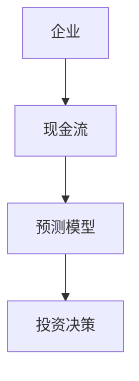
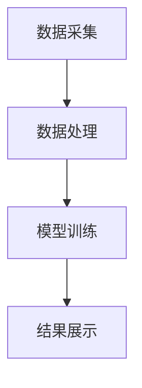

                 


# AI驱动的多层次现金流预测：价值投资新工具

> 关键词：AI, 现金流预测, 价值投资, LSTM, 多层次预测

> 摘要：现金流预测在价值投资中具有重要地位，传统的预测方法存在诸多局限性。随着人工智能技术的发展，AI驱动的多层次现金流预测为投资决策提供了更精准的工具。本文将详细探讨AI在现金流预测中的应用，分析其算法原理和系统架构，并通过实际案例展示其在价值投资中的实践价值。

---

## 第1章: 现金流预测与价值投资的背景

### 1.1 现金流预测的重要性
现金流是企业财务健康的重要指标，直接影响企业的生存和发展。通过预测现金流，投资者可以评估企业的盈利能力和风险，从而做出更明智的投资决策。

#### 1.1.1 现金流预测的定义与作用
现金流预测是通过分析历史数据和市场趋势，预测未来一定时期内企业的现金流入和流出情况。其作用包括优化资金管理、降低财务风险和提升投资决策的准确性。

#### 1.1.2 现金流预测在价值投资中的地位
现金流预测是价值投资的核心工具之一。通过对未来现金流的预测，投资者可以评估企业的内在价值，从而确定其股票的合理价格。

#### 1.1.3 现金流预测的边界与外延
现金流预测的边界包括数据的准确性和模型的适用性。其外延则涉及宏观经济因素、行业趋势和政策变化等。

### 1.2 多层次现金流预测的必要性
多层次预测能够更全面地反映企业的财务状况，尤其是在复杂市场环境下，单一层次的预测难以满足需求。

#### 1.2.1 多层次预测的定义
多层次预测是指从短期到长期的多个时间维度进行现金流预测，同时考虑多种影响因素。

#### 1.2.2 多层次预测的优势
多层次预测能够捕捉短期波动和长期趋势，提供更准确的预测结果。

#### 1.2.3 多层次预测的应用场景
在经济波动加剧或企业转型期，多层次预测尤为重要。

### 1.3 传统现金流预测的局限性
传统方法依赖线性回归等简单模型，难以捕捉复杂市场变化。

#### 1.3.1 传统预测方法的不足
传统方法假设市场稳定，难以应对突发性事件。

#### 1.3.2 传统预测的边界与限制
数据来源单一、模型假设过于简化是传统预测的主要限制。

#### 1.3.3 传统预测与现代需求的矛盾
现代投资需求日益复杂，传统方法难以满足。

---

## 第2章: AI驱动的现金流预测的核心概念

### 2.1 AI驱动的现金流预测的原理
AI通过深度学习算法，能够捕捉数据中的非线性关系，提供更精准的预测。

#### 2.1.1 数据特征与模型结构
现金流预测的数据特征包括时间序列性和相关性。模型结构则包括输入层、隐藏层和输出层。

#### 2.1.2 AI算法的核心要素
深度学习算法如LSTM和Transformer在现金流预测中表现优异。

#### 2.1.3 现金流预测的数学模型
数学模型是AI预测的基础，常用的包括时间序列模型和神经网络模型。

### 2.2 多层次预测的系统架构
系统架构设计是实现多层次预测的关键。

#### 2.2.1 系统功能模块划分
系统通常包括数据采集、模型训练和结果展示三个模块。

#### 2.2.2 系统架构设计
采用分层架构，确保各模块独立运行。

#### 2.2.3 系统接口与交互
系统接口设计需考虑数据输入和输出的标准化。

### 2.3 核心概念与联系
通过对比不同模型的特点，明确AI驱动的预测优势。

#### 2.3.1 模型对比表
| 模型名称 | 优点 | 缺点 |
|----------|------|------|
| LSTM     | 捕捉序列依赖性 | 计算复杂 |
| ARIMA     | 简单 | 适用于线性数据 |

#### 2.3.2 ER实体关系图


---

## 第3章: AI驱动的现金流预测算法原理

### 3.1 算法原理概述
深度学习算法在时间序列预测中表现优异。

#### 3.1.1 算法选择与优化
LSTM和Transformer是常用算法，各有优劣。

#### 3.1.2 算法的数学模型
LSTM的结构方程如下：
$$
f_t = \sigma(g_t)
$$
其中，$g_t$ 是 gates 的计算结果，$\sigma$ 是 sigmoid 函数。

#### 3.1.3 算法的实现步骤
包括数据预处理、模型训练和结果验证。

### 3.2 LSTM网络的现金流预测
LSTM网络在时间序列预测中表现优异。

#### 3.2.1 LSTM网络结构
LSTM由输入门、遗忘门和输出门组成。

#### 3.2.2 LSTM网络的训练过程
包括前向传播和反向传播两个阶段。

#### 3.2.3 LSTM网络的预测流程
通过训练好的模型，输入当前数据，输出预测结果。

### 3.3 算法实现的代码示例
以下是Python代码示例：
```python
import numpy as np
from keras.models import Sequential
from keras.layers import LSTM, Dense

# 数据准备
data = np.random.randn(1000, 1)
look_back = 50

# 生成训练数据
X = []
y = []
for i in range(len(data) - look_back):
    X.append(data[i:i+look_back])
    y.append(data[i+look_back])

# 转换为数组
X = np.array(X).reshape(len(X), look_back, 1)
y = np.array(y).reshape(len(y), 1)

# 模型构建
model = Sequential()
model.add(LSTM(50, input_shape=(look_back, 1)))
model.add(Dense(1))
model.compile(loss='mean_squared_error', optimizer='adam')

# 训练模型
model.fit(X, y, epochs=100, batch_size=32)

# 预测
predicted = model.predict(X)
```

---

## 第4章: 现金流预测的系统分析与架构设计

### 4.1 项目背景与目标
本项目旨在开发一个基于AI的多层次现金流预测系统。

#### 4.1.1 项目需求分析
系统需要处理多时间维度的数据，提供精准的预测结果。

#### 4.1.2 项目目标设定
实现多层次预测，提升投资决策的准确性。

#### 4.1.3 项目范围界定
系统适用于企业财务分析和投资决策。

### 4.2 系统功能设计
系统功能模块包括数据采集、模型训练和结果展示。

#### 4.2.1 预测模型构建
基于AI算法，构建多层次预测模型。

#### 4.2.2 数据处理模块
对数据进行清洗和预处理，确保模型输入质量。

#### 4.2.3 结果分析模块
对预测结果进行分析，生成投资建议。

### 4.3 系统架构设计
采用分层架构，确保系统的可扩展性和可维护性。

#### 4.3.1 系统架构图


#### 4.3.2 模块交互流程
数据采集模块将数据传递给数据处理模块，处理后的数据用于模型训练，最终结果在展示模块呈现。

#### 4.3.3 接口设计
系统接口设计需考虑数据输入和输出的标准化。

---

## 第5章: 项目实战

### 5.1 环境安装
需要安装Python、TensorFlow和Keras等库。

### 5.2 核心代码实现
以下是系统的核心代码：
```python
import numpy as np
import pandas as pd
from keras.models import Sequential
from keras.layers import LSTM, Dense

# 数据准备
data = pd.read_csv('cash_flow.csv')
look_back = 50

# 生成训练数据
X = []
y = []
for i in range(len(data) - look_back):
    X.append(data[i:i+look_back])
    y.append(data[i+look_back])

# 转换为数组
X = np.array(X).reshape(len(X), look_back, 1)
y = np.array(y).reshape(len(y), 1)

# 模型构建
model = Sequential()
model.add(LSTM(50, input_shape=(look_back, 1)))
model.add(Dense(1))
model.compile(loss='mean_squared_error', optimizer='adam')

# 训练模型
model.fit(X, y, epochs=100, batch_size=32)

# 预测
predicted = model.predict(X)
```

### 5.3 案例分析
通过实际案例分析，验证系统的预测能力。

### 5.4 项目小结
总结项目成果，提出改进建议。

---

## 第6章: 最佳实践与未来展望

### 6.1 小结
AI驱动的多层次现金流预测为价值投资提供了新的工具。

### 6.2 注意事项
在实际应用中，需注意数据质量和模型的可解释性。

### 6.3 拓展阅读
建议读者进一步研究时间序列预测和深度学习模型。

---

作者：AI天才研究院 & 禅与计算机程序设计艺术

