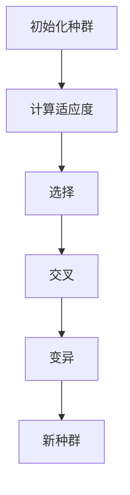
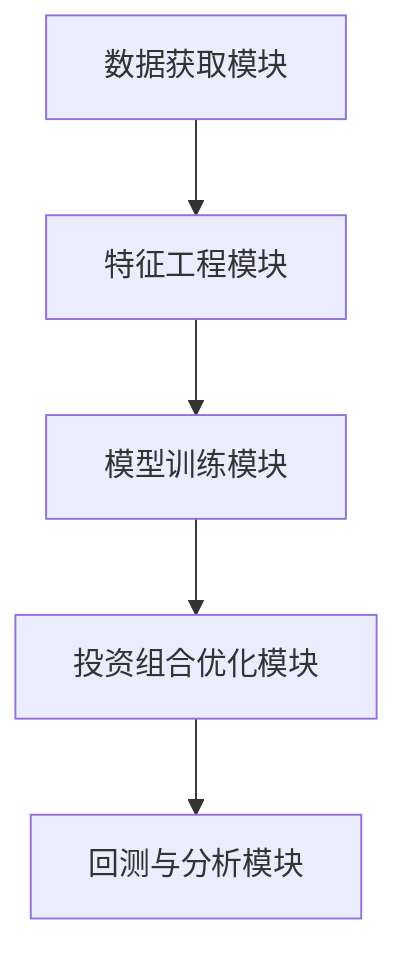

                 


# AI驱动的投资组合优化器

## 关键词：AI，投资组合优化，机器学习，智能优化算法，大数据分析

## 摘要：本文探讨了AI在投资组合优化中的应用，从数学基础、算法实现到系统架构设计，结合项目实战，详细分析了如何利用AI技术构建高效的投资组合优化器。

---

## 第1章：投资组合优化与AI的结合

### 1.1 背景与意义

#### 1.1.1 投资组合优化的定义与目标
投资组合优化是指在给定风险承受能力下，寻找最优资产配置，以实现收益最大化的过程。其目标包括最大化收益、最小化风险、满足投资约束等。

#### 1.1.2 AI技术在投资组合优化中的作用
AI通过大数据分析和机器学习模型，帮助识别市场模式，预测资产价格波动，优化投资组合，提高收益并降低风险。

#### 1.1.3 当前投资组合优化的挑战
传统方法依赖历史数据，难以应对市场波动和突发事件。AI技术的应用能够增强模型的适应性和预测能力。

### 1.2 核心概念

#### 1.2.1 AI与投资组合优化的结合方式
AI通过监督学习、无监督学习和强化学习等方法，优化投资组合。

#### 1.2.2 数据驱动的优化方法
利用大数据分析，提取特征，构建预测模型，优化投资组合。

#### 1.2.3 智能优化算法的特点
智能优化算法通过模拟自然进化或物理过程，找到全局最优解。

### 1.3 本书结构与目标
本书将从理论到实践，详细讲解AI驱动的投资组合优化器的设计与实现，帮助读者掌握相关技术和方法。

---

## 第2章：投资组合优化的数学基础

### 2.1 现代投资组合理论（MPT）

#### 2.1.1 均值-方差优化
目标是最小化投资组合的方差，同时满足收益要求。

$$\min_w \sum_{i=1}^n w_i^2 \sigma_i^2$$

#### 2.1.2 资本资产定价模型（CAPM）
$$E(R_i) = R_f + \beta_i (R_m - R_f)$$

#### 2.1.3 马科维茨有效前沿
有效前沿是所有可行投资组合中收益-风险效率最高的曲线。

### 2.2 数学模型与优化目标

#### 2.2.1 投资组合优化的数学表达
$$\min_w \frac{1}{2}w^T \Sigma w$$
$$s.t. \sum_{i=1}^n w_i = 1$$

#### 2.2.2 目标函数与约束条件
目标函数：风险最小化或收益最大化  
约束条件：权重非负，总和为1

### 2.3 线性代数与概率论基础

#### 2.3.1 矩阵运算在投资组合优化中的应用
协方差矩阵用于计算资产间的相关性。

#### 2.3.2 概率分布与风险评估
正态分布假设用于资产收益的建模。

#### 2.3.3 统计推断的基本概念
用于估计模型参数和假设检验。

---

## 第3章：人工智能与投资组合优化的结合

### 3.1 机器学习在投资组合优化中的应用

#### 3.1.1 监督学习与无监督学习
- 监督学习：使用历史数据预测资产价格。
- 无监督学习：发现市场结构和模式。

#### 3.1.2 强化学习
通过模拟交易环境，优化投资策略。

#### 3.1.3 深度学习
用于复杂非线性关系的建模。

### 3.2 智能优化算法

#### 3.2.1 遗传算法
- 初始化：随机生成初始种群。
- 适应度评估：计算收益和风险。
- 选择：保留优秀个体。
- 交叉与变异：生成新个体。



#### 3.2.2 模拟退火算法
逐步降低温度，避免陷入局部最优。

### 3.3 大数据分析与投资组合优化

#### 3.3.1 数据预处理与特征提取
清洗数据，提取有效特征。

#### 3.3.2 数据驱动的投资策略
利用大数据预测市场趋势。

#### 3.3.3 优化挑战
处理高维数据和计算复杂度。

---

## 第4章：投资组合优化的算法实现

### 4.1 现代投资组合理论的算法实现

#### 4.1.1 均值-方差优化
使用拉格朗日乘数法求解。

#### 4.1.2 马科维茨有效前沿
通过二次规划求解。

### 4.2 智能优化算法的实现

#### 4.2.1 遗传算法实现
```python
def genetic_algorithm(objective_func, constraints, pop_size, ...):
    while not done:
        evaluate population
        select survivors
        breed new individuals
        mutate
```

#### 4.2.2 模拟退火算法实现
```python
def simulated_annealing(objective_func, initial_state, ...):
    current = initial_state
    while T > 0:
        neighbor = get_neighbor(current)
        if evaluate(neighbor) < evaluate(current):
            current = neighbor
        T *= cooling_rate
```

### 4.3 机器学习模型的实现

#### 4.3.1 线性回归模型
$$y = \beta_0 + \beta_1 x + \epsilon$$

#### 4.3.2 支持向量机模型
最大化间隔的分类与回归。

#### 4.3.3 神经网络模型
多层感知机用于复杂函数逼近。

---

## 第5章：投资组合优化的系统架构设计

### 5.1 系统功能模块划分

#### 5.1.1 数据获取与处理模块
获取实时数据，清洗和转换。

#### 5.1.2 特征工程模块
提取特征，如技术指标和市场情绪。

#### 5.1.3 模型训练与优化模块
训练机器学习模型，优化投资组合。

#### 5.1.4 投资组合回测与分析模块
回测策略，评估性能。

### 5.2 系统架构设计



### 5.3 系统接口设计

#### 5.3.1 数据接口
提供API获取市场数据。

#### 5.3.2 模型接口
定义输入输出接口，供优化模块调用。

#### 5.3.3 用户接口
图形化界面，展示结果和交互。

---

## 第6章：项目实战——构建AI驱动的投资组合优化器

### 6.1 项目环境搭建

#### 6.1.1 Python环境安装
安装Python和必要的库。

#### 6.1.2 机器学习框架安装
安装TensorFlow、PyTorch等。

#### 6.1.3 数学库安装
安装NumPy、SciPy等。

### 6.2 系统核心实现

#### 6.2.1 数据获取与处理
使用API获取数据，清洗和预处理。

#### 6.2.2 特征工程
提取技术指标和市场情绪特征。

#### 6.2.3 模型训练与优化
训练机器学习模型，优化投资组合。

#### 6.2.4 投资组合回测
回测策略，评估收益和风险。

### 6.3 代码实现与解读

#### 6.3.1 数据处理代码
```python
import pandas as pd

data = pd.read_csv('data.csv')
data = data.dropna()
```

#### 6.3.2 特征工程代码
```python
from sklearn.preprocessing import StandardScaler

features = data[['return', 'volatility']]
scaler = StandardScaler()
features_scaled = scaler.fit_transform(features)
```

#### 6.3.3 模型训练代码
```python
from sklearn.svm import SVC

model = SVC()
model.fit(features_scaled, labels)
```

### 6.4 实际案例分析
通过具体案例分析，展示如何优化投资组合。

### 6.5 项目小结
总结项目实现的关键点和经验教训。

---

## 第7章：最佳实践与总结

### 7.1 最佳实践
- 数据清洗的重要性
- 特征选择的技巧
- 模型调优的策略

### 7.2 小结
AI技术为投资组合优化提供了新的思路和方法。

### 7.3 注意事项
- 模型过拟合的风险
- 数据偏差的影响
- 市场波动的不可预测性

### 7.4 拓展阅读
推荐相关书籍和论文，供读者深入学习。

---

## 作者：AI天才研究院 & 禅与计算机程序设计艺术

---

以上是《AI驱动的投资组合优化器》的技术博客文章的完整内容，涵盖了从基础理论到项目实战的各个方面，按照逻辑逐步展开，确保读者能够全面理解和掌握AI驱动投资组合优化器的设计与实现。

