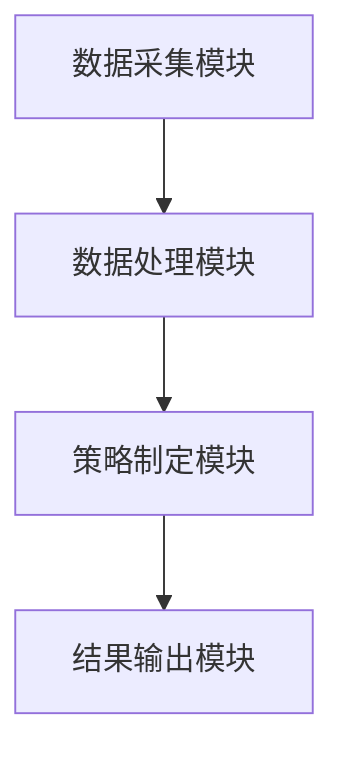
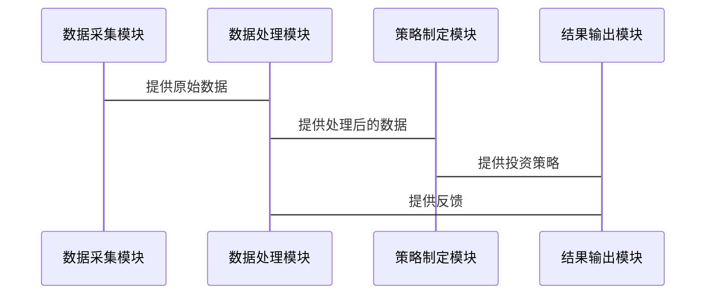

                 


# AI驱动的行业分析：多智能体系统在价值投资中的应用

> 关键词：AI驱动、行业分析、多智能体系统、价值投资、系统架构、项目实战

> 摘要：本文将深入探讨AI驱动的行业分析，特别是在价值投资中的应用。通过多智能体系统的原理和架构，结合具体的数学模型和算法，展示如何利用多智能体系统进行高效的价值投资分析和策略构建。文章还将详细讲解系统架构设计、项目实战和案例分析，为读者提供全面的理论和实践指导。

---

## 正文

### 第一部分: AI驱动的行业分析基础

#### 第1章: AI驱动的行业分析概述

##### 1.1 行业分析的核心概念

###### 1.1.1 什么是行业分析
行业分析是通过对市场、竞争对手、消费者行为等多方面数据的分析，评估行业的整体发展趋势和投资价值。传统的行业分析依赖于人工调研和经验判断，而AI驱动的行业分析则利用机器学习、自然语言处理等技术，提高分析的效率和准确性。

###### 1.1.2 AI在行业分析中的作用
AI技术可以处理海量数据，发现隐藏的模式和趋势，帮助投资者更快地做出决策。AI还能实时更新数据，提供动态的市场洞察，为价值投资提供支持。

###### 1.1.3 多智能体系统的特点
多智能体系统由多个协作或竞争的智能体组成，每个智能体都有自己的目标和决策机制。与传统单智能体系统相比，多智能体系统能够更好地模拟复杂的市场环境，提供更全面的分析。

##### 1.2 价值投资的基本原理

###### 1.2.1 价值投资的定义
价值投资是一种投资策略，强调以低于市场价值的价格买入优质资产。其核心是寻找被市场低估的公司，长期持有，等待其价值回归。

###### 1.2.2 价值投资的关键要素
- 公司基本面分析：包括财务状况、盈利能力、管理层素质等。
- 市场趋势分析：通过分析市场周期，判断投资的最佳时机。
- 风险控制：通过分散投资和止损策略，降低投资风险。

###### 1.2.3 价值投资与AI的结合
AI可以通过分析大量的历史数据和市场信息，帮助投资者识别潜在的投资机会和风险。多智能体系统可以在复杂的市场环境中，模拟不同投资策略的表现，为价值投资提供科学依据。

##### 1.3 多智能体系统的特点

###### 1.3.1 多智能体系统的定义
多智能体系统是由多个智能体组成的分布式系统，每个智能体能够感知环境、做出决策并与其他智能体协作或竞争。

###### 1.3.2 多智能体系统的组成
- 智能体：具有感知、决策和执行能力的独立实体。
- 通信机制：智能体之间交换信息的方式。
- 协作机制：智能体之间协同工作的规则和策略。

###### 1.3.3 多智能体系统的优缺点
优点：能够处理复杂问题，适应动态变化的环境，提供多样化的解决方案。
缺点：系统复杂性高，实现难度大，需要大量的计算资源。

---

#### 第2章: 多智能体系统的原理与架构

##### 2.1 多智能体系统的原理

###### 2.1.1 智能体的基本概念
智能体是具有感知、决策和执行能力的实体。在多智能体系统中，每个智能体都有自己的目标和行为规则。

###### 2.1.2 多智能体系统的通信机制
智能体之间通过共享信息或直接交互，实现协作和协调。常用的通信机制包括发布-订阅模式和点对点通信。

###### 2.1.3 多智能体系统的协作机制
协作机制是智能体之间如何协同工作的规则。常见的协作机制包括任务分配、资源分配和决策协调。

##### 2.2 多智能体系统的架构设计

###### 2.2.1 分层架构
分层架构将系统分为多个层次，每个层次负责不同的功能。例如，感知层负责数据采集，决策层负责策略制定。

###### 2.2.2 分布式架构
分布式架构将智能体分布在不同的节点上，通过网络进行通信和协作。这种架构适合处理大规模的数据和复杂的任务。

###### 2.2.3 集中式架构
集中式架构有一个中心节点，负责协调和管理所有智能体的行为。这种架构适合需要统一控制和协调的场景。

##### 2.3 多智能体系统的实现

###### 2.3.1 系统模块划分
多智能体系统可以划分为数据采集模块、数据处理模块、决策模块和执行模块。

###### 2.3.2 系统功能设计
系统功能包括数据采集、信息处理、策略制定和结果输出。

###### 2.3.3 系统性能优化
通过优化算法和减少通信延迟，提高系统的运行效率。

---

#### 第3章: 多智能体系统在价值投资中的应用

##### 3.1 价值投资中的数据获取

###### 3.1.1 数据来源
数据来源包括公开的财务报表、新闻资讯、社交媒体和政府公告等。

###### 3.1.2 数据清洗
数据清洗是去除无效数据和异常值，确保数据的准确性和完整性。

###### 3.1.3 数据预处理
数据预处理包括数据标准化、数据转换和数据归约。

##### 3.2 价值投资中的特征工程

###### 3.2.1 特征提取
特征提取是从数据中提取有用的信息，例如公司的盈利能力、市场占有率等。

###### 3.2.2 特征选择
特征选择是根据相关性或重要性，选择最重要的特征。

###### 3.2.3 特征优化
特征优化是通过降维或特征组合，提高模型的性能。

##### 3.3 价值投资中的策略构建

###### 3.3.1 策略设计
策略设计包括制定买入和卖出的规则，例如均线策略、MACD指标等。

###### 3.3.2 策略优化
策略优化是通过回测和参数调整，提高策略的盈利能力。

###### 3.3.3 策略评估
策略评估包括计算策略的收益、风险和稳定性。

##### 3.4 价值投资中的风险控制

###### 3.4.1 风险识别
风险识别是通过分析市场波动、公司基本面等，识别潜在的风险。

###### 3.4.2 风险评估
风险评估是通过量化方法，评估风险的大小和影响。

###### 3.4.3 风险控制
风险控制是通过设置止损、分散投资等方法，降低投资风险。

---

#### 第4章: 系统架构设计与实现

##### 4.1 系统架构设计

###### 4.1.1 系统模块划分
系统模块包括数据采集模块、数据处理模块、策略制定模块和结果输出模块。

###### 4.1.2 系统功能设计
系统功能包括数据采集、信息处理、策略制定和结果输出。

###### 4.1.3 系统性能优化
通过优化算法和减少通信延迟，提高系统的运行效率。

##### 4.2 系统功能设计

###### 4.2.1 数据采集模块
数据采集模块负责从多个数据源获取数据，例如爬取股票价格、公司新闻等。

###### 4.2.2 数据处理模块
数据处理模块负责清洗和预处理数据，提取有用的特征。

###### 4.2.3 策略制定模块
策略制定模块根据特征和市场情况，制定投资策略。

###### 4.2.4 结果输出模块
结果输出模块将策略执行结果输出，供投资者参考。

##### 4.3 系统架构图



##### 4.4 系统交互图



---

#### 第5章: 项目实战

##### 5.1 环境搭建

###### 5.1.1 安装Python
安装Python 3.8或更高版本，推荐使用Anaconda。

###### 5.1.2 安装依赖库
安装numpy、pandas、scikit-learn、matplotlib等库。

###### 5.1.3 安装深度学习框架
安装TensorFlow或PyTorch，用于实现复杂的模型。

##### 5.2 核心实现

###### 5.2.1 数据采集
使用BeautifulSoup或requests库，从互联网上爬取数据。

###### 5.2.2 数据处理
使用pandas库进行数据清洗和特征工程。

###### 5.2.3 策略制定
使用机器学习模型，如随机森林或支持向量机，进行策略制定。

##### 5.3 代码实现

###### 5.3.1 数据采集代码

```python
import requests
from bs4 import BeautifulSoup

url = "https://finance.yahoo.com/quote/AAPL"
response = requests.get(url)
soup = BeautifulSoup(response.text, 'html.parser')
data = {
    'price': soup.find('span', {'class': 'Trsdefer'}).text,
    'name': soup.find('h1', {'class': 'companyName'}).text
}
print(data)
```

###### 5.3.2 数据处理代码

```python
import pandas as pd

df = pd.DataFrame(data)
df['price'] = df['price'].astype(float)
print(df.head())
```

###### 5.3.3 策略制定代码

```python
from sklearn.ensemble import RandomForestRegressor

model = RandomForestRegressor()
model.fit(X_train, y_train)
y_pred = model.predict(X_test)
```

##### 5.4 实际案例分析

###### 5.4.1 案例介绍
以苹果公司为例，分析其股票价格走势，制定投资策略。

###### 5.4.2 模型训练
使用历史数据训练模型，预测未来价格走势。

###### 5.4.3 结果分析
根据模型预测结果，制定买入和卖出策略。

##### 5.5 项目小结
通过项目实战，我们可以看到AI驱动的多智能体系统在价值投资中的巨大潜力。通过实际案例分析，我们可以验证模型的有效性和实用性。

---

#### 第6章: 项目扩展与未来展望

##### 6.1 项目扩展

###### 6.1.1 引入更复杂的数据源
例如，引入社交媒体数据和新闻数据，丰富模型的输入。

###### 6.1.2 实现多智能体协作
通过多智能体协作，提高模型的准确性和鲁棒性。

###### 6.1.3 优化模型性能
通过改进算法和优化参数，提高模型的预测精度。

##### 6.2 未来展望
随着AI技术的不断发展，多智能体系统在价值投资中的应用将更加广泛。未来的挑战在于如何处理更复杂的数据和更动态的市场环境。

---

### 作者

作者：AI天才研究院/AI Genius Institute  
& 禅与计算机程序设计艺术 /Zen And The Art of Computer Programming

