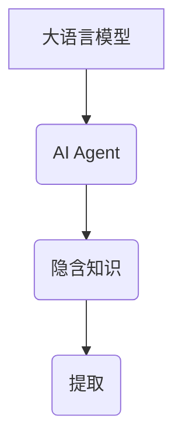
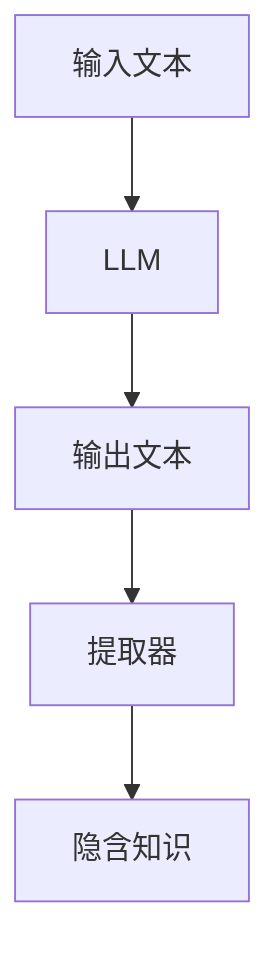
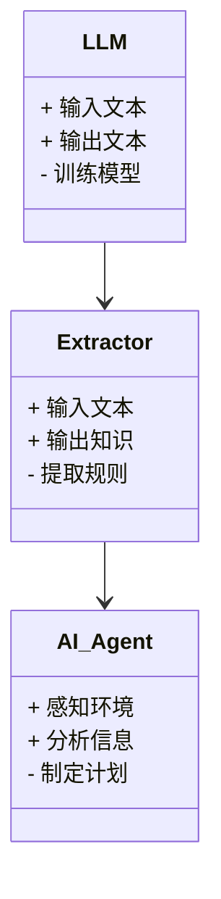
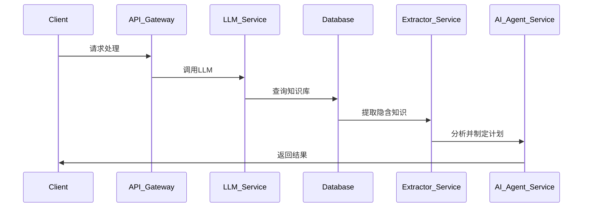

                 


# LLM在AI Agent隐含知识提取中的应用

**关键词**：LLM, AI Agent, 隐含知识提取, 大语言模型, 人工智能, 知识图谱

**摘要**：本文深入探讨了大语言模型（LLM）在AI代理（AI Agent）中的应用，特别是在隐含知识提取方面。通过分析LLM的原理、AI Agent的结构以及隐含知识提取的方法，本文为读者提供了从理论到实践的全面指导。文章还详细讲解了算法原理、系统架构设计和实际项目案例，帮助读者理解如何在实际场景中应用这些技术。

---

# 第1章 背景介绍

## 1.1 问题背景

### 1.1.1 LLM的定义与特点
大语言模型（LLM）是一种基于深度学习的自然语言处理模型，具有以下特点：
- **大规模训练**：通常使用海量文本数据进行训练。
- **多任务能力**：能够处理多种NLP任务，如文本生成、问答系统等。
- **上下文理解**：能够理解上下文关系，生成连贯的文本。

### 1.1.2 AI Agent的定义与特点
AI Agent是一种智能代理，能够感知环境并采取行动以实现目标。其特点包括：
- **自主性**：能够在没有外部干预的情况下运行。
- **反应性**：能够根据环境变化调整行为。
- **目标导向**：通过采取行动来实现特定目标。

### 1.1.3 隐含知识提取的定义与特点
隐含知识提取是从文本中抽取隐藏在表面信息背后的深层知识。其特点包括：
- **隐含性**：知识并非直接给出，需要通过推理获得。
- **多样性**：隐含知识可以是事实、关系或推理结果。
- **复杂性**：提取过程涉及多种NLP技术，如语义分析和推理。

## 1.2 问题描述

### 1.2.1 LLM在AI Agent中的作用
LLM作为AI Agent的核心组件，负责处理自然语言输入并生成输出，帮助AI Agent理解和生成文本。

### 1.2.2 隐含知识提取的挑战
隐含知识提取的难点在于如何准确识别和抽取隐藏在文本中的信息，这需要结合上下文理解和推理能力。

### 1.2.3 当前技术的局限性
现有技术在处理复杂语义和上下文依赖时仍存在不足，难以准确提取所有类型的隐含知识。

## 1.3 问题解决

### 1.3.1 LLM在AI Agent中的应用场景
LLM可以应用于智能问答、文本生成、对话系统等场景，帮助AI Agent更好地与用户交互。

### 1.3.2 隐含知识提取的方法
常用方法包括基于规则的提取、统计学习和深度学习等，每种方法都有其优缺点。

### 1.3.3 当前技术的解决方案
结合LLM的强大语言理解和生成能力，通过改进模型结构和引入外部知识库，可以有效提升隐含知识提取的准确性。

## 1.4 边界与外延

### 1.4.1 LLM与AI Agent的边界
LLM主要负责语言处理，而AI Agent则负责整体目标的实现，两者相互协作但各有边界。

### 1.4.2 隐含知识提取的边界
隐含知识提取的边界在于如何平衡准确性和效率，避免过度抽取或遗漏重要信息。

### 1.4.3 相关技术的外延
相关技术包括知识图谱、规则引擎和推理引擎，这些技术可以与LLM结合，进一步提升隐含知识提取的效果。

## 1.5 概念结构与核心要素组成

### 1.5.1 LLM的结构
- 输入层：处理原始文本输入。
- 隐藏层：通过神经网络进行特征提取。
- 输出层：生成最终的文本输出。

### 1.5.2 AI Agent的结构
- 感知层：感知环境信息。
- 处理层：分析信息并制定行动计划。
- 执行层：执行具体动作以实现目标。

### 1.5.3 隐含知识提取的结构
- 数据预处理：清洗和标注数据。
- 特征提取：提取关键特征。
- 知识抽取：基于特征进行知识抽取。

---

# 第2章 核心概念与联系

## 2.1 核心概念原理

### 2.1.1 LLM的原理
LLM通过大规模训练数据学习语言规律，能够生成与训练数据相似的文本。

### 2.1.2 AI Agent的原理
AI Agent通过感知环境、分析信息并采取行动来实现目标。

### 2.1.3 隐含知识提取的原理
隐含知识提取通过分析文本结构和语义关系，识别隐藏在文本中的深层知识。

## 2.2 概念属性特征对比

| 概念       | 输入 | 输出 | 方法 | 特点           |
|------------|------|------|------|----------------|
| LLM       | 文本 | 文本 | 神经网络 | 强大的语言理解能力 |
| AI Agent  | 环境 | 行动 | 感知与推理 | 目标导向性     |
| 隐含知识提取 | 文本 | 知识 | 统计学习 | 高准确性       |

### 2.3 ER实体关系图


---

# 第3章 算法原理讲解

## 3.1 LLM的训练过程

### 3.1.1 数据预处理
- 分词：将文本分割成单词或短语。
- 去除停用词：移除常见词汇，如“的”、“是”等。
- 标注：对文本进行词性标注或句法分析。

### 3.1.2 模型训练
- 模型结构：使用Transformer架构。
- 损失函数：交叉熵损失函数。
- 优化器：Adam优化器。

### 3.1.3 调优与优化
- 超参数调整：如学习率、批量大小等。
- 正则化：防止过拟合。

## 3.2 隐含知识提取算法

### 3.2.1 基于LLM的提取方法
使用LLM生成潜在的隐含知识，再通过后处理提取。

### 3.2.2 基于规则的提取方法
通过预定义的规则匹配特定模式。

### 3.2.3 基于监督学习的提取方法
使用标注数据训练模型，预测隐含知识。

## 3.3 算法流程


---

# 第4章 系统分析与架构设计

## 4.1 项目背景
本项目旨在利用LLM提升AI Agent的隐含知识提取能力，使其能够更智能地理解和处理用户需求。

## 4.2 系统功能设计

### 4.2.1 领域模型


### 4.2.2 系统架构


### 4.2.3 系统交互


---

# 第5章 项目实战

## 5.1 环境安装
```bash
pip install transformers
pip install torch
pip install mermaid
```

## 5.2 核心代码实现

### 5.2.1 LLM调用代码
```python
from transformers import AutoModelForCausalLM, AutoTokenizer

model_name = "gpt2"
tokenizer = AutoTokenizer.from_pretrained(model_name)
model = AutoModelForCausalLM.from_pretrained(model_name)

input_text = "隐含知识提取是指..."
inputs = tokenizer(input_text, return_tensors="np")
outputs = model.generate(inputs.input_ids, max_length=50)
print(tokenizer.decode(outputs[0], skip_special_tokens=True))
```

### 5.2.2 提取器代码
```python
def extract_implicit_knowledge(text):
    # 示例规则：提取动词短语
    import re
    pattern = r"\b([a-zA-Z]+)\b"
    matches = re.findall(pattern, text)
    return matches
```

## 5.3 案例分析
假设输入文本为：“张三昨天去了公园。”
提取器提取出“去了公园”作为隐含知识。

---

# 第6章 总结与展望

## 6.1 最佳实践Tips
- 合理选择模型和算法，根据具体需求调整参数。
- 结合外部知识库可以提升提取准确性。

## 6.2 小结
本文详细介绍了LLM在AI Agent隐含知识提取中的应用，从理论到实践进行了全面探讨。

## 6.3 注意事项
- 数据质量和标注准确性直接影响提取效果。
- 模型调优需要考虑计算资源和训练时间。

## 6.4 拓展阅读
推荐阅读《深度学习入门》和《自然语言处理实战》以深入理解相关技术。

---

**作者：AI天才研究院/AI Genius Institute & 禅与计算机程序设计艺术 /Zen And The Art of Computer Programming**

