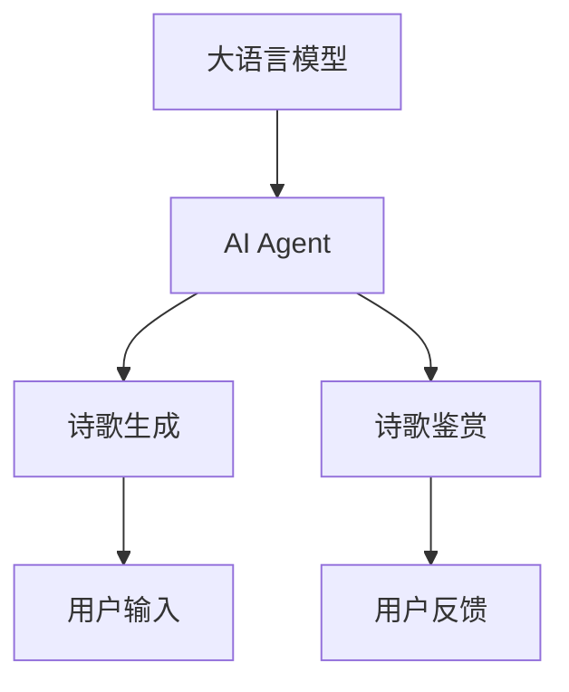
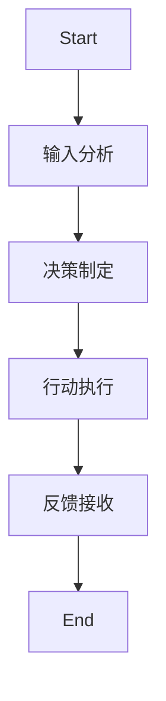
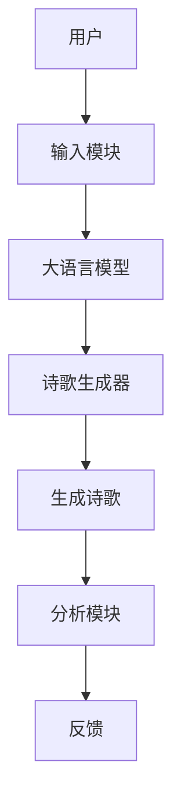
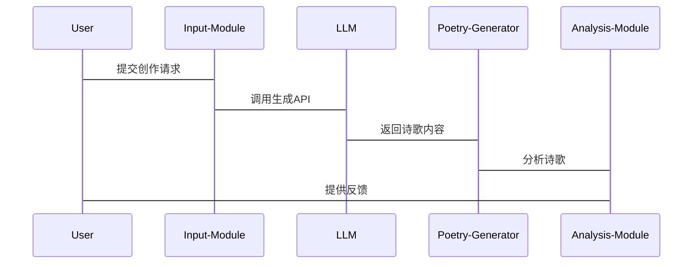

                 


# LLM驱动的AI Agent诗歌创作与鉴赏

## 关键词
大语言模型（LLM）、AI Agent、诗歌创作、诗歌鉴赏、生成式AI、人机协作

## 摘要
本文探讨了利用大语言模型（LLM）驱动的AI Agent在诗歌创作与鉴赏中的应用，通过背景介绍、核心概念、算法原理、系统架构、项目实战和总结展望，详细分析了LLM与AI Agent在诗歌领域的结合方式，展示了其在现代诗歌创作与鉴赏中的潜力和挑战。

---

## 第一部分: LLM驱动的AI Agent诗歌创作与鉴赏背景介绍

### 第1章: 问题背景与应用前景

#### 1.1 问题背景
##### 1.1.1 诗歌创作与鉴赏的数字化转型
传统诗歌创作依赖于人类的灵感和经验，而诗歌鉴赏则受到主观性和复杂性的限制。随着大语言模型（LLM）的崛起，AI技术正在改变这一领域的创作和鉴赏方式。

##### 1.1.2 大语言模型（LLM）的崛起
近年来，LLM（如GPT-3、GPT-4）凭借其强大的生成能力和理解能力，已经在多个领域展现出巨大潜力。AI Agent作为智能体，能够根据上下文做出决策并执行任务，进一步增强了LLM的应用范围。

##### 1.1.3 AI Agent在创意领域中的潜力
AI Agent结合LLM的能力，能够理解用户需求、生成创意内容，并与用户互动。这种结合为诗歌创作与鉴赏提供了新的可能性，使得诗歌创作不再是单纯的个人行为，而是人机协作的结果。

#### 1.2 问题描述
##### 1.2.1 传统诗歌创作的局限性
传统诗歌创作依赖于个人经验和灵感，创作过程耗时且难以量化。同时，诗歌的多样性也受到创作者知识和能力的限制。

##### 1.2.2 诗歌鉴赏中的主观性挑战
诗歌鉴赏主观性强，不同读者对同一作品的理解可能差异巨大。传统的鉴赏方法难以满足个性化需求，且缺乏客观依据。

##### 1.2.3 LLM驱动AI Agent的创新解决方案
通过LLM驱动的AI Agent，可以实现自动化的诗歌创作与鉴赏，提供多样化的创作工具和个性化的鉴赏建议，从而克服传统方法的局限性。

#### 1.3 问题解决
##### 1.3.1 LLM在诗歌创作中的应用
LLM能够生成符合特定主题、风格和结构的诗歌，为创作者提供灵感和辅助。AI Agent可以通过用户输入的关键词或情感需求，生成符合要求的诗歌。

##### 1.3.2 AI Agent在诗歌鉴赏中的角色
AI Agent可以分析诗歌的结构、语言和情感，提供客观的鉴赏报告。它还可以根据读者的偏好推荐相似风格的作品。

##### 1.3.3 人机协作的创作与鉴赏模式
通过人机协作，诗歌创作与鉴赏可以更加高效和多样化。人类创作者可以利用AI工具提升创作效率，而读者则可以通过AI工具获得更深入的鉴赏体验。

#### 1.4 边界与外延
##### 1.4.1 LLM驱动AI Agent的适用范围
目前，LLM驱动的AI Agent主要适用于诗歌创作与鉴赏的辅助工作，但在复杂情感表达和深度艺术理解方面仍需进一步提升。

##### 1.4.2 诗歌创作与鉴赏的边界问题
诗歌的创作与鉴赏涉及文化、情感和语言等多个方面，AI技术在处理这些复杂因素时仍存在局限性。

##### 1.4.3 技术与艺术的平衡点
在利用AI技术推动诗歌创作与鉴赏的同时，需要保持艺术的原创性和人类的情感表达，避免技术过度干预艺术创作。

#### 1.5 概念结构与核心要素
##### 1.5.1 LLM的核心要素
- **模型结构**：如Transformer架构。
- **训练数据**：海量文本数据。
- **生成机制**：基于概率的生成方法。

##### 1.5.2 AI Agent的功能模块
- **输入解析**：理解用户需求。
- **生成模块**：生成诗歌内容。
- **反馈机制**：根据用户反馈调整生成结果。

##### 1.5.3 诗歌创作与鉴赏的流程模型
- 创作流程：输入需求 → 生成诗歌 → 反馈优化。
- 鉴赏流程：输入诗歌 → 分析解读 → 提供反馈。

---

## 第二部分: 核心概念与联系

### 第2章: 核心概念与联系

#### 2.1 核心概念原理
##### 2.1.1 大语言模型的工作原理
LLM通过大规模数据训练，学习语言的规律和上下文关系。当用户输入提示时，模型根据概率生成最可能的下一步内容。

##### 2.1.2 AI Agent的智能决策机制
AI Agent通过感知环境、分析任务目标，选择最优行动方案。在诗歌创作中，AI Agent可以根据用户的输入生成诗歌，并根据反馈调整创作方向。

##### 2.1.3 诗歌创作与鉴赏的算法模型
诗歌创作可以看作是一个生成任务，而鉴赏则是一个分类或分析任务。两者都依赖于LLM的强大生成能力和分析能力。

#### 2.2 概念属性对比
| 比较维度       | LLM                         | AI Agent                     |
|----------------|------------------------------|------------------------------|
| 核心功能       | 生成文本内容                 | 理解需求、执行任务           |
| 优势           | 大规模数据训练，生成能力强   | 多目标决策，适应复杂场景     |
| 应用场景       | 诗歌生成、文本创作           | 诗歌创作指导、鉴赏反馈       |

#### 2.3 ER实体关系图


---

## 第三部分: 算法原理讲解

### 第3章: 算法原理

#### 3.1 生成式模型
##### 3.1.1 基于LLM的生成式模型
生成式模型（如GPT）通过概率生成文本内容。生成过程基于上下文，逐步生成每个词。

##### 3.1.2 智能体决策机制
AI Agent在生成诗歌时，会根据当前上下文和用户需求，选择最合适的生成策略。

#### 3.2 文本生成算法
##### 3.2.1 Transformer架构
- **编码器**：将输入文本转化为向量表示。
- **解码器**：根据编码结果生成输出文本。

##### 3.2.2 概率生成模型
$$ P(y|x) = \prod_{i=1}^{n} P(y_i | x, y_{<i}) $$
其中，$x$ 是输入，$y$ 是生成的文本序列。

#### 3.3 智能体决策流程


---

## 第四部分: 系统分析与架构设计

### 第4章: 系统分析与架构设计

#### 4.1 问题场景
用户希望利用AI Agent辅助创作诗歌，并通过AI进行诗歌鉴赏。系统需要支持用户输入、生成诗歌、分析诗歌并提供反馈。

#### 4.2 系统功能设计
- **用户输入模块**：接收用户的创作需求或鉴赏请求。
- **诗歌生成模块**：基于LLM生成诗歌内容。
- **诗歌分析模块**：对生成的诗歌进行结构和情感分析。
- **反馈模块**：根据分析结果提供反馈建议。

#### 4.3 系统架构设计


#### 4.4 接口设计
- **输入接口**：接收用户需求的API。
- **输出接口**：返回生成的诗歌内容。
- **分析接口**：返回诗歌的结构和情感分析结果。

#### 4.5 交互流程


---

## 第五部分: 项目实战

### 第5章: 项目实战

#### 5.1 环境安装
- 安装Python 3.8以上版本。
- 安装必要的库：`transformers`, `numpy`, `scikit-learn`。

#### 5.2 核心代码实现
##### 5.2.1 诗歌生成模块
```python
from transformers import GPT2LMHeadModel, GPT2Tokenizer

tokenizer = GPT2Tokenizer.from_pretrained('gpt2')
model = GPT2LMHeadModel.from_pretrained('gpt2')

def generate_poetry(prompt):
    inputs = tokenizer.encode(prompt, return_tensors='pt')
    outputs = model.generate(inputs, max_length=50, do_sample=True)
    poem = tokenizer.decode(outputs[0], skip_special_tokens=True)
    return poem
```

##### 5.2.2 诗歌分析模块
```python
from sklearn.feature_extraction.text import TfidfVectorizer
from sklearn.decomposition import PCA

def analyze_poetry(poem):
    vectorizer = TfidfVectorizer()
    tfidf = vectorizer.fit_transform([poem])
    pca = PCA(n_components=2)
    components = pca.fit_transform(tfidf.toarray())
    return components
```

#### 5.3 案例分析
##### 5.3.1 生成案例
用户输入“爱情”，生成诗歌：
```
爱情如春风，轻拂心田，
岁月如流水，永不停息。
```

##### 5.3.2 分析案例
分析上述诗歌，提取关键词：爱情、春风、心田、岁月、流水。

#### 5.4 项目小结
通过代码实现，展示了如何利用LLM生成诗歌以及如何对诗歌进行分析。实际案例验证了系统的可行性。

---

## 第六部分: 总结与展望

### 第6章: 总结与展望

#### 6.1 总结
本文探讨了LLM驱动的AI Agent在诗歌创作与鉴赏中的应用，分析了其核心概念、算法原理和系统架构。通过项目实战，验证了系统的可行性和实用性。

#### 6.2 未来展望
- **技术优化**：改进LLM的生成能力和AI Agent的决策机制。
- **应用场景扩展**：探索更多诗歌创作与鉴赏的结合方式。
- **人机协作深化**：进一步提升人机协作的效率和质量。

#### 6.3 注意事项
- 在实际应用中，需注意数据隐私和版权问题。
- 避免过度依赖AI，保持人类在创作中的主体地位。

#### 6.4 最佳实践
- 定期更新模型，提升生成质量。
- 根据用户反馈优化系统。

---

## 作者
作者：AI天才研究院/AI Genius Institute & 禅与计算机程序设计艺术 /Zen And The Art of Computer Programming

