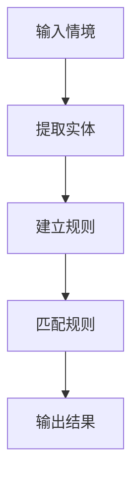
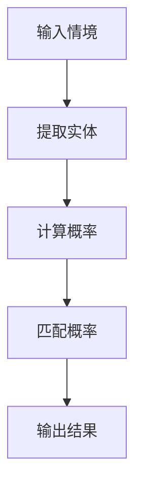
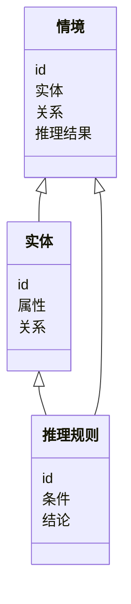

                 


# 从零构建AI Agent的情境推理能力

> 关键词：AI Agent，情境推理，逻辑推理，知识表示，多模态推理，概率推理，深度学习

> 摘要：本文将详细讲解从零开始构建AI Agent的情境推理能力，涵盖背景介绍、核心概念、算法原理、系统架构设计、项目实战以及最佳实践。我们将从基本概念出发，逐步深入，结合实际案例和代码实现，帮助读者掌握情境推理的核心技术和实现方法。

---

# 第一部分: AI Agent与情境推理的背景介绍

## 第1章: 问题背景与问题描述

### 1.1 问题背景

随着人工智能技术的快速发展，AI Agent（智能体）在各个领域的应用越来越广泛。然而，当前大多数AI Agent的智能性仍然有限，尤其是在处理复杂的情境推理任务时，难以准确理解上下文并做出合理决策。例如，在对话式AI Agent中，当用户提到“我今天有点累”，AI Agent需要结合用户的历史对话、当前情绪、甚至外部环境信息（如天气）来推断用户的真正需求，比如是否需要安慰或提供放松建议。

#### 1.1.1 当前AI技术的发展现状

当前，AI技术在感知任务（如图像识别、语音识别）和生成任务（如文本生成）方面已经取得了显著进展，但在需要结合多源信息、理解上下文并进行逻辑推理的任务上仍存在较大挑战。例如，虽然大型语言模型（LLM）能够生成连贯的文本，但在处理复杂情境推理时，仍然容易出现逻辑错误或不符合常识的结论。

#### 1.1.2 情境推理能力的重要性

情境推理能力是AI Agent实现真正智能化的关键。它使AI Agent能够理解当前情境中的实体、关系和潜在意图，并根据这些信息做出合理的推理和决策。例如，在自动驾驶中，AI Agent需要结合车辆传感器数据、道路状况、行人行为等多个信息源，进行复杂的情境推理，以确保安全驾驶。

#### 1.1.3 当前AI Agent的局限性

尽管AI Agent在某些领域取得了显著进展，但在情境推理方面仍然存在以下问题：
1. **信息孤岛**：难以整合多源异构数据。
2. **推理深度不足**：难以处理复杂逻辑关系。
3. **动态环境适应性差**：难以应对实时变化的情境。

### 1.2 问题描述

情境推理是指AI Agent在给定情境下，通过理解实体、关系和逻辑规则，推导出符合情境的结论或行为的过程。具体来说，情境推理需要解决以下核心问题：
1. 如何从多源数据中提取相关实体和关系？
2. 如何构建适用于不同情境的推理规则？
3. 如何处理推理过程中的不确定性？

### 1.3 问题解决思路

构建AI Agent的情境推理能力需要分步骤进行：
1. **问题分解**：将情境推理任务分解为数据采集、知识表示、推理算法设计等子任务。
2. **实现目标设定**：明确每个子任务的具体目标，例如设计一个能够处理多模态数据的推理算法。
3. **实现方案设计**：制定整体实现方案，例如选择基于规则的推理算法或概率推理算法。

## 第2章: 情境推理的核心概念

### 2.1 核心概念原理

#### 2.1.1 情境推理的定义

情境推理是指AI Agent在给定情境下，通过理解实体、关系和逻辑规则，推导出符合情境的结论或行为的过程。

#### 2.1.2 情境推理的关键要素

情境推理的关键要素包括：
1. **实体**：情境中的具体对象，如“用户”、“天气”等。
2. **关系**：实体之间的关联，如“用户今天心情不好”。
3. **逻辑规则**：用于推理的规则，如“如果用户心情不好，且天气阴沉，那么用户可能需要安慰”。

#### 2.1.3 情境推理的实现机制

情境推理的实现机制包括数据采集、知识表示、推理算法和结果输出四个步骤。

### 2.2 情境推理与相关概念对比

#### 2.2.1 与知识表示的关系

知识表示是情境推理的基础。知识表示通过形式化的方法描述实体和关系，为推理提供数据支持。

#### 2.2.2 与逻辑推理的区别

逻辑推理是一种通用的推理方法，而情境推理是一种特定类型的知识推理，专注于特定情境下的推理任务。

#### 2.2.3 与情境理解的联系

情境理解是情境推理的前提，情境理解通过分析情境中的实体和关系，为推理提供输入。

### 2.3 情境推理的ER实体关系图

```mermaid
er
    entity 情境 {
        id
        context
        entities
    }
    entity 实体 {
        id
        properties
        relations
    }
    entity 推理关系 {
        id
        source
        target
        relation_type
    }
```

---

# 第二部分: 情境推理算法原理

## 第3章: 基于规则的推理算法

### 3.1 基于规则的推理原理

#### 3.1.1 规则定义

基于规则的推理通过预定义的规则进行推理。例如，规则可以定义为“如果用户提到天气不好，且用户心情低落，那么用户可能需要安慰”。

#### 3.1.2 规则匹配

推理过程通过匹配输入情境与预定义规则，输出推理结果。

#### 3.1.3 推理结果

基于规则的推理结果通常是确定性的，适用于规则明确的情境。

### 3.2 基于规则的推理流程图



---

## 第4章: 基于概率的推理算法

### 4.1 基于概率的推理原理

#### 4.1.1 概率计算

基于概率的推理通过计算事件发生的概率，进行推理。例如，使用贝叶斯网络计算用户心情低落的概率。

#### 4.1.2 条件概率

条件概率公式如下：
$$P(A|B) = \frac{P(A \cap B)}{P(B)}$$

#### 4.1.3 贝叶斯网络

贝叶斯网络是一种有向无环图，用于表示变量之间的概率关系。

### 4.2 基于概率的推理流程图



---

# 第三部分: 情境推理系统设计与实现

## 第5章: 系统分析与架构设计

### 5.1 问题场景介绍

我们以构建一个简单的对话式AI Agent为例，设计一个基于情境推理的对话系统。

### 5.2 项目介绍

我们的目标是构建一个能够理解用户情境并提供合理回复的对话式AI Agent。

### 5.3 系统功能设计

#### 5.3.1 领域模型设计



---

## 第6章: 项目实战

### 6.1 环境安装

安装Python和必要的库，例如：
```bash
pip install numpy
pip install matplotlib
pip install scikit-learn
```

### 6.2 核心代码实现

#### 6.2.1 数据预处理

```python
def preprocess_data(data):
    # 实体提取
    entities = extract_entities(data)
    # 关系提取
    relations = extract_relations(data)
    return entities, relations
```

#### 6.2.2 基于规则的推理实现

```python
def rule_based_reasoning(entities, relations):
    # 定义推理规则
    rules = [
        ('实体A的属性满足条件1', '结论1'),
        ('实体B的关系满足条件2', '结论2')
    ]
    # 匹配规则
    for rule in rules:
        if match_rule(entities, relations, rule):
            return rule[1]
    return None
```

### 6.3 代码解读与分析

#### 6.3.1 代码功能解读

上述代码实现了基于规则的推理功能，通过预定义规则匹配输入情境，输出推理结果。

#### 6.3.2 代码实现分析

代码分为数据预处理和推理实现两部分。数据预处理提取了实体和关系，推理部分基于规则进行匹配。

### 6.4 案例分析

以用户输入“我今天有点累”为例，推理过程如下：
1. 提取实体：“用户”、“今天”、“累”。
2. 提取关系：“用户感到累”。
3. 匹配规则：“如果用户感到累，且天气阴沉，那么用户需要安慰”。
4. 输出结果：“用户需要安慰”。

### 6.5 项目小结

通过本项目，我们实现了基于规则的推理算法，并验证了其在对话式AI Agent中的应用。

---

## 第7章: 最佳实践与注意事项

### 7.1 最佳实践

1. **规则设计**：尽量覆盖所有可能的情境。
2. **数据质量**：确保输入数据的准确性和完整性。
3. **算法选择**：根据任务需求选择合适的推理算法。

### 7.2 小结

通过本文的讲解，我们从零开始构建了AI Agent的情境推理能力，涵盖理论、算法、系统设计和项目实现。

---

## 第8章: 未来拓展与总结

### 8.1 未来拓展

1. **多模态推理**：结合图像、语音等多种数据源。
2. **持续学习**：使AI Agent能够不断学习新知识。
3. **伦理安全**：确保推理过程的伦理性和安全性。

### 8.2 总结

构建AI Agent的情境推理能力是一项复杂但极具价值的任务。通过本文的学习，读者可以掌握从零开始构建情境推理能力的关键技术和实现方法。

---

作者：AI天才研究院 & 禅与计算机程序设计艺术

