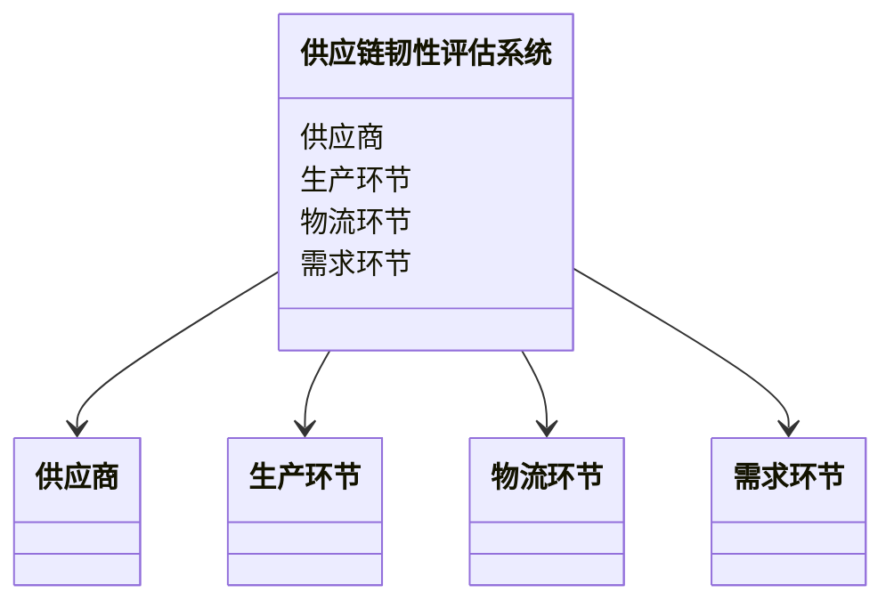
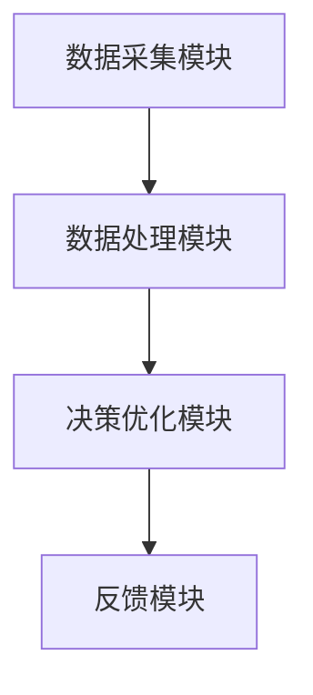

                 


# 价值投资中的AI驱动供应链韧性评估：多智能体协作

## 关键词：供应链韧性评估、AI驱动、多智能体协作、价值投资、供应链风险管理、数学模型

## 摘要：
在现代经济中，供应链的稳定性和韧性对于企业的生存和成功至关重要。特别是在价值投资领域，供应链的风险管理直接影响企业的长期价值和投资决策。本文将深入探讨如何利用AI技术，特别是多智能体协作的方法，来评估和提升供应链的韧性。通过理论分析、算法实现和实际案例，本文将为读者提供一个全面的视角，帮助他们在投资决策中更好地管理和优化供应链韧性。

---

## 第1章: 供应链韧性评估的背景与价值

### 1.1 供应链韧性评估的背景

#### 1.1.1 供应链在现代经济中的重要性
供应链是现代经济的“生命线”。从原材料采购到生产、物流、分销，再到最终用户的交付，供应链的每一个环节都直接影响企业的运营效率和成本控制。特别是在全球化背景下，供应链的复杂性和全球化程度不断提高，任何一个环节的中断都可能引发连锁反应。

#### 1.1.2 供应链断裂对企业的影响
供应链断裂可能导致生产停滞、交货延迟、库存积压或短缺，进而影响企业的声誉、客户满意度和市场竞争力。在价值投资中，供应链的稳定性是评估企业长期价值的重要因素之一。

#### 1.1.3 供应链韧性评估的必要性
供应链韧性是指供应链在面对外部冲击（如疫情、自然灾害、地缘政治冲突等）时，能够快速恢复并保持稳定运作的能力。评估供应链韧性可以帮助企业识别潜在风险，优化供应链结构，降低风险敞口。

---

### 1.2 价值投资中的供应链风险管理

#### 1.2.1 供应链风险对投资的影响
供应链风险可能影响企业的盈利能力、成本控制能力和市场竞争力。例如，原材料短缺可能导致生产成本上升，交货延迟可能导致客户流失，进而影响企业的市值。

#### 1.2.2 供应链韧性与企业价值的关系
供应链韧性是企业核心竞争力的重要组成部分。具备强大供应链韧性的企业能够在市场波动中保持稳定，从而为投资者提供更稳定的投资回报。

#### 1.2.3 供应链韧性评估的挑战与机遇
供应链韧性评估的挑战在于其复杂性和动态性。传统的供应链评估方法往往依赖于静态指标，难以捕捉实时变化的风险因素。而AI技术的引入为供应链韧性评估提供了新的可能性，尤其是在多智能体协作的框架下，可以通过动态数据分析和实时反馈优化供应链韧性。

---

## 第2章: 供应链韧性评估的核心概念

### 2.1 供应链韧性评估的定义与特点

#### 2.1.1 供应链韧性的定义
供应链韧性是指供应链在面对内外部干扰时，能够快速适应、恢复并保持稳定运作的能力。它涵盖了供应链的灵活性、冗余性、协调性和恢复能力。

#### 2.1.2 供应链韧性的核心特征
- **灵活性**：能够根据市场需求变化快速调整供应链策略。
- **冗余性**：在关键环节具备替代方案，降低单一环节中断的风险。
- **协调性**：供应链各环节之间的高效协同，确保信息流、物流和资金流的畅通。
- **恢复能力**：在遭受冲击后，能够快速恢复并优化供应链结构。

#### 2.1.3 供应链韧性评估的边界与外延
供应链韧性评估的边界包括从原材料供应商到最终消费者的整个供应链链条，而外延则涉及外部环境（如政策、经济、技术）和内部管理（如组织结构、信息化水平）。

---

### 2.2 多智能体协作的原理

#### 2.2.1 多智能体协作的定义
多智能体协作是指多个智能体（如AI算法、数据源、决策系统）协同工作，共同完成复杂任务的过程。在供应链韧性评估中，多智能体协作可以用于实时数据分析、风险预测和决策优化。

#### 2.2.2 多智能体协作的核心要素
- **智能体**：能够感知环境、做出决策并执行动作的实体。
- **通信机制**：智能体之间共享信息和协调行动的渠道。
- **协作策略**：智能体之间如何分工合作的规则和策略。

#### 2.2.3 多智能体协作与供应链韧性评估的关系
多智能体协作通过实时数据分析、风险预测和决策优化，帮助企业在复杂多变的环境中保持供应链的稳定性和韧性。

---

### 2.3 供应链韧性评估的数学模型

#### 2.3.1 供应链韧性评估的数学模型概述
供应链韧性评估的数学模型通常基于概率论、统计学和优化理论。通过构建数学模型，可以量化供应链各环节的风险，并评估整体供应链的韧性。

#### 2.3.2 供应链韧性评估的指标体系
供应链韧性评估的指标体系包括以下几个方面：
- **供应风险**：供应商的可靠性、多样性。
- **生产风险**：生产环节的效率、灵活性。
- **物流风险**：物流网络的稳定性和冗余性。
- **需求风险**：市场需求的波动性和预测准确性。

#### 2.3.3 供应链韧性评估的公式推导
供应链韧性评估的综合指标可以通过加权平均的方法计算：

$$
\text{供应链韧性} = \sum_{i=1}^{n} w_i \cdot r_i
$$

其中，\(w_i\) 是第 \(i\) 个指标的权重，\(r_i\) 是第 \(i\) 个指标的评估结果。

---

## 第3章: 供应链韧性评估的算法原理

### 3.1 多智能体协作算法

#### 3.1.1 多智能体协作算法的定义
多智能体协作算法是一种基于分布式计算的算法，通过多个智能体的协同工作，实现复杂任务的优化。

#### 3.1.2 多智能体协作算法的实现步骤
1. 初始化：设置智能体的初始状态和目标。
2. 信息共享：智能体之间共享信息，协调行动。
3. 决策优化：基于共享信息，优化决策。
4. 执行动作：智能体根据优化后的决策执行动作。
5. 反馈与调整：根据执行结果反馈信息，调整决策。

#### 3.1.3 多智能体协作算法的优缺点
- **优点**：能够处理复杂任务，提高决策的准确性和效率。
- **缺点**：需要复杂的通信机制和协调策略，可能导致计算成本较高。

---

### 3.2 供应链韧性评估的数学模型

#### 3.2.1 供应链韧性评估的数学模型概述
供应链韧性评估的数学模型通常基于概率论和统计学，用于量化供应链各环节的风险。

#### 3.2.2 供应链韧性评估的指标权重分配
供应链韧性评估的指标权重可以通过层次分析法（AHP）确定。例如：

$$
w_1 = 0.3, \quad w_2 = 0.2, \quad w_3 = 0.2, \quad w_4 = 0.3
$$

其中，\(w_1\) 是供应风险的权重，\(w_2\) 是生产风险的权重，\(w_3\) 是物流风险的权重，\(w_4\) 是需求风险的权重。

#### 3.2.3 供应链韧性评估的公式推导
供应链韧性评估的综合指标可以通过加权平均的方法计算：

$$
\text{供应链韧性} = w_1 \cdot r_1 + w_2 \cdot r_2 + w_3 \cdot r_3 + w_4 \cdot r_4
$$

---

## 第4章: 供应链韧性评估的系统架构设计

### 4.1 问题场景介绍

#### 4.1.1 供应链韧性评估的场景
供应链韧性评估的场景包括供应链中断风险评估、供应链优化和供应链恢复策略制定。

#### 4.1.2 项目介绍
本项目旨在通过多智能体协作算法，评估和优化供应链的韧性，帮助企业在复杂多变的环境中保持供应链的稳定性和高效性。

---

### 4.2 系统功能设计

#### 4.2.1 领域模型
领域模型是一个供应链系统的抽象表示，包括供应商、生产环节、物流环节和需求环节。



#### 4.2.2 系统架构
系统架构包括数据采集模块、数据处理模块、决策优化模块和反馈模块。



---

## 第5章: 供应链韧性评估的项目实战

### 5.1 环境安装

#### 5.1.1 Python环境安装
需要安装Python 3.8及以上版本，并安装以下库：
- `numpy`
- `pandas`
- `scipy`
- `matplotlib`

#### 5.1.2 数据采集工具安装
安装`requests`和`beautifulsoup4`用于数据采集。

---

### 5.2 系统核心实现

#### 5.2.1 数据采集模块
```python
import requests
from bs4 import BeautifulSoup

def fetch_data(url):
    response = requests.get(url)
    soup = BeautifulSoup(response.text, 'html.parser')
    data = []
    for item in soup.find_all('div', class_='data-item'):
        data.append({
            'name': item.find('h3').text,
            'value': item.find('span').text
        })
    return data
```

#### 5.2.2 数据处理模块
```python
import pandas as pd

def process_data(data):
    df = pd.DataFrame(data)
    df['value'] = df['value'].astype(float)
    return df
```

#### 5.2.3 决策优化模块
```python
import numpy as np

def optimize_supply_chain(data):
    weights = np.array([0.3, 0.2, 0.2, 0.3])
    risks = data['value'].values
    resilience = np.dot(weights, risks)
    return resilience
```

---

### 5.3 代码应用解读与分析

#### 5.3.1 代码功能解读
- 数据采集模块：从指定URL获取数据。
- 数据处理模块：将数据转换为DataFrame格式，并进行数据清洗。
- 决策优化模块：基于加权平均的方法，计算供应链的韧性。

#### 5.3.2 实际案例分析
假设我们有一个供应链，包括4个供应商、3个生产环节、2个物流环节和5个需求环节。通过上述代码，我们可以计算出供应链的韧性。

---

## 第6章: 最佳实践与总结

### 6.1 小结与注意事项

#### 6.1.1 小结
本文通过理论分析、算法实现和实际案例，展示了如何利用AI技术，特别是多智能体协作的方法，来评估和优化供应链的韧性。

#### 6.1.2 注意事项
在实际应用中，需要注意数据的准确性和实时性，同时要根据具体场景调整模型参数。

---

### 6.2 拓展阅读与进一步学习

#### 6.2.1 拓展阅读
- 《供应链管理：原理与应用》
- 《多智能体协作算法及其应用》

#### 6.2.2 进一步学习方向
- 学习更多的AI算法，如强化学习、深度学习。
- 研究供应链韧性评估的最新研究成果。

---

## 作者：AI天才研究院/AI Genius Institute & 禅与计算机程序设计艺术 /Zen And The Art of Computer Programming

