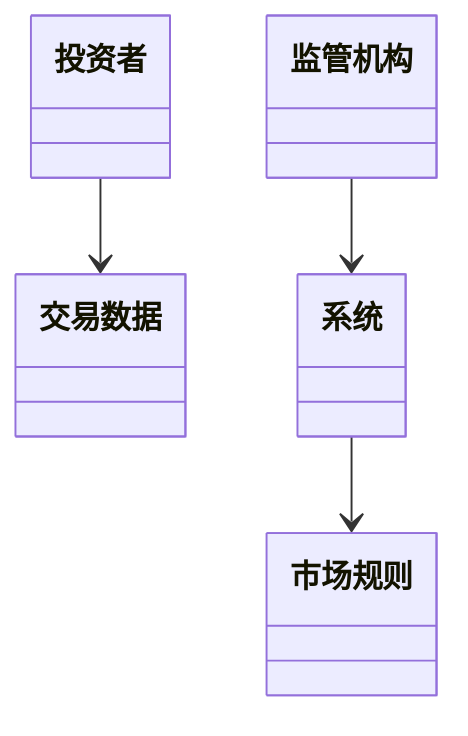
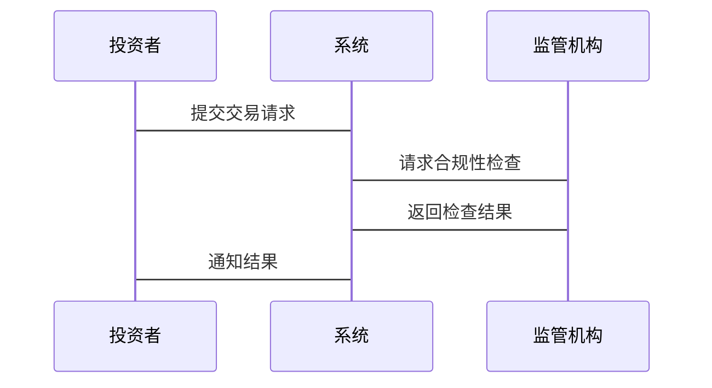

                 


# 价值投资中的AI驱动监管合规性分析：多智能体系统

## 关键词：价值投资、AI监管合规性、多智能体系统、强化学习、金融监管

## 摘要：  
随着人工智能技术的快速发展，金融领域对监管合规性分析的需求日益增长。本文探讨了如何利用多智能体系统在价值投资中实现AI驱动的监管合规性分析。通过分析多智能体系统的架构、算法原理及其在金融监管中的应用，本文为价值投资者提供了新的视角和方法，以应对复杂的金融市场环境。

---

# 第1章: 价值投资与AI驱动监管合规性分析的背景

## 1.1 价值投资的基本概念  
### 1.1.1 价值投资的定义与核心理念  
价值投资是一种投资策略，强调以低于内在价值的价格购买优质资产。其核心理念包括长期投资、安全边际和市场有效性的质疑。  

### 1.1.2 价值投资的历史与发展  
价值投资起源于20世纪初，代表人物包括本杰明·格雷厄姆和菲利普·费雪。随着金融市场的复杂化，价值投资策略需要不断优化以适应新的挑战。  

### 1.1.3 价值投资在现代金融中的地位  
在现代金融中，价值投资仍然是重要的策略之一，尤其是在市场波动和不确定性增加的情况下，其长期稳定的回报特性备受关注。  

## 1.2 AI驱动的监管合规性分析的必要性  
### 1.2.1 金融监管的基本概念  
金融监管旨在维护市场秩序，保护投资者利益，防止系统性风险。  

### 1.2.2 AI在金融监管中的应用现状  
AI技术在金融监管中的应用包括异常交易检测、风险评估和合规性分析。  

### 1.2.3 监管合规性分析的重要性  
合规性分析是确保金融机构行为符合法律法规的关键，直接关系到市场的稳定性和投资者的权益。  

## 1.3 多智能体系统在价值投资中的应用前景  
### 1.3.1 多智能体系统的定义与特点  
多智能体系统是由多个相互作用的智能体组成的系统，具有分布式决策、协作性和适应性等特点。  

### 1.3.2 多智能体系统在金融领域的优势  
多智能体系统能够模拟市场参与者的复杂行为，提供更精准的市场预测和风险评估。  

### 1.3.3 价值投资中的多智能体系统应用案例  
例如，利用多智能体系统分析市场情绪和交易数据，辅助投资者做出更明智的投资决策。  

## 1.4 本章小结  
本章介绍了价值投资和AI驱动监管合规性的基本概念，并探讨了多智能体系统在金融监管中的潜力和应用前景。  

---

# 第2章: 多智能体系统的核心概念与原理  

## 2.1 多智能体系统的定义与特征  
### 2.1.1 多智能体系统的定义  
多智能体系统（MAS）是由多个智能体组成的系统，这些智能体能够自主决策、协作和通信。  

### 2.1.2 多智能体系统的特征对比表格  
| 特征       | 单智能体系统 | 多智能体系统 |
|------------|--------------|--------------|
| 决策中心化 | 是           | 否           |
| 通信能力   | 无           | 有           |
| 协作性      | 低           | 高           |

### 2.1.3 多智能体系统的ER实体关系图  
```mermaid
er
    actor 投资者
    actor 监管机构
    actor 市场参与者
    entity 交易数据
    entity 市场规则
    entity 投资组合
    relation 投资者 -> 交易数据
    relation 监管机构 -> 市场规则
    relation 市场参与者 -> 投资组合
```

## 2.2 多智能体系统的组成与架构  
### 2.2.1 多智能体系统的组成要素  
多智能体系统由智能体、环境、通信机制和协作规则组成。  

### 2.2.2 多智能体系统的架构类型  
常见的架构包括分散式架构、集中式架构和混合式架构。  

### 2.2.3 多智能体系统的通信机制  
智能体之间的通信可以通过消息传递、共享数据库或中间件实现。  

## 2.3 多智能体系统的协作与协调  
### 2.3.1 协作机制的定义与实现  
协作机制通过定义任务分工和角色分配来实现。  

### 2.3.2 协调机制的类型与应用  
协调机制包括同步协调和异步协调，适用于实时交易和非实时分析。  

### 2.3.3 协作与协调对系统性能的影响  
良好的协作和协调机制可以提高系统的效率和准确性。  

## 2.4 本章小结  
本章详细介绍了多智能体系统的定义、组成、通信机制和协作协调机制，并分析了其在金融监管中的应用潜力。  

---

# 第3章: 基于多智能体的监管合规性分析算法原理  

## 3.1 强化学习在多智能体系统中的应用  
### 3.1.1 强化学习的基本原理  
强化学习通过智能体与环境的交互，学习最优策略。  

### 3.1.2 多智能体强化学习的挑战与解决方案  
挑战包括策略协调和计算复杂性，解决方案包括一致性强化学习和分布式强化学习。  

### 3.1.3 强化学习在监管合规性分析中的应用案例  
例如，利用强化学习优化投资组合的合规性，确保投资组合符合监管要求。  

## 3.2 基于博弈论的多智能体系统模型  
### 3.2.1 博弈论的基本概念  
博弈论研究理性决策者在冲突与合作中的行为模式。  

### 3.2.2 多智能体博弈模型的构建  
构建博弈模型需要定义参与者的策略空间、收益函数和博弈规则。  

### 3.2.3 博弈论在监管合规性分析中的应用  
例如，分析金融机构之间的竞争与合作行为，评估其对市场合规性的影响。  

## 3.3 监管合规性分析的数学模型  
### 3.3.1 监管合规性分析的基本数学模型  
合规性得分 \( C \) 可以表示为：  
$$ C = \sum_{i=1}^{n} w_i \cdot f_i(x_i) $$  
其中，\( w_i \) 是特征 \( x_i \) 的权重，\( f_i \) 是评估函数。  

### 3.3.2 基于多智能体的数学模型构建  
构建多智能体系统的数学模型，例如：  
$$ V(s) = \max_{a} \left( r(s, a) + \gamma \cdot V(s') \right) $$  
其中，\( V(s) \) 是状态 \( s \) 的价值函数，\( r \) 是奖励函数，\( \gamma \) 是折扣因子。  

### 3.3.3 数学模型的优化与验证  
通过实验验证模型的有效性，并不断优化参数以提高预测精度。  

## 3.4 本章小结  
本章探讨了强化学习和博弈论在多智能体系统中的应用，并构建了监管合规性分析的数学模型。  

---

# 第4章: 系统架构与设计  

## 4.1 金融监管分析系统的功能设计  
### 4.1.1 系统功能模块  
系统功能模块包括数据采集、合规性分析、风险评估和结果可视化。  

### 4.1.2 系统功能设计的领域模型  


## 4.2 系统架构设计  
### 4.2.1 系统架构类型  
系统架构包括单体架构、微服务架构和混合架构。  

### 4.2.2 系统架构设计的mermaid图  


## 4.3 系统接口设计  
### 4.3.1 系统接口的定义  
系统接口包括数据接口和用户接口。  

### 4.3.2 系统接口的设计原则  
接口设计应遵循松耦合、高内聚的原则。  

## 4.4 系统交互设计  
### 4.4.1 系统交互的mermaid序列图  


## 4.5 本章小结  
本章详细设计了金融监管分析系统的架构、接口和交互流程，为系统的实现提供了指导。  

---

# 第5章: 项目实战与分析  

## 5.1 环境配置  
### 5.1.1 开发环境的选择  
选择Python作为开发语言，使用TensorFlow和Keras框架。  

### 5.1.2 系统依赖的安装  
安装必要的库，如numpy、pandas、scikit-learn和matplotlib。  

## 5.2 核心代码实现  
### 5.2.1 数据预处理代码  
```python
import pandas as pd
import numpy as np

# 加载数据
data = pd.read_csv('交易数据.csv')
# 数据清洗
data = data.dropna()
```

### 5.2.2 监管合规性分析算法代码  
```python
def compute_compliance_score(交易数据):
    score = 0
    for transaction in 交易数据:
        if transaction合规:
            score += 1
    return score
```

## 5.3 实际案例分析  
### 5.3.1 案例背景介绍  
分析一个具体的交易案例，评估其合规性。  

### 5.3.2 案例分析与结果解读  
通过算法计算出合规性得分，并解释结果。  

## 5.4 项目小结  
本章通过实际项目展示了多智能体系统在监管合规性分析中的应用，并验证了算法的有效性。  

---

# 第6章: 总结与展望  

## 6.1 本章总结  
本文探讨了多智能体系统在价值投资中的应用，详细介绍了其核心概念、算法原理和系统架构。  

## 6.2 最佳实践 tips  
- 确保数据质量和完整性  
- 定期更新模型参数  
- 加强系统安全性和稳定性  

## 6.3 未来研究方向  
- 研究更高效的多智能体算法  
- 探讨多智能体系统在其他金融领域的应用  
- 结合区块链技术提升系统的透明度和安全性  

---

作者：AI天才研究院/AI Genius Institute & 禅与计算机程序设计艺术 /Zen And The Art of Computer Programming  

---

# 结语  
通过本文的探讨，读者可以深入了解多智能体系统在价值投资中的应用，掌握AI驱动的监管合规性分析的方法和技巧。希望本文能为相关领域的研究和实践提供有价值的参考。  

---

