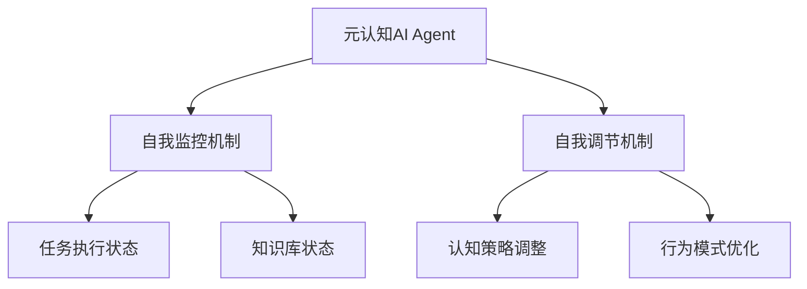
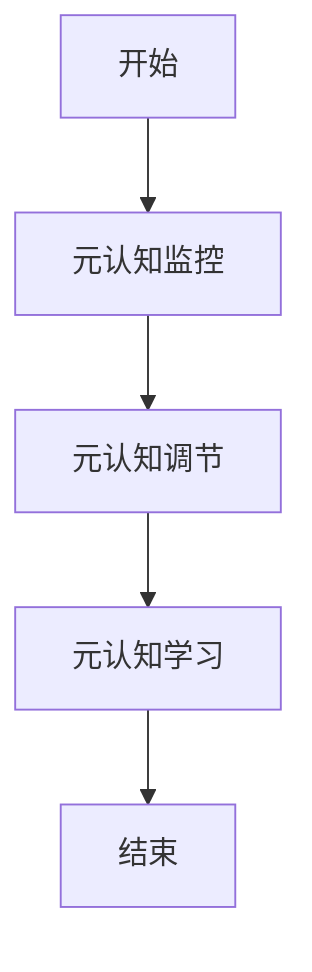
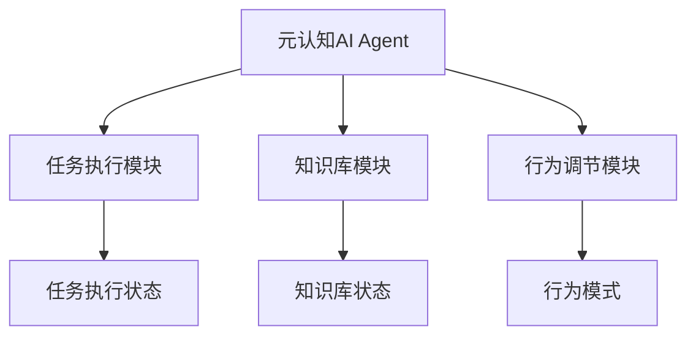

                 


# 元认知AI Agent：具备自我监控和调节能力

> 关键词：元认知AI Agent，自我监控，自我调节，AI架构，算法实现

> 摘要：元认知AI Agent是一种具备自我监控和调节能力的人工智能代理，能够通过元认知机制实现自我优化和适应性学习。本文将从元认知AI Agent的背景、核心概念、算法原理、系统架构到项目实战，全面深入地探讨其技术实现和应用潜力。

---

## 第一部分：元认知AI Agent的背景与概念

### 第1章：元认知AI Agent的定义与问题背景

#### 1.1 元认知AI Agent的核心概念

元认知AI Agent是一种具备元认知能力的人工智能代理，能够在运行过程中监控自身的认知过程，并根据监控结果调节自身的行为和决策。元认知能力包括三个核心要素：**自我监控**、**自我调节**和**自适应学习**。

- **自我监控**：元认知AI Agent能够实时监控自身的认知过程，识别当前的认知状态和行为模式。
- **自我调节**：基于监控结果，元认知AI Agent能够主动调整自身的认知策略和行为模式，以优化任务执行效果。
- **自适应学习**：元认知AI Agent能够根据环境变化和任务需求，动态调整自身的知识库和算法模型。

#### 1.2 元认知AI Agent的问题背景

传统的AI系统在特定任务上表现出色，但缺乏自我监控和调节能力。元认知AI Agent的出现，旨在解决以下问题：

- **动态环境适应性不足**：传统AI系统难以应对快速变化的环境，无法根据环境变化动态调整自身的行为策略。
- **自我优化能力缺失**：传统AI系统缺乏自我监控和调节能力，难以实现持续优化。
- **复杂任务处理能力有限**：在处理复杂任务时，传统AI系统容易受到外部干扰或内部缺陷的影响，导致性能下降。

元认知AI Agent通过引入元认知机制，能够实时监控自身的认知过程，动态调整行为策略，从而在复杂动态环境中表现出更强的适应性和优化能力。

---

### 第2章：元认知AI Agent的核心要素与概念结构

元认知AI Agent的核心要素包括：

1. **元认知机制**：元认知AI Agent通过元认知机制实现对自身认知过程的监控和调节。
2. **自我监控机制**：元认知AI Agent能够实时监控自身的认知过程，包括任务执行状态、知识库状态和行为模式。
3. **自我调节机制**：基于监控结果，元认知AI Agent能够主动调整自身的认知策略和行为模式。

元认知AI Agent的概念结构可以用以下表格和图示来描述：

#### 2.1 元认知机制的原理

| 概念 | 描述 |
|------|------|
| 元认知监控 | 元认知AI Agent实时监控自身的认知过程 |
| 元认知调节 | 根据监控结果调整认知策略和行为模式 |
| 元认知学习 | 基于监控和调节结果优化知识库和算法模型 |

#### 2.2 元认知AI Agent的概念结构图



---

## 第二部分：元认知AI Agent的算法与数学模型

### 第3章：元认知AI Agent的算法原理

#### 3.1 元认知机制的算法实现

元认知AI Agent的算法实现主要分为三个阶段：**元认知监控**、**元认知调节**和**元认知学习**。

##### 3.1.1 元认知监控算法

元认知监控算法用于实时监控元认知AI Agent的认知过程，包括任务执行状态、知识库状态和行为模式。算法实现如下：

```python
def metacognitive_monitor(agent):
    # 监控任务执行状态
    task_status = monitor_task_status(agent.current_task)
    # 监控知识库状态
    knowledge_status = monitor_knowledge_status(agent.knowledge_base)
    # 监控行为模式
    behavior_pattern = monitor_behavior_pattern(agent.behavior_pattern)
    return task_status, knowledge_status, behavior_pattern
```

##### 3.1.2 元认知调节算法

元认知调节算法根据监控结果调整元认知AI Agent的认知策略和行为模式。

```python
def metacognitive_regulation(agent, task_status, knowledge_status, behavior_pattern):
    # 调整认知策略
    new_strategy = adjust_cognitive_strategy(agent.strategy, task_status)
    # 调整行为模式
    new_behavior = adjust_behavior_pattern(agent.behavior, behavior_pattern)
    return new_strategy, new_behavior
```

##### 3.1.3 元认知学习算法

元认知学习算法基于监控和调节结果优化元认知AI Agent的知识库和算法模型。

```python
def metacognitive_learning(agent, task_status, knowledge_status, behavior_pattern):
    # 优化知识库
    optimized_knowledge = optimize_knowledge_base(agent.knowledge_base, task_status)
    # 优化算法模型
    optimized_model = optimize_algorithm_model(agent.model, behavior_pattern)
    return optimized_knowledge, optimized_model
```

#### 3.2 元认知AI Agent的算法流程

元认知AI Agent的算法流程可以用以下Mermaid流程图表示：



---

### 第4章：元认知AI Agent的数学模型与公式

#### 4.1 元认知监控的数学模型

元认知监控的数学模型可以表示为：

$$
\text{监控结果} = f(\text{任务执行状态}, \text{知识库状态}, \text{行为模式})
$$

其中，$f$ 是一个综合函数，用于将任务执行状态、知识库状态和行为模式映射到监控结果。

#### 4.2 元认知调节的数学模型

元认知调节的数学模型可以表示为：

$$
\text{新策略} = g(\text{当前策略}, \text{监控结果})
$$

其中，$g$ 是一个调节函数，用于根据当前策略和监控结果生成新的认知策略。

#### 4.3 元认知学习的数学模型

元认知学习的数学模型可以表示为：

$$
\text{优化知识库} = h(\text{当前知识库}, \text{监控结果}, \text{调节结果})
$$

其中，$h$ 是一个优化函数，用于根据当前知识库、监控结果和调节结果生成优化后的知识库。

---

## 第三部分：元认知AI Agent的系统架构与设计

### 第5章：元认知AI Agent的系统分析

#### 5.1 系统问题场景介绍

元认知AI Agent的应用场景包括：

- **动态环境适应**：在快速变化的环境中，元认知AI Agent能够动态调整自身的行为策略。
- **复杂任务处理**：在复杂任务中，元认知AI Agent能够通过自我监控和调节实现高效处理。
- **自适应学习**：元认知AI Agent能够根据环境变化和任务需求，动态优化自身的知识库和算法模型。

#### 5.2 系统功能设计

元认知AI Agent的功能需求包括：

- **自我监控功能**：实时监控任务执行状态、知识库状态和行为模式。
- **自我调节功能**：根据监控结果调整认知策略和行为模式。
- **自适应学习功能**：根据监控和调节结果优化知识库和算法模型。

---

### 第6章：元认知AI Agent的系统架构设计

#### 6.1 系统架构设计

元认知AI Agent的系统架构可以用以下Mermaid图表示：



#### 6.2 系统接口设计

元认知AI Agent的系统接口包括：

- **监控接口**：用于获取任务执行状态、知识库状态和行为模式。
- **调节接口**：用于调整认知策略和行为模式。
- **学习接口**：用于优化知识库和算法模型。

---

## 第四部分：元认知AI Agent的项目实战

### 第7章：元认知AI Agent的项目实战

#### 7.1 环境安装

要实现元认知AI Agent，首先需要安装以下环境：

- Python 3.8 或更高版本
- 基础AI库（如NumPy、TensorFlow）
- Mermaid图生成工具

#### 7.2 系统核心实现

以下是元认知AI Agent的核心实现代码：

```python
class MetacognitiveAI:
    def __init__(self):
        self.current_task = None
        self.knowledge_base = {}
        self.behavior_pattern = None
        self.strategy = None

    def metacognitive_monitor(self):
        # 监控任务执行状态
        task_status = self.monitor_task_status(self.current_task)
        # 监控知识库状态
        knowledge_status = self.monitor_knowledge_status(self.knowledge_base)
        # 监控行为模式
        behavior_pattern = self.monitor_behavior_pattern(self.behavior_pattern)
        return task_status, knowledge_status, behavior_pattern

    def metacognitive_regulation(self, task_status, knowledge_status, behavior_pattern):
        # 调整认知策略
        new_strategy = self.adjust_cognitive_strategy(self.strategy, task_status)
        # 调整行为模式
        new_behavior = self.adjust_behavior_pattern(self.behavior_pattern, behavior_pattern)
        return new_strategy, new_behavior

    def metacognitive_learning(self, task_status, knowledge_status, behavior_pattern):
        # 优化知识库
        optimized_knowledge = self.optimize_knowledge_base(self.knowledge_base, task_status)
        # 优化算法模型
        optimized_model = self.optimize_algorithm_model(self.model, behavior_pattern)
        return optimized_knowledge, optimized_model
```

---

## 第五部分：总结与展望

### 8.1 最佳实践

- 在实现元认知AI Agent时，建议先从简单的任务开始，逐步增加复杂性。
- 定期监控和评估元认知AI Agent的性能，及时调整其认知策略和行为模式。
- 在实际应用中，结合具体场景优化元认知AI Agent的知识库和算法模型。

### 8.2 小结

元认知AI Agent是一种具备自我监控和调节能力的人工智能代理，能够通过元认知机制实现自我优化和适应性学习。本文从背景、算法、系统架构到项目实战，全面深入地探讨了元认知AI Agent的技术实现和应用潜力。

### 8.3 注意事项

- 元认知AI Agent的实现需要结合具体应用场景，避免过度复杂化。
- 在实际应用中，需注意元认知AI Agent的监控和调节机制可能引入额外的计算开销。

### 8.4 拓展阅读

- 阅读相关学术论文，深入了解元认知机制在AI中的应用。
- 探索元认知AI Agent在不同领域的潜在应用，如自动驾驶、智能客服等。

---

作者：AI天才研究院/AI Genius Institute & 禅与计算机程序设计艺术 /Zen And The Art of Computer Programming

