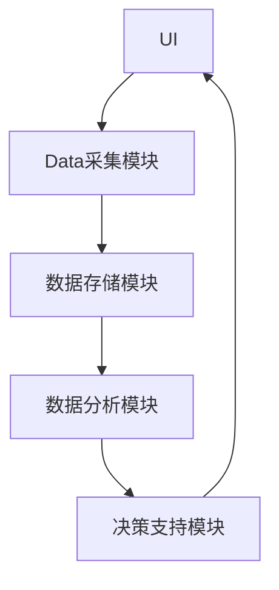
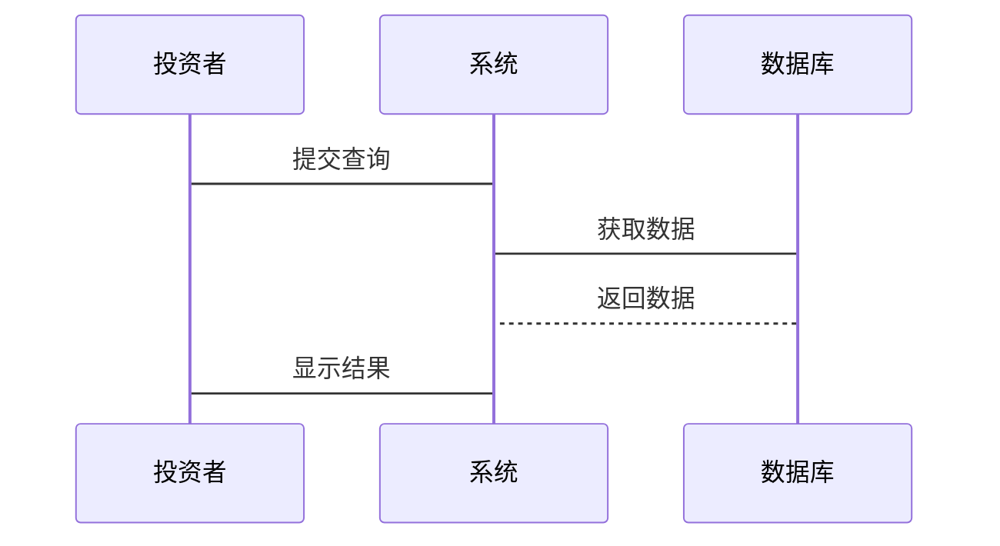

                 


# 克里斯托弗·布朗的全球价值投资机会识别

---

## 关键词

- 全球价值投资
- 投资机会识别
- 价值投资策略
- 投资组合优化
- 数据分析与建模

---

## 摘要

在全球经济日益复杂和不确定的今天，价值投资作为一种长期有效的投资策略，正在吸引越来越多投资者的关注。本文将从价值投资的基本概念出发，结合数据分析与建模的方法，系统性地探讨如何在全球范围内识别价值投资机会。通过分析价值投资的核心要素、算法原理、系统架构以及实际案例，本文旨在为投资者提供一套科学、系统的价值投资机会识别方法。

---

## 第1章：价值投资的背景与重要性

### 1.1 价值投资的定义与核心要素

#### 1.1.1 价值投资的基本概念

价值投资是一种以基本面分析为基础的投资策略，强调以低于内在价值的价格购买优质资产。其核心在于识别市场定价低于其真实价值的标的，从而在长期实现超额收益。

- **核心要素**：
  1. **内在价值**：资产在未来现金流的现值，反映其真实价值。
  2. **安全边际**：买入价格与内在价值的差距，提供风险缓冲。
  3. **长期视角**：关注企业长期盈利能力，而非短期市场波动。

#### 1.1.2 价值投资与其他投资策略的对比

| 投资策略 | 核心逻辑 | 优点 | 缺点 |
|----------|----------|------|------|
| 价值投资 | 价格与价值的偏差 | 高风险回报比、长期稳定性 | 需深度研究，短期可能跑输 |
| 技术分析 | 价格和成交量的模式 | 短期信号捕捉能力强 | 易受市场情绪影响，长期效果不稳定 |

#### 1.1.3 价值投资的实体关系图

```mermaid
er
    title 价值投资实体关系图
    actor 投资者
    actor 市场环境
    actor 企业基本面
    class 标的资产
    class 投资组合
    class 投资机会
    投资者 --> 标的资产: 评估和选择
    标的资产 --> 企业基本面: 反映
    标的资产 --> 市场环境: 受影响
    投资组合 --> 投资机会: 包含
```

---

### 1.2 全球化背景下的投资机会

#### 1.2.1 全球经济格局的变化

- 经济全球化推动了跨国投资的兴起，投资者可以利用不同市场的差异性寻找低估资产。
- 地缘政治风险、货币政策差异等因素为价值投资提供了机会。

#### 1.2.2 不同市场的投资机会分析

| 市场类型 | 投资机会特点 | 适合的价值投资策略 |
|----------|--------------|--------------------|
| 发达市场 | 价格波动小，低估资产难寻 | 高精度筛选 |
| 新兴市场 | 波动性大，估值混乱 | 风险-收益平衡 |

---

## 第2章：价值投资的核心概念与理论基础

### 2.1 价值投资的理论基础

#### 2.1.1 现代投资组合理论与价值投资的融合

- 现代投资组合理论强调分散化和风险调整后的收益，与价值投资的长期视角相辅相成。

#### 2.1.2 技术分析与基本面分析的结合

- **技术分析**：提供短期信号，辅助价值投资者在合适时机介入或退出。
- **基本面分析**：确定标的的内在价值，指导投资决策。

---

## 第3章：价值投资机会识别的算法原理

### 3.1 数据收集与预处理

#### 3.1.1 数据来源

- 公开市场数据（股价、财务报表）。
- 行业和宏观经济数据。

#### 3.1.2 数据预处理

- 数据清洗：处理缺失值、异常值。
- 标准化：统一数据格式，便于分析。

### 3.2 特征提取与模型训练

#### 3.2.1 特征提取

- 财务指标：市盈率（P/E）、市净率（P/B）、股息率等。
- 市场指标：波动率、成交量。

#### 3.2.2 模型训练

- 使用回归分析预测内在价值。
- 通过分类算法识别低估资产。

#### 3.2.3 价值识别算法实现

```python
import pandas as pd
import numpy as np

# 示例：基于回归分析的内在价值预测
def calculate_intrinsic_value(fundamentals):
    # 假设fundamentals是一个包含财务数据的DataFrame
    # 使用线性回归模型预测内在价值
    X = fundamentals[['Revenue', 'Net Income', 'Cash Flow']]
    y = fundamentals['Intrinsic Value']
    from sklearn.linear_model import LinearRegression
    model = LinearRegression()
    model.fit(X, y)
    return model.predict(X)

# 示例：识别低估资产
def identify_value_stocks(prices, fundamentals):
    intrinsic_values = calculate_intrinsic_value(fundamentals)
    mispricing = prices['Price'] < intrinsic_values
    value_stocks = mispricing[mispricing == True].index
    return value_stocks
```

### 3.3 数学模型与公式

#### 3.3.1 内在价值公式

$$
\text{内在价值} = \sum_{t=1}^{n} \frac{CF_t}{(1 + r)^t}
$$

其中：
- $CF_t$ 是第 t 年的现金流。
- $r$ 是折现率。

#### 3.3.2 价值识别的分类模型

$$
\text{概率} = P(\text{低估} | \text{特征})
$$

---

## 第4章：价值投资机会识别的系统架构设计

### 4.1 系统功能设计

#### 4.1.1 数据采集模块

- 从多个数据源获取实时和历史数据。

#### 4.1.2 数据分析模块

- 对标的资产进行基本面和技术面分析。

#### 4.1.3 决策支持模块

- 提供价值投资机会的筛选和排序。

### 4.2 系统架构设计



### 4.3 接口设计与交互流程

#### 4.3.1 系统交互流程图



---

## 第5章：价值投资机会识别的项目实战

### 5.1 环境安装

- Python 3.8+
- 数据分析库（Pandas、NumPy）
- 机器学习库（Scikit-learn）

### 5.2 核心代码实现

#### 5.2.1 环境安装代码

```bash
pip install pandas numpy scikit-learn
```

#### 5.2.2 数据获取与分析代码

```python
import pandas as pd
import numpy as np
from sklearn.linear_model import LinearRegression

# 数据获取示例
data = pd.read_csv('market_data.csv')
data.head()
```

#### 5.2.3 价值识别代码

```python
def identify_value_stocks(data):
    # 假设data包含价格和基本面数据
    # 计算市盈率
    data['P/E'] = data['Price'] / data['Earnings Per Share']
    # 识别低市盈率股票
    value_stocks = data[data['P/E'] < data['P/E'].mean()].index
    return value_stocks

# 示例调用
value_stocks = identify_value_stocks(data)
print("价值投资机会：", value_stocks)
```

### 5.3 案例分析与解读

#### 5.3.1 案例分析

- 某行业的数据分析，识别低估值企业。

#### 5.3.2 分析解读

- 基于P/E和P/B指标，筛选出低估股票。
- 结合行业前景和企业基本面，评估其长期价值。

---

## 第6章：最佳实践与小结

### 6.1 最佳实践

- **持续学习**：市场变化快，需不断更新知识。
- **风险管理**：合理分散投资，控制回撤。
- **工具辅助**：利用数据分析工具提升效率。

### 6.2 小结

价值投资在全球化背景下具有重要的现实意义。通过系统的分析和建模，投资者可以更有效地识别投资机会。本文提供的方法和工具为实现这一目标提供了有力支持。

---

## 作者

作者：AI天才研究院/AI Genius Institute & 禅与计算机程序设计艺术/Zen And The Art of Computer Programming

---

以上为《克里斯托弗·布朗的全球价值投资机会识别》的技术博客文章大纲及部分具体内容。如需进一步扩展或修改，请随时告知！

