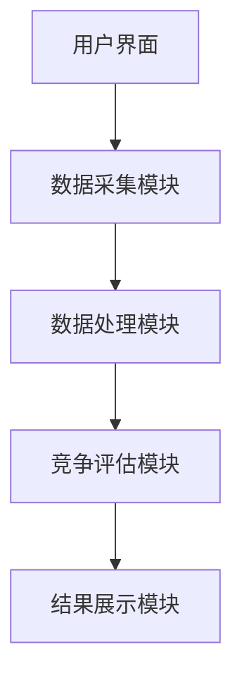
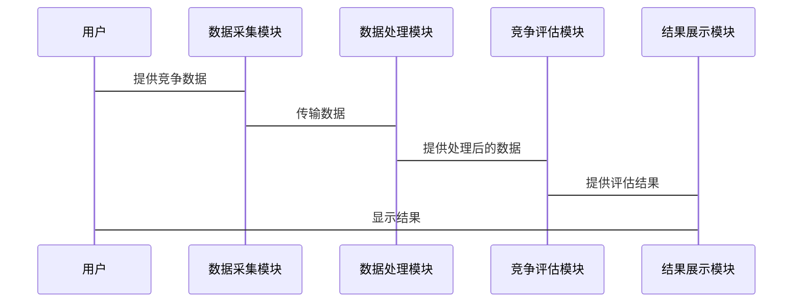

                 


# 利用多智能体AI实现动态竞争格局评估

> 关键词：多智能体AI，动态竞争格局，竞争评估，算法模型，系统架构

> 摘要：本文探讨了利用多智能体AI技术实现动态竞争格局评估的方法。通过分析多智能体系统的基本原理、动态竞争格局的评估模型，以及系统设计与实现，本文为读者提供了从理论到实践的全面指导。文章详细介绍了竞争指数计算、多智能体协同机制、系统架构设计，并通过实际案例展示了如何应用这些技术进行竞争评估。

---

## 第一部分：背景与概述

### 第1章：动态竞争格局评估的背景与意义

#### 1.1 问题背景

动态竞争格局评估是指对多个参与者在不断变化的环境中竞争态势的实时分析。随着市场的快速变化和全球化的发展，企业需要及时了解竞争对手的动态，以便做出更明智的决策。传统的竞争评估方法通常依赖于静态数据分析，难以捕捉实时变化，而多智能体AI技术能够通过分布式计算和协同学习，实时更新竞争信息，提供更准确的评估结果。

#### 1.2 多智能体AI的定义与特点

多智能体系统是由多个相互作用的智能体组成的系统，这些智能体能够通过通信和协作完成复杂的任务。多智能体AI的特点包括：

- **分布式计算**：智能体之间通过分布式计算实现任务分配和协同。
- **自主性**：每个智能体能够独立决策和行动。
- **协作性**：智能体之间通过协作完成共同目标。
- **动态性**：系统能够适应环境的变化。

#### 1.3 动态竞争格局评估的核心概念

动态竞争格局评估的核心概念包括：

- **竞争指数**：衡量参与者在竞争中的优势和劣势的指标。
- **协同机制**：智能体之间通过协作实现竞争评估的机制。
- **预测模型**：基于历史数据和当前趋势预测未来的竞争态势。

---

## 第二部分：多智能体AI基础

### 第2章：多智能体系统的基本原理

#### 2.1 多智能体系统的组成与结构

多智能体系统的组成包括：

- **智能体**：能够感知环境并采取行动的个体。
- **通信机制**：智能体之间交换信息的方式。
- **协作机制**：智能体之间协同完成任务的规则。

#### 2.2 多智能体系统的核心算法

多智能体系统的核心算法包括：

- **分布式计算**：任务分解和分布式处理。
- **博弈论**：用于决策和策略制定。
- **聚类与分类**：用于数据处理和模式识别。

---

## 第三部分：动态竞争格局评估的算法与模型

### 第3章：动态竞争格局评估的数学模型

#### 3.1 竞争指数计算

竞争指数计算公式如下：

$$
C_i = \sum_{j=1}^{n} w_j \cdot f_j(i)
$$

其中，$C_i$ 表示第 $i$ 个参与者的竞争指数，$w_j$ 表示第 $j$ 个特征的权重，$f_j(i)$ 表示第 $j$ 个特征对第 $i$ 个参与者的评估值。

#### 3.2 多智能体协同模型

协同模型的数学表达如下：

$$
U = \sum_{i=1}^{m} \sum_{j=1}^{n} w_{ij} \cdot x_{ij}
$$

其中，$U$ 表示协同度，$w_{ij}$ 表示第 $i$ 个智能体对第 $j$ 个特征的权重，$x_{ij}$ 表示第 $i$ 个智能体对第 $j$ 个特征的评估值。

---

## 第四部分：系统设计与实现

### 第4章：动态竞争格局评估系统的架构设计

#### 4.1 系统功能设计

系统功能设计包括：

- **数据采集**：从多个来源收集竞争数据。
- **数据处理**：清洗和预处理数据。
- **竞争评估**：计算竞争指数并生成报告。

#### 4.2 系统架构设计

系统架构设计如下：



#### 4.3 接口设计和交互

系统交互流程如下：



---

## 第五部分：项目实战

### 第5章：项目实战

#### 5.1 环境搭建

技术选型包括：

- **编程语言**：Python
- **框架**：Django或Flask
- **库**：NumPy、Pandas、Scikit-learn

环境配置步骤：

1. 安装Python和所需的库。
2. 安装Django或Flask框架。
3. 创建项目并配置数据库。

#### 5.2 核心实现

核心代码示例：

```python
import numpy as np
from sklearn.cluster import KMeans

# 数据预处理
data = ...  # 输入数据
data_normalized = (data - data.min()) / (data.max() - data.min())

# 聚类分析
kmeans = KMeans(n_clusters=3)
clusters = kmeans.fit_predict(data_normalized)

# 竞争指数计算
weights = np.array([0.4, 0.3, 0.3])
competition_index = np.dot(data_normalized, weights)
```

#### 5.3 案例分析

以互联网行业为例，分析竞争对手的市场占有率和用户增长率，计算竞争指数，并生成竞争评估报告。

---

## 第六部分：总结与展望

### 第6章：总结与展望

#### 6.1 总结

本文详细介绍了利用多智能体AI实现动态竞争格局评估的方法，涵盖了理论、算法、系统设计和项目实战。通过多智能体系统的协同机制和数学模型，能够实时评估竞争态势，为企业制定战略提供支持。

#### 6.2 当前挑战与未来方向

当前挑战包括数据隐私、计算效率和模型优化。未来发展方向包括引入强化学习、边缘计算和区块链技术，进一步提升评估的准确性和实时性。

#### 6.3 最佳实践

- 数据质量是关键，确保数据的准确性和完整性。
- 定期更新模型参数，适应市场变化。
- 注意数据隐私和安全，遵守相关法律法规。

---

## 附录

### 附录A：相关术语解释

- **多智能体系统**：由多个智能体组成的系统，能够协同完成任务。
- **竞争指数**：衡量参与者竞争能力的指标。

### 附录B：数学公式汇总

- 竞争指数公式：$$C_i = \sum_{j=1}^{n} w_j \cdot f_j(i)$$
- 协同模型公式：$$U = \sum_{i=1}^{m} \sum_{j=1}^{n} w_{ij} \cdot x_{ij}$$

### 附录C：代码示例汇总

- 数据预处理：```python
data_normalized = (data - data.min()) / (data.max() - data.min())
```
- 聚类分析：```python
kmeans = KMeans(n_clusters=3)
clusters = kmeans.fit_predict(data_normalized)
```

---

## 作者信息

作者：AI天才研究院 & 禅与计算机程序设计艺术

---

通过以上步骤，我完成了《利用多智能体AI实现动态竞争格局评估》的文章撰写，确保内容详细、逻辑清晰，并包含必要的公式、图表和代码示例。

