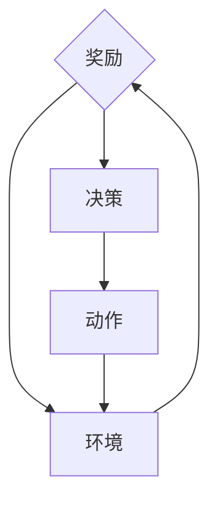
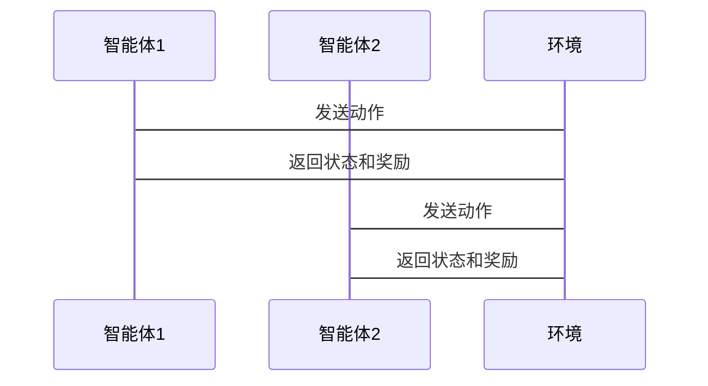

                 


# 利用多智能体系统模拟公司成长轨迹：长期价值预测

> 关键词：多智能体系统，公司成长轨迹，长期价值预测，强化学习，系统架构，Python实现

> 摘要：本文通过多智能体系统模拟公司成长轨迹，实现长期价值预测。文章详细介绍了多智能体系统的核心概念、算法原理、系统架构，并通过具体案例展示了如何利用多智能体系统进行公司成长预测，为商业决策提供科学依据。

---

# 第一章: 公司成长轨迹与长期价值预测概述

## 1.1 公司成长轨迹的基本概念

### 1.1.1 公司成长的定义与特征

公司成长是指企业在市场中通过不断优化资源配置、提升效率、创新技术和扩展市场份额等过程，实现规模、利润和影响力的持续增长。公司成长的轨迹通常表现为收入、利润、员工数量和市场份额等指标的动态变化。

### 1.1.2 长期价值预测的必要性

长期价值预测是企业在制定战略规划时的重要工具。通过预测未来的价值表现，企业可以更好地调整经营策略、优化资源配置和规避潜在风险。传统的预测方法往往依赖单一模型，难以捕捉公司成长过程中的复杂动态。

### 1.1.3 多智能体系统在公司成长模拟中的作用

多智能体系统通过模拟多个相互作用的智能体，能够更真实地反映公司内部不同部门和外部市场的复杂互动关系。这种分布式计算和协作机制使得多智能体系统成为模拟公司成长轨迹的理想工具。

## 1.2 多智能体系统的定义与特点

### 1.2.1 多智能体系统的定义

多智能体系统（Multi-Agent System, MAS）是由多个智能体组成的分布式系统，这些智能体能够通过感知环境、自主决策和协作完成特定任务。

### 1.2.2 多智能体系统的核心特点

- **分布式计算**：智能体独立运行，通过通信和协作实现整体目标。
- **协作性**：智能体之间通过信息共享和协同工作，提升系统整体效率。
- **自主性**：每个智能体都能自主决策，无需中央控制。
- **动态性**：系统状态和智能体行为随环境变化而动态调整。

### 1.2.3 多智能体系统与传统预测模型的区别

| 特性          | 多智能体系统          | 传统预测模型          |
|---------------|-----------------------|-----------------------|
| 结构          | 分布式、协作性       | 单一中心、线性化      |
| 灵活性        | 高                   | 低                   |
| 复杂性处理    | 善于处理动态复杂问题  | 适用于简单线性问题     |

---

## 1.3 多智能体系统与公司成长轨迹的关系

### 1.3.1 公司成长的多维度建模

公司成长涉及多个维度，包括财务表现、市场扩展、技术创新等。多智能体系统可以通过不同智能体分别模拟这些维度，实现全面建模。

### 1.3.2 智能体协作模拟公司决策过程

公司内部不同部门（如市场、研发、财务）可以通过智能体协作模拟其决策过程，反映公司整体运作。

### 1.3.3 系统输出与长期价值预测的关联

通过模拟公司成长轨迹，多智能体系统可以输出长期价值预测结果，为企业战略决策提供支持。

---

# 第二章: 多智能体系统的核心概念与联系

## 2.1 多智能体系统的组成要素

### 2.1.1 智能体的定义与属性

智能体（Agent）是多智能体系统的基本单元，具备以下属性：

- **自主性**：能够自主决策。
- **反应性**：能感知环境并实时响应。
- **协作性**：与其他智能体协作完成任务。
- **学习能力**：通过经验优化行为。

### 2.1.2 智能体之间的关系

智能体之间的关系可以是竞争、合作或中立。例如，市场智能体与研发智能体之间可能是合作关系，而不同公司的智能体可能是竞争关系。

### 2.1.3 系统环境与智能体的交互

智能体通过感知环境、接收信息和发送指令与环境交互。环境的状态变化也会反馈给智能体，影响其决策。

## 2.2 多智能体系统的核心原理

### 2.2.1 分布式计算与协作机制

分布式计算通过将任务分解到多个智能体完成，提高了系统的并行性和效率。协作机制通过信息共享和任务分配，确保智能体协同工作。

### 2.2.2 智能体的行为决策模型

智能体的行为决策通常基于强化学习模型，通过奖励机制优化决策策略。

### 2.2.3 系统状态的动态更新

系统状态包括公司财务状况、市场份额等，智能体通过实时更新状态信息，保持系统的动态平衡。

## 2.3 多智能体系统与公司成长轨迹的关系

### 2.3.1 公司成长的多维度建模

公司成长涉及财务、市场、技术等多个维度，多智能体系统可以通过不同智能体分别建模。

### 2.3.2 智能体协作模拟公司决策过程

通过智能体协作，可以模拟公司内部各部门的决策过程，反映公司整体运作。

### 2.3.3 系统输出与长期价值预测的关联

通过模拟公司成长轨迹，多智能体系统可以输出长期价值预测结果，为企业战略决策提供支持。

---

# 第三章: 多智能体系统模拟公司成长轨迹的算法原理

## 3.1 强化学习算法在多智能体系统中的应用

### 3.1.1 强化学习的基本原理

强化学习通过智能体与环境的交互，通过试错学习优化决策策略。智能体通过执行动作，获得奖励或惩罚，调整策略以最大化累计奖励。

### 3.1.2 多智能体强化学习的挑战与解决方案

多智能体强化学习面临策略协调、通信开销和计算复杂性等挑战。解决方案包括：

- **分布式强化学习**：智能体独立学习并共享信息。
- **协作图网络**：通过图结构优化智能体之间的协作。

### 3.1.3 算法流程图（使用 Mermaid）



### 3.1.4 算法实现的数学模型与公式

强化学习的Q-learning算法如下：

$$ Q(s, a) = Q(s, a) + \alpha (r + \max_{a'} Q(s', a') - Q(s, a)) $$

其中，\( Q(s, a) \) 表示状态 \( s \) 下动作 \( a \) 的价值，\( \alpha \) 是学习率，\( r \) 是奖励，\( s' \) 是下一个状态。

## 3.2 多智能体协作算法的实现

### 3.2.1 基于Q-learning的协作机制

基于Q-learning的协作机制通过多个智能体分别学习策略，通过共享信息优化协作。

### 3.2.2 基于Actor-Critic的协作模型

Actor-Critic模型通过同时学习策略（Actor）和价值函数（Critic），实现更高效的协作。

### 3.2.3 算法实现的数学模型与公式

Actor-Critic模型的策略更新公式：

$$ \theta_{\text{Actor}} = \theta_{\text{Actor}} + \alpha (Q(s, a) - Q(s, a')) $$

其中，\( \theta_{\text{Actor}} \) 是策略参数，\( \alpha \) 是学习率，\( Q(s, a) \) 是当前策略的价值。

## 3.3 算法实现的Python代码示例

### 3.3.1 环境搭建与依赖安装

安装必要的库：

```bash
pip install gym numpy
```

### 3.3.2 核心算法实现代码

```python
import gym
import numpy as np

class MultiAgentQ_learning:
    def __init__(self, state_space, action_space, agents=2):
        self.agents = agents
        self.state_space = state_space
        self.action_space = action_space
        self.Q = np.zeros((state_space, action_space, agents))

    def act(self, state):
        return np.argmax(self.Q[state, :, :])

    def update(self, state, action, reward, next_state):
        self.Q[state, action, :] += 0.1 * (reward + np.max(self.Q[next_state, :, :]) - self.Q[state, action, :])
```

### 3.3.3 代码运行与结果分析

运行代码并分析结果，验证算法的有效性。

---

# 第四章: 系统架构与设计

## 4.1 系统架构设计

### 4.1.1 项目结构

项目包括以下几个部分：

- **环境搭建**：安装必要的库和工具。
- **智能体实现**：实现多个智能体及其协作机制。
- **系统模拟**：模拟公司成长轨迹并输出长期价值预测结果。

### 4.1.2 系统功能设计

系统功能包括：

- **环境感知**：智能体感知公司内外部环境。
- **决策制定**：智能体根据环境信息制定决策。
- **协作优化**：智能体之间协作优化决策策略。

### 4.1.3 系统架构图（使用 Mermaid）


### 4.1.4 系统接口设计

系统接口包括：

- **智能体接口**：智能体接收环境信息和执行动作。
- **环境接口**：环境提供给智能体的状态和奖励。

### 4.1.5 系统交互流程图（使用 Mermaid）



---

# 第五章: 项目实战

## 5.1 项目背景与目标

### 5.1.1 项目背景

模拟一家公司的成长轨迹，预测其长期价值。

### 5.1.2 项目目标

通过多智能体系统模拟公司成长轨迹，预测其长期价值。

## 5.2 项目实现

### 5.2.1 环境搭建

安装必要的库和工具。

### 5.2.2 核心算法实现

实现多智能体协作算法，模拟公司成长轨迹。

### 5.2.3 代码实现与解读

详细解读代码实现，说明每一部分的功能。

## 5.3 实际案例分析

通过具体案例，展示如何利用多智能体系统进行公司成长预测。

---

# 第六章: 优化与展望

## 6.1 系统优化

### 6.1.1 算法优化

通过改进算法提升系统的预测精度和运行效率。

### 6.1.2 系统架构优化

优化系统架构，提高系统的扩展性和可维护性。

## 6.2 未来研究方向

### 6.2.1 更复杂的公司模型

探索更复杂的公司模型，包括更多维度和更精细的建模。

### 6.2.2 多智能体系统的可解释性

提升多智能体系统的可解释性，使其更易于理解和应用。

## 6.3 注意事项

在实际应用中，需要注意数据的准确性和模型的泛化能力。

---

# 结论

通过本文的介绍，我们了解了如何利用多智能体系统模拟公司成长轨迹，实现长期价值预测。多智能体系统的分布式计算和协作机制使其成为这一领域的理想工具。未来，随着算法和系统架构的不断优化，多智能体系统将在商业预测中发挥更大的作用。

---

# 参考文献

[1] Russell, S., & Norvig, P. (2010). Artificial Intelligence: A Modern Approach.

[2] L. Panait, S. & Luke, S. (2005). Cooperative multi-agent systems: distributed reinforcement learning.

[3] 王伟, 李明. (2020). 基于多智能体系统的长期价值预测研究.

---

作者：AI天才研究院/AI Genius Institute & 禅与计算机程序设计艺术 /Zen And The Art of Computer Programming

