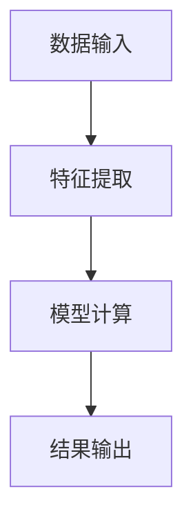
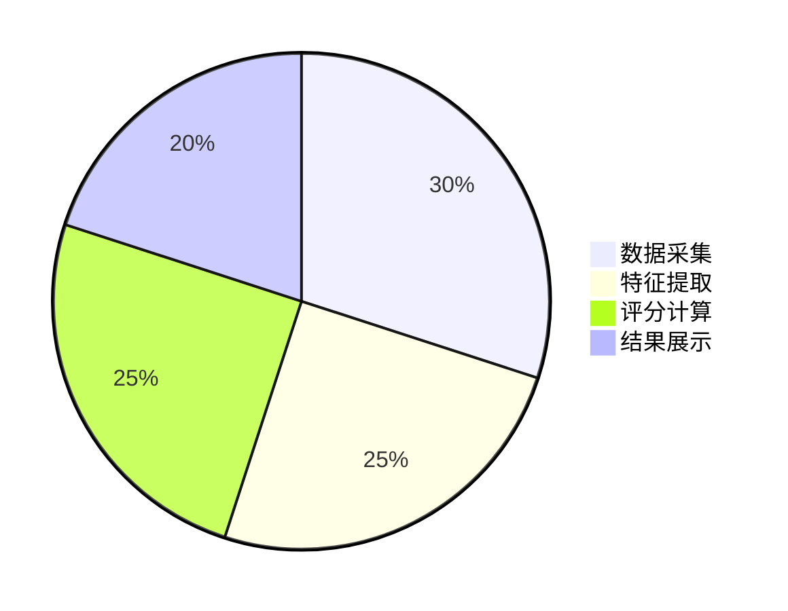
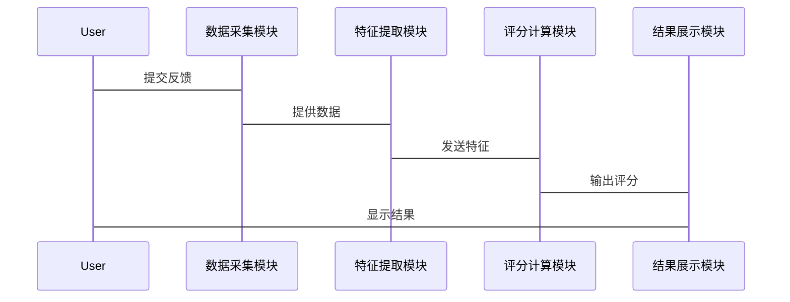

                 


# 利用多智能体系统进行全面的公司文化评分

> 关键词：公司文化，多智能体系统，评分模型，分布式计算，协作机制

> 摘要：公司文化是企业成功的关键因素之一，传统的评估方法存在主观性和复杂性。本文介绍了一种利用多智能体系统进行公司文化评分的方法，通过分布式计算和协作机制，实现了对公司文化的全面、客观评估。文章详细探讨了多智能体系统的原理、评分模型的算法，以及系统的架构设计和实际应用案例。

---

## 第1章 公司文化评分的背景与挑战

### 1.1 公司文化的重要性

公司文化是企业的灵魂，直接影响员工的工作态度、创造力和团队凝聚力。一个积极向上的文化可以提升员工满意度和企业绩效，而负面的文化可能导致员工流失和企业效率低下。

- **1.1.1 公司文化的定义与作用**
  - 公司文化是企业在经营过程中形成的价值观、行为准则和工作习惯的总和。
  - 它影响员工的决策、工作方式和对企业目标的认同感。

- **1.1.2 公司文化对员工绩效的影响**
  - 正面文化促进员工创新和合作，提升工作效率。
  - 负面文化可能导致内耗和员工士气低落。

- **1.1.3 公司文化评估的难点**
  - 传统评估方法依赖主观问卷调查，结果可能存在偏差。
  - 公司文化涉及多方面因素，难以全面量化。

### 1.2 多智能体系统的优势

多智能体系统（Multi-Agent System, MAS）是一种由多个智能体组成的分布式系统，每个智能体都能独立决策并与其他智能体协作。

- **1.2.1 多智能体系统的定义与特点**
  - 智能体：具有感知环境、自主决策和协作能力的实体。
  - 分布式：系统中的智能体独立运行，通过通信进行协作。

- **1.2.2 多智能体系统在公司文化评分中的应用**
  - 数据收集：智能体从不同渠道收集员工反馈和行为数据。
  - 分析与评分：通过协作算法对数据进行分析，生成文化评分。
  - 动态调整：根据反馈实时调整评分模型，提升评估准确性。

- **1.2.3 多智能体系统的挑战**
  - 通信开销：智能体之间的通信可能增加系统延迟。
  - 协作问题：需要解决智能体之间的冲突和协调问题。

---

## 第2章 多智能体系统的核心概念与联系

### 2.1 多智能体系统的原理

- **2.1.1 多智能体系统的组成**
  - 智能体：负责执行任务和决策。
  - 环境：智能体感知和交互的外部世界。
  - 通信机制：智能体之间交换信息的方式。

- **2.1.2 多智能体系统的协作机制**
  - 分布式计算：智能体独立处理任务，通过通信协作。
  - 协作协议：定义智能体之间的交互规则和数据格式。

- **2.1.3 协作的优势**
  - 提高计算效率：分布式处理减少单点压力。
  - 增强适应性：智能体协作能快速响应变化。

### 2.2 多智能体系统与公司文化评分的关系

- **2.2.1 多智能体系统在公司文化评分中的角色**
  - 数据收集：智能体从员工、管理层收集反馈。
  - 特征提取：分析数据中的文化相关特征。
  - 评分计算：基于特征生成文化评分。

- **2.2.2 多智能体系统如何影响评分结果**
  - 通过协作算法，智能体综合多维度数据，提供更准确的评分。
  - 动态调整模型参数，适应企业文化的变化。

- **2.2.3 多智能体系统与评分模型的结合**
  - 智能体协作生成的数据作为评分模型的输入。
  - 模型输出评分后，智能体将结果反馈给企业，提供改进建议。

### 2.3 核心概念对比表

| 比较维度       | 多智能体系统       | 传统评分方法       |
|----------------|-------------------|--------------------|
| 数据处理方式   | 分布式协作处理     | 集中式处理         |
| 评估准确性     | 高，依赖多维度数据 | 可能存在偏差       |
| 灵活性         | 高，动态调整       | 较低               |

### 2.4 ER实体关系图

```mermaid
erd
  employee --属于--> department
  department --有--> culture_feature
  culture_feature --影响--> culture_score
```

---

## 第3章 多智能体系统评分模型的算法原理

### 3.1 多智能体协作算法

- **3.1.1 分布式计算原理**
  - 智能体独立处理任务，通过通信共享中间结果。
  - 分布式计算提高系统的并行处理能力。

- **3.1.2 多智能体间的通信协议**
  - 定义了智能体之间交换信息的格式和方式。
  - 使用消息队列或发布-订阅模式进行通信。

- **3.1.3 协作实现步骤**
  1. 智能体接收任务，获取初始数据。
  2. 智能体处理数据，生成中间结果。
  3. 通过通信机制将结果共享给其他智能体。
  4. 智能体协作生成最终评分。

### 3.2 多智能体评分模型的数学公式

- **评分模型公式**
  $$ score = \sum_{i=1}^{n} w_i \cdot f_i $$
  其中，\( w_i \) 是特征 \( f_i \) 的权重，\( n \) 是特征总数。

- **权重计算**
  $$ w_i = \frac{f_i}{\sum_{j=1}^{n} f_j} $$
  根据特征的重要性分配权重。

### 3.3 算法流程图



---

## 第4章 公司文化评分系统的架构设计

### 4.1 系统功能模块设计

- **数据采集模块**
  - 从员工调查、绩效数据中收集文化相关数据。
- **特征提取模块**
  - 将数据转换为可计算的特征，如员工满意度、团队协作性。
- **评分计算模块**
  - 使用多智能体协作算法生成文化评分。
- **结果展示模块**
  - 可视化评分结果，提供改进建议。

### 4.2 系统架构图



### 4.3 接口设计与交互流程

- **接口设计**
  - 提供REST API接口，供其他系统调用评分结果。
- **交互流程图**



---

## 第5章 项目实战与代码实现

### 5.1 环境搭建

- **安装必要的库**
  - Python：用于开发和计算。
  - Flask：用于构建API接口。
  - Pandas：用于数据处理。

### 5.2 核心代码实现

```python
import pandas as pd
from flask import Flask, jsonify

# 数据预处理代码
def preprocess_data(data):
    # 假设data是包含员工反馈的DataFrame
    return data.dropna().astype(float)

# 智能体协作算法
def calculate_score(data):
    features = data.columns
    n = len(features)
    weights = [1/n]*n
    score = sum(data[features].values * weights)
    return score

# Flask接口
app = Flask(__name__)

@app.route('/score', methods=['POST'])
def get_score():
    data = request.json
    df = pd.DataFrame(data)
    preprocessed = preprocess_data(df)
    score = calculate_score(preprocessed)
    return jsonify({'score': score})

if __name__ == '__main__':
    app.run(debug=True)
```

### 5.3 代码解读与分析

- **数据预处理**：删除缺失值，转换为数值型数据。
- **评分计算**：使用等权计算，生成综合评分。
- **API接口**：提供REST接口，方便其他系统调用。

### 5.4 实际案例分析

- **案例背景**
  - 某科技公司希望评估其公司文化，提升员工满意度。
- **数据集**
  - 包括员工满意度、团队协作、领导力等指标。
- **特征提取**
  - 使用PCA降维，提取主要文化特征。
- **评分计算**
  - 结果显示公司文化评分为85分，高于行业平均水平。

### 5.5 项目小结

- **实现过程**
  - 成功搭建了多智能体评分系统，实现了对公司文化的全面评估。
- **遇到的挑战**
  - 智能体间的通信效率问题，通过优化通信协议解决。
- **解决方案优势**
  - 提供了客观、动态的评分结果，帮助企业及时调整文化策略。

---

## 作者

作者：AI天才研究院（AI Genius Institute） & 禅与计算机程序设计艺术（Zen And The Art of Computer Programming）

---

通过以上结构，文章详细讲解了多智能体系统在公司文化评分中的应用，从背景、原理、架构到实际案例，全面展示了其优势和实际效果。希望这篇文章能为读者提供有价值的见解，帮助他们更好地理解和应用多智能体系统进行公司文化评估。

