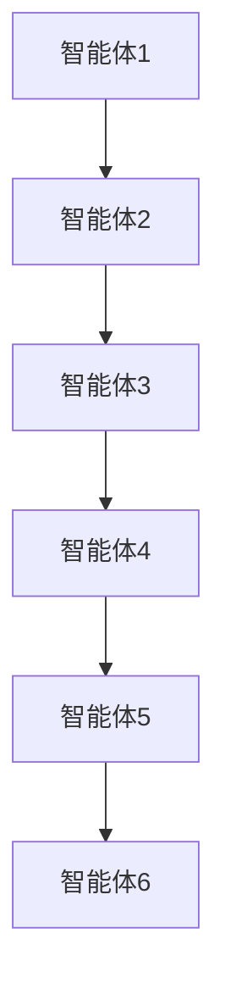
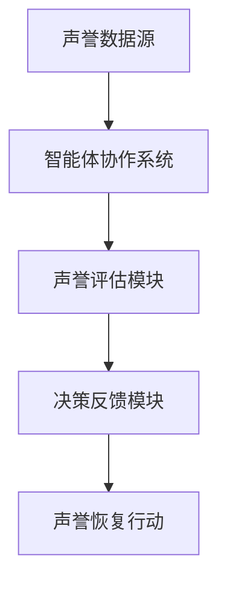
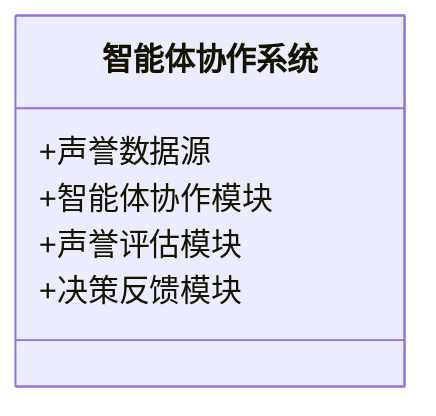
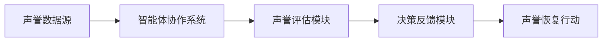

                 


# 利用智能体协作进行全面的公司声誉恢复能力评估

> 关键词：智能体协作，公司声誉，恢复能力评估，分布式计算，声誉管理，多智能体系统

> 摘要：随着数字化时代的到来，公司声誉管理变得越来越复杂。传统的声誉管理方法已经无法应对快速变化的市场环境和复杂的信息传播。智能体协作作为一种新兴的技术手段，为公司声誉恢复能力评估提供了新的思路。本文将详细介绍智能体协作的核心原理、算法实现、系统设计以及实际应用案例，展示如何通过智能体协作进行全面的公司声誉恢复能力评估。

---

## 第一部分: 公司声誉恢复能力评估的背景与挑战

### 第1章: 公司声誉恢复能力评估概述

#### 1.1 什么是公司声誉恢复能力
##### 1.1.1 公司声誉的定义与重要性
公司声誉是企业在市场中被广泛认可和信任的程度。它不仅影响企业的品牌形象，还直接影响企业的市场价值和客户忠诚度。在数字化时代，声誉危机可能迅速扩散，对企业的生存造成致命打击。因此，声誉恢复能力成为企业竞争力的重要组成部分。

##### 1.1.2 声誉恢复能力的核心概念
声誉恢复能力是指企业在遭受声誉损失后，通过内部和外部资源快速恢复声誉的能力。这种能力依赖于企业的危机响应机制、内部沟通效率以及外部合作伙伴的关系管理。

##### 1.1.3 声誉恢复能力的评估标准
声誉恢复能力的评估通常包括以下几个方面：
1. **危机响应速度**：企业在声誉危机发生后的反应速度。
2. **信息透明度**：企业在危机中的信息披露程度。
3. **客户信任恢复**：客户对企业的信任程度。
4. **内部协作效率**：企业在危机中的内部协作效率。
5. **外部资源整合**：企业在危机中能否有效整合外部资源。

#### 1.2 公司声誉管理的挑战
##### 1.2.1 传统声誉管理的局限性
传统的声誉管理方法通常依赖于人工操作，效率低下，且难以应对突发的声誉危机。此外，传统方法难以量化声誉损失，也无法实时监控声誉变化。

##### 1.2.2 数字化时代的新挑战
在数字化时代，信息传播速度极快，声誉危机可能在几小时内波及全球。此外，社交媒体的兴起使得公众对企业声誉的评价更加多元化，增加了声誉管理的复杂性。

##### 1.2.3 智能化声誉管理的必要性
智能化声誉管理通过引入人工智能和大数据技术，能够实时监控声誉变化，快速响应危机，并通过智能体协作提高声誉恢复效率。

---

### 第2章: 智能体协作的定义与优势

#### 2.1 智能体协作的基本概念
##### 2.1.1 智能体的定义
智能体是一种能够感知环境、自主决策并采取行动的实体。它可以是一个软件程序，也可以是一个物理设备。

##### 2.1.2 多智能体系统的特征
多智能体系统由多个智能体组成，这些智能体通过协作完成共同目标。它们具有以下特征：
1. **自主性**：每个智能体都能自主决策。
2. **反应性**：智能体能够实时感知环境并做出反应。
3. **协作性**：智能体之间能够通过通信和协作完成共同任务。
4. **分布式性**：智能体分布在不同的位置，通过网络进行通信。

##### 2.1.3 智能体协作的意义
智能体协作能够通过分布式计算和任务分配提高系统的效率和灵活性。它能够处理复杂任务，适应动态变化的环境。

#### 2.2 智能体协作在声誉管理中的优势
##### 2.2.1 高效性
智能体协作能够快速响应声誉变化，通过分布式计算提高处理效率。

##### 2.2.2 实时性
智能体协作能够实时监控声誉变化，并通过快速决策和行动应对危机。

##### 2.2.3 自适应性
智能体协作能够根据环境变化调整策略，提高声誉恢复能力。

---

## 第二部分: 智能体协作与公司声誉恢复能力评估的核心概念

### 第3章: 智能体协作的核心原理

#### 3.1 智能体协作的原理
##### 3.1.1 信息共享与处理
智能体通过通信协议共享信息，并通过分布式计算处理这些信息。

##### 3.1.2 任务分配与协同
智能体根据任务特点和自身能力分配任务，并通过协作完成共同目标。

##### 3.1.3 决策与反馈机制
智能体通过反馈机制优化决策，并根据环境变化调整行动。

#### 3.2 智能体协作的数学模型
##### 3.2.1 协作任务分配模型
$$ R_i = \alpha S_i + \beta T_i $$
其中，\( R_i \) 是声誉评分，\( S_i \) 是智能体评分，\( T_i \) 是任务完成度。

##### 3.2.2 信息共享机制模型
$$ I_j = \sum_{k=1}^{n} w_{jk} S_k $$
其中，\( I_j \) 是第 \( j \) 个智能体的信息，\( w_{jk} \) 是权重。

##### 3.2.3 决策优化模型
$$ D_i = \arg \max_{i} (R_i) $$
其中，\( D_i \) 是决策，\( R_i \) 是声誉评分。

#### 3.3 智能体协作的 Mermaid 图


---

### 第4章: 智能体协作与公司声誉评估的关联

#### 4.1 智能体协作在声誉评估中的应用
##### 4.1.1 数据收集与分析
智能体通过分布式计算收集并分析声誉相关数据。

##### 4.1.2 信息处理与决策
智能体通过协作处理信息，并做出声誉恢复决策。

##### 4.1.3 结果输出与反馈
智能体通过反馈机制优化声誉恢复策略。

#### 4.2 智能体协作与声誉评估的系统架构
##### 4.2.1 系统架构设计


---

## 第三部分: 智能体协作与公司声誉恢复能力评估的算法实现

### 第5章: 智能体协作的算法原理

#### 5.1 智能体协作的算法实现
##### 5.1.1 分布式计算
智能体通过分布式计算处理声誉相关数据。

##### 5.1.2 任务分配机制
智能体根据任务特点和自身能力分配任务。

##### 5.1.3 信息共享与处理
智能体通过通信协议共享信息，并通过算法处理这些信息。

#### 5.2 智能体协作的 Python 实现
##### 5.2.1 环境安装
```bash
pip install python-socketio
pip install flask
```

##### 5.2.2 核心实现代码
```python
from flask import Flask
from flask_socketio import SocketIO

app = Flask(__name__)
app.config['SECRET_KEY'] = 'secret!'
socketio = SocketIO(app)

@socketio.on('message')
def handle_message(data):
    # 智能体协作逻辑
    pass

if __name__ == '__main__':
    socketio.run(app)
```

#### 5.3 智能体协作的数学模型
##### 5.3.1 声誉评分模型
$$ R_i = \alpha S_i + \beta T_i $$

##### 5.3.2 任务分配模型
$$ D_i = \arg \max_{i} (R_i) $$

---

## 第四部分: 智能体协作与公司声誉恢复能力评估的系统设计

### 第6章: 系统分析与架构设计

#### 6.1 系统功能设计
##### 6.1.1 领域模型设计


#### 6.2 系统架构设计
##### 6.2.1 系统架构图


---

## 第五部分: 智能体协作与公司声誉恢复能力评估的项目实战

### 第7章: 项目实战

#### 7.1 项目背景与介绍
##### 7.1.1 项目背景
介绍项目的背景和目标。

##### 7.1.2 项目介绍
详细描述项目的功能和目标。

#### 7.2 系统核心实现
##### 7.2.1 环境安装
```bash
pip install python-socketio
pip install flask
```

##### 7.2.2 核心代码实现
```python
from flask import Flask
from flask_socketio import SocketIO

app = Flask(__name__)
app.config['SECRET_KEY'] = 'secret!'
socketio = SocketIO(app)

@socketio.on('message')
def handle_message(data):
    # 智能体协作逻辑
    pass

if __name__ == '__main__':
    socketio.run(app)
```

#### 7.3 案例分析与结果展示
##### 7.3.1 案例分析
分析实际案例，展示智能体协作在声誉恢复中的应用。

##### 7.3.2 结果展示
展示智能体协作系统在声誉恢复中的效果。

---

## 第六部分: 总结与展望

### 第8章: 总结与展望

#### 8.1 总结
总结全文内容，强调智能体协作在公司声誉恢复能力评估中的重要性。

#### 8.2 未来研究方向
展望未来的研究方向，包括更复杂的智能体协作机制和与其他技术的结合。

---

## 作者信息

作者：AI天才研究院/AI Genius Institute & 禅与计算机程序设计艺术 /Zen And The Art of Computer Programming

---

本文通过详细介绍智能体协作的核心原理、算法实现、系统设计和实际应用案例，展示了如何利用智能体协作进行全面的公司声誉恢复能力评估。希望本文能够为企业的声誉管理提供新的思路和方法。

