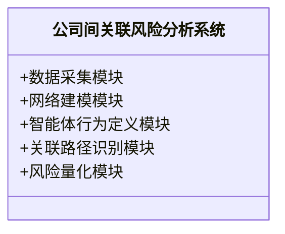
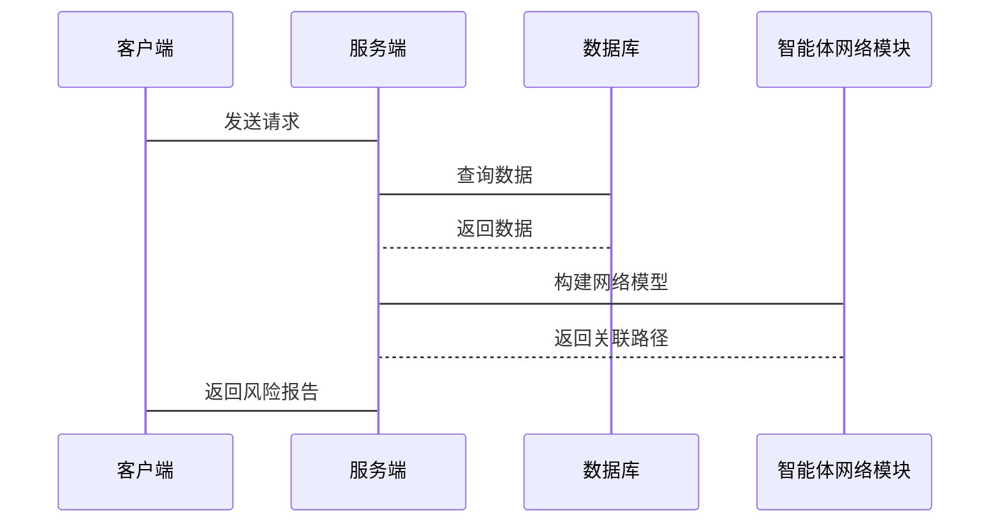

                 


# 利用智能体网络分析公司间的隐藏关联风险

> 关键词：智能体网络，关联风险，公司间关联，隐藏风险，网络分析，智能体行为，风险量化

> 摘要：本文详细探讨了利用智能体网络分析公司间隐藏关联风险的方法。通过背景介绍、核心概念、算法原理、系统架构、项目实战等多角度分析，深入解读了智能体网络在关联风险分析中的应用，结合实际案例，总结了最佳实践和注意事项。

---

## 第1章 背景介绍

### 1.1 问题背景

#### 1.1.1 公司间关联风险的定义与重要性
公司间关联风险指的是由于公司之间的直接或间接关联（如供应链、投资、合作等）所引发的潜在风险。这些风险可能包括声誉风险、财务风险、法律风险等，甚至可能引发系统性风险。随着全球化和复杂化的加剧，公司间的隐藏关联风险变得越来越重要。

#### 1.1.2 隐藏关联风险的潜在威胁
隐藏关联风险可能通过复杂的网络结构隐藏，例如通过多层供应链、嵌套投资或间接合作关系。这些隐藏的关联可能在危机发生时放大风险，甚至引发连锁反应。

#### 1.1.3 智能体网络的引入与优势
智能体网络是一种能够模拟和分析复杂网络结构的技术。通过智能体网络，可以更好地识别和量化公司间的隐藏关联风险，帮助企业在复杂环境中做出更明智的决策。

### 1.2 问题描述

#### 1.2.1 隐藏关联风险的复杂性
公司间的关联可能涉及多个维度，包括直接和间接关联、层级关联等。这些复杂的关联关系使得传统的线性分析方法难以捕捉隐藏风险。

#### 1.2.2 智能体网络在关联风险分析中的作用
智能体网络能够通过非线性分析和复杂网络建模，捕捉公司间的隐藏关联，并量化这些关联对风险的影响。

#### 1.2.3 当前关联风险分析的局限性
传统的关联风险分析方法通常依赖于线性回归、Pearson相关系数等简单方法，难以应对复杂网络中的隐藏关联。

### 1.3 问题解决

#### 1.3.1 智能体网络的核心优势
智能体网络通过构建复杂的网络模型，能够识别和量化公司间的隐藏关联风险。

#### 1.3.2 隐藏关联风险的识别与量化
通过智能体网络分析，可以识别出隐藏的关联路径，并量化这些路径对风险的影响。

#### 1.3.3 智能体网络在风险分析中的具体应用
智能体网络可以应用于供应链风险分析、投资组合风险评估等领域，帮助企业在复杂环境中降低风险。

### 1.4 边界与外延

#### 1.4.1 智能体网络的边界条件
智能体网络的边界条件包括数据的可用性、模型的复杂性等。

#### 1.4.2 隐藏关联风险的外延范围
隐藏关联风险的外延范围包括直接关联、间接关联、多层次关联等。

#### 1.4.3 相关领域的交叉与融合
智能体网络与图论、复杂网络、风险管理等领域的交叉与融合，为隐藏关联风险分析提供了新的思路。

### 1.5 概念结构与核心要素

#### 1.5.1 智能体网络的构成要素
智能体网络的构成要素包括节点、边、属性、动态规则等。

#### 1.5.2 隐藏关联风险的核心属性
隐藏关联风险的核心属性包括关联的隐性性、复杂性、动态性等。

#### 1.5.3 智能体网络与关联风险的关系图谱
智能体网络与关联风险的关系图谱展示了智能体网络如何通过建模和分析关联路径来识别和量化隐藏风险。

---

## 第2章 核心概念与联系

### 2.1 智能体网络的原理

#### 2.1.1 智能体的基本定义
智能体是一种能够感知环境、做出决策并采取行动的实体。

#### 2.1.2 智能体网络的构建过程
智能体网络的构建过程包括数据收集、网络建模、智能体行为定义等。

#### 2.1.3 智能体网络的动态特性
智能体网络具有动态性，能够实时更新网络结构和节点属性。

### 2.2 关联风险的核心概念

#### 2.2.1 风险的定义与分类
风险可以分为市场风险、信用风险、操作风险等。

#### 2.2.2 公司间关联风险的特征
公司间关联风险的特征包括复杂性、隐蔽性、传染性等。

#### 2.2.3 隐藏关联风险的识别方法
隐藏关联风险的识别方法包括网络分析、聚类分析、路径分析等。

### 2.3 智能体网络与关联风险的关系

#### 2.3.1 智能体网络在关联风险分析中的应用
智能体网络可以用于识别公司间的隐藏关联路径，并评估这些路径对风险的影响。

#### 2.3.2 智能体网络的优势与局限性
智能体网络的优势在于能够建模复杂网络，但其局限性在于需要大量数据支持。

#### 2.3.3 智能体网络与关联风险的关系图谱
通过Mermaid图展示公司、智能体、关联风险之间的关系。


---

## 第3章 算法原理

### 3.1 关联风险计算的算法

#### 3.1.1 基于图论的路径分析
路径分析用于识别公司间的关联路径，并计算路径长度和权重。

#### 3.1.2 基于聚类的关联分析
聚类分析用于识别具有相似属性的公司群体，并评估群体内部的关联风险。

#### 3.1.3 基于概率的关联风险评估
概率模型用于评估公司间关联风险的发生概率。

### 3.2 算法流程图


### 3.3 数学模型与公式

#### 3.3.1 路径长度计算
路径长度为各边权重的和。

$$ \text{路径长度} = \sum_{i=1}^{n} w_i $$

#### 3.3.2 关联风险的概率计算
关联风险的概率可以表示为：

$$ P(\text{风险}) = \sum_{i=1}^{m} p_i \times r_i $$

其中，\( p_i \) 是风险 \( i \) 发生的概率，\( r_i \) 是风险 \( i \) 的影响程度。

---

## 第4章 系统分析与架构设计

### 4.1 系统功能设计

#### 4.1.1 功能模块
功能模块包括数据采集、网络建模、智能体行为定义、关联路径识别、风险量化等。

#### 4.1.2 领域模型



### 4.2 系统架构设计


### 4.3 接口设计与交互



---

## 第5章 项目实战

### 5.1 环境安装

#### 5.1.1 Python环境安装
安装Python和必要的库，如networkx、numpy、scipy等。

#### 5.1.2 数据库安装
安装MySQL或MongoDB等数据库。

### 5.2 核心代码实现

#### 5.2.1 数据预处理
```python
import networkx as nx
import pandas as pd

data = pd.read_csv('company_relation.csv')
G = nx.from_pandas_edgelist(data, 'from', 'to')
```

#### 5.2.2 网络建模
```python
nx.draw(G, nodes=range(len(data)), edges=data[['from', 'to']], edge_color='blue', node_color='red')
plt.show()
```

#### 5.2.3 智能体行为定义
```python
class Agent:
    def __init__(self, node):
        self.node = node
        self.state = 'idle'

    def感知环境(self, 环境):
        pass

    def决策(self):
        pass

    def行动(self):
        pass
```

### 5.3 案例分析

#### 5.3.1 案例背景
分析一家公司的供应链风险，识别隐藏的关联路径。

#### 5.3.2 分析结果
通过智能体网络分析，识别出多个隐藏的关联路径，并量化这些路径对风险的影响。

---

## 第6章 最佳实践、小结与注意事项

### 6.1 最佳实践
- 数据质量是关键，确保数据的准确性和完整性。
- 根据具体场景选择合适的算法和模型。
- 定期更新模型和数据，保持系统的实时性。

### 6.2 小结
智能体网络为公司间隐藏关联风险分析提供了新的思路和方法，能够帮助企业在复杂环境中更好地识别和管理风险。

### 6.3 注意事项
- 智能体网络需要大量的数据支持，数据不足可能影响分析结果。
- 模型的复杂性可能导致计算成本较高。

---

## 第7章 拓展阅读

### 7.1 推荐书籍
- 《复杂网络与金融风险》
- 《智能体建模与应用》

### 7.2 推荐论文
- "Agent-based modeling for financial risk analysis"
- "Network theory and corporate risk management"

### 7.3 工具推荐
- Gephi：网络分析工具
- NetworkX：Python网络分析库
- PyTorch：用于复杂模型的深度学习框架

---

## 作者：AI天才研究院 & 禅与计算机程序设计艺术

---

通过以上章节的详细分析和实际案例，您可以系统地了解如何利用智能体网络分析公司间的隐藏关联风险。

