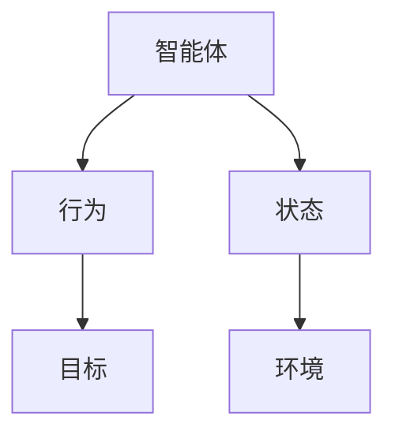
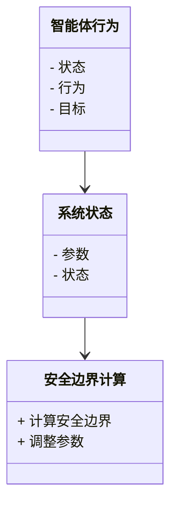
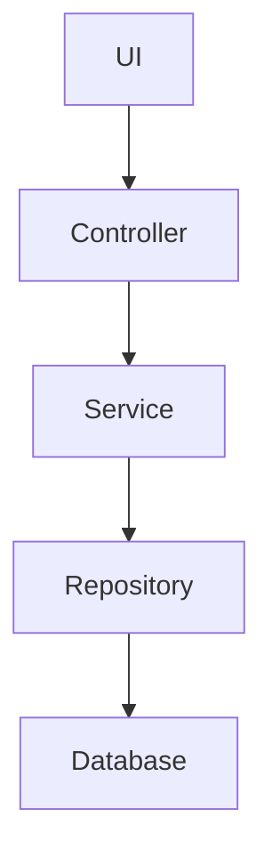
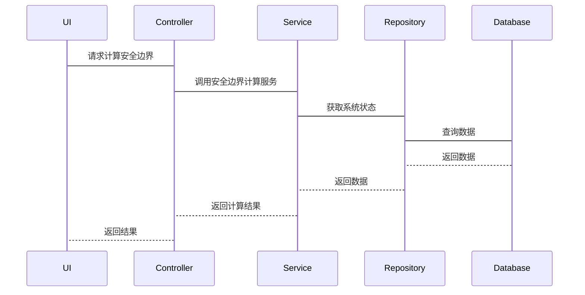

                 


# 基于多智能体的动态安全边际计算模型

> 关键词：多智能体系统、动态安全边际、安全计算、模型构建、算法优化

> 摘要：本文系统地介绍了一种基于多智能体的动态安全边际计算模型，详细阐述了模型的构建方法、核心算法、系统架构以及实际应用案例。文章从背景介绍、核心概念、算法原理、系统分析到项目实战，逐步展开，旨在为读者提供一个全面而深入的视角，理解该模型的设计思路和实现细节。通过本文，读者能够掌握该模型在实际场景中的应用价值和优化方法。

---

## 正文

### 第1章: 背景介绍

#### 1.1 多智能体系统概述
多智能体系统（Multi-Agent System, MAS）是由多个智能体组成的复杂系统，这些智能体能够自主决策、协作或竞争以完成特定任务。智能体具备感知环境、推理和自主行动的能力，能够通过交互实现系统的目标。

- **1.1.1 多智能体系统的定义**：多智能体系统由多个智能体组成，每个智能体都有自己的目标和行为，能够通过通信和协作完成复杂的任务。
- **1.1.2 多智能体系统的特性**：智能体之间的交互性、分布式决策、动态性和自主性是多智能体系统的主要特点。
- **1.1.3 多智能体系统的应用场景**：多智能体系统广泛应用于机器人协作、交通管理、分布式计算和智能城市等领域。

#### 1.2 动态安全边际计算的背景
动态安全边际计算是指在多智能体系统中，根据系统的实时状态和环境变化，动态调整安全边界，以确保系统的安全性和稳定性。

- **1.2.1 安全边际的定义**：安全边际是指系统在正常运行范围内能够承受的扰动或变化的极限。
- **1.2.2 动态安全边际的特性**：动态性、实时性和自适应性是动态安全边际计算的关键特性。
- **1.2.3 动态安全边际计算的必要性**：随着多智能体系统的复杂化，传统的静态安全边际计算已无法满足需求，动态计算能够适应系统的实时变化。

#### 1.3 问题背景与描述
在多智能体系统中，智能体之间的交互可能导致系统状态的不确定性和波动性，传统的静态安全边际计算无法有效应对这些变化，可能导致系统安全风险的增加。

- **1.3.1 当前多智能体系统中的安全挑战**：智能体之间的协作与竞争可能导致系统不稳定，外部干扰和内部故障可能引发系统崩溃。
- **1.3.2 动态安全边际计算的核心问题**：如何实时计算动态变化的安全边界，确保系统的安全性和稳定性。
- **1.3.3 问题的边界与外延**：动态安全边际计算不仅涉及系统的实时状态，还需要考虑外部环境和内部结构的变化。

#### 1.4 概念结构与核心要素
动态安全边际计算模型由多个核心要素构成，包括智能体行为、系统状态、环境变化和安全边界等。

- **1.4.1 模型的核心要素**：智能体行为、系统状态、环境变化和安全边界。
- **1.4.2 概念之间的关系**：智能体行为影响系统状态，系统状态和环境变化共同决定安全边界。
- **1.4.3 模型的结构化表示**：通过层次化结构展示各要素之间的关系。

### 第2章: 核心概念与联系

#### 2.1 核心概念原理
动态安全边际计算模型的核心原理基于多智能体系统的协作与竞争，通过实时计算系统状态的变化，动态调整安全边界。

- **2.1.1 多智能体系统的核心原理**：智能体通过通信和协作完成任务，系统状态由多个智能体的交互决定。
- **2.1.2 动态安全边际计算的数学模型**：通过数学模型描述系统的实时状态和安全边界的变化。
- **2.1.3 智能体之间的交互机制**：智能体通过消息传递、状态共享等方式进行协作和竞争。

#### 2.2 概念属性特征对比
通过对比分析，明确多智能体系统与传统单智能体系统的差异，以及动态安全边际与静态安全边际的区别。

- **2.2.1 多智能体系统与传统单智能体系统的对比**：
  | 特性         | 多智能体系统           | 单智能体系统           |
  |--------------|-----------------------|-----------------------|
  | 智能体数量   | 多个                   | 单个                   |
  | 交互方式     | 协作与竞争             | 无                     |
  | 系统复杂度   | 高                    | 低                    |
- **2.2.2 动态安全边际与静态安全边际的对比**：
  | 特性         | 动态安全边际           | 静态安全边际           |
  |--------------|-----------------------|-----------------------|
  | 计算方式     | 实时动态计算             | 静态计算               |
  | 灵活性       | 高                    | 低                    |
  | 适应性       | 强                    | 弱                    |
- **2.2.3 不同智能体模型的属性特征分析**：通过对比不同智能体模型的特征，明确动态安全边际计算的适用范围。

#### 2.3 ER实体关系图


### 第3章: 算法原理讲解

#### 3.1 算法概述
动态安全边际计算模型的核心算法基于多智能体系统的实时状态和环境变化，通过动态调整参数，计算系统的安全边界。

- **3.1.1 算法的基本思想**：通过实时感知系统状态和环境变化，动态调整安全边界。
- **3.1.2 算法的输入输出**：输入包括系统状态和环境参数，输出是动态调整后的安全边界。
- **3.1.3 算法的适用场景**：适用于复杂动态环境下的多智能体系统。

#### 3.2 算法流程图
```mermaid
graph TD
    Start --> Initialize parameters
    Initi --> Check system state
    Check system state --> Compute safety margin
    Compute safety margin --> Adjust parameters
    Adjust parameters --> Output new safety margin
    Output new safety margin --> End
```

#### 3.3 算法实现
通过Python代码实现算法，展示动态安全边际计算的核心步骤。

```python
def dynamic_safety_margin(system_state, environment_params):
    # 计算当前系统的安全边界
    safety_margin = system_state / environment_params
    return safety_margin

# 示例应用
system_state = 0.8
environment_params = 1.0
result = dynamic_safety_margin(system_state, environment_params)
print(result)
```

#### 3.4 算法数学模型
动态安全边际计算的数学模型如下：

$$
\text{安全边际} = \frac{\text{目标函数}}{\text{约束条件}}
$$

其中，目标函数表示系统希望达到的状态，约束条件表示系统必须满足的限制条件。

### 第4章: 系统分析与架构设计

#### 4.1 系统分析
动态安全边际计算模型的应用场景包括多智能体系统的实时监控和安全维护。

- **4.1.1 问题场景介绍**：系统中存在多个智能体，需要实时计算安全边界。
- **4.1.2 项目介绍**：介绍动态安全边际计算模型的开发背景和目标。

#### 4.2 系统功能设计
通过领域模型类图展示系统功能模块之间的关系。



#### 4.3 系统架构设计
展示系统的整体架构，包括各组件之间的交互。



#### 4.4 系统接口设计
通过交互序列图展示系统接口的交互流程。



### 第5章: 项目实战

#### 5.1 环境安装
安装所需的开发环境和工具，包括Python、NumPy、Matplotlib等。

```bash
pip install numpy matplotlib
```

#### 5.2 核心代码实现
实现动态安全边际计算的核心代码。

```python
import numpy as np
import matplotlib.pyplot as plt

def compute_safety_margin(system_state, environment_params):
    return system_state / environment_params

# 示例数据
system_state = np.random.uniform(0.5, 1.5, 100)
environment_params = np.random.uniform(0.8, 1.2, 100)
safety_margin = compute_safety_margin(system_state, environment_params)

plt.plot(safety_margin)
plt.xlabel('时间')
plt.ylabel('安全边际')
plt.show()
```

#### 5.3 实际案例分析
通过具体案例展示模型的应用效果，分析计算结果的意义和优化方向。

### 第6章: 最佳实践、小结与展望

#### 6.1 最佳实践 tips
- 定期更新模型参数，适应系统变化。
- 优化算法性能，提高计算效率。
- 加强系统监控，及时发现异常。

#### 6.2 小结
本文系统地介绍了基于多智能体的动态安全边际计算模型，详细阐述了模型的构建方法、核心算法、系统架构以及实际应用案例。通过本文的学习，读者能够掌握该模型的设计思路和实现细节。

#### 6.3 注意事项
- 模型的应用需要结合具体场景，避免一刀切。
- 算法的优化需要考虑系统的实时性和计算效率。
- 系统的安全性需要通过多方面的测试和验证。

#### 6.4 拓展阅读
推荐进一步阅读多智能体系统的相关文献，深入了解动态安全边际计算的最新研究成果。

### 作者
作者：AI天才研究院 & 禅与计算机程序设计艺术

---

通过以上结构，本文为读者提供了一个全面而深入的视角，理解基于多智能体的动态安全边际计算模型的设计思路和实现细节。

