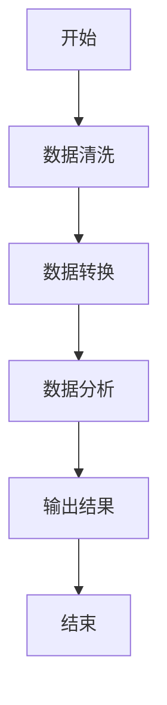
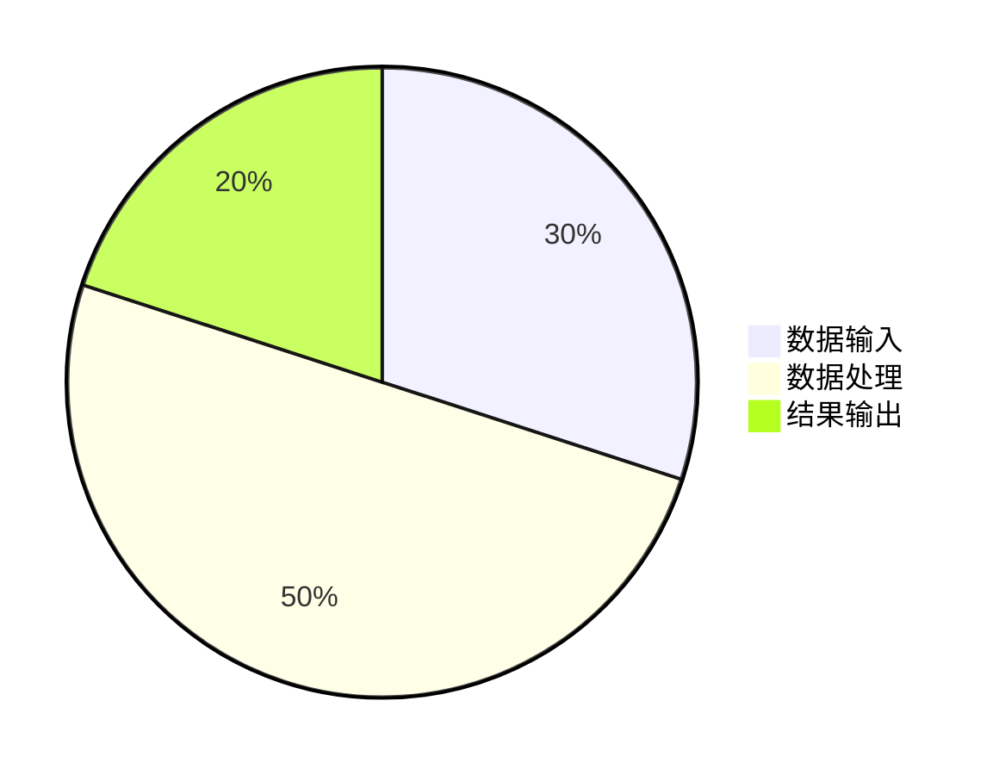
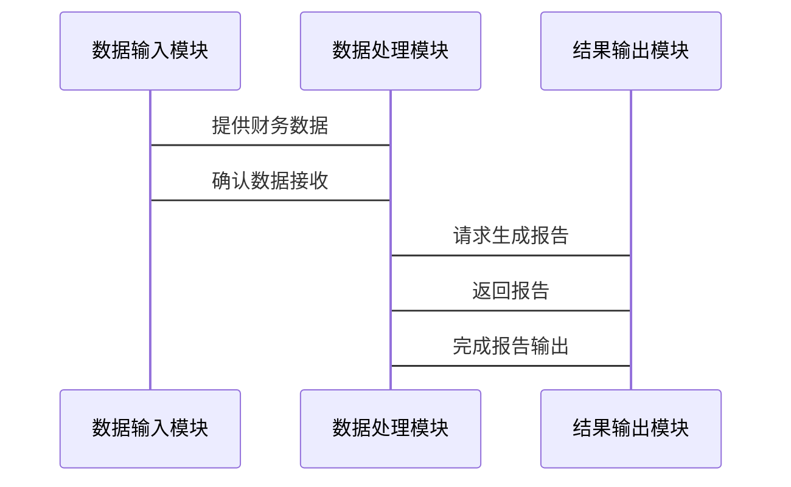

                 


# 基于多智能体的自动化财务报表比较分析系统

## 关键词：多智能体系统，财务报表比较分析，自动化分析，人工智能，协作算法，系统架构

## 摘要：  
本文探讨了基于多智能体的自动化财务报表比较分析系统的设计与实现。通过结合多智能体系统的协作机制与财务数据处理的需求，提出了一种高效的财务报表自动化分析方法。文章从背景、理论基础、系统架构、算法实现等多个维度进行详细分析，展示了多智能体系统在财务数据处理中的独特优势和实际应用价值。

---

## 第一部分: 基于多智能体的自动化财务报表比较分析系统概述

### 第1章: 财务报表比较分析的背景与意义

#### 1.1 财务报表比较分析的基本概念
财务报表比较分析是通过对不同时间段、不同企业或同一企业的财务数据进行对比，揭示企业财务状况的变化趋势和潜在问题。传统的财务报表分析依赖人工操作，效率低且容易出错。随着人工智能技术的发展，自动化财务分析成为趋势。

#### 1.2 多智能体系统的基本概念
多智能体系统（Multi-Agent System, MAS）是由多个相互作用的智能体组成的系统，每个智能体具有一定的自主性、协作性和学习能力。多智能体系统在分布式问题求解、任务分配和复杂环境下的协作中表现出色。

#### 1.3 本章小结
财务报表比较分析的自动化需求与多智能体系统的协作能力相契合。通过引入多智能体系统，可以实现财务数据的高效处理和智能分析，提升财务分析的准确性和效率。

---

## 第二部分: 多智能体系统的理论基础与核心概念

### 第2章: 多智能体系统的原理与架构

#### 2.1 多智能体系统的原理
- **智能体定义**：智能体是具有感知、决策和执行能力的实体。
- **协作机制**：智能体之间通过通信协议交换信息，协同完成任务。
- **任务分配**：基于智能体的能力和当前状态，动态分配任务。

#### 2.2 多智能体系统的协作机制
- **通信协议**：定义智能体之间的信息交换规则。
- **任务分配算法**：如基于角色的分配和基于优先级的分配。
- **冲突解决**：通过协商或仲裁机制解决任务冲突。

#### 2.3 多智能体系统的性能评估
- **系统效率**：完成任务的速度和资源利用率。
- **可扩展性**：系统是否能适应智能体数量的增加。
- **容错性**：系统在部分智能体故障时的鲁棒性。

#### 2.4 本章小结
多智能体系统的协作机制和性能评估为自动化财务报表分析提供了理论基础。通过合理的任务分配和协作，可以确保系统的高效性和稳定性。

---

## 第三部分: 多智能体系统在财务报表分析中的应用

### 第3章: 多智能体系统在财务数据处理中的应用

#### 3.1 财务数据处理的核心问题
- 数据清洗：处理缺失值和异常值。
- 数据转换：将不同格式的数据统一化。
- 数据分析：通过对比分析发现趋势和异常。

#### 3.2 多智能体系统在财务数据处理中的角色分配
- 数据清洗智能体：负责处理脏数据。
- 数据转换智能体：统一数据格式。
- 数据分析智能体：执行对比分析。

#### 3.3 本章小结
通过多智能体系统的分工协作，可以实现财务数据处理的自动化，提升数据处理效率和准确性。

---

### 第4章: 基于多智能体的财务报表比较分析算法

#### 4.1 算法原理
- **输入**：多份财务报表数据。
- **输出**：财务状况的对比分析结果。
- **核心步骤**：数据清洗、数据转换、对比分析、结果输出。

#### 4.2 算法实现
```python
class Agent:
    def __init__(self, role):
        self.role = role
        self.data = None

    def receive_data(self, data):
        self.data = data

    def process_data(self):
        pass

# 数据清洗智能体
class DataCleaningAgent(Agent):
    def process_data(self):
        cleaned_data = self.data.dropna().replace({pd.NA: None})
        return cleaned_data

# 数据转换智能体
class DataConversionAgent(Agent):
    def process_data(self):
        converted_data = self.data.apply(lambda x: x.upper())
        return converted_data

# 数据分析智能体
class DataAnalysisAgent(Agent):
    def process_data(self):
        comparison_result = self.data.compare(self.previous_data)
        return comparison_result
```

#### 4.3 算法流程图


#### 4.4 本章小结
通过多智能体系统的协作，算法能够高效完成财务数据的处理和分析，为后续的比较分析奠定基础。

---

### 第5章: 多智能体系统的架构设计

#### 5.1 系统功能模块
- 数据输入模块：接收财务报表数据。
- 数据处理模块：包括清洗、转换和分析。
- 结果输出模块：生成对比分析报告。

#### 5.2 系统架构图


#### 5.3 系统交互图


#### 5.4 本章小结
系统的架构设计确保了各模块之间的高效协作，为自动化财务报表分析提供了可靠的架构支持。

---

### 第6章: 项目实战

#### 6.1 环境安装
- Python 3.8+
- Pandas、NumPy、Matplotlib
- Scikit-learn

#### 6.2 核心代码实现
```python
import pandas as pd

class Agent:
    def __init__(self, role):
        self.role = role
        self.data = None

    def receive_data(self, data):
        self.data = data

    def process_data(self):
        pass

class DataCleaningAgent(Agent):
    def process_data(self):
        if self.data is not None:
            cleaned_data = self.data.dropna().replace({pd.NA: None})
            return cleaned_data
        return None

class DataConversionAgent(Agent):
    def process_data(self):
        if self.data is not None:
            converted_data = self.data.apply(lambda x: str(x).upper())
            return converted_data
        return None

class DataAnalysisAgent(Agent):
    def process_data(self):
        if self.data is not None:
            previous_data = self.previous_data
            comparison_result = self.data.compare(previous_data)
            return comparison_result
        return None

# 示例代码
cleaning_agent = DataCleaningAgent("Cleaner")
conversion_agent = DataConversionAgent("Converter")
analysis_agent = DataAnalysisAgent("Analyzer")

# 数据输入
data = pd.DataFrame({
    'Revenue': [100, 200, 300],
    'Profit': [50, -10, 150]
})

cleaning_agent.receive_data(data)
cleaned_data = cleaning_agent.process_data()

conversion_agent.receive_data(cleaned_data)
converted_data = conversion_agent.process_data()

analysis_agent.receive_data(converted_data)
analysis_agent.previous_data = pd.DataFrame({
    'Revenue': [80, 180, 280],
    'Profit': [40, -5, 140]
})

comparison_result = analysis_agent.process_data()
print(comparison_result)
```

#### 6.3 实际案例分析
- 数据清洗：处理缺失值和异常值。
- 数据转换：统一数据格式。
- 数据分析：生成对比分析报告。

#### 6.4 本章小结
通过项目实战，验证了多智能体系统在自动化财务报表分析中的有效性，展示了系统的实际应用价值。

---

## 第四部分: 扩展与总结

### 第7章: 系统的扩展与优化

#### 7.1 系统扩展
- 引入机器学习算法，提升数据分析的准确性。
- 增加实时监控功能，实现动态分析。

#### 7.2 系统优化
- 优化通信协议，降低系统延迟。
- 提高智能体的协作效率，减少资源消耗。

#### 7.3 本章小结
通过对系统的扩展与优化，可以进一步提升多智能体系统的性能和应用范围。

---

## 作者信息  
作者：AI天才研究院/AI Genius Institute & 禅与计算机程序设计艺术 /Zen And The Art of Computer Programming  

---

以上是《基于多智能体的自动化财务报表比较分析系统》的技术博客文章的完整目录和内容概要。

