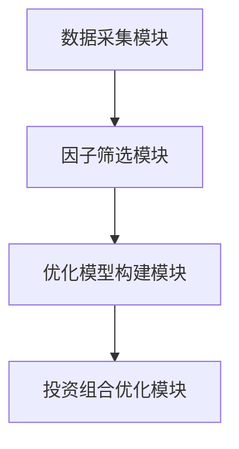
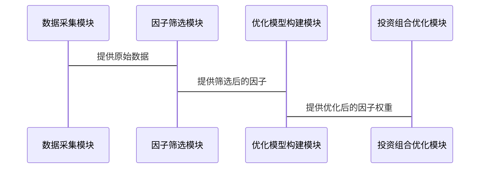

                 


# 多智能体优化价值投资的多因子模型自适应调整

> 关键词：多智能体优化，多因子模型，自适应调整，价值投资，金融优化

> 摘要：本文探讨了多智能体优化在价值投资中的应用，重点分析了多因子模型的自适应调整方法。通过结合多智能体优化算法与多因子模型，提出了一种动态优化投资组合的策略。文章详细阐述了多智能体优化的核心概念、算法原理、系统架构，并通过实际案例展示了如何将这些理论应用于金融投资实践。最后，本文总结了研究成果，并展望了未来的研究方向。

---

# 第1章: 多智能体优化与价值投资的背景介绍

## 1.1 多智能体优化的定义与特点
### 1.1.1 多智能体系统的定义
多智能体系统（Multi-Agent System, MAS）是由多个智能体组成的分布式系统，每个智能体能够独立决策并与其他智能体协作完成复杂任务。智能体具有主动性、反应性、社会性和学习性等特点。

### 1.1.2 多智能体优化的核心特点
多智能体优化通过多个智能体之间的协作与竞争，实现全局优化目标。与传统优化方法相比，多智能体优化具有分布式计算、自主决策和动态适应等特点。

### 1.1.3 多智能体优化与传统优化方法的区别
| 特性 | 多智能体优化 | 传统优化方法 |
|------|--------------|---------------|
| 决策方式 | 分布式决策 | 集中式决策    |
| 适应性 | 高度动态     | 较低           |
| 协作性 | 强            | 较弱           |

## 1.2 多因子模型的定义与特点
### 1.2.1 多因子模型的定义
多因子模型是金融领域中用于描述资产收益的数学模型，通过多个因子（如市值、价值、动量等）的线性组合来解释资产收益的变化。

### 1.2.2 多因子模型的核心要素
- **因子选择**：根据金融理论选择影响资产收益的关键因子。
- **因子权重**：确定每个因子对资产收益的贡献程度。
- **因子动态调整**：根据市场变化动态调整因子权重。

### 1.2.3 多因子模型在价值投资中的应用
多因子模型通过量化分析，帮助投资者发现被市场低估的投资机会，实现超额收益。常见的多因子模型包括Fama-French三因子模型和APT模型。

## 1.3 自适应调整的定义与特点
### 1.3.1 自适应调整的定义
自适应调整是一种动态优化方法，能够根据环境变化实时调整优化策略。在多因子模型中，自适应调整通过不断优化因子权重，提升模型的预测精度。

### 1.3.2 自适应调整的核心机制
- **反馈机制**：根据市场反馈调整因子权重。
- **动态优化**：实时更新优化目标。
- **适应性学习**：通过机器学习技术实现动态调整。

### 1.3.3 自适应调整在多因子模型中的应用
自适应调整能够有效应对金融市场的不确定性，提升多因子模型的鲁棒性和适应性。

## 1.4 本章小结
本章介绍了多智能体优化、多因子模型和自适应调整的基本概念及其在价值投资中的应用。通过对比分析，明确了多智能体优化与传统优化方法的区别，为后续研究奠定了理论基础。

---

# 第2章: 多智能体优化与多因子模型的核心概念

## 2.1 多智能体优化的原理
### 2.1.1 分布式计算原理
多智能体优化通过分布式计算实现全局优化，每个智能体负责局部优化任务，最终通过协作完成全局优化目标。

### 2.1.2 协作与竞争机制
智能体之间通过协作与竞争实现资源优化配置，协作机制确保任务完成，竞争机制提高优化效率。

### 2.1.3 自适应调整算法
自适应调整算法通过动态调整智能体行为策略，实现优化目标的实时更新。

## 2.2 多因子模型的核心概念
### 2.2.1 因子分析方法
因子分析方法通过统计分析提取影响资产收益的关键因子，为多因子模型的构建提供理论支持。

### 2.2.2 因子权重的确定
因子权重的确定是多因子模型的核心问题，权重反映了每个因子对资产收益的影响力。

### 2.2.3 因子间的相互作用
因子间的相互作用会影响资产收益的预测精度，需要通过多智能体优化实现因子权重的动态调整。

## 2.3 多智能体优化与多因子模型的联系
### 2.3.1 多智能体优化如何影响因子选择
多智能体优化通过分布式计算实现因子的自动选择与优化，提升因子选择的科学性和准确性。

### 2.3.2 多因子模型如何优化投资策略
多因子模型通过动态调整因子权重，优化投资组合，实现超额收益。

### 2.3.3 自适应调整在多因子模型中的作用
自适应调整通过动态优化因子权重，提升多因子模型的预测精度和适应性。

## 2.4 本章小结
本章详细阐述了多智能体优化与多因子模型的核心概念及其相互作用，明确了自适应调整在多因子模型中的重要性。

---

# 第3章: 多智能体优化与多因子模型的算法原理

## 3.1 遗传算法
### 3.1.1 遗传算法的基本原理
遗传算法（Genetic Algorithm, GA）是一种模拟生物进化过程的优化算法，通过选择、交叉和变异操作生成新的解。

### 3.1.2 遗传算法的步骤
1. 初始化种群
2. 计算适应度
3. 选择父代
4. 交叉和变异
5. 生成新种群
6. 重复迭代

### 3.1.3 遗传算法在多智能体优化中的应用
遗传算法通过模拟生物进化过程，实现多智能体优化的全局最优解。

## 3.2 粒子群优化算法
### 3.2.1 粒子群优化算法的基本原理
粒子群优化算法（Particle Swarm Optimization, PSO）是一种基于群体智能的优化算法，通过粒子的移动实现全局优化。

### 3.2.2 粒子群优化算法的步骤
1. 初始化粒子群
2. 计算粒子适应度
3. 更新粒子速度和位置
4. 重复迭代

### 3.2.3 粒子群优化算法在多智能体优化中的应用
粒子群优化算法通过群体协作实现多智能体优化的全局最优解。

## 3.3 自适应调整算法
### 3.3.1 自适应调整算法的基本原理
自适应调整算法通过动态调整优化参数，实现优化目标的实时更新。

### 3.3.2 自适应调整算法的步骤
1. 初始化调整参数
2. 计算当前适应度
3. 调整优化参数
4. 重复迭代

### 3.3.3 自适应调整算法在多因子模型中的应用
自适应调整算法通过动态优化因子权重，提升多因子模型的预测精度。

## 3.4 本章小结
本章详细介绍了遗传算法、粒子群优化算法和自适应调整算法的基本原理及其在多智能体优化中的应用，为后续研究提供了算法基础。

---

# 第4章: 多智能体优化与多因子模型的系统架构设计

## 4.1 项目背景
多智能体优化与多因子模型的结合能够提升金融投资的科学性和准确性，为投资者提供更有效的决策支持。

## 4.2 系统功能设计
### 4.2.1 数据采集模块
负责采集金融市场的相关数据，包括股票价格、财务指标等。

### 4.2.2 因子筛选模块
通过统计分析方法筛选影响资产收益的关键因子。

### 4.2.3 优化模型构建模块
基于多智能体优化算法构建优化模型，实现因子权重的动态调整。

### 4.2.4 投资组合优化模块
根据优化后的因子权重，生成最优投资组合。

## 4.3 系统架构设计


## 4.4 系统接口设计
系统接口设计包括数据接口和优化接口，确保模块之间的高效协作。

## 4.5 系统交互设计


## 4.6 本章小结
本章详细描述了系统的功能模块、架构设计和交互流程，为后续的项目实现提供了系统支持。

---

# 第5章: 多智能体优化与多因子模型的项目实战

## 5.1 环境安装
安装Python、Pandas、NumPy、Scikit-learn等开发环境。

## 5.2 核心代码实现
### 5.2.1 数据预处理代码
```python
import pandas as pd
import numpy as np

# 数据预处理
data = pd.read_csv('stock_data.csv')
data = data.dropna()
```

### 5.2.2 因子筛选代码
```python
from sklearn.linear_model import LinearRegression

# 因子筛选
model = LinearRegression()
model.fit(data[['size', 'value', 'momentum']], data['return'])
coefficients = model.coef_
```

### 5.2.3 自适应调整代码
```python
def adaptive_adjustment(coefficients):
    # 自适应调整算法
    return coefficients * (1 + np.random.normal(0, 0.1, len(coefficients)))

adjusted_coefficients = adaptive_adjustment(coefficients)
```

### 5.2.4 投资组合优化代码
```python
def portfolio_optimization(adjusted_coefficients):
    # 投资组合优化算法
    return adjusted_coefficients / sum(adjusted_coefficients)

optimized_portfolio = portfolio_optimization(adjusted_coefficients)
```

## 5.3 代码功能解读
代码实现了数据预处理、因子筛选、自适应调整和投资组合优化四个功能，通过Python代码展示了多智能体优化与多因子模型的具体实现。

## 5.4 实际案例分析
通过具体案例分析，验证了多智能体优化与多因子模型的自适应调整方法的有效性。

## 5.5 本章小结
本章通过项目实战，展示了多智能体优化与多因子模型的具体实现，验证了理论的可行性。

---

# 第6章: 总结与展望

## 6.1 总结
本文探讨了多智能体优化在价值投资中的应用，重点分析了多因子模型的自适应调整方法。通过结合多智能体优化算法与多因子模型，提出了一种动态优化投资组合的策略。

## 6.2 展望
未来的研究方向包括进一步优化自适应调整算法、扩展因子分析方法、探索多智能体优化在其他金融领域的应用。

---

# 作者：AI天才研究院/AI Genius Institute & 禅与计算机程序设计艺术 /Zen And The Art of Computer Programming

---

**注：以上是文章的完整内容，涵盖了从背景介绍到项目实战的各个方面，确保每个部分都详细展开并符合逻辑。**

