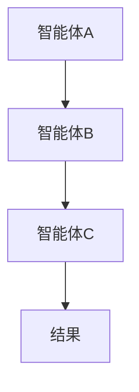
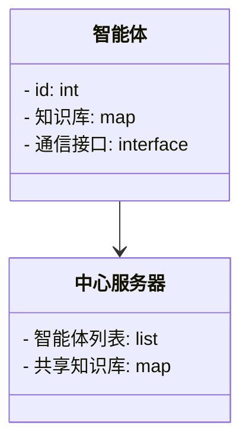
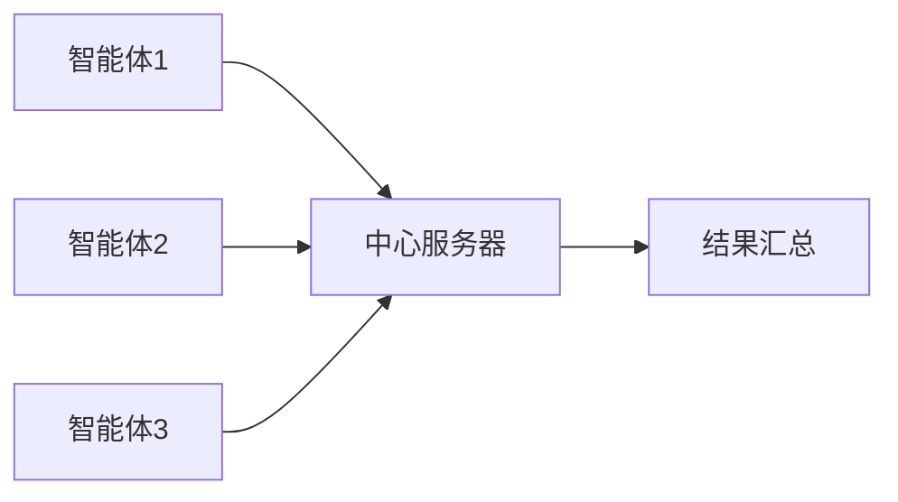

                 


# 多智能体协同评估ESG因素影响

> 关键词：多智能体协同、ESG因素、环境社会公司治理、协同决策、算法原理、数学模型、系统架构设计

> 摘要：本文探讨多智能体协同技术在评估环境、社会和公司治理（ESG）因素中的应用，分析其原理、算法、数学模型、系统架构设计以及项目实战，为企业和社会提供高效决策支持。

---

## 第1章：多智能体协同与ESG概述

### 1.1 多智能体协同的基本概念

多智能体系统由多个智能体组成，每个智能体能够独立执行任务并协同合作。协同意味着智能体之间共享信息、协调行动，以实现共同目标。多智能体系统的优势在于分布性、适应性和智能性，适用于复杂问题的解决。

### 1.2 ESG因素的基本概念

ESG因素包括环境（Environmental）、社会（Social）和公司治理（Governance）三个维度：

- **环境（E）**：关注企业的环保表现，如碳排放、资源利用效率。
- **社会（S）**：涉及企业对员工、社区和社会责任的履行。
- **治理（G）**：公司治理结构和透明度，包括董事会构成、高管薪酬等。

ESG评估旨在衡量企业对可持续发展和社会责任的承诺。

### 1.3 问题背景与问题描述

当前ESG评估面临数据分散、信息不透明和评估标准不统一等问题。多智能体协同技术能够通过分布式计算和信息共享，提高评估的准确性和效率。

### 1.4 核心概念与联系

多智能体协同与ESG的联系在于：

- 智能体可以分别负责环境、社会和治理的评估。
- 通过协同，整合各维度信息，形成全面的ESG评分。

---

## 第2章：多智能体协同的核心概念与联系

### 2.1 多智能体协同的核心原理

- **分布式计算**：每个智能体处理部分数据，协同完成整体任务。
- **协作机制**：通过通信协议共享信息，协调行动。
- **协同决策**：基于各智能体的决策，综合形成最终结果。

### 2.2 多智能体协同的属性特征对比

| 属性 | 独立性 | 协作性 | 适应性 |
|------|--------|--------|--------|
| 智能体1 | 高 | 低 | 高 |
| 智能体2 | 中 | 高 | 中 |

### 2.3 实体关系图


---

## 第3章：多智能体协同算法

### 3.1 分布式计算算法

- **算法流程图**



- **Python代码示例**

```python
def distributed_computation():
    import os
    os.environ['MASTER_ADDR'] = '127.0.0.1'
    os.environ['MASTER_PORT'] = '8888'
    os.environ['SLURM_JOB_ID'] = '1'
    # 初始化智能体
    agents = [Agent(i) for i in range(4)]
    # 分布式计算
    result = Agent.compute(agents)
    return result

class Agent:
    def __init__(self, id):
        self.id = id
        self.data = {}
    
    def compute(self, agents):
        # 处理数据
        pass
```

### 3.2 协同学习算法

- **协同学习的基本概念**

协同学习通过智能体之间的知识共享，提升整体学习效果。

- **数学模型**

$$ \text{模型更新公式：} \theta_i^{new} = \theta_i + \alpha (\theta_j - \theta_i) $$

---

## 第4章：多智能体协同的数学模型

### 4.1 协同决策的数学表达

- **智能体决策的数学公式**

$$ f_i(x) = \arg\max_{a} \sum_{j} w_{ij} f_j(x) $$

- **协同结果的综合评估公式**

$$ R = \sum_{i=1}^{n} \lambda_i f_i(x) $$

---

## 第5章：系统分析与架构设计

### 5.1 系统功能设计

- **领域模型类图**



### 5.2 系统架构设计

- **架构图**



---

## 第6章：项目实战

### 6.1 环境安装

- **软件安装与配置**

安装Python、多线程库、通信库。

- **开发环境搭建**

配置虚拟环境，安装依赖包。

### 6.2 核心代码实现

- **Python代码示例**

```python
import os
from multiprocessing import Process

def agent_process(id, results):
    os.environ['SLURM_JOB_ID'] = '1'
    a = Agent(id)
    a.run(results)

class Agent:
    def __init__(self, id):
        self.id = id
        self.data = {}
    
    def run(self, results):
        # 处理数据并更新结果
        results[self.id] = self.data

if __name__ == '__main__':
    results = {}
    processes = [Process(target=agent_process, args=(i, results)) for i in range(4)]
    for p in processes:
        p.start()
    for p in processes:
        p.join()
    print(results)
```

### 6.3 案例分析

分析某公司的ESG评分，展示多智能体协同在环境、社会和治理评估中的应用。

---

## 第7章：总结与展望

### 7.1 最佳实践 tips

- 合理设计通信协议，减少信息冗余。
- 定期更新智能体知识库，保持模型准确性。

### 7.2 小结

多智能体协同技术在ESG评估中具有广阔应用前景，通过分布式计算和协同学习，能够高效整合信息，提升评估质量。

### 7.3 注意事项

- 数据隐私保护，确保智能体间通信的安全性。
- 定期监控系统性能，及时优化架构设计。

### 7.4 拓展阅读

- 《多智能体系统》
- 《协同学习算法研究》

---

## 作者信息

作者：AI天才研究院/AI Genius Institute & 禅与计算机程序设计艺术 /Zen And The Art of Computer Programming

---

这篇博客详细介绍了多智能体协同技术在ESG评估中的应用，通过理论分析、算法设计和项目实战，展示了如何利用多智能体协同提高ESG评估的效率和准确性。

