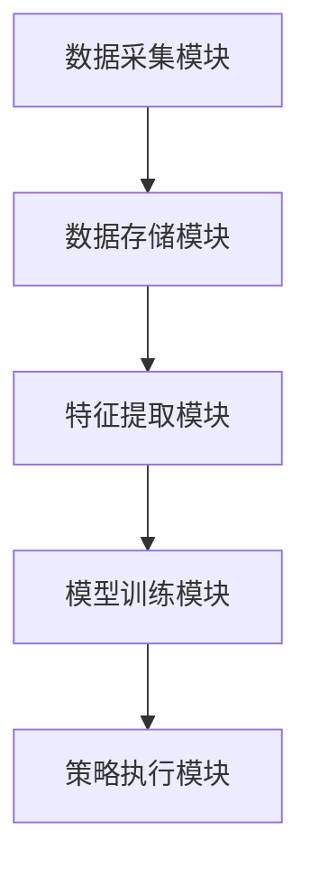
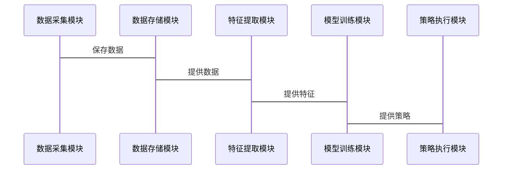

                 


```markdown
# 多智能体强化学习在股票市场价值发现中的应用

> 关键词：多智能体强化学习，股票市场，价值发现，算法，系统设计

> 摘要：本文探讨了多智能体强化学习在股票市场价值发现中的应用，通过分析多智能体系统的核心概念、强化学习算法、系统设计、项目实战等多方面，揭示了多智能体强化学习在金融领域的潜力与实际应用价值。

---

## 第一部分: 多智能体强化学习与股票市场价值发现概述

### 第1章: 多智能体强化学习与股票市场概述

#### 1.1 多智能体强化学习的基本概念

##### 1.1.1 多智能体系统的基本定义
多智能体系统（Multi-Agent System, MAS）是由多个相互作用的智能体组成的系统，这些智能体通过协作或竞争完成特定任务。智能体具备自主性、反应性、社会性和学习能力。

##### 1.1.2 强化学习的基本原理
强化学习（Reinforcement Learning, RL）是一种机器学习方法，通过智能体与环境交互，学习最优策略。智能体通过试错，根据环境反馈的奖励或惩罚，调整行为以最大化累计奖励。

##### 1.1.3 多智能体强化学习的独特优势
多智能体强化学习结合了MAS和RL的优势，通过多个智能体协作，能够处理更复杂的任务，如分布式决策和全局优化。

#### 1.2 股票市场与价值发现的基本概念

##### 1.2.1 股票市场的基本运作机制
股票市场是金融资产交易的场所，参与者包括投资者、经纪人、上市公司等。股票价格受多种因素影响，如公司业绩、市场情绪、经济指标等。

##### 1.2.2 股票价值发现的核心问题
股票价值发现是指通过分析公司基本面、市场趋势等因素，判断股票的内在价值。传统方法包括财务指标分析、技术分析等，但存在主观性和滞后性。

##### 1.2.3 传统股票价值发现方法的局限性
传统方法依赖经验判断，难以应对复杂多变的市场环境，且容易受情绪影响，导致决策失误。

#### 1.3 多智能体强化学习在股票市场中的应用前景

##### 1.3.1 多智能体强化学习在金融领域的潜力
多智能体强化学习能够模拟市场参与者的行为，帮助理解市场动态，优化投资策略。

##### 1.3.2 股票市场价值发现的智能化趋势
随着人工智能技术的发展，利用多智能体强化学习实现智能化价值发现成为可能。

##### 1.3.3 多智能体强化学习的应用场景
多智能体强化学习可以应用于股票交易、风险控制、投资组合管理等领域。

---

### 第2章: 多智能体强化学习的核心概念与联系

#### 2.1 多智能体系统的核心原理

##### 2.1.1 多智能体系统的组成与交互
多智能体系统由多个智能体组成，智能体之间通过通信模块进行信息交换，协作完成任务。

##### 2.1.2 多智能体系统中的通信与协作
智能体之间可以通过共享状态、动作或奖励进行协作，提升整体系统的决策能力。

##### 2.1.3 多智能体系统的决策机制
每个智能体独立决策，但需要考虑其他智能体的动作，以实现全局最优。

#### 2.2 强化学习的算法原理

##### 2.2.1 Q-learning算法
Q-learning是一种经典的强化学习算法，通过更新Q值表，学习最优策略。

##### 2.2.2 Deep Q-Networks (DQN)算法
DQN通过深度神经网络近似Q值函数，解决高维状态空间的问题。

##### 2.2.3 多智能体强化学习的挑战与解决方案
多智能体强化学习面临通信开销、策略同步等问题，解决方案包括中心化学习、分布式学习等。

#### 2.3 多智能体强化学习与股票市场价值发现的关联

##### 2.3.1 多智能体系统在股票市场中的角色
智能体可以模拟投资者行为，分析市场动态，提供投资建议。

##### 2.3.2 强化学习在股票交易中的应用
强化学习可以用于自动交易策略的优化，提升交易收益。

##### 2.3.3 多智能体强化学习如何帮助发现股票价值
通过模拟多个投资者的行为，多智能体强化学习能够发现潜在的市场机会，帮助判断股票价值。

---

### 第3章: 多智能体强化学习的数学模型与算法

#### 3.1 多智能体强化学习的基本模型

##### 3.1.1 马尔可夫决策过程（MDP）
MDP描述智能体在环境中的决策过程，包括状态、动作、转移概率和奖励函数。

##### 3.1.2 多智能体马尔可夫决策过程（Multi-Agent MDP）
多智能体MDP扩展了单智能体MDP，考虑多个智能体的协作与竞争。

##### 3.1.3 多智能体系统中的状态、动作与奖励
每个智能体维护自己的状态和动作，全局奖励或个体奖励用于指导学习。

#### 3.2 多智能体强化学习的数学公式

##### 3.2.1 单智能体强化学习的数学模型
$$ Q(s, a) = r + \gamma \max_{a'} Q(s', a') $$
其中，$s$是状态，$a$是动作，$r$是奖励，$\gamma$是折扣因子。

##### 3.2.2 多智能体强化学习的数学扩展
$$ J_i = \sum_{t=0}^\infty \gamma^t r_i(s_t, a_t) $$
每个智能体的目标函数$J_i$考虑了个体贡献。

##### 3.2.3 联合动作与联合奖励的数学表达
$$ R = \sum_{i=1}^N r_i $$
联合奖励是各智能体奖励的总和。

#### 3.3 多智能体强化学习的算法实现

##### 3.3.1 基于DQN的多智能体算法
使用深度神经网络近似Q值函数，每个智能体独立学习。

##### 3.3.2 基于策略梯度的多智能体算法
采用策略梯度方法，优化每个智能体的策略函数。

##### 3.3.3 基于价值函数的多智能体算法
通过价值函数评估状态的价值，指导智能体决策。

---

### 第4章: 股票市场价值发现的系统分析与架构设计

#### 4.1 问题场景介绍

##### 4.1.1 股票市场数据的特点
股票数据具有高维性、时序性、非线性等特点，适合使用深度学习进行分析。

##### 4.1.2 股票价值发现的核心问题
如何利用历史数据和市场信息，准确预测股票价格，发现其潜在价值。

##### 4.1.3 多智能体强化学习的应用目标
通过模拟市场参与者的行为，优化投资策略，提高收益。

#### 4.2 系统功能设计

##### 4.2.1 数据采集模块
负责收集股票价格、成交量、市场情绪等数据。

##### 4.2.2 特征提取模块
从原始数据中提取有用的特征，如技术指标、财务指标等。

##### 4.2.3 模型训练模块
利用多智能体强化学习算法，训练交易策略模型。

##### 4.2.4 策略执行模块
根据训练好的模型，执行实际交易。

#### 4.3 系统架构设计

##### 4.3.1 系统架构图


##### 4.3.2 系统交互图


---

### 第5章: 项目实战

#### 5.1 环境安装

##### 5.1.1 安装Python环境
使用Anaconda或Miniconda安装Python 3.8及以上版本。

##### 5.1.2 安装依赖库
安装PyTorch、numpy、pandas、scikit-learn等库。

#### 5.2 核心代码实现

##### 5.2.1 数据预处理代码
```python
import pandas as pd
import numpy as np

def preprocess_data(data):
    # 数据清洗和特征提取
    data = data.dropna()
    features = data[['open', 'high', 'low', 'volume']]
    labels = data['close']
    return features, labels
```

##### 5.2.2 模型训练代码
```python
import torch
import torch.nn as nn
import torch.optim as optim

class DQN(nn.Module):
    def __init__(self, input_dim, output_dim):
        super(DQN, self).__init__()
        self.fc1 = nn.Linear(input_dim, 64)
        self.fc2 = nn.Linear(64, output_dim)
    
    def forward(self, x):
        x = torch.relu(self.fc1(x))
        x = self.fc2(x)
        return x

def train_model(features, labels, model, optimizer, criterion):
    for X, y in zip(features, labels):
        output = model(X)
        loss = criterion(output, y)
        loss.backward()
        optimizer.step()
        optimizer.zero_grad()
```

##### 5.2.3 策略执行代码
```python
def execute_strategy(model, data):
    for i in range(len(data)):
        X = data[i]
        with torch.no_grad():
            output = model(X)
        action = torch.argmax(output).item()
        # 执行交易策略
```

#### 5.3 实际案例分析

##### 5.3.1 数据来源
使用某股票的历史数据进行分析。

##### 5.3.2 模型训练结果
展示训练过程中的损失曲线和准确率变化。

##### 5.3.3 交易策略表现
分析模型在测试数据上的表现，包括收益、回撤、夏普比率等指标。

---

### 第6章: 总结与展望

#### 6.1 全文总结
多智能体强化学习为股票市场价值发现提供了新的思路，通过模拟市场行为，优化投资策略。

#### 6.2 当前研究的不足
现有研究主要集中在理论层面，实际应用中仍面临数据质量、模型泛化能力等问题。

#### 6.3 未来研究方向
未来可以研究多智能体强化学习在多资产配置、风险对冲等领域的应用。

#### 6.4 最佳实践Tips
- 数据预处理是关键，确保数据质量和完整性。
- 模型调参需要耐心，尝试不同的网络结构和优化策略。
- 实际应用中，需结合市场专家知识，优化交易策略。

---

## 第七章: 作者简介

作者：AI天才研究院/AI Genius Institute & 禅与计算机程序设计艺术 /Zen And The Art of Computer Programming

---

通过以上结构和内容，本文系统地介绍了多智能体强化学习在股票市场价值发现中的应用，从理论到实践，全面阐述了相关技术和方法。希望对读者在这一领域的研究和实践提供有价值的参考。
```

