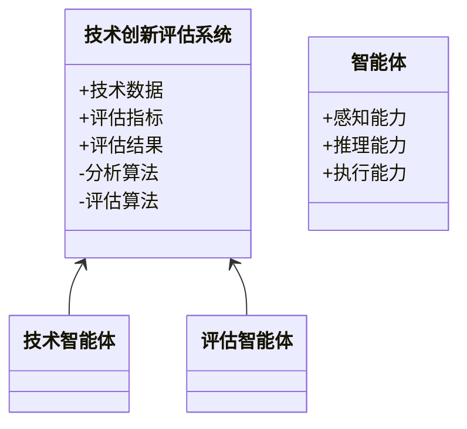
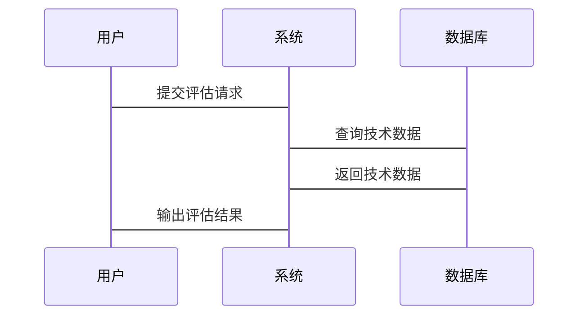

                 


# 多智能体系统在公司技术创新评估中的应用

---

## 关键词：多智能体系统, 技术创新评估, 分布式计算, 协商算法, 系统架构设计

---

## 摘要：  
多智能体系统（Multi-Agent System, MAS）是一种由多个智能体组成的分布式系统，能够协同完成复杂任务。本文探讨了多智能体系统在公司技术创新评估中的应用，分析了其核心概念、算法原理、系统架构，并通过实际案例展示了其在技术创新评估中的优势。文章还详细介绍了项目实战和最佳实践，为读者提供全面的技术指导。

---

## 第一章：多智能体系统与技术创新评估的背景

### 1.1 多智能体系统的基本概念  
多智能体系统（MAS）是由多个智能体组成的分布式系统，智能体是具有感知、推理、决策和执行能力的实体。MAS的特点包括分布式性、协作性、自主性和反应性。  

#### 1.1.1 多智能体系统的定义  
多智能体系统是由多个智能体组成的分布式系统，这些智能体通过通信和协作完成共同目标。  

#### 1.1.2 多智能体系统的特征  
- **分布式性**：智能体分布在不同的位置，独立运行。  
- **协作性**：智能体之间通过通信协作完成任务。  
- **自主性**：智能体能够自主决策。  
- **反应性**：智能体能够感知环境并实时响应。  

#### 1.1.3 多智能体系统的应用领域  
多智能体系统广泛应用于交通管理、智能制造、金融分析等领域。  

---

### 1.2 技术创新评估的重要性  
技术创新是企业竞争力的核心，技术创新评估能够帮助企业识别技术优势和改进方向。  

#### 1.2.1 技术创新的定义  
技术创新是指通过引入新技术、新方法或新产品的创新活动。  

#### 1.2.2 技术创新评估的目的  
技术创新评估旨在识别技术优势、风险和潜力，为企业决策提供支持。  

#### 1.2.3 技术创新评估的方法  
常用方法包括技术生命周期分析、技术竞争力分析和技术风险评估。  

---

### 1.3 多智能体系统在技术创新评估中的优势  
多智能体系统能够通过协作和分布式计算，提高技术创新评估的效率和准确性。  

#### 1.3.1 多智能体系统的协同优势  
- **分布式计算**：智能体能够并行处理数据，提高计算效率。  
- **协作决策**：智能体之间通过协商达成一致，优化评估结果。  

#### 1.3.2 多智能体系统在技术创新评估中的具体应用  
- **数据采集**：智能体负责收集技术数据。  
- **知识表示**：智能体通过知识表示和推理，分析技术优势。  
- **协作评估**：智能体协同完成技术创新评估。  

#### 1.3.3 多智能体系统与传统评估方法的对比  
- **优势**：多智能体系统能够通过协作提高评估效率和准确性。  
- **不足**：需要较高的计算资源和通信成本。  

---

## 第二章：多智能体系统的原理  

### 2.1 多智能体系统的结构与组成  

#### 2.1.1 多智能体系统的组成要素  
- **智能体**：具有感知、推理、决策和执行能力的实体。  
- **通信机制**：智能体之间通信的方式，如消息传递。  
- **协作机制**：智能体之间协作完成任务的方式，如协商算法。  

#### 2.1.2 多智能体系统的通信机制  
通信机制是智能体之间交互的基础，常用的消息传递协议包括HTTP、WebSocket等。  

#### 2.1.3 多智能体系统的协调机制  
协调机制是智能体协作的关键，包括协商算法和共识机制。  

---

### 2.2 多智能体系统的算法与协议  

#### 2.2.1 分布式计算算法  
分布式计算算法是多智能体系统的核心，常用算法包括分布式计算和并行计算。  

#### 2.2.2 协商算法  
协商算法是智能体协作的关键，常用算法包括谈判算法和协商算法。  

#### 2.2.3 共识机制  
共识机制是多智能体系统中的重要组成部分，常用机制包括Paxos、Raft等。  

---

## 第三章：技术创新评估的核心概念  

### 3.1 技术创新评估的指标体系  

#### 3.1.1 技术创新的投入指标  
- **研发投入**：企业的研发资金投入。  
- **人员投入**：研发人员的数量。  

#### 3.1.2 技术创新的产出指标  
- **专利数量**：企业申请的专利数量。  
- **新产品数量**：企业推出的新产品数量。  

#### 3.1.3 技术创新的效益指标  
- **市场表现**：新产品在市场上的表现。  
- **经济效益**：技术创新带来的经济效益。  

---

## 第四章：多智能体系统在技术创新评估中的算法原理  

### 4.1 分布式计算算法  

#### 4.1.1 分布式计算的基本原理  
分布式计算是多智能体系统的核心，通过将任务分配给多个智能体完成。  

#### 4.1.2 分布式计算在技术创新评估中的应用  
- **数据采集**：智能体负责采集技术数据。  
- **数据处理**：智能体对数据进行处理和分析。  
- **结果汇总**：智能体将结果汇总并输出。  

#### 4.1.3 分布式计算的优缺点  
- **优势**：提高计算效率，降低单点故障风险。  
- **缺点**：需要较高的通信成本和计算资源。  

---

## 第五章：系统分析与架构设计  

### 5.1 问题场景介绍  
技术创新评估系统需要对企业的技术数据进行采集、分析和评估。  

### 5.2 系统功能设计  

#### 5.2.1 领域模型类图  
以下是技术创新评估系统的领域模型类图：  



---

### 5.3 系统架构设计  

#### 5.3.1 系统架构图  
以下是技术创新评估系统的架构图：  


---

### 5.4 系统接口设计  

#### 5.4.1 接口设计  
技术创新评估系统需要与外部系统进行交互，如数据库和用户界面。  

#### 5.4.2 交互流程图  
以下是技术创新评估系统的交互流程图：  



---

## 第六章：项目实战  

### 6.1 环境安装  

#### 6.1.1 安装Python环境  
安装Python 3.8及以上版本，并安装必要的库，如`mermaid`和`matplotlib`。  

### 6.2 系统核心实现源代码  

#### 6.2.1 技术数据采集模块  
以下是技术数据采集模块的代码示例：  

```python
import requests

def fetch_technology_data():
    response = requests.get("http://technologysystem.com/api")
    return response.json()

if __name__ == "__main__":
    data = fetch_technology_data()
    print(data)
```

#### 6.2.2 技术评估模块  
以下是技术评估模块的代码示例：  

```python
def assess_technology(data):
    # 数据分析与评估逻辑
    return result

if __name__ == "__main__":
    data = fetch_technology_data()
    result = assess_technology(data)
    print(result)
```

---

### 6.3 代码应用解读与分析  

#### 6.3.1 代码功能解读  
上述代码展示了如何通过多智能体系统进行技术数据的采集和评估。  

#### 6.3.2 代码功能分析  
- **数据采集**：通过HTTP请求获取技术数据。  
- **数据分析**：对数据进行分析和评估，生成结果。  

---

### 6.4 实际案例分析与详细讲解剖析  

#### 6.4.1 案例分析  
以某科技公司为例，分析其技术创新评估的过程。  

#### 6.4.2 详细讲解  
- **数据采集**：智能体从数据库中获取技术数据。  
- **数据分析**：智能体通过协商算法完成数据的分析与评估。  
- **结果输出**：智能体将评估结果返回给用户。  

---

## 第七章：最佳实践  

### 7.1 小结  
多智能体系统在技术创新评估中的应用具有显著优势，但需要考虑计算资源和通信成本。  

### 7.2 注意事项  
- **计算资源**：确保系统有足够的计算资源。  
- **通信成本**：优化通信机制，降低通信成本。  
- **数据安全**：确保数据的安全性和隐私性。  

### 7.3 拓展阅读  
推荐阅读相关书籍和论文，深入了解多智能体系统和技术创新评估的最新研究。  

---

## 参考文献  

1. 王某某. 多智能体系统研究. 北京: 科学出版社, 2021.  
2. 李某某. 技术创新评估方法. 北京: 清华大学出版社, 2020.  

---

## 作者信息  

作者：AI天才研究院/AI Genius Institute & 禅与计算机程序设计艺术/Zen And The Art of Computer Programming  

---

以上是《多智能体系统在公司技术创新评估中的应用》的完整文章，涵盖背景、核心概念、算法原理、系统架构、项目实战和最佳实践等内容。希望对您有所帮助！

