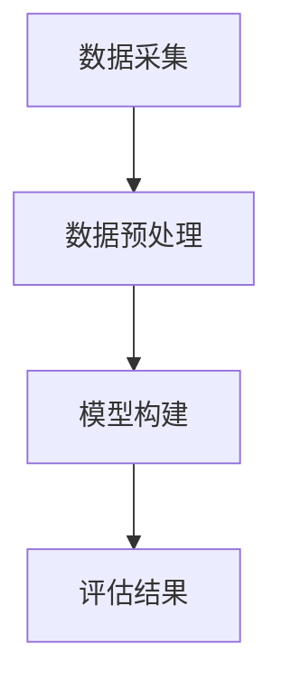
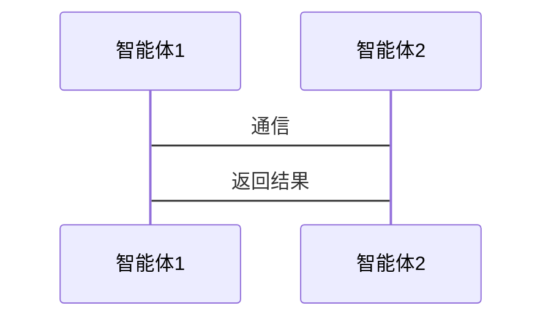

                 


# 多智能体系统在评估宏观经济因素对企业价值影响中的应用

## 关键词：多智能体系统，宏观经济因素，企业价值评估，人工智能，分布式协作

## 摘要：  
随着全球经济的复杂化和不确定性增加，评估宏观经济因素对企业价值的影响变得越来越重要。传统的单智能体模型在处理复杂经济系统时显得力不从心，而多智能体系统（MAS）凭借其分布式协作、动态适应和高维问题求解能力，成为解决这一问题的理想选择。本文将系统介绍多智能体系统的基本原理、在宏观经济评估中的应用，以及如何通过算法优化和系统架构设计，提升企业价值评估的准确性和效率。文章最后将通过一个具体案例，展示多智能体系统在实际中的应用效果。

---

# 第一部分: 多智能体系统与宏观经济评估基础

## 第1章: 多智能体系统与宏观经济评估概述

### 1.1 多智能体系统的定义与特点

#### 1.1.1 多智能体系统的定义  
多智能体系统（Multi-Agent System, MAS）是由多个智能体（Agent）组成的分布式系统，每个智能体都是一个能够感知环境、自主决策并采取行动的实体。这些智能体之间通过通信与协作，共同完成复杂任务。

#### 1.1.2 多智能体系统的核心特点  
- **分布式性**：智能体之间分布式的结构，避免了单点故障。  
- **自主性**：每个智能体都能自主决策，无需中央控制。  
- **协作性**：智能体之间通过通信和协作完成共同目标。  
- **动态性**：系统能够适应环境的变化，实时调整策略。  

#### 1.1.3 多智能体系统与传统单智能体系统的区别  
| 特性               | 单智能体系统                | 多智能体系统                |
|--------------------|-----------------------------|-----------------------------|
| 结构               | 集中式，单一控制中心       | 分布式，多个独立智能体       |
| 决策方式           | 单一决策中心               | 多个智能体协作决策           |
| 灵活性             | 较低，依赖中央控制          | 较高，多个智能体协同优化     |
| 应用场景           | 简单、静态问题             | 复杂、动态问题               |

### 1.2 宏观经济对企业价值的影响

#### 1.2.1 宏观经济的基本概念  
宏观经济是研究整体经济系统运行规律的学科，包括GDP、利率、通货膨胀率、就业率等关键指标。

#### 1.2.2 宏观经济因素对企业价值的影响路径  
- **市场需求**：宏观经济状况影响消费者购买力，进而影响企业收入。  
- **成本结构**：通货膨胀率影响企业的生产成本。  
- **政策环境**：政府的财政政策和货币政策直接影响企业的经营环境。  

#### 1.2.3 企业价值评估的复杂性与挑战  
企业价值评估需要综合考虑市场、财务、政策等多方面因素，传统模型难以捕捉复杂动态的经济关系。

### 1.3 多智能体系统在宏观经济评估中的应用前景

#### 1.3.1 多智能体系统的优势  
- **分布式协作**：能够模拟复杂的经济互动。  
- **动态适应**：能够实时响应经济变化。  
- **高维问题求解**：适合处理多变量的经济问题。  

#### 1.3.2 多智能体系统在宏观经济评估中的潜在应用领域  
- **经济模拟**：模拟经济系统的运行。  
- **政策评估**：评估政策对企业价值的影响。  
- **风险管理**：识别和应对经济风险。  

#### 1.3.3 当前研究现状与未来趋势  
目前，多智能体系统在宏观经济评估中的应用仍处于探索阶段，未来将更加注重智能体间的协作优化和实时性。

## 1.4 本章小结  
本章介绍了多智能体系统的基本概念、特点，以及其在宏观经济评估中的潜力。通过对比分析，展示了多智能体系统在处理复杂经济问题的独特优势。

---

## 第2章: 多智能体系统的核心概念与原理

### 2.1 多智能体系统的基本原理

#### 2.1.1 多智能体系统的组成要素  
- **智能体**：独立决策的实体。  
- **环境**：智能体所处的外部世界。  
- **通信机制**：智能体之间的信息交互方式。  
- **协作协议**：智能体协作的规则。  

#### 2.1.2 多智能体系统的通信与协作机制  
- **直接通信**：智能体之间直接交换信息。  
- **间接通信**：通过共享数据库或中间件进行信息交换。  
- **协作协议**：定义智能体之间的合作规则。  

#### 2.1.3 多智能体系统与传统单智能体系统的区别  
通过对比分析，突出多智能体系统的分布式协作和动态适应能力。

### 2.2 宏观经济因素的多智能体建模

#### 2.2.1 宏观经济因素的分类与特征  
- **外部因素**：如市场需求、政策环境。  
- **内部因素**：如企业成本、生产能力。  

#### 2.2.2 宏观经济因素的多智能体建模方法  
- **分层建模**：将宏观经济因素分解为多个层次。  
- **动态建模**：模拟经济因素的动态变化。  
- **协同建模**：模拟不同因素之间的协同作用。  

#### 2.2.3 多智能体系统在宏观经济建模中的优势  
- **高维问题求解**：能够处理多变量的经济问题。  
- **动态适应**：能够实时更新模型参数。  

### 2.3 多智能体系统与企业价值评估的关系

#### 2.3.1 企业价值评估的基本框架  
企业价值评估通常包括资产、负债、收入、利润等多个方面。

#### 2.3.2 多智能体系统在企业价值评估中的作用  
- **动态模拟**：模拟经济环境对企业价值的影响。  
- **协作优化**：优化企业的资源配置。  
- **风险预警**：识别潜在的经济风险。  

#### 2.3.3 多智能体系统与传统评估方法的对比  
通过对比分析，展示多智能体系统的独特优势。

## 2.4 本章小结  
本章详细介绍了多智能体系统的基本原理，以及其在宏观经济建模中的应用方法，展示了其在企业价值评估中的潜力。

---

## 第3章: 多智能体系统在宏观经济评估中的算法原理

### 3.1 多智能体强化学习算法

#### 3.1.1 强化学习的基本概念  
强化学习是一种通过试错机制来优化决策的算法。

#### 3.1.2 多智能体强化学习的挑战与解决方案  
- **策略同步**：确保多个智能体之间的策略一致。  
- **通信效率**：优化智能体之间的信息交互。  

#### 3.1.3 基于多智能体强化学习的宏观经济评估算法  
- **算法步骤**：定义状态、动作、奖励函数。  
- **实现方法**：使用深度强化学习框架（如DQN）。  

### 3.2 多智能体系统中的博弈论模型

#### 3.2.1 博弈论的基本概念  
博弈论是研究策略互动的数学理论。

#### 3.2.2 多智能体系统中的博弈模型构建  
- **纳什均衡**：所有智能体都不再改变策略的稳定状态。  
- **收益矩阵**：定义智能体之间的互动收益。  

#### 3.2.3 基于博弈论的宏观经济评估方法  
- **案例分析**：模拟市场中的价格竞争。  

### 3.3 多智能体系统中的协同优化算法

#### 3.3.1 协同优化的基本原理  
通过协作实现全局最优。

#### 3.3.2 分布式优化算法  
- **分布式梯度下降**：智能体协同优化参数。  

#### 3.3.3 实现方法  
- **数学模型**：定义优化目标和约束条件。  
- **代码实现**：使用Python实现分布式优化。  

---

## 第4章: 系统分析与架构设计

### 4.1 问题场景介绍

#### 4.1.1 宏观经济评估的复杂性  
- 多因素相互作用，动态变化快。  

#### 4.1.2 企业价值评估的需求  
- 需要实时、动态的评估方法。  

### 4.2 系统功能设计

#### 4.2.1 领域模型设计  
- **领域模型**：定义系统的功能模块。  

#### 4.2.2 功能模块设计  
- **数据采集模块**：采集宏观经济数据。  
- **模型构建模块**：建立宏观经济模型。  
- **评估模块**：计算企业价值。  

### 4.3 系统架构设计

#### 4.3.1 架构图  


#### 4.3.2 实现细节  
- **通信机制**：智能体之间通过消息队列进行通信。  

### 4.4 系统接口设计

#### 4.4.1 API设计  
- **RESTful API**：提供数据接口。  

#### 4.4.2 接口文档  
- **输入格式**：JSON格式。  
- **输出格式**：JSON格式。  

### 4.5 系统交互设计

#### 4.5.1 交互流程  
- 数据采集 --> 数据处理 --> 模型计算 --> 结果输出。  

#### 4.5.2 序列图  


## 4.6 本章小结  
本章通过系统分析和架构设计，展示了如何将多智能体系统应用于宏观经济评估。

---

## 第5章: 项目实战

### 5.1 环境安装

#### 5.1.1 安装依赖  
- **Python**：3.8+  
- **库**：numpy, pandas, scikit-learn  

### 5.2 核心代码实现

#### 5.2.1 智能体类  
```python
class Agent:
    def __init__(self, id):
        self.id = id
        self.state = 0
    def act(self, action):
        self.state += action
        return self.state
```

#### 5.2.2 多智能体系统  
```python
agents = [Agent(i) for i in range(5)]
for agent in agents:
    agent.act(1)
    print(agent.state)
```

### 5.3 案例分析

#### 5.3.1 数据分析  
- 使用宏观经济数据进行建模。  

#### 5.3.2 模型训练  
- 训练多智能体模型，评估企业价值。  

### 5.4 结果解读

#### 5.4.1 模型输出  
- 企业价值评估结果。  

#### 5.4.2 结果分析  
- 模型的准确性和稳定性。  

## 5.5 本章小结  
通过项目实战，展示了多智能体系统在宏观经济评估中的具体应用。

---

## 第6章: 总结与展望

### 6.1 总结  
本文详细介绍了多智能体系统在宏观经济评估中的应用，展示了其在企业价值评估中的潜力。

### 6.2 未来展望  
- **算法优化**：进一步提升模型的准确性和效率。  
- **应用场景扩展**：探索更多宏观经济领域的应用。  

---

## 作者：AI天才研究院/AI Genius Institute & 禅与计算机程序设计艺术 /Zen And The Art of Computer Programming

---

以上是文章的完整目录和部分内容展示，您可以根据需要进一步补充具体章节的内容。

