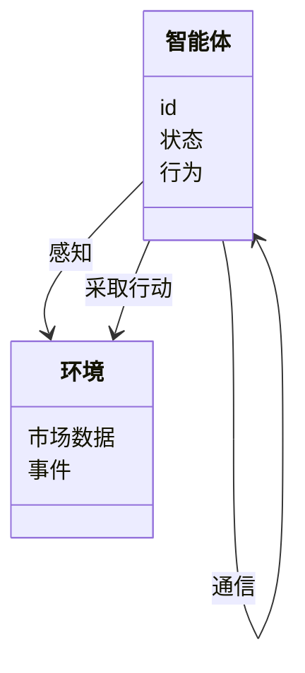
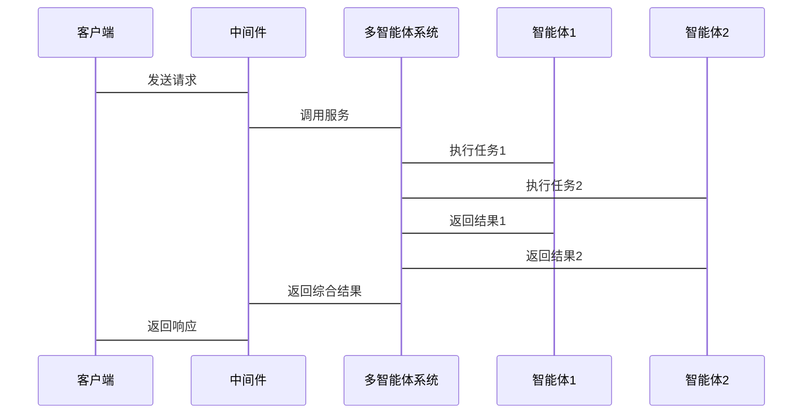

                 


# 多智能体系统在识别市场转折点中的应用

> 关键词：多智能体系统、市场转折点、金融预测、协同学习、分布式计算、人工智能

> 摘要：本文探讨了多智能体系统在金融市场中的应用，特别是如何利用多智能体系统的协同学习和分布式计算能力来识别市场转折点。通过详细分析多智能体系统的算法原理、数学模型和系统架构，本文展示了如何在实际金融场景中应用这些技术，并通过案例分析验证了其有效性。文章还讨论了系统设计的关键问题，如数据驱动的市场预测、分布式计算算法、协同学习机制以及系统架构设计，并给出了实际的项目实现和最佳实践建议。

---

# 第一部分: 多智能体系统与市场转折点概述

## 第1章: 多智能体系统基础

### 1.1 多智能体系统的基本概念

#### 1.1.1 智能体的定义与分类

智能体（Agent）是指能够感知环境、自主决策并采取行动的实体。在金融市场中，智能体可以是算法交易系统、量化分析工具或其他自动化决策系统。多智能体系统（Multi-Agent System, MAS）由多个智能体组成，通过协同工作来完成复杂任务。

**智能体的分类**：
1. **简单反射智能体**：基于当前输入做出反应，无内部状态。
2. **基于模型的智能体**：利用内部状态和目标进行决策。
3. **实用智能体**：基于效用函数优化决策。
4. **学习智能体**：通过经验改进性能。

#### 1.1.2 多智能体系统的组成与特点

多智能体系统由多个智能体和环境组成，智能体之间通过通信和协作完成任务。其特点包括：
- **分布性**：智能体独立运行，通过通信协作。
- **协同性**：智能体之间通过信息共享实现协同。
- **动态性**：环境和智能体状态动态变化。
- **鲁棒性**：系统在部分故障时仍能正常运行。

#### 1.1.3 多智能体系统与单智能体系统的区别

| 特性             | 单智能体系统         | 多智能体系统         |
|------------------|---------------------|----------------------|
| 决策中心化       | 单一决策中心       | 分散决策，多个智能体协作 |
| 资源利用率       | 高                  | 低，资源分散使用     |
| 应用场景         | 简单任务           | 复杂任务，如金融市场预测 |

### 1.2 多智能体系统在金融市场的应用

#### 1.2.1 金融市场中的数据与信息

金融市场数据包括：
- **时间序列数据**：股票价格、指数等。
- **文本数据**：新闻、社交媒体评论。
- **交易数据**：订单簿、交易记录。

#### 1.2.2 多智能体系统在金融分析中的优势

多智能体系统能够处理复杂金融市场中的非线性关系和不确定性，通过分布式计算和协同学习提高预测准确性。

#### 1.2.3 市场转折点的定义与重要性

市场转折点是指市场趋势发生显著变化的时刻，包括牛市转熊市、趋势反转等。准确识别市场转折点对投资者至关重要。

## 第2章: 市场转折点识别的背景与挑战

### 2.1 市场转折点的定义与分类

市场转折点分为：
- **短期转折点**：短时间内趋势变化。
- **中期转折点**：中期趋势变化。
- **长期转折点**：长期趋势变化。

### 2.2 市场转折点识别的难点

#### 2.2.1 数据的复杂性与不确定性

金融市场数据受多种因素影响，包括经济指标、政策变化、突发事件等。

#### 2.2.2 市场参与者的博弈行为

市场参与者之间的博弈行为增加了预测的难度。

#### 2.2.3 市场外部因素的干扰

外部事件如疫情、战争等可能引发市场剧烈波动。

---

# 第二部分: 多智能体系统的核心原理

## 第3章: 多智能体系统的协同机制

### 3.1 分布式计算与协同学习

#### 3.1.1 分布式计算的基本原理

分布式计算将任务分解为多个子任务，由不同智能体分别执行，最后汇总结果。

#### 3.1.2 协同学习的实现方法

协同学习通过智能体之间的信息共享，提高整体预测精度。

#### 3.1.3 智能体之间的通信与协调

智能体通过消息传递机制进行通信，协调任务分配和结果汇总。

### 3.2 多智能体系统的决策机制

#### 3.2.1 基于博弈论的决策模型

博弈论模型模拟市场参与者之间的竞争与合作。

#### 3.2.2 分层决策与分布式决策

分层决策将任务分解为不同层次，分布式决策则将决策权分散到各个智能体。

#### 3.2.3 智能体之间的利益冲突与协调

通过机制设计解决智能体之间的利益冲突，如基于效用函数的协调。

## 第4章: 市场数据的多智能体分析

### 4.1 市场数据的特征提取

#### 4.1.1 时间序列数据的特征提取

提取如均值、方差、波动率等统计特征。

#### 4.1.2 文本数据的情感分析

利用自然语言处理技术分析新闻和社交媒体的情绪。

#### 4.1.3 市场参与者的交易行为分析

分析交易者的交易策略和行为模式。

### 4.2 数据驱动的市场预测

#### 4.2.1 基于机器学习的市场预测

使用如LSTM、随机森林等算法进行预测。

#### 4.2.2 基于统计学的市场预测

使用时间序列模型如ARIMA进行预测。

#### 4.2.3 市场数据的实时处理与分析

实时处理市场数据，快速响应市场变化。

---

# 第三部分: 多智能体系统的算法与实现

## 第5章: 多智能体系统的算法原理

### 5.1 分布式计算算法

#### 5.1.1 分布式计算的基本算法

如MapReduce、分布式排序等。

#### 5.1.2 分布式计算中的同步与异步问题

解决分布式系统中的同步问题，减少延迟。

#### 5.1.3 分布式计算中的通信协议

设计高效的通信协议，减少数据传输开销。

### 5.2 协同学习算法

#### 5.2.1 基于强化学习的协同策略

通过强化学习训练智能体之间的协同策略。

#### 5.2.2 分布式协同学习

智能体在分布式环境下进行协同学习。

#### 5.2.3 协同学习的收敛性分析

分析协同学习算法的收敛性，确保算法稳定性。

---

## 第6章: 系统分析与架构设计

### 6.1 系统功能设计

#### 6.1.1 问题场景介绍

金融市场中多智能体系统的应用场景。

#### 6.1.2 领域模型设计

使用Mermaid绘制领域模型类图。



### 6.2 系统架构设计

使用Mermaid绘制系统架构图。


### 6.3 系统接口设计

定义智能体之间的通信接口，如HTTP API。

### 6.4 系统交互设计

使用Mermaid绘制系统交互序列图。



---

## 第7章: 项目实战

### 7.1 环境安装

安装Python、TensorFlow、Kafka等依赖。

### 7.2 核心代码实现

实现多智能体系统的协同学习算法。

```python
import tensorflow as tf
from tensorflow.keras import layers

# 定义智能体类
class Agent:
    def __init__(self):
        self.model = self.build_model()

    def build_model(self):
        model = tf.keras.Sequential([
            layers.Dense(64, activation='relu'),
            layers.Dense(1, activation='linear')
        ])
        return model

# 定义协同学习函数
def collaborative_learning(agents, data):
    for agent in agents:
        agent.model.fit(data, labels, epochs=10)

# 初始化多智能体
agents = [Agent() for _ in range(5)]
collaborative_learning(agents, data)
```

### 7.3 代码解读与分析

解释代码的作用和实现细节。

### 7.4 案例分析

通过实际案例分析多智能体系统在市场转折点识别中的表现。

### 7.5 项目小结

总结项目实现的关键点和经验教训。

---

# 第四部分: 总结与展望

## 第8章: 总结与展望

### 8.1 全文总结

总结全文内容，强调多智能体系统在金融市场中的应用价值。

### 8.2 未来研究方向

提出未来的研究方向，如更高效的分布式算法、更智能的协同学习机制。

---

# 作者信息

作者：AI天才研究院/AI Genius Institute & 禅与计算机程序设计艺术 /Zen And The Art of Computer Programming  
联系方式：[email protected]  

---

感谢您的阅读！如需进一步探讨，请随时联系作者。

