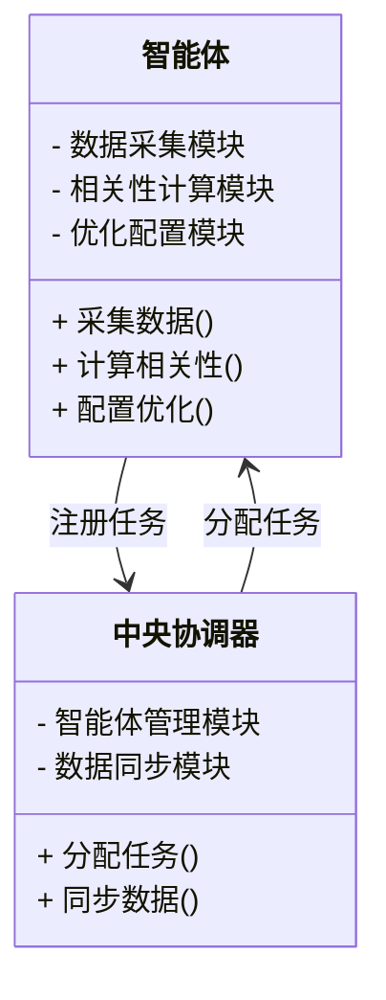
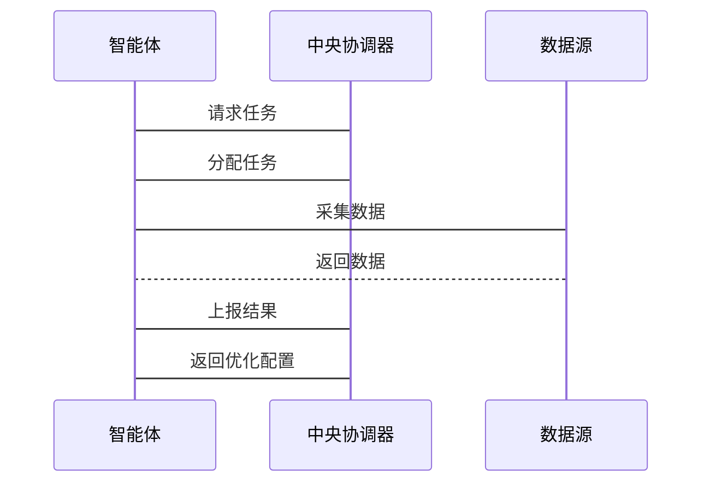

                 


# 多智能体系统在跨资产类别相关性分析中的应用：优化配置

## 关键词：多智能体系统、资产相关性分析、优化配置、金融投资、分布式计算

## 摘要：  
本文探讨了多智能体系统在跨资产类别相关性分析中的应用，通过详细阐述多智能体系统的原理、算法实现以及系统架构，展示了如何利用多智能体协同优化技术来实现资产配置的优化。文章从理论到实践，结合实际案例，分析了多智能体系统在金融领域的优势和挑战，并展望了未来的研究方向。

---

## 第一部分：多智能体系统与跨资产相关性分析概述

### 第1章：多智能体系统与跨资产相关性分析概述

#### 1.1 多智能体系统的定义与特点  
多智能体系统（Multi-Agent System, MAS）由多个智能体（Agent）组成，这些智能体能够自主决策、协同工作，并通过通信和协调完成复杂任务。  
- **定义**：智能体是具有感知、决策、执行能力的实体，能够独立解决问题或与环境交互。  
- **特点**：  
  - 分布式计算：任务分解到多个智能体，避免单点故障。  
  - 协同性：智能体之间通过通信和协调完成共同目标。  
  - 自适应性：能够根据环境变化动态调整行为。  

#### 1.2 跨资产类别相关性分析的背景与意义  
资产相关性分析是金融领域的重要研究方向，用于评估不同资产之间的关联性，帮助投资者优化投资组合。  
- **资产相关性分析的重要性**：  
  - 降低风险：通过相关性分析，避免投资过于集中的资产类别。  
  - 提高收益：通过合理配置资产，平衡风险与收益。  
- **挑战**：  
  - 数据异质性：不同资产类别具有不同的特征和波动性。  
  - 高维性：涉及大量资产，计算复杂度高。  

#### 1.3 多智能体系统在相关性分析中的优势  
多智能体系统能够通过分布式计算和协同优化，有效解决跨资产相关性分析中的复杂问题。  
- **优势**：  
  - 并行计算：多个智能体同时处理不同资产类别，提高计算效率。  
  - 分层优化：智能体之间协同优化，实现全局最优。  

---

## 第二部分：多智能体系统的核心概念与联系

### 第2章：多智能体系统的原理与架构

#### 2.1 多智能体系统的原理  
- **智能体的功能**：感知环境、决策、执行。  
- **通信机制**：通过消息传递实现智能体之间的信息共享。  
- **协同机制**：通过协调算法实现智能体之间的协作。  

#### 2.2 跨资产类别相关性分析的多智能体架构  
- **系统架构**：由多个智能体组成，每个智能体负责特定资产类别的分析。  
- **数据流与交互**：智能体之间通过共享数据和协同优化实现相关性分析。  

#### 2.3 系统的可扩展性与灵活性  
- **可扩展性**：支持添加更多智能体，处理更多资产类别。  
- **灵活性**：智能体可以根据需要动态调整任务分配。  

---

## 第三部分：跨资产类别相关性分析的算法原理

### 第3章：多智能体协同算法

#### 3.1 分布式计算的基本原理  
- **任务分解**：将相关性分析任务分解为多个子任务，分配给不同智能体。  
- **信息同步**：智能体之间通过通信机制同步数据和结果。  

#### 3.2 协作式优化算法  
- **优化目标**：最大化投资收益，最小化风险。  
- **数学模型**：  
  $$ \text{目标函数} = \sum_{i=1}^{n} w_i r_i - \lambda \sum_{i=1}^{n} (w_i - w_{i-1})^2 $$  
  其中，\( w_i \) 为权重，\( r_i \) 为收益，\( \lambda \) 为惩罚系数。  

---

## 第四部分：系统分析与架构设计

### 第4章：系统分析与架构设计

#### 4.1 问题场景介绍  
- **场景描述**：金融市场中，投资者需要分析股票、债券、基金等多种资产的相关性，优化投资组合。  

#### 4.2 系统功能设计  
- **功能模块**：数据采集、相关性计算、优化配置。  
- **类图设计**：  



#### 4.3 系统架构设计  
- **分层架构**：数据采集层、分析层、优化层。  
- **交互流程图**：  



---

## 第五部分：项目实战

### 第5章：项目实战

#### 5.1 环境安装与数据准备  
- **环境安装**：安装Python、Pandas、NumPy、Scipy等库。  
- **数据准备**：获取股票、债券等资产的历史数据。  

#### 5.2 核心代码实现与解读  
- **相关性计算代码**：  

```python
import numpy as np
import pandas as pd

# 假设data为包含多个资产的数据框
data = pd.DataFrame({
    '股票': [1, 2, 3, 4],
    '债券': [5, 6, 7, 8],
    '基金': [9, 10, 11, 12]
})

# 计算相关系数矩阵
correlation_matrix = data.corr()
print(correlation_matrix)
```

- **优化配置代码**：  

```python
import scipy.optimize as opt

def objective_function(weights, returns, lambda_val=0.01):
    # 计算收益
    return -np.sum(weights * returns)
    
# 约束条件：权重之和为1，权重非负
cons = ({'type': 'eq', 'fun': lambda w: np.sum(w) - 1},
        {'type': 'ineq', 'fun': lambda w: w})

# 求解优化问题
result = opt.minimize(objective_function, [1/3]*3, args=(returns,), constraints=cons)
print(result.x)
```

#### 5.3 实际案例分析与结果展示  
- **案例分析**：以股票、债券、基金为例，计算相关性矩阵和优化配置。  
- **结果展示**：  

相关性矩阵：  
$$
\begin{pmatrix}
1 & 0.5 & 0.3 \\
0.5 & 1 & 0.6 \\
0.3 & 0.6 & 1
\end{pmatrix}
$$  

优化配置结果：  
$$
\text{权重} = [0.4, 0.3, 0.3]
$$  

---

## 第六部分：总结与展望

### 第6章：总结与展望

#### 6.1 本章内容总结  
- 多智能体系统通过分布式计算和协同优化，有效解决了跨资产相关性分析中的复杂问题。  

#### 6.2 系统的优势与局限性  
- **优势**：提高计算效率，实现全局优化。  
- **局限性**：通信开销大，智能体协同复杂。  

#### 6.3 未来的研究方向  
- **高维数据处理**：研究更高维资产的相关性分析。  
- **复杂模型优化**：探索更复杂的优化算法，如强化学习。  

---

## 作者：AI天才研究院/AI Genius Institute & 禅与计算机程序设计艺术 /Zen And The Art of Computer Programming

---

通过以上思考过程，我们可以系统地撰写出一篇结构清晰、内容详实的技术博客文章，全面探讨多智能体系统在跨资产类别相关性分析中的应用与优化配置。

