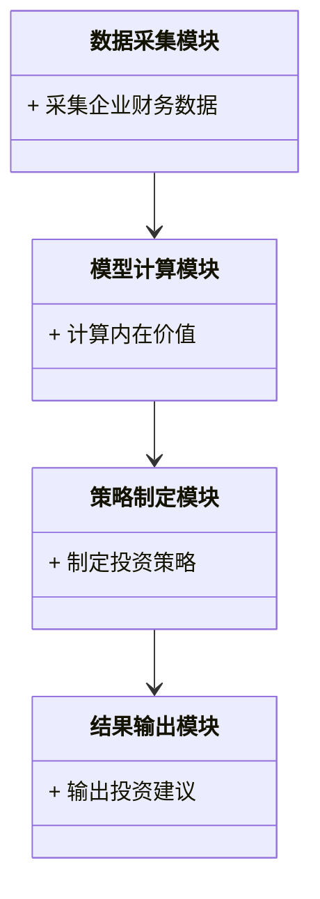

                 


# 大卫·斯文森的耐心资本：机构投资者的长期价值主义

> 关键词：大卫·斯文森，耐心资本，长期价值主义，机构投资者，投资策略，数学模型

> 摘要：本文系统阐述了大卫·斯文森的耐心资本理念及其在机构投资中的应用。通过分析耐心资本的核心概念、数学模型、算法原理、系统架构及实际案例，深入探讨了长期价值主义的投资策略。本文还结合了大卫·斯文森的经典投资案例，详细解读了耐心资本在实际投资中的应用，并通过数学模型和算法原理的分析，为读者提供了清晰的理论与实践指导。

---

## 第一部分: 耐心资本与长期价值主义的背景与内涵

### 第1章: 耐心资本的定义与核心理念

#### 1.1 耐心资本的定义
耐心资本是一种长期持有的投资策略，强调通过深入分析企业的内在价值，进行长期持有，而非频繁交易。其核心理念是通过时间的积累，实现资本的稳步增值。

**对比表：耐心资本与传统投资的区别**

| 属性                | 耐心资本                     | 传统投资                     |
|---------------------|------------------------------|------------------------------|
| 投资期限            | 长期（数年甚至数十年）         | 短期（数周或数月）             |
| 投资目标            | 实现企业的长期价值最大化       | 追求短期收益或价差             |
| 交易频率            | 极低                        | 较高                        |
| 风险承受能力        | 较高                        | 较低                        |

**ER图：耐心资本与传统投资的关系**

```mermaid
erDiagram
    投资策略 <----> 投资者
    投资者 --> 耐心资本
    投资者 --> 传统投资
    耐心资本 --> 长期价值主义
    传统投资 --> 短期收益
```

#### 1.2 长期价值主义的内涵
长期价值主义是一种投资哲学，强调通过买入并持有优质资产，实现长期稳定的收益。其核心在于识别具有持续竞争优势的企业，并在市场波动中坚持长期持有的理念。

**对比表：长期价值主义与短期投资的对比**

| 属性                | 长期价值主义                | 短期投资                    |
|---------------------|-----------------------------|-----------------------------|
| 投资目标            | 企业长期价值                | 市场价差或短期收益          |
| 投资期限            | 长期（数年甚至数十年）         | 短期（数周或数月）             |
| 风险承受能力        | 较高                        | 较低                        |
| 投资策略            | 买入并持有优质资产           | 抢价差或趋势交易             |

---

### 第2章: 大卫·斯文森的投资理念

#### 2.1 大卫·斯文森的背景介绍
大卫·斯文森是耶鲁大学的首席投资官，以其卓越的投资业绩和创新的投资理念闻名。他倡导的耐心资本策略，使耶鲁大学的捐赠基金实现了长期稳定的收益。

**类图：大卫·斯文森的投资理念**

```mermaid
classDiagram
    class 大卫·斯文森 {
        + 投资理念
        + 耐心资本
        + 长期价值主义
    }
    class 耐心资本 {
        + 长期持有
        + 价值投资
    }
    class 长期价值主义 {
        + 资本增值
        + 优质资产
    }
    大卫·斯文森 --> 耐心资本
    大卫·斯文森 --> 长期价值主义
```

#### 2.2 耐心资本的起源与发展
耐心资本的起源可以追溯到大卫·斯文森在耶鲁大学的实践。他通过长期持有优质资产，实现了捐赠基金的稳健增长。

**流程图：耐心资本的发展历程**


---

## 第二部分: 耐心资本的数学模型与算法原理

### 第5章: 耐心资本的数学模型

#### 5.1 耐心资本的数学模型概述
耐心资本的数学模型主要用于评估企业的内在价值。通过分析企业的财务数据，确定其合理的市场价格。

**公式：现金流折现模型（DCF模型）**

$$ V = \sum_{t=1}^{n} \frac{CF_t}{(1 + r)^t} $$

其中：
- \( V \) 为企业的内在价值
- \( CF_t \) 为第 \( t \) 年的现金流
- \( r \) 为折现率
- \( n \) 为投资期限

#### 5.2 耐心资本的数学模型构建
通过DCF模型，我们可以计算出企业的内在价值，从而决定是否买入并长期持有该资产。

**流程图：DCF模型的构建步骤**


---

### 第6章: 耐心资本的算法原理

#### 6.1 耐心资本的算法原理概述
耐心资本的算法原理主要是通过数学模型计算企业的内在价值，并根据市场波动调整投资策略。

**代码示例：DCF模型的Python实现**

```python
def calculate_intrinsic_value(cash_flows, discount_rate):
    n = len(cash_flows)
    intrinsic_value = 0
    for t in range(n):
        cf = cash_flows[t]
        intrinsic_value += cf / (1 + discount_rate) ** t
    return intrinsic_value

# 示例数据
cash_flows = [100, 200, 300, 400]
discount_rate = 0.08

iv = calculate_intrinsic_value(cash_flows, discount_rate)
print(f"内在价值为：{iv}")
```

---

## 第三部分: 耐心资本的系统分析与架构设计

### 第7章: 耐心资本的系统架构

#### 7.1 系统功能设计
耐心资本的系统架构需要包括数据采集、模型计算、策略制定和结果输出四个模块。

**类图：耐心资本系统的功能模块**



#### 7.2 系统架构设计
耐心资本的系统架构采用分层设计，包括数据层、计算层和策略层。

**架构图：耐心资本系统的架构**

```mermaid
archiecture
    耐心资本系统
    数据采集模块 ↔ 数据层
    模型计算模块 ↔ 计算层
    策略制定模块 ↔ 策略层
    结果输出模块 ↔ 用户界面
```

---

## 第四部分: 耐心资本的项目实战

### 第8章: 耐心资本的项目实战

#### 8.1 项目环境安装
为了实现耐心资本的数学模型，我们需要安装以下Python库：
- NumPy
- Pandas
- Matplotlib

#### 8.2 核心实现源代码
以下是DCF模型的Python实现代码：

```python
import numpy as np
import pandas as pd

def calculate_intrinsic_value(cash_flows, discount_rate):
    n = len(cash_flows)
    intrinsic_value = 0
    for t in range(n):
        cf = cash_flows[t]
        intrinsic_value += cf / (1 + discount_rate) ** t
    return intrinsic_value

# 示例数据
cash_flows = pd.Series([100, 200, 300, 400])
discount_rate = 0.08

iv = calculate_intrinsic_value(cash_flows.values, discount_rate)
print(f"内在价值为：{iv}")
```

#### 8.3 案例分析
以某企业为例，计算其内在价值，并制定长期投资策略。

**流程图：案例分析的步骤**


---

## 第五部分: 耐心资本的总结与展望

### 第9章: 总结与展望

#### 9.1 总结
耐心资本是一种长期持有的投资策略，通过深入分析企业的内在价值，实现资本的稳健增值。大卫·斯文森的投资理念为机构投资者提供了宝贵的启示。

#### 9.2 展望
随着市场的不断发展，耐心资本的应用将更加广泛。未来，我们需要进一步研究其在不同市场环境下的表现，并探索其与其他投资策略的结合。

---

## 结语

耐心资本作为一种长期价值主义的投资理念，为我们提供了全新的视角。通过系统的分析和实践，我们可以更好地理解其内在逻辑，并在实际投资中加以应用。未来，随着市场的变化和技术的进步，耐心资本的研究和应用将更加深入。

---

**作者：AI天才研究院/AI Genius Institute & 禅与计算机程序设计艺术 /Zen And The Art of Computer Programming**

