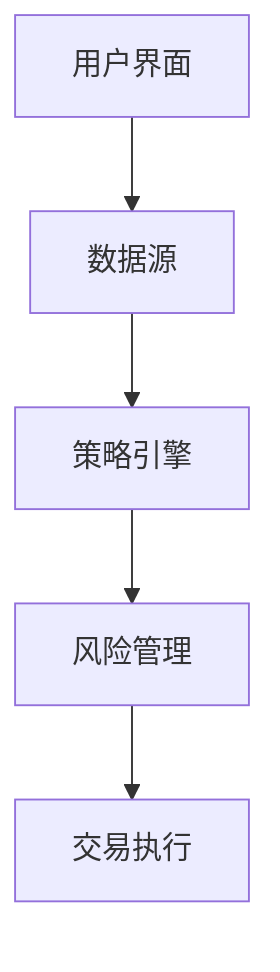
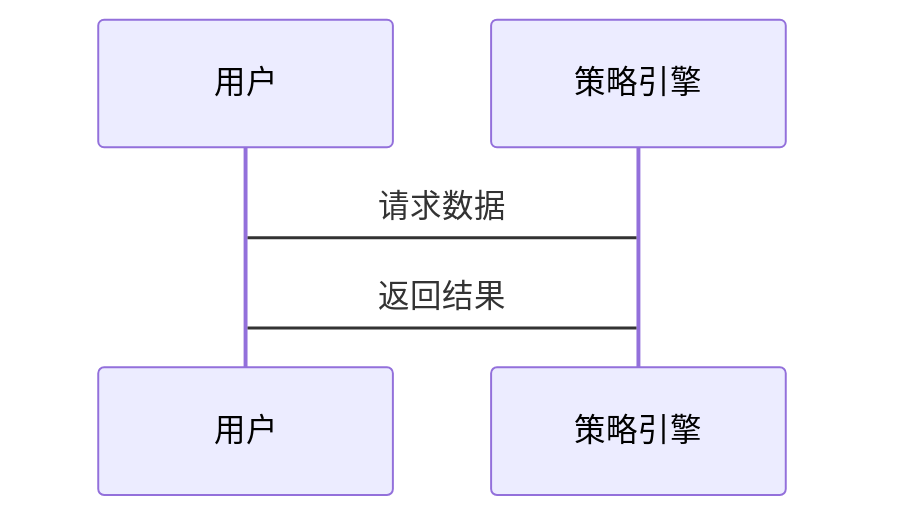

                 


# 如何利用特价股票策略应对市场剧烈波动

**关键词：特价股票策略、市场波动、投资策略、风险管理、技术分析**

**摘要：**  
在金融市场中，市场波动是不可避免的现象，投资者需要有效的策略来应对这种波动。特价股票策略作为一种低成本、高收益的策略，能够在市场波动中抓住机会，帮助投资者在动荡的市场中获得稳定的收益。本文将详细介绍特价股票策略的核心概念、数学模型、系统架构以及实际应用，帮助读者更好地理解和应用这一策略。

---

## 第1章 特价股票策略的背景与概念

### 1.1 市场波动的背景与挑战  
市场的剧烈波动往往由经济不确定性、政策变化或突发事件引发，这些因素会导致股票价格的大幅波动。投资者在面对市场波动时，常常面临以下挑战：  
1. **情绪化决策**：投资者容易受到市场情绪的影响，做出非理性的决策，如恐慌性抛售或贪婪性买入。  
2. **交易成本**：频繁交易可能导致高额的佣金和滑点成本。  
3. **收益不稳定**：市场波动大，投资者难以稳定获利。  

### 1.2 特价股票策略的核心概念  
特价股票策略是一种基于低估值和高波动性的股票投资策略。其核心在于寻找价格低于内在价值的股票，利用市场波动进行买卖，从而获得超额收益。  

#### 1.2.1 特价股票的定义与特点  
- **定义**：特价股票是指市场价格显著低于其内在价值的股票，通常具有较高的波动性和低估值特征。  
- **特点**：  
  - 价格波动大，短期内可能大幅波动。  
  - 市盈率、市净率等估值指标显著低于行业平均水平。  
  - 常见于周期性行业或遭遇短期困境的公司。  

#### 1.2.2 特价策略与传统策略的对比  
| 对比维度 | 特价策略 | 传统价值投资 |  
|----------|----------|--------------|  
| 核心思想 | 价格波动套利 | 价值回归 |  
| 选股标准 | 低估值 + 高波动 | 高估值 + 低波动 |  
| 风险特征 | 高 | 中 |  

### 1.3 特价股票策略的优势与局限性  
#### 1.3.1 优势  
- **低成本**：通过低价买入高价卖出，减少交易成本。  
- **高收益潜力**：波动性大的股票可能带来更高的收益。  

#### 1.3.2 局限性  
- **高风险**：市场波动不可预测，可能导致亏损。  
- **策略失效**：在某些市场环境下，特价策略可能无法生效。  

---

## 第2章 特价股票策略的数学模型与算法

### 2.1 特价股票策略的基本原理  
特价策略的核心在于利用价格与价值的偏离，通过数学模型预测价格波动，寻找买卖时机。  

#### 2.1.1 市场波动与股票价格的关系  
股票价格波动可以用统计学方法进行建模，常见的模型包括均值回归和动量策略。  

### 2.2 特价股票策略的核心算法  

#### 2.2.1 均值回归模型  
均值回归模型假设价格会回归到均值，适用于具有周期性波动的股票。  

$$ R_t = \alpha + \beta R_{t-1} + \epsilon_t $$  

其中，$R_t$ 是当前收益，$R_{t-1}$ 是前一期收益，$\alpha$ 是截距，$\beta$ 是回归系数，$\epsilon_t$ 是误差项。  

#### 2.2.2 动量策略模型  
动量策略利用价格动量效应，适用于趋势性较强的股票。  

$$ P_t = \mu + \lambda P_{t-1} + \epsilon_t $$  

其中，$P_t$ 是当前价格，$P_{t-1}$ 是前一期价格，$\mu$ 是均值，$\lambda$ 是动量系数，$\epsilon_t$ 是误差项。  

#### 2.2.3 波动率套利模型  
波动率套利模型利用波动率差异进行套利。  

$$ \sigma_t = \sqrt{\lambda \sigma_{t-1}^2 + (1-\lambda) \epsilon_t^2} $$  

其中，$\sigma_t$ 是当前波动率，$\sigma_{t-1}$ 是前一期波动率，$\lambda$ 是平滑系数，$\epsilon_t$ 是误差项。  

### 2.3 算法的数学公式与实现  

#### 2.3.1 均值回归模型的实现  
```python
import pandas as pd
import numpy as np

# 计算收益
returns = (prices[1:] / prices[0:-1].values) - 1

# 均值回归模型
beta = np.cov(returns, returns.shift(1))[0, 1] / np.var(returns.shift(1))
alpha = returns.mean() - beta * returns.shift(1).mean()
```

#### 2.3.2 动量策略模型的实现  
```python
# 动量策略
window = 20
momentum = prices.rolling(window).mean()
signal = (prices > momentum).shift(1)
```

### 2.4 算法的实现与优化  
- **优化策略**：结合多因子模型，引入更多指标如市盈率、市净率等。  
- **风险管理**：设置止损点和止盈点，控制仓位。  

---

## 第3章 基于特价股票策略的交易系统设计

### 3.1 系统架构设计  

#### 3.1.1 系统功能模块划分  
- 用户界面：接收输入，显示结果。  
- 数据源：获取市场数据。  
- 策略引擎：执行策略计算。  
- 风险管理：监控和管理风险。  

#### 3.1.2 系统架构图  


### 3.2 系统功能设计  

#### 3.2.1 领域模型的mermaid类图  


### 3.3 系统接口设计  
- API设计：提供REST接口，供外部调用。  
- 接口安全：使用身份验证和加密技术。  

### 3.4 系统交互设计  

#### 3.4.1 交互流程的mermaid序列图  


---

## 第4章 项目实战  

### 4.1 环境安装  
- Python 3.8+  
- Pandas、NumPy、Matplotlib等库。  

### 4.2 系统核心实现源代码  

#### 4.2.1 均值回归策略实现  
```python
import pandas as pd
import numpy as np

def mean_reversion_strategy(prices):
    returns = (prices[1:] / prices[0:-1].values) - 1
    beta = np.cov(returns, returns.shift(1))[0, 1] / np.var(returns.shift(1))
    alpha = returns.mean() - beta * returns.shift(1).mean()
    predicted_returns = alpha + beta * returns.shift(1)
    signal = predicted_returns > 0
    return signal
```

#### 4.2.2 动量策略实现  
```python
def momentum_strategy(prices, window=20):
    momentum = prices.rolling(window).mean()
    signal = (prices > momentum).shift(1)
    return signal
```

### 4.3 代码应用解读与分析  
- 通过回测分析策略的有效性，计算夏普比率、最大回撤等指标。  

### 4.4 实际案例分析  
- 以某段时间的市场数据为例，展示策略的应用和结果。  

---

## 第5章 最佳实践与总结  

### 5.1 最佳实践  
- **选择合适的股票**：结合估值和波动率指标。  
- **风险管理**：设置止损和止盈点，避免过度杠杆。  

### 5.2 小结  
特价股票策略是一种有效的应对市场波动的方法，但需要结合其他策略和风险管理工具，才能在实际操作中获得稳定收益。  

### 5.3 注意事项  
- 特价策略适合长期投资者，短期投资者需谨慎。  
- 市场环境变化会影响策略效果，需持续优化。  

### 5.4 拓展阅读  
- 《投资学精要》  
- 《算法交易：数学模型与实践》  

---

**参考文献**  
1. Fama, E. F. (1970). Efficient Capital Markets: A Review of Theory and Practice.  
2. Sharpe, W. F. (1994). The Sharpe Ratio.  
3. Malkiel, B. (2005). The Efficient Market Hypothesis and Its Critics.  

**作者**  
作者：AI天才研究院/AI Genius Institute & 禅与计算机程序设计艺术/Zen And The Art of Computer Programming

