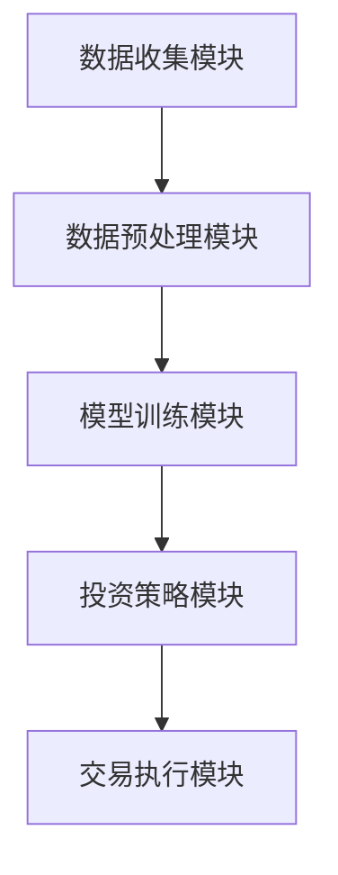
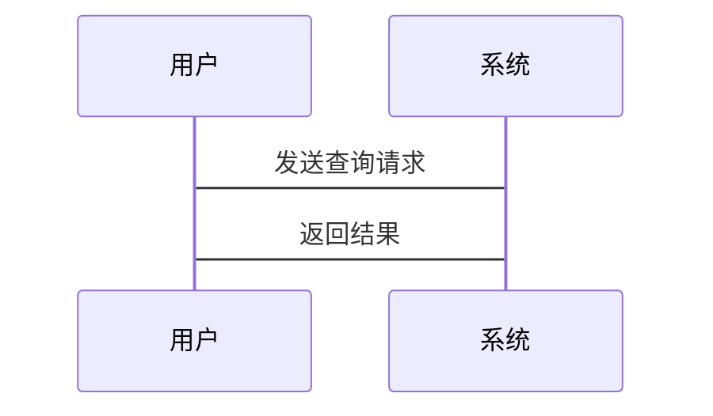

                 


# 巴菲特如何看待人工智能在金融服务中的应用

> 关键词：巴菲特, 人工智能, 金融服务, 投资理念, 价值投资, 算法交易, 风险管理

> 摘要：本文深入探讨了巴菲特的投资理念及其对人工智能在金融服务中应用的看法。通过分析人工智能技术在金融领域的具体应用，结合巴菲特的价值投资策略，探讨了人工智能如何辅助投资决策、风险管理以及客户画像与精准营销等方面。文章详细讲解了人工智能的核心算法原理，包括线性回归、随机森林和神经网络，并通过实际案例展示了这些算法在金融分析中的应用。最后，本文提出了系统架构设计和项目实战方案，为读者提供了一个全面了解人工智能在金融服务中应用的框架。

---

# 第一部分: 巴菲特投资理念与人工智能的结合

## 第1章: 巴菲特投资理念概述

### 1.1 巴菲特投资理念的核心思想

#### 1.1.1 价值投资的定义与核心要素

- **价值投资**：以低于内在价值的价格买入优质股票，长期持有，获得超额收益。
- **核心要素**：
  - **企业基本面**：关注企业的财务状况、盈利能力、竞争优势。
  - **安全边际**：买入价格低于内在价值，以降低风险。
  - **长期视角**：关注企业的长期价值，而非短期波动。

#### 1.1.2 巴菲特的价值投资方法论

- **买入并持有**：巴菲特倾向于买入优质股票并长期持有，避免频繁交易。
- **关注ROE（净资产收益率）**：巴菲特认为ROE是衡量企业盈利能力的重要指标。
- **分散与集中**：适度分散投资以降低风险，但集中投资于少数优质企业以获得超额收益。

#### 1.1.3 巴菲特投资理念的哲学基础

- **安全边际**：买入价格低于内在价值，确保投资的安全性。
- **长期主义**：关注企业的长期价值，而非短期市场波动。
- **价值创造**：寻找能够持续创造价值的企业，而非仅仅关注价格波动。

### 1.2 巴菲特投资理念的实践案例

#### 1.2.1 巴菲特的经典投资案例分析

- **可口可乐**：巴菲特长期持有可口可乐，因为其强大的品牌优势和稳定的现金流。
- **苹果公司**：巴菲特对苹果的投资体现了对创新能力和市场地位的重视。

#### 1.2.2 巴菲特投资决策的逻辑框架

- **第一步：分析企业基本面**：关注企业的财务状况、盈利能力、竞争优势。
- **第二步：评估内在价值**：计算企业的内在价值，确定买入价格。
- **第三步：长期持有**：买入优质股票并长期持有，避免短期波动。

#### 1.2.3 巴菲特投资理念的现代演变

- **从传统到现代**：巴菲特的投资理念逐渐融入现代金融理论，尤其是对风险管理的关注。

## 第2章: 人工智能在金融服务中的应用背景

### 2.1 人工智能技术的发展现状

#### 2.1.1 人工智能技术的核心进展

- **机器学习**：基于数据的模式识别和预测。
- **深度学习**：基于神经网络的特征提取和模式识别。
- **自然语言处理**：文本分析和情感计算。

#### 2.1.2 人工智能在金融行业的应用现状

- **算法交易**：利用算法进行高频交易和套利。
- **风险管理**：基于AI的风险评估和信用评分。
- **客户画像**：利用AI进行客户分群和精准营销。

#### 2.1.3 人工智能技术的未来发展趋势

- **自动化决策**：AI在投资决策中的自动化趋势。
- **个性化服务**：基于AI的个性化金融产品推荐。
- **实时分析**：AI在实时数据分析中的应用。

### 2.2 金融服务行业的数字化转型

#### 2.2.1 金融服务行业的痛点与挑战

- **传统模式的低效性**：人工操作效率低下，成本高昂。
- **数据爆炸**：金融数据的爆炸式增长，需要高效处理工具。
- **风险管理**：传统方法难以应对复杂多变的市场风险。

#### 2.2.2 数字化转型的必要性与路径

- **必要性**：通过数字化转型提升效率、降低成本、增强用户体验。
- **路径**：引入AI技术，优化业务流程，提升风险管理能力。

#### 2.2.3 人工智能在数字化转型中的作用

- **数据处理**：AI能够高效处理海量金融数据，提供实时分析。
- **决策支持**：AI辅助投资决策，优化风险管理策略。

---

## 第3章: 巴菲特如何看待人工智能的应用

### 3.1 巴菲特对人工智能技术的看法

#### 3.1.1 巴菲特对人工智能技术的肯定

- **技术进步**：巴菲特认可人工智能技术的进步，认为其能够提高金融行业的效率。
- **辅助工具**：AI可以作为投资决策的辅助工具，帮助投资者更好地分析市场。

#### 3.1.2 巴菲特对人工智能技术的担忧

- **过度依赖**：担心市场参与者过度依赖AI，导致市场波动加剧。
- **黑箱问题**：AI模型的不可解释性可能引发投资风险。

#### 3.1.3 巴菲特对人工智能技术的未来展望

- **结合人类智慧**：巴菲特认为AI应该与人类智慧结合，而非完全替代人类决策。
- **风险管理**：AI在风险管理中的应用需要谨慎，确保模型的稳健性。

### 3.2 巴菲特投资理念与人工智能的结合

#### 3.2.1 人工智能如何辅助价值投资

- **数据驱动决策**：AI帮助投资者分析企业的基本面数据，识别潜在投资机会。
- **实时监控**：AI实时监控市场动态，帮助投资者及时调整投资策略。

#### 3.2.2 人工智能在风险控制中的应用

- **实时风险评估**：AI能够实时评估投资组合的风险，帮助投资者规避潜在风险。
- **情景分析**：AI可以进行情景分析，模拟不同市场条件下的投资表现。

#### 3.2.3 人工智能在投资决策中的潜在风险

- **模型过拟合**：AI模型可能过拟合历史数据，导致在实际市场中的表现不佳。
- **市场波动**：AI模型可能无法预测市场突发事件，导致投资决策失误。

---

## 第4章: 人工智能在金融服务中的具体应用

### 4.1 人工智能在股票分析中的应用

#### 4.1.1 基于机器学习的股票预测模型

- **线性回归模型**：用于分析股票价格与相关因素之间的线性关系。
- **随机森林模型**：用于分类和回归分析，预测股票价格走势。
- **神经网络模型**：用于非线性预测，捕捉复杂市场动态。

#### 4.1.2 自然语言处理在财经新闻中的应用

- **情感分析**：分析财经新闻中的情感倾向，预测市场情绪。
- **关键词提取**：提取财经新闻中的关键词，识别市场热点。

#### 4.1.3 时间序列分析在股价预测中的应用

- **ARIMA模型**：用于预测股票价格的未来走势。
- **LSTM模型**：用于捕捉时间序列中的长期依赖关系。

### 4.2 人工智能在风险管理中的应用

#### 4.2.1 基于AI的风险评估模型

- **信用评分模型**：用于评估客户的信用风险。
- **市场风险模型**：用于评估投资组合在市场波动中的风险。

#### 4.2.2 AI在信用评分中的应用

- **逻辑回归模型**：用于预测客户违约概率。
- **梯度提升模型**：用于提高信用评分的准确性。

#### 4.2.3 AI在市场波动预测中的应用

- **波动率预测模型**：用于预测市场的波动性，帮助投资者制定交易策略。

### 4.3 人工智能在客户画像与精准营销中的应用

#### 4.3.1 客户画像构建

- **聚类分析**：将客户分为不同的群体，进行精准营销。
- **特征工程**：提取客户特征，构建客户画像。

#### 4.3.2 精准营销策略

- **推荐系统**：基于客户画像，推荐个性化金融产品。
- **营销预测**：预测客户对金融产品的反应，优化营销策略。

---

## 第5章: 人工智能在金融服务中的系统架构设计

### 5.1 项目背景介绍

- **目标**：构建一个基于AI的金融分析系统，辅助投资决策。
- **范围**：涵盖股票分析、风险管理和客户画像三个方面。
- **用户**：投资者、金融机构和金融从业者。

### 5.2 系统功能设计

#### 5.2.1 数据收集模块

- **数据来源**：股票数据、财经新闻、客户数据。
- **数据预处理**：清洗、转换和归一化。

#### 5.2.2 模型训练模块

- **算法选择**：线性回归、随机森林、神经网络。
- **模型训练**：基于数据训练模型，优化参数。

#### 5.2.3 投资策略模块

- **策略制定**：基于模型预测结果，制定投资策略。
- **策略执行**：自动化执行交易策略。

### 5.3 系统架构设计

#### 5.3.1 系统架构图



#### 5.3.2 接口设计

- **API接口**：提供RESTful API，供其他系统调用。
- **数据接口**：与数据源对接，获取实时数据。

#### 5.3.3 交互设计



---

## 第6章: 项目实战与总结

### 6.1 项目实战

#### 6.1.1 环境安装

- **Python**：安装Anaconda或Miniconda。
- **库依赖**：安装numpy、pandas、scikit-learn、keras等。

#### 6.1.2 核心代码实现

```python
import numpy as np
import pandas as pd
from sklearn.linear_model import LinearRegression
from sklearn.ensemble import RandomForestRegressor
from keras.models import Sequential
from keras.layers import Dense

# 数据预处理
data = pd.read_csv('stock_data.csv')
X = data.drop('target', axis=1)
y = data['target']

# 线性回归模型
model_lr = LinearRegression()
model_lr.fit(X, y)

# 随机森林模型
model_rf = RandomForestRegressor()
model_rf.fit(X, y)

# 神经网络模型
model_nn = Sequential()
model_nn.add(Dense(64, activation='relu', input_dim=X.shape[1]))
model_nn.add(Dense(1, activation='linear'))
model_nn.compile(optimizer='adam', loss='mean_squared_error')
model_nn.fit(X, y, epochs=100, batch_size=32)
```

#### 6.1.3 案例分析

- **案例1**：基于线性回归模型预测股票价格。
- **案例2**：基于随机森林模型进行客户画像分析。
- **案例3**：基于神经网络模型预测市场波动。

### 6.2 总结与展望

- **总结**：人工智能在金融服务中的应用前景广阔，能够显著提升投资决策的效率和准确性。
- **展望**：未来，AI将与人类智慧结合，推动金融服务行业的进一步创新和发展。

---

## 第7章: 最佳实践与小结

### 7.1 最佳实践 tips

- **数据质量**：确保数据的准确性和完整性。
- **模型解释性**：选择可解释的模型，避免黑箱问题。
- **风险管理**：定期监控模型的表现，及时调整策略。

### 7.2 小结

- **核心观点**：人工智能能够辅助巴菲特的价值投资理念，提升投资决策的效率和准确性。
- **未来展望**：AI与人类智慧的结合将推动金融服务行业的智能化发展。

---

## 作者信息

作者：AI天才研究院/AI Genius Institute & 禅与计算机程序设计艺术 /Zen And The Art of Computer Programming

