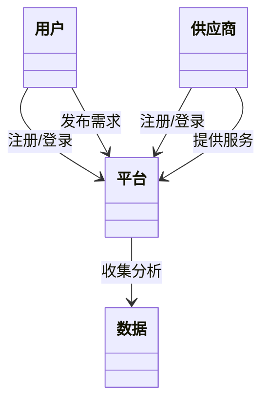
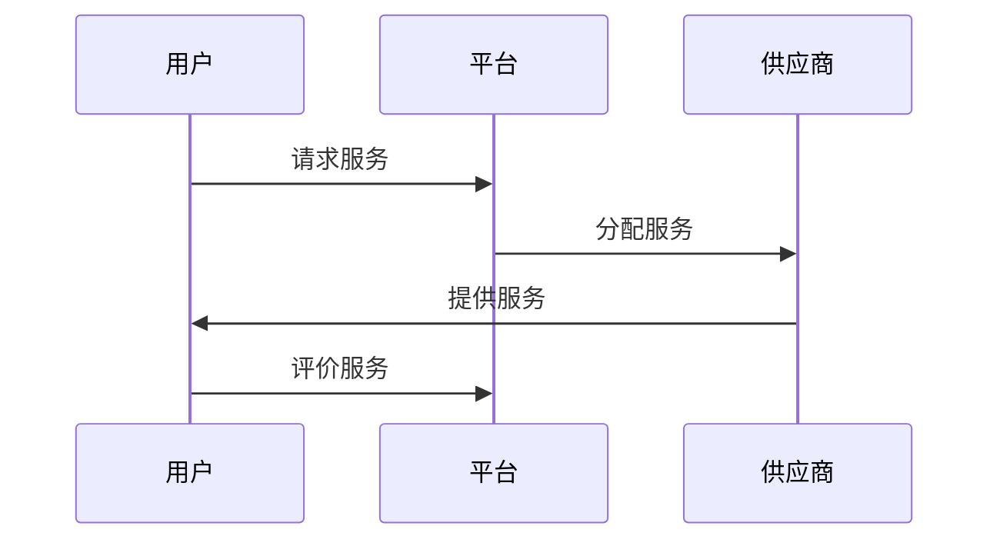

                 


# 巴菲特的价值链分析：数字平台经济下的价值创造

## 关键词：
巴菲特，价值链分析，数字平台经济，价值创造，护城河，安全边际，投资理念

## 摘要：
本文探讨了如何将巴菲特的价值链分析方法应用于数字平台经济中的价值创造。通过分析数字平台的双边市场、网络效应和数据资产，结合巴菲特的安全边际和护城河理念，揭示数字平台经济中的价值传递和捕获机制。本文从理论、系统设计到实战案例，全面解析数字平台经济下的价值创造过程。

---

# 巴菲特的价值链分析：数字平台经济下的价值创造

## 第一部分：巴菲特的价值链分析概述

### 第1章：巴菲特的价值链分析基础

#### 1.1 巴菲特投资理念的核心要素

##### 1.1.1 价值投资的定义与核心原则
价值投资是一种长期投资策略，强调以低于内在价值的价格购买优质资产。巴菲特的核心原则包括：
1. **安全边际**：买入价格低于内在价值，确保投资的安全性。
2. **护城河**：选择具备竞争优势的企业，尤其是具备宽护城河的企业。
3. **长期视角**：关注企业的长期盈利能力，而非短期市场波动。

##### 1.1.2 投资中的安全边际概念
安全边际是指投资的实际价值与市场价格之间的差距，确保在市场价格波动时仍能保持盈利。巴菲特认为，安全边际是投资成功的关键因素。

##### 1.1.3 企业的护城河与竞争优势
护城河是指企业抵御竞争的能力。常见的护城河类型包括：
1. **成本优势**：如规模化生产降低成本。
2. **品牌优势**：强大的品牌影响力吸引客户。
3. **技术优势**：专利和技术壁垒防止竞争对手进入。

#### 1.2 数字平台经济的特点

##### 1.2.1 数字平台经济的定义与特征
数字平台经济是指通过数字技术构建的双边或多边市场，连接供需双方，提供撮合交易或增值服务。其特征包括：
1. **双边市场**：连接两个或多个群体，如消费者和商家。
2. **网络效应**：用户数量增加会增强平台价值。
3. **数据资产**：通过数据收集和分析，优化服务和决策。

##### 1.2.2 数字平台的双边市场模式
数字平台通过连接供需双方，创造价值。例如，电商平台连接买家和卖家，社交平台连接用户和内容创作者。

##### 1.2.3 数字平台的网络效应与数据资产
网络效应使平台更具价值，数据资产则通过分析用户行为，优化服务和商业模式。

#### 1.3 巴菲特理念与数字平台经济的结合

##### 1.3.1 传统企业价值链的数字化转型
数字技术正在改变传统企业的价值链，数字平台经济为企业提供了新的价值创造和传递方式。

##### 1.3.2 数字平台经济中的价值创造与传递
数字平台通过数据驱动和网络效应，高效地创造和传递价值，实现价值捕获。

##### 1.3.3 数字平台经济下的巴菲特投资逻辑
在数字平台经济中，巴菲特的价值观仍然适用，尤其是护城河和安全边际的概念。

---

## 第二部分：数字平台经济下的价值链分析方法

### 第2章：数字平台经济中的价值创造

#### 2.1 价值创造的核心要素

##### 2.1.1 用户价值的定义与衡量
用户价值是平台提供的服务对用户的需求满足程度。衡量标准包括用户体验、服务效率和价值实现。

##### 2.1.2 数字平台的生态系统构建
数字平台需要构建一个包含用户、供应商和第三方服务提供商的生态系统，实现多方共赢。

##### 2.1.3 数据驱动的价值创造
数据是数字平台的核心资产，通过数据驱动的分析和优化，提升平台的价值创造能力。

#### 2.2 价值传递的路径分析

##### 2.2.1 价值传递的定义与核心要素
价值传递是指平台如何将价值从生产者传递给消费者，包括平台的商业模式、用户界面和交易流程。

##### 2.2.2 数字平台的双边市场价值传递
数字平台通过连接供需双方，降低交易成本，提高效率，实现价值传递。

##### 2.2.3 数字平台的价值传递机制优化
通过优化用户界面、流程和定价策略，提高价值传递效率。

#### 2.3 价值捕获的策略与方法

##### 2.3.1 价值捕获的定义与核心要素
价值捕获是指平台如何通过商业模式和技术手段，获取用户创造的价值。

##### 2.3.2 数字平台的定价策略
数字平台通过订阅、广告、交易佣金等多种方式，实现价值捕获。

##### 2.3.3 数据驱动的定价优化
通过分析用户行为和需求，优化定价策略，提高收益。

---

### 第3章：数字平台经济中的价值传递

#### 3.1 价值传递的系统架构设计

##### 3.1.1 价值传递的系统架构
数字平台的价值传递系统包括用户界面、交易引擎和支付系统。

##### 3.1.2 系统功能设计
系统功能包括用户注册、信息发布、搜索匹配和交易支付。

##### 3.1.3 系统接口设计
系统接口包括API调用和数据交换格式。

#### 3.2 价值传递的实现流程

##### 3.2.1 价值传递的实现步骤
1. 用户注册与认证
2. 信息发布与匹配
3. 交易确认与支付
4. 服务交付与反馈

##### 3.2.2 价值传递的优化策略
1. 提高用户界面的易用性
2. 优化匹配算法
3. 提高交易效率

---

### 第4章：数字平台经济中的价值捕获

#### 4.1 价值捕获的系统架构设计

##### 4.1.1 价值捕获的系统架构
价值捕获系统包括数据采集、分析和决策支持。

##### 4.1.2 系统功能设计
系统功能包括数据分析、用户画像和定价优化。

##### 4.1.3 系统接口设计
系统接口包括数据采集模块和分析模块。

#### 4.2 价值捕获的实现流程

##### 4.2.1 数据驱动的定价优化
通过分析用户行为和市场趋势，优化定价策略。

##### 4.2.2 平台的护城河构建
通过数据和技术壁垒，构建平台的护城河，确保竞争优势。

##### 4.2.3 价值捕获的数学模型
建立数学模型，分析用户行为和市场反应，优化定价策略。

---

## 第三部分：数字平台经济下的系统架构与设计

### 第5章：系统架构与设计

#### 5.1 系统架构设计

##### 5.1.1 领域模型类图


##### 5.1.2 系统架构图


##### 5.1.3 系统接口设计
系统接口包括API和数据交换格式，如JSON。

##### 5.1.4 系统交互设计


---

## 第四部分：项目实战

### 第6章：实战案例分析

#### 6.1 环境安装与配置

##### 6.1.1 环境需求
- 操作系统：Linux/Windows/MacOS
- 开发工具：Python/Java/JavaScript
- 数据库：MySQL/PostgreSQL
- 服务器：云服务器（AWS/Azure/Google Cloud）

#### 6.2 核心代码实现

##### 6.2.1 用户认证模块
```python
def user_auth(email, password):
    # 数据库查询用户信息
    user = User.query.filter_by(email=email).first()
    if user and user.check_password(password):
        return user
    return None
```

##### 6.2.2 信息发布模块
```python
def post_service(user_id, service_desc):
    # 创建服务记录
    service = Service(user_id=user_id, description=service_desc)
    db.session.add(service)
    db.session.commit()
```

##### 6.2.3 交易匹配算法
```python
def match_service(user_request, services_available):
    # 匹配最优服务
    matched_service = None
    min_diff = float('inf')
    for service in services_available:
        diff = abs(service.rating - user_request.rating)
        if diff < min_diff:
            min_diff = diff
            matched_service = service
    return matched_service
```

#### 6.3 案例分析与解读

##### 6.3.1 案例背景介绍
选择一个具体数字平台（如电商平台）作为案例，分析其价值链。

##### 6.3.2 代码实现与分析
详细解释核心代码的功能和实现逻辑，分析其在平台经济中的作用。

##### 6.3.3 项目小结
总结项目的实施过程，提炼经验教训，为后续项目提供参考。

---

## 第五部分：总结与展望

### 第7章：总结与展望

#### 7.1 总结分析
总结本文的主要内容，强调巴菲特价值链分析在数字平台经济中的应用价值。

#### 7.2 最佳实践 tips
- 理解数字平台的网络效应和数据资产。
- 注重平台的护城河构建。
- 优化价值传递和捕获机制。

#### 7.3 注意事项
- 确保数据安全和用户隐私。
- 提高平台的用户体验和易用性。
- 保持对市场变化的敏感性和适应性。

#### 7.4 拓展阅读
推荐相关书籍和资源，鼓励读者深入学习和研究。

---

## 作者信息

作者：AI天才研究院/AI Genius Institute & 禅与计算机程序设计艺术 /Zen And The Art of Computer Programming

---

这篇文章从理论到实践，系统地分析了巴菲特的价值链分析在数字平台经济中的应用，结合实际案例和系统设计，为读者提供了全面的视角和深入的见解。希望这篇文章能帮助读者更好地理解数字平台经济的价值创造和价值捕获机制。

