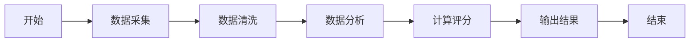
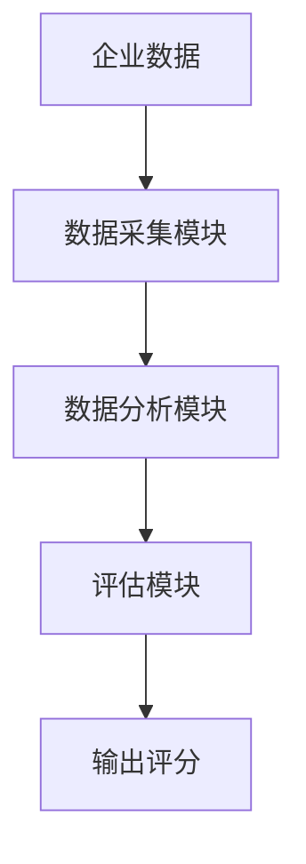
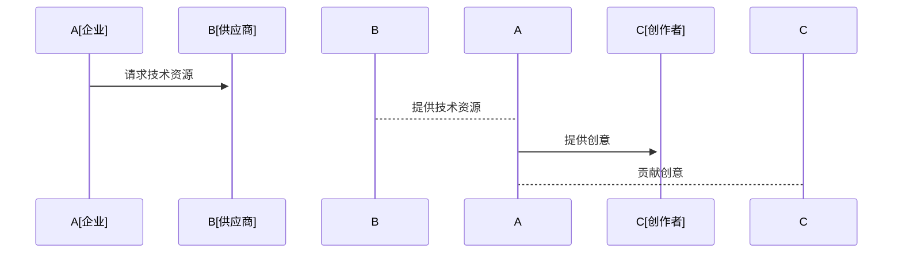

                 


# 巴菲特的创新能力评估：开放式创新生态系统的价值

## 关键词：
- 巴菲特
- 创新能力评估
- 开放式创新
- 生态系统
- 价值分析

## 摘要：
本文探讨了巴菲特创新能力评估的重要性，以及开放式创新生态系统在其中的价值。通过分析创新评估的框架、算法原理和系统架构，结合实际案例，展示了如何通过开放式创新生态系统提升企业的创新能力，并展望了未来的发展方向。

---

## 第1章：背景介绍

### 1.1 创新能力评估的定义与意义

#### 1.1.1 创新能力评估的核心概念
创新能力评估是对企业或个人在创新方面的能力进行测量和分析的过程，旨在识别其在技术研发、市场适应性和战略制定等方面的优势和不足。

#### 1.1.2 创新能力评估的背景与问题背景
在快速变化的商业环境中，创新能力成为企业竞争优势的关键。巴菲特作为投资界的传奇，其成功的部分原因在于对创新企业的精准判断。

#### 1.1.3 创新能力评估的边界与外延
创新能力评估不仅关注技术层面，还包括市场响应、组织结构和文化等多方面因素。

---

### 1.2 开放式创新生态系统的定义与特点

#### 1.2.1 开放式创新的定义
开放式创新是一种通过外部资源和知识的整合，加速内部创新的模式，打破了传统的封闭创新边界。

#### 1.2.2 开放式创新的核心特征
- 资源整合：利用外部资源和知识。
- 协作创新：鼓励跨组织合作。
- 开放共享：知识和资源的开放共享。

#### 1.2.3 开放式创新与传统创新模式的区别
- 传统创新：内部资源主导。
- 开放式创新：外部资源整合，协作创新。

---

## 第2章：核心概念与联系

### 2.1 创新能力评估的框架

#### 2.1.1 创新能力评估的维度
- 技术创新
- 市场创新
- 组织创新

#### 2.1.2 创新能力评估的指标体系
- 技术创新指标：研发支出比例、专利数量。
- 市场创新指标：市场占有率、客户满意度。
- 组织创新指标：组织灵活性、员工创新能力。

#### 2.1.3 创新能力评估的模型
- 加权评分模型：$S = \sum (w_i \times s_i)$，其中$w_i$是权重，$s_i$是评分。

### 2.2 开放式创新生态系统的核心要素

#### 2.2.1 开放式创新的参与者
- 企业：主导创新活动。
- 供应商：提供技术和资源。
- 创作者：贡献创意和知识。

#### 2.2.2 开放式创新的资源与能力
- 技术资源：专利、研发能力。
- 知识资源：行业知识、最佳实践。

#### 2.2.3 开放式创新的环境与支持机制
- 制度环境：政策支持、法律框架。
- 文化环境：创新文化、合作氛围。

---

## 第3章：算法原理

### 3.1 创新能力评估的数学模型

#### 3.1.1 创新能力评估的加权评分公式
$$ S = \sum_{i=1}^{n} w_i \times s_i $$
其中，$w_i$是指标$i$的权重，$s_i$是评分。

#### 3.1.2 创新能力评估的综合得分公式
$$ T = \frac{\sum (w_i \times s_i)}{\sum w_i} $$

#### 3.1.3 创新能力评估的对
$$ P = \sum (w_i \times s_i) $$

---

## 第4章：系统架构与设计方案

### 4.1 创新能力评估的系统架构

#### 4.1.1 系统功能模块划分
- 数据采集模块：收集企业数据。
- 数据分析模块：处理和分析数据。
- 评估模块：计算创新能力评分。

#### 4.1.2 系统功能流程图


#### 4.1.3 系统数据流图


### 4.2 开放式创新生态系统的架构设计

#### 4.2.1 开放式创新的系统组成
- 资源层：技术资源、知识资源。
- 应用层：创新项目、合作网络。
- 支持层：政策支持、文化支持。

#### 4.2.2 开放式创新的系统交互设计


---

## 第5章：项目实战

### 5.1 创新能力评估的环境安装与配置

#### 5.1.1 系统运行环境要求
- 操作系统：Linux/Windows/MacOS
- 开发工具：Python 3.8+

#### 5.1.2 系统依赖库安装
```bash
pip install numpy pandas scikit-learn
```

#### 5.1.3 系统配置文件示例
```python
config = {
    'weight': [0.4, 0.3, 0.3],
    'threshold': 0.7
}
```

### 5.2 创新能力评估的核心实现代码

#### 5.2.1 创新能力评估的Python实现
```python
import numpy as np
from sklearn.metrics import mean_squared_error

def calculate创新能力评分(数据):
    加权评分 = np.dot(数据.权重, 数据.评分)
    return 加权评分
```

#### 5.2.2 开放式创新生态系统的代码实现
```python
class 开放式创新生态系统:
    def __init__(self, 资源):
        self.资源 = 资源

    def 整合资源(self, 新资源):
        self.资源 += 新资源
        return self.资源
```

---

## 第6章：最佳实践与总结

### 6.1 创新能力评估的实践技巧

#### 6.1.1 创新能力评估的常见问题及解决方案
- 数据不足：使用外部数据源填充。
- 模型过拟合：采用交叉验证。

#### 6.1.2 开放式创新生态系统中的注意事项
- 确保数据隐私。
- 加强合作网络的维护。

#### 6.1.3 创新能力评估的优化建议
- 定期更新模型。
- 结合行业特点调整权重。

### 6.2 创新能力评估的总结与展望

#### 6.2.1 本书的核心内容回顾
详细介绍了创新能力评估的框架、算法和实际应用。

#### 6.2.2 创新能力评估的未来发展方向
- 结合人工智能技术。
- 应用到更多行业。

#### 6.2.3 开放式创新生态系统的潜在研究领域
- 知识共享机制。
- 创新绩效的长期影响。

---

## 第7章：数学公式与模型

### 7.1 创新能力评估的数学模型

#### 7.1.1 创新能力评估的加权评分公式
$$ S = \sum_{i=1}^{n} w_i \times s_i $$

#### 7.1.2 创新能力评估的综合得分计算
$$ T = \frac{\sum (w_i \times s_i)}{\sum w_i} $$

#### 7.1.3 创新能力评估的对
$$ P = \sum (w_i \times s_i) $$

---

## 作者信息

作者：AI天才研究院/AI Genius Institute & 禅与计算机程序设计艺术 /Zen And The Art of Computer Programming

