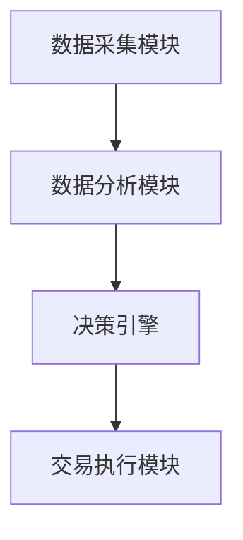
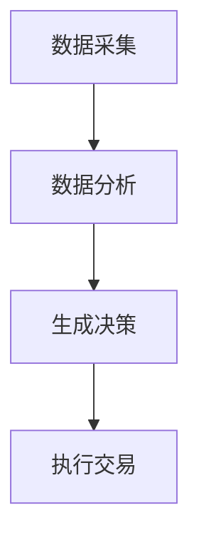

                 


# 巴菲特的反周期投资方法：在恐慌中买入

> 关键词：巴菲特，反周期投资，安全边际，内在价值，市场恐慌，价值投资

> 摘要：本文深入分析巴菲特的反周期投资策略，探讨其在市场恐慌时买入优质资产的原理和方法。通过系统分析、算法设计和实战案例，揭示如何利用市场周期波动，实现长期稳健的投资回报。

---

## 第一部分: 巴菲特反周期投资方法概述

### 第1章: 投资基础与巴菲特投资哲学

#### 1.1 投资的基本概念
##### 1.1.1 投资的定义与分类
投资是指将资金投入到资产中，以期在未来获得收益或资本增值的行为。投资可以分为股票、债券、房地产等多种形式，其中股票投资因其高回报潜力而备受关注。

##### 1.1.2 股票市场的基本原理
股票市场是企业通过发行股票筹集资金的场所。股票价格受多种因素影响，包括公司业绩、市场情绪、宏观经济环境等。市场的波动性使得股票价格经常偏离其内在价值。

##### 1.1.3 巴菲特的投资哲学概述
巴菲特的投资哲学以价值投资为核心，强调寻找具有持续竞争优势、良好管理团队和合理估值的公司。他主张长期持有优质资产，避免短期市场波动的干扰。

#### 1.2 巴菲特的生平与投资成就
##### 1.2.1 巴菲特的早年经历
巴菲特早年展现出对投资的极大兴趣，通过阅读格雷厄姆的价值投资理论奠定了其投资基础。他在大学期间就开始投资，积累了丰富的实战经验。

##### 1.2.2 巴菲特的投资理念与风格
巴菲特的理念强调安全边际、内在价值和长期持有。他认为市场先生的情绪波动为投资者提供了廉价买入优质资产的机会。

##### 1.2.3 巴菲特的经典投资案例
巴菲特的经典投资案例包括可口可乐和美国运通等。这些投资的成功在于他选择了具有强大护城河和稳定现金流的企业。

### 第2章: 反周期投资的基本原理
#### 2.1 经济周期与市场波动
##### 2.1.1 经济周期的定义与阶段划分
经济周期分为衰退、复苏、繁荣和衰退四个阶段。在衰退阶段，市场恐慌，资产价格被低估，为反周期投资提供了机会。

##### 2.1.2 市场波动的规律与特征
市场波动具有周期性，恐慌和贪婪交替出现。反周期投资的核心是在恐慌时买入，在贪婪时卖出。

##### 2.1.3 反周期投资的定义与特点
反周期投资是指在市场低迷时投资，利用资产价格的低估实现超额收益。其特点是逆向思维和长期持有。

#### 2.2 巴菲特的反周期投资策略
##### 2.2.1 反周期投资的核心理念
巴菲特强调在市场恐慌时买入优质资产，因为此时价格被低估，提供了安全边际。

##### 2.2.2 在恐慌中买入的逻辑
恐慌导致市场抛售，优质资产价格下跌，为长期投资者提供了买入良机。巴菲特定价收购企业，利用恐慌实现收益。

##### 2.2.3 巴菲特的经典反周期投资案例
巴菲特在2008年金融危机期间大量买入高盛和摩根士丹利的股票，展现了其在恐慌中的投资策略。

### 第3章: 巴菲特反周期投资的核心概念
#### 3.1 安全边际的概念与计算
##### 3.1.1 安全边际的定义
安全边际是指买入价格低于内在价值的部分，确保即使市场波动，投资者也能获得收益。

##### 3.1.2 安全边际的计算方法
计算公式为：安全边际 = 内在价值 - 市场价格。

##### 3.1.3 安全边际在反周期投资中的应用
在市场恐慌时，寻找安全边际高的股票，确保投资的安全性。

#### 3.2 内在价值与市场价值的对比
##### 3.2.1 内在价值的定义与计算
内在价值是未来现金流的现值。计算公式为：
$$
\text{内在价值} = \sum_{t=1}^{\infty} \frac{\text{现金流}_t}{(1 + r)^t}
$$

##### 3.2.2 市场价值的波动性分析
市场价值受情绪影响，经常偏离内在价值。在恐慌时，市场价值可能低于内在价值。

##### 3.2.3 内在价值与市场价值的动态关系
市场价值围绕内在价值波动。反周期投资的核心是利用市场低估内在价值的机会。

#### 3.3 价值陷阱与价值机会的识别
##### 3.3.1 价值陷阱的定义与特征
价值陷阱是指价格看似便宜，但公司基本面不佳，缺乏竞争优势。

##### 3.3.2 价值机会的识别方法
通过分析公司财务状况、竞争优势和管理层质量，识别真正的价值机会。

##### 3.3.3 巴菲特如何避免价值陷阱
巴菲特定价收购优质企业，避免投资于管理层不佳或缺乏竞争优势的公司。

---

## 第二部分: 反周期投资的系统分析与架构设计

### 第4章: 反周期投资的系统分析

#### 4.1 投资决策系统的构建
##### 4.1.1 系统目标与范围
构建一个能够识别反周期投资机会的系统，帮助投资者在市场恐慌时做出决策。

##### 4.1.2 系统功能需求分析
系统需具备数据采集、分析、决策生成和执行功能。

##### 4.1.3 系统架构设计
系统架构包括数据采集模块、数据分析模块、决策引擎和交易执行模块。

#### 4.2 数据流分析
##### 4.2.1 数据来源与收集
从Yahoo Finance获取股票数据和市场指标。

##### 4.2.2 数据处理与分析
计算市场情绪指标和股票估值指标，识别投资机会。

##### 4.2.3 数据可视化与决策支持
使用图表展示市场数据，辅助投资决策。

### 第5章: 投资决策系统的架构设计

#### 5.1 系统模块划分
##### 5.1.1 数据采集模块
从多个数据源获取实时和历史数据。

##### 5.1.2 数据分析模块
计算内在价值、安全边际和市场情绪指标。

##### 5.1.3 决策引擎
基于预设条件生成买入或卖出信号。

##### 5.1.4 交易执行模块
根据决策信号执行交易。

#### 5.2 系统架构设计
##### 5.2.1 系统架构图


##### 5.2.2 系统功能流程图


### 第6章: 反周期投资算法设计

#### 6.1 算法原理
##### 6.1.1 算法目标
识别市场恐慌时的买入机会。

##### 6.1.2 算法步骤
1. 数据采集：获取市场数据。
2. 计算指标：计算市场情绪和股票估值指标。
3. 生成信号：根据指标生成买入或卖出信号。
4. 执行交易：根据信号执行交易。

#### 6.2 算法实现
##### 6.2.1 算法代码示例
```python
import yfinance as yf
import pandas as pd
import numpy as np

def calculate_intrinsic_value(company, data):
    # 示例：使用股利贴现模型计算内在价值
    dividend = data['dividend'][company]
    growth_rate = 0.05  # 假设股利年增长率为5%
    required_return = 0.10  # 折现率10%
    
    present_value = dividend / (required_return - growth_rate)
    return present_value

def calculate_margin_of_safety(company, data, intrinsic_value):
    market_price = data['close'][company]
    margin = (intrinsic_value - market_price) / intrinsic_value
    return margin

# 数据采集
data = yf.download(tickers='AAPL', period='max')

# 计算内在价值和安全边际
intrinsic_value = calculate_intrinsic_value('AAPL', data)
margin_of_safety = calculate_margin_of_safety('AAPL', data, intrinsic_value)

print(f'苹果的内在价值：{intrinsic_value}')
print(f'安全边际：{margin_of_safety}')
```

#### 6.3 算法优化与调优
##### 6.3.1 参数优化
调整折现率和增长率等参数，以提高模型准确性。

##### 6.3.2 模型优化
引入更多的估值指标，如市净率、EV/EBITDA等，提高模型的全面性。

### 第7章: 项目实战

#### 7.1 环境安装与配置
##### 7.1.1 安装Python和相关库
安装Python 3.9以上版本，安装yfinance、pandas、numpy等库。

##### 7.1.2 数据源配置
设置Yahoo Finance API，获取所需数据。

#### 7.2 系统核心实现
##### 7.2.1 数据采集与处理
编写代码从Yahoo Finance获取数据，并进行清洗和处理。

##### 7.2.2 指标计算与分析
计算内在价值、市场情绪指标，并识别投资机会。

##### 7.2.3 交易策略实现
根据预设条件生成交易信号，并模拟交易执行。

#### 7.3 实际案例分析
##### 7.3.1 案例背景
选择一只股票，如苹果公司（AAPL）。

##### 7.3.2 数据分析
计算苹果的内在价值和安全边际，识别其投资价值。

##### 7.3.3 策略执行
在市场恐慌时买入苹果股票，验证策略的有效性。

#### 7.4 项目小结
总结项目实施过程中的经验教训，提出改进建议。

---

## 第三部分: 反周期投资的最佳实践

### 第8章: 反周期投资的最佳实践

#### 8.1 投资心态管理
##### 8.1.1 避免情绪化决策
保持冷静，避免贪婪和恐慌的干扰。

##### 8.1.2 坚持长期投资
长期持有优质资产，忽略短期波动。

#### 8.2 风险管理策略
##### 8.2.1 分散投资
避免过度集中，降低投资风险。

##### 8.2.2 设置止损点
在市场大幅波动时，设置止损点以控制风险。

### 第9章: 总结与展望

#### 9.1 小结
总结反周期投资的核心理念和实施方法。

#### 9.2 注意事项
提醒读者注意市场波动和系统风险。

#### 9.3 拓展阅读
推荐相关书籍和资源，供读者深入学习。

---

## 作者：AI天才研究院/AI Genius Institute & 禅与计算机程序设计艺术 /Zen And The Art of Computer Programming

