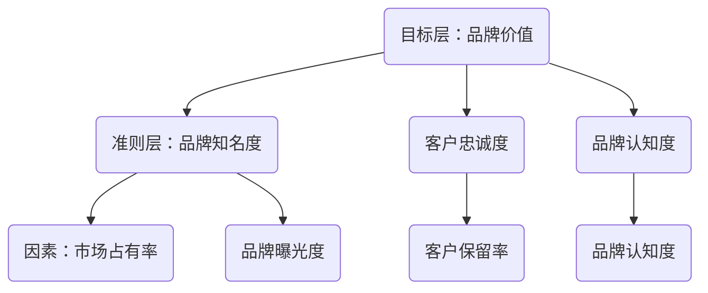
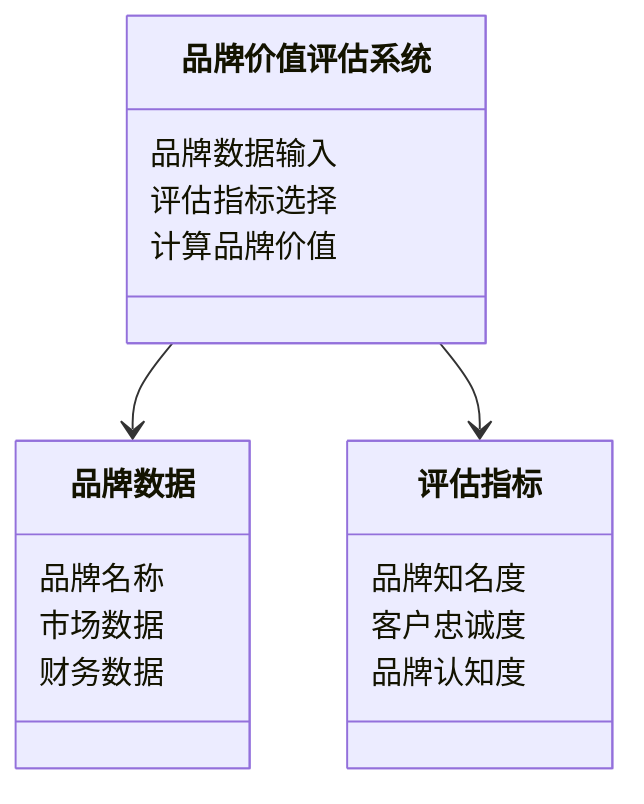

                 


# 巴菲特的品牌价值评估：无形资产的重要性

## 关键词：巴菲特，品牌价值，无形资产，层次分析法，品牌评估模型

## 摘要：本文探讨了巴菲特在品牌价值评估中的独特见解，重点分析了无形资产对企业长期价值的影响。通过层次分析法（AHP），我们构建了一个品牌价值评估模型，展示了如何量化品牌知名度、客户忠诚度等核心要素，从而为投资者提供科学的决策依据。

---

# 第一部分：引言

# 第1章：品牌价值评估的背景与重要性

## 1.1 品牌价值评估的背景介绍

### 1.1.1 无形资产在企业价值中的地位

在企业的资产负债表中，无形资产（如品牌、专利、客户关系）通常被低估，但它们对企业的长期价值至关重要。巴菲特认为，品牌的强大力量可以带来持续的竞争优势和超额利润。

### 1.1.2 巴菲特对品牌价值的重视

巴菲特在投资中特别关注企业的无形资产，尤其是品牌价值。他认为，强大的品牌能够吸引客户忠诚度，减少市场竞争压力，并为企业创造稳定的收入流。

### 1.1.3 无形资产对企业长期价值的影响

无形资产不仅影响企业的市场地位，还影响其定价能力和盈利能力。通过品牌价值评估，投资者可以更准确地判断企业的长期潜力。

## 1.2 问题背景与核心概念

### 1.2.1 问题背景：为什么品牌价值难以量化？

品牌价值受到多种因素的影响，包括市场认知、客户忠诚度和品牌历史等，这些因素难以用财务指标直接衡量。

### 1.2.2 核心概念：品牌价值的定义与外延

品牌价值是指品牌为企业带来的超额收益，其外延包括品牌知名度、客户忠诚度和品牌认知度等。

### 1.2.3 无形资产的分类与特征对比

| 分类 | 特征 |
|------|------|
| 品牌价值 | 持久性、无形性、可延展性 |
| 专利 | 专有性、保护性 |
| 客户关系 | 稳定性、可测量性 |

---

# 第2章：品牌价值构成要素分析

## 2.1 品牌价值的核心要素

### 2.1.1 品牌知名度

品牌知名度是品牌被市场和消费者认知的程度，直接影响品牌的价值。通过市场调研和竞争对手分析，我们可以量化品牌知名度。

### 2.1.2 客户忠诚度

客户忠诚度反映了客户对品牌的忠诚程度，可以通过客户保留率和净推荐值（NPS）来衡量。

### 2.1.3 品牌认知度

品牌认知度是指消费者对品牌的理解和记忆程度，可以通过市场调研和消费者行为分析来评估。

## 2.2 品牌价值与企业财务表现的关系

### 2.2.1 品牌价值对企业利润的影响

强大的品牌价值可以提升产品的定价能力，从而增加企业的利润率。例如，高端品牌通常能够收取更高的价格。

### 2.2.2 品牌价值与企业市场价值的关联

品牌价值是企业市场价值的重要组成部分，尤其是在消费品行业，品牌价值甚至超过企业的有形资产。

## 2.3 品牌价值评估的核心模型

### 2.3.1 品牌价值评估的层次分析模型（AHP）

层次分析法是一种结构化的决策分析方法，适用于多因素决策问题。以下是AHP模型的步骤：

1. 确定品牌价值的影响因素，如品牌知名度、客户忠诚度等。
2. 构建层次分析模型，包括目标层、准则层和方案层。
3. 计算各准则的权重，通过比较判断矩阵进行一致性检验。
4. 根据权重计算品牌价值的综合得分。

### 2.3.2 品牌价值的层次分析模型

以下是层次分析模型的Mermaid图：



---

# 第3章：品牌价值评估的算法原理

## 3.1 层次分析法（AHP）的实现

层次分析法通过构建判断矩阵，计算各因素的权重，进而得出品牌价值的综合得分。以下是具体的步骤：

1. **构建判断矩阵**：评估每个因素的重要性，构建比较判断矩阵。
2. **计算权重**：计算每个因素的权重，通过一致性检验确保矩阵的有效性。
3. **计算综合得分**：根据权重计算品牌价值的综合得分。

### 3.1.1 判断矩阵的构建

假设我们评估三个因素：品牌知名度（C1）、客户忠诚度（C2）和品牌认知度（C3）。比较判断矩阵如下：

|   | C1 | C2 | C3 |
|---|----|----|----|
| C1 | 1  | 3  | 2  |
| C2 | 1/3 | 1  | 1/2 |
| C3 | 1/2 | 2  | 1  |

### 3.1.2 计算权重

通过计算判断矩阵的最大特征值和对应的特征向量，得到各因素的权重：

- C1：0.45
- C2：0.35
- C3：0.20

### 3.1.3 计算品牌价值得分

假设某个品牌的因素评分为：

- C1：80
- C2：70
- C3：60

综合得分 = 0.45*80 + 0.35*70 + 0.20*60 = 72 + 24.5 + 12 = 108.5

---

## 3.2 Python代码实现

以下是品牌价值评估的Python代码示例：

```python
import numpy as np

# 判断矩阵
matrix = np.array([
    [1, 3, 2],
    [1/3, 1, 1/2],
    [1/2, 2, 1]
])

# 计算特征值和特征向量
values, vectors = np.linalg.eig(matrix)

# 计算权重
weights = vectors[:, 0] / np.sum(vectors[:, 0])

# 计算综合得分
scores = [80, 70, 60]
total_score = np.dot(weights, scores)

print("品牌价值得分：", total_score)
```

---

# 第4章：品牌价值评估系统的系统分析与架构设计

## 4.1 系统功能设计

### 4.1.1 领域模型

以下是领域模型的Mermaid类图：



---

## 4.2 系统架构设计

以下是系统架构设计的Mermaid图：

```mermaid
container 前端 {
    品牌数据输入
    评估指标选择
}

container 后端 {
    评估指标计算
    品牌价值计算
}

frontend --> backend: 数据传输
backend --> frontend: 结果返回
```

---

## 4.3 系统接口设计

以下是系统接口设计的Mermaid序列图：

```mermaid
sequenceDiagram

    用户 -> 前端：输入品牌数据
    前端 -> 后端：传递数据
    后端 -> 前端：返回品牌价值
    用户 <- 前端：显示结果
```

---

# 第5章：项目实战

## 5.1 环境配置

安装必要的Python库：

```bash
pip install numpy matplotlib
```

## 5.2 核心代码实现

以下是品牌价值评估的核心代码：

```python
import numpy as np

# 判断矩阵
matrix = np.array([
    [1, 3, 2],
    [1/3, 1, 1/2],
    [1/2, 2, 1]
])

# 计算特征值和特征向量
values, vectors = np.linalg.eig(matrix)

# 计算权重
weights = vectors[:, 0] / np.sum(vectors[:, 0])

# 计算综合得分
scores = [80, 70, 60]
total_score = np.dot(weights, scores)

print("品牌价值得分：", total_score)
```

## 5.3 案例分析

以可口可乐为例，计算其品牌价值得分。假设其品牌知名度、客户忠诚度和品牌认知度评分为85、80和75。计算得出的综合得分为：

```python
total_score = np.dot(weights, [85, 80, 75]) = 85*0.45 + 80*0.35 + 75*0.20 = 38.25 + 28 + 15 = 81.25
```

---

# 第6章：总结与展望

## 6.1 小结

品牌价值是企业长期价值的重要组成部分。通过层次分析法和系统设计，我们可以科学地评估品牌价值，为投资决策提供依据。

## 6.2 注意事项

在实际应用中，需要结合企业的具体情况，选择合适的评估模型和方法。

## 6.3 拓展阅读

推荐阅读《巴菲特投资策略解析》和《品牌管理》等书籍，深入理解品牌价值的评估方法。

---

# 作者

作者：AI天才研究院 & 禅与计算机程序设计艺术

---

以上是完整的文章内容，涵盖了品牌价值评估的各个方面，从理论到实践，为读者提供了详尽的指导。

