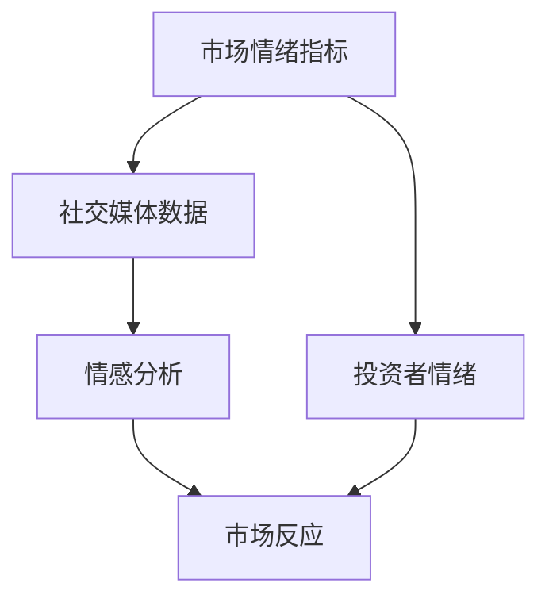
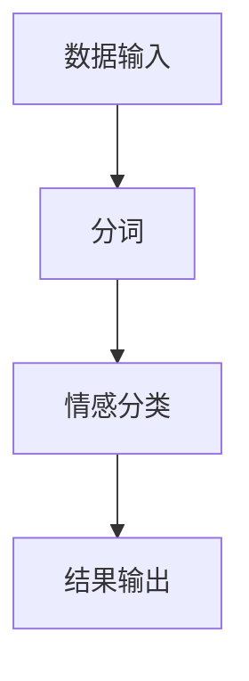
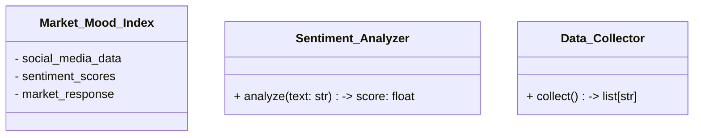
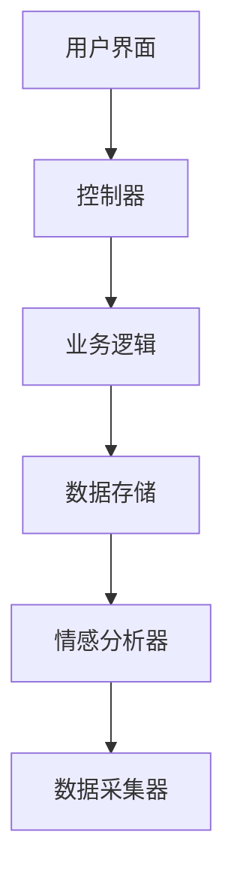

                 


```markdown
# 巴菲特的市场情绪指标2.0：社交媒体时代的舆情分析

> 关键词：市场情绪指标、社交媒体、舆情分析、自然语言处理、情感分析、深度学习、巴菲特指标

> 摘要：本文深入探讨了在社交媒体时代，如何改进巴菲特的市场情绪指标，通过自然语言处理和深度学习技术，实现对社交媒体舆情的精准分析，帮助投资者更好地理解市场情绪，做出更明智的投资决策。

---

# 第1章: 背景介绍

## 1.1 问题背景

### 1.1.1 市场情绪指标的定义与作用
市场情绪指标是衡量市场参与者情绪状态的量化工具，能够反映市场的乐观或悲观情绪。巴菲特曾提出过一些经典的市场情绪指标，但随着社交媒体的兴起，传统的指标已难以满足需求。

### 1.1.2 社交媒体时代市场情绪分析的必要性
社交媒体的兴起使得市场参与者的情绪表达更加多样化和实时化。通过分析社交媒体上的海量数据，可以更及时、准确地捕捉市场情绪。

### 1.1.3 巴菲特市场情绪指标的历史演变
从巴菲特的经典指标到社交媒体时代的指标2.0，本文将详细分析其演变过程和改进方向。

## 1.2 问题描述

### 1.2.1 社交媒体数据的特点与挑战
社交媒体数据具有实时性、多样性、噪声多等特点，这些特点为市场情绪分析带来了新的挑战。

### 1.2.2 当前市场情绪分析的局限性
传统的市场情绪指标可能存在滞后性、片面性等问题，难以捕捉社交媒体时代的复杂情绪。

### 1.2.3 巴菲特指标2.0的核心目标
通过结合社交媒体数据和自然语言处理技术，优化市场情绪指标，使其更准确、实时、全面。

## 1.3 问题解决

### 1.3.1 社交媒体数据的采集与处理
介绍如何从社交媒体平台（如Twitter、Reddit）获取数据，并进行清洗和预处理。

### 1.3.2 基于NLP的市场情绪分析方法
通过自然语言处理技术，提取社交媒体文本中的情绪特征，构建市场情绪指标。

### 1.3.3 巴菲特指标2.0的创新点
结合社交媒体数据和深度学习技术，提出改进的市场情绪指标，提升其准确性和实时性。

## 1.4 边界与外延

### 1.4.1 市场情绪指标的适用范围
明确市场情绪指标的应用场景和限制条件，避免误用。

### 1.4.2 相关概念的区分与联系
区分市场情绪指标与其他相关概念（如情感分析、舆情监控）的异同，明确其独特性。

### 1.4.3 指标2.0的局限性与改进方向
分析指标2.0的局限性，并提出未来可能的改进方向。

## 1.5 概念结构与核心要素

### 1.5.1 指标体系的核心框架
介绍市场情绪指标2.0的核心框架，包括数据源、特征提取、模型构建等部分。

### 1.5.2 核心要素的定义与属性
详细定义市场情绪指标2.0的核心要素，如情感强度、情绪类别、时间窗口等。

### 1.5.3 指标之间的关系与影响
分析不同指标之间的关系，以及它们对市场情绪分析的综合影响。

---

# 第2章: 核心概念与联系

## 2.1 市场情绪指标的核心原理

### 2.1.1 情感分析的基本原理
介绍情感分析的基本概念和常用方法，如基于规则的分析和基于机器学习的分析。

### 2.1.2 巴菲特指标的数学模型
通过数学公式，描述市场情绪指标的计算方法。

### 2.1.3 社交媒体数据的特征提取
分析社交媒体数据中的文本特征，如关键词、句式、情感倾向等。

## 2.2 核心概念的属性对比

### 2.2.1 不同市场情绪指标的对比分析
通过表格形式，对比不同市场情绪指标的优缺点。

### 2.2.2 社交媒体数据与传统数据的对比
分析社交媒体数据与传统市场数据在特征、规模、实时性等方面的差异。

### 2.2.3 情感强度与市场反应的关系
探讨情感强度与市场实际反应之间的相关性。

## 2.3 ER实体关系图



---

# 第3章: 算法原理讲解

## 3.1 数据采集与预处理

### 3.1.1 数据采集方法
介绍从社交媒体平台获取数据的具体方法，包括API调用和网络爬虫。

### 3.1.2 数据清洗流程
详细说明数据清洗的步骤，如去除噪声、处理重复数据等。

### 3.1.3 数据标注与分类
描述如何对社交媒体数据进行标注和分类，以便后续分析。

## 3.2 情感分析算法

### 3.2.1 算法流程


### 3.2.2 代码实现
```python
import nltk
from nltk.sentiment import SentimentIntensityAnalyzer

sia = SentimentIntensityAnalyzer()
text = "I love this stock!"
scores = sia.polarity_scores(text)
print(scores)  # 输出情感分数
```

## 3.3 模型训练与优化

### 3.3.1 模型选择
比较不同情感分析模型的优缺点，如Naive Bayes、SVM、深度学习模型等。

### 3.3.2 模型训练流程
描述从数据预处理到模型训练的具体步骤。

### 3.3.3 模型优化方法
介绍如何通过调参、数据增强等方法优化模型性能。

## 3.4 代码实现

### 3.4.1 情感分析模型的实现
```python
from sklearn.feature_extraction.text import TfidfVectorizer
from sklearn.svm import SVC

vectorizer = TfidfVectorizer()
model = SVC()
model.fit(vectorizer.fit_transform(train_texts), train_labels)
```

---

# 第4章: 数学模型与公式

## 4.1 情感分析的数学模型

### 4.1.1 词袋模型
描述词袋模型的基本原理和实现方法。

### 4.1.2 TF-IDF权重计算
详细说明TF-IDF的计算公式：
$$ \text{TF-IDF}(i,j) = \text{TF}(i,j) \times \text{IDF}(j) $$

### 4.1.3 情感强度计算公式
$$ \text{score} = \sum_{i=1}^{n} w_i \times s_i $$

## 4.2 深度学习模型

### 4.2.1 LSTM结构
介绍LSTM的基本结构和在情感分析中的应用。

### 4.2.2 Transformer机制
描述Transformer的自注意力机制及其在情感分析中的优势。

### 4.2.3 模型损失函数
给出常用的损失函数公式：
$$ \text{Loss} = -\frac{1}{N}\sum_{i=1}^{N} y_i \log(\hat{y}_i) $$

---

# 第5章: 系统分析与架构设计方案

## 5.1 系统功能设计

### 5.1.1 领域模型


### 5.1.2 系统架构设计


## 5.2 系统架构设计

### 5.2.1 系统模块划分
将系统划分为数据采集模块、情感分析模块、结果展示模块等。

### 5.2.2 模块之间的接口设计
描述模块之间的交互接口和数据流。

### 5.2.3 模块之间的交互流程
通过序列图展示模块之间的协作流程。

---

# 第6章: 项目实战

## 6.1 环境安装

### 6.1.1 安装Python
介绍如何安装Python及其常用开发工具。

### 6.1.2 安装NLP库
安装如nltk、scikit-learn、transformers等NLP库。

## 6.2 核心实现

### 6.2.1 数据采集
编写代码从社交媒体平台采集数据。

### 6.2.2 数据预处理
对采集到的数据进行清洗和标注。

### 6.2.3 情感分析
实现情感分析模型并对数据进行预测。

## 6.3 代码解读与分析
详细解读核心代码，分析其实现原理和优化点。

## 6.4 案例分析
通过实际案例，展示市场情绪指标2.0的应用效果。

## 6.5 项目小结
总结项目实现的关键点和经验教训。

---

# 第7章: 总结与展望

## 7.1 核心结论
总结市场情绪指标2.0的核心创新点和实际价值。

## 7.2 应用价值
分析市场情绪指标2.0在投资决策中的应用前景。

## 7.3 未来研究方向
提出未来可能的研究方向和改进空间。

---

作者：AI天才研究院/AI Genius Institute & 禅与计算机程序设计艺术 /Zen And The Art of Computer Programming
```

