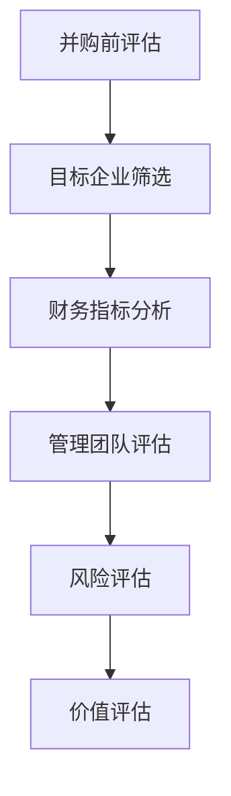
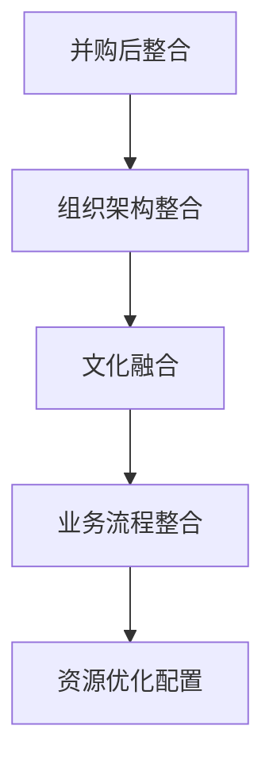
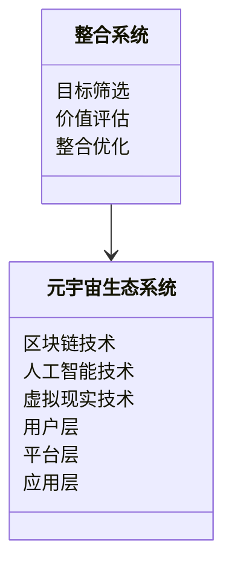
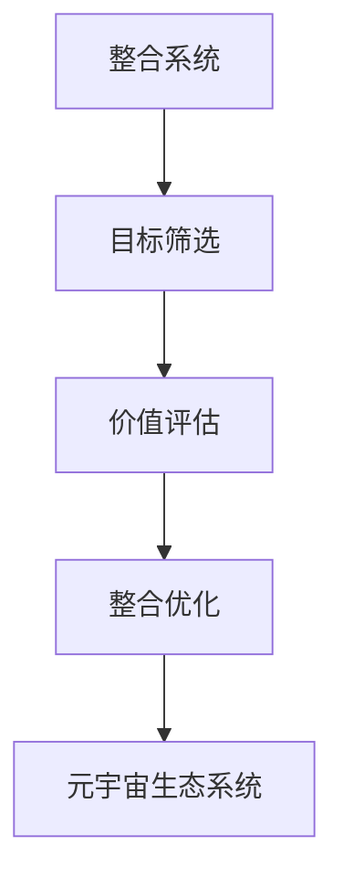

                 


# 巴菲特的并购艺术：元宇宙生态系统整合的新策略

## 关键词：巴菲特、并购艺术、元宇宙、生态系统整合、技术策略、投资策略、系统架构

## 摘要：  
本文探讨了巴菲特并购艺术在元宇宙生态系统整合中的应用策略。通过分析巴菲特并购的核心要素，结合元宇宙技术基础与生态系统特点，提出了一套基于巴菲特投资哲学的元宇宙整合新策略。文章详细阐述了元宇宙生态系统的整合方法，结合数学模型和系统架构图，提出了并购前评估、目标筛选、价值评估、整合优化等关键步骤。最后，通过实际案例分析，展示了如何将巴菲特的并购艺术应用于元宇宙生态系统的整合中，以实现价值最大化和风险控制。

---

# 第1章 巴菲特并购艺术与元宇宙概念概述

## 1.1 巴菲特并购艺术的核心理念

### 1.1.1 巴菲特并购投资哲学  
巴菲特的并购投资哲学以“价值投资”为核心，强调企业内在价值的评估和长期稳健的投资策略。他注重企业的财务健康、管理团队的稳定性以及行业地位等因素。以下是巴菲特并购投资哲学的关键点：  
1. **长期主义**：关注企业的长期价值，而非短期市场波动。  
2. **安全边际**：以低于企业内在价值的价格进行投资。  
3. **管理层信任**：选择具备诚信和能力的管理层。  
4. **竞争优势**：投资具有持续竞争优势的企业。  

### 1.1.2 巴菲特并购策略的核心要素  
1. **企业价值评估**：通过分析企业的财务指标（如ROE、ROA、净利润率等）来评估其内在价值。  
2. **财务健康性**：关注企业的资产负债表，确保其具备健康的财务状况。  
3. **行业地位**：选择具有市场领导地位或竞争优势的企业。  
4. **并购后的整合能力**：确保并购后能够实现业务协同和价值最大化。  

### 1.1.3 巴菲特并购成功案例分析  
以巴菲特收购喜诗糖果为例：  
- **背景**：喜诗糖果是一家具有强大品牌优势和市场份额的公司。  
- **评估**：巴菲特团队通过详细分析财务数据和市场地位，确定其内在价值。  
- **整合**：并购后通过优化管理、降低成本，实现了价值最大化。  

## 1.2 元宇宙概念与技术基础

### 1.2.1 元宇宙的定义与特点  
元宇宙（Metaverse）是一个虚拟的三维空间，结合了区块链、人工智能、虚拟现实（VR）和增强现实（AR）等技术，构建一个沉浸式的数字世界。其特点包括：  
1. **去中心化**：基于区块链技术，确保数据的安全性和不可篡改性。  
2. **实时性**：用户可以在虚拟空间中进行实时互动。  
3. **开放性**：支持多种应用和内容的接入。  

### 1.2.2 元宇宙的核心技术支撑  
1. **区块链技术**：用于数字资产的交易和身份认证。  
2. **人工智能（AI）**：用于智能合约和虚拟助手的实现。  
3. **虚拟现实（VR）和增强现实（AR）**：提供沉浸式的用户体验。  
4. **边缘计算**：优化元宇宙的实时性和响应速度。  

### 1.2.3 元宇宙生态系统的构成  
元宇宙生态系统由以下几个核心部分组成：  
1. **基础设施**：包括区块链网络、服务器和边缘计算设备。  
2. **平台层**：提供开发工具和应用发布平台。  
3. **应用层**：涵盖游戏、社交、电子商务等多种应用场景。  
4. **用户层**：包括终端用户和开发者。  

## 1.3 元宇宙生态系统整合的背景与意义

### 1.3.1 元宇宙生态系统的整合需求  
随着元宇宙的快速发展，生态系统内的企业需要通过并购整合来实现资源的优化配置和竞争优势的提升。  

### 1.3.2 巴菲特并购艺术在元宇宙中的应用潜力  
巴菲特的并购策略可以为元宇宙生态系统的整合提供重要的理论支持，尤其是在企业价值评估和风险控制方面。  

### 1.3.3 元宇宙生态系统整合的未来趋势  
未来的元宇宙生态系统将更加依赖于高效的整合策略，以实现跨平台的协同和创新。  

---

# 第2章 巴菲特并购策略的核心要素分析

## 2.1 巴菲特并购策略的五个关键点

### 2.1.1 企业价值评估标准  
1. **ROE（净资产收益率）**：衡量企业盈利能力的重要指标。  
2. **ROA（资产收益率）**：评估企业资产的使用效率。  
3. **净利润率**：反映企业的盈利能力和成本控制能力。  

### 2.1.2 财务指标分析方法  
- **净现值法（NPV）**：用于评估并购项目的经济价值。  
- **内部收益率法（IRR）**：衡量项目的投资回报率。  

### 2.1.3 管理团队评估的重要性  
1. **团队稳定性**：管理团队的稳定性直接影响企业的长期发展。  
2. **团队能力**：具备行业经验和领导能力的管理团队更有可能实现价值创造。  

### 2.1.4 并购后的整合策略  
1. **组织架构整合**：优化组织结构，避免重复和冗余。  
2. **文化融合**：通过文化整合实现团队的协同合作。  

### 2.1.5 风险控制与价值最大化  
1. **风险评估**：通过SWOT分析法识别并购中的潜在风险。  
2. **价值最大化**：通过优化管理和资源配置实现价值提升。  

## 2.2 巴菲特并购策略的数学模型

### 2.2.1 企业价值评估公式  
$$ 企业价值 = 股东权益 + 税后净债务 $$  

### 2.2.2 并购溢价计算公式  
$$ 并购溢价 = 购买价格 - 目标公司公允价值 $$  

### 2.2.3 投资回报率模型  
$$ ROI = \frac{净收益}{投资成本} \times 100\% $$  

## 2.3 巴菲特并购策略的系统架构

### 2.3.1 并购前评估系统架构图  


### 2.3.2 并购后整合系统架构图  


---

# 第3章 元宇宙生态系统整合的理论基础

## 3.1 元宇宙生态系统整合的核心概念

### 3.1.1 元宇宙生态系统的整合需求  
1. **资源优化配置**：通过并购整合实现资源的高效利用。  
2. **竞争优势提升**：通过整合实现技术、市场和管理的协同。  

### 3.1.2 元宇宙生态系统整合的关键步骤  
1. **目标企业筛选**：基于技术、市场和财务指标进行筛选。  
2. **价值评估**：使用数学模型评估目标企业的价值。  
3. **整合策略制定**：包括组织架构、文化和业务流程的整合。  

## 3.2 元宇宙生态系统整合的系统架构

### 3.2.1 元宇宙生态系统整合的领域模型  


### 3.2.2 元宇宙生态系统整合的架构图  


---

# 第4章 巴菲特并购策略在元宇宙生态系统整合中的应用

## 4.1 元宇宙生态系统整合的策略制定

### 4.1.1 目标筛选与价值评估  
1. **目标筛选**：基于财务指标和市场地位进行目标企业筛选。  
2. **价值评估**：使用数学模型评估目标企业的内在价值。  

### 4.1.2 并购后的整合优化  
1. **组织架构优化**：优化组织结构，提高管理效率。  
2. **文化融合**：通过文化整合实现团队的协同合作。  

## 4.2 元宇宙生态系统整合的系统实现

### 4.2.1 整合系统的核心模块  
1. **目标筛选模块**：基于财务指标和市场地位进行目标企业筛选。  
2. **价值评估模块**：使用数学模型评估目标企业的内在价值。  
3. **整合优化模块**：优化组织架构和文化融合。  

### 4.2.2 系统实现的代码示例  
```python
# 目标筛选模块
def select_target(finance_metrics, market_position):
    if finance_metrics['ROE'] > 15 and market_position['share'] > 20:
        return True
    else:
        return False

# 价值评估模块
def value_assessment(value_metrics):
    enterprise_value = value_metrics['equity'] + value_metrics['net_debt']
    return enterprise_value

# 整合优化模块
def integration_optimization(organization, culture):
    optimized_organization = organization.merge_departments()
    merged_culture = culture.fuse_cultures()
    return optimized_organization, merged_culture
```

## 4.3 元宇宙生态系统整合的案例分析

### 4.3.1 案例背景  
假设一家元宇宙公司A计划并购一家区块链技术公司B。  

### 4.3.2 并购前评估  
1. **目标筛选**：B公司具备领先的技术和良好的市场地位。  
2. **价值评估**：使用数学模型评估B公司的内在价值。  

### 4.3.3 并购后整合  
1. **组织架构优化**：优化合并后的组织结构，提高管理效率。  
2. **文化融合**：通过文化整合实现团队的协同合作。  

## 4.4 元宇宙生态系统整合中的风险管理

### 4.4.1 风险评估  
1. **技术风险**：整合过程中可能出现的技术兼容性问题。  
2. **市场风险**：并购后市场环境的变化可能影响企业的盈利能力。  

### 4.4.2 风险控制策略  
1. **技术兼容性测试**：确保技术的兼容性和可扩展性。  
2. **市场环境监控**：实时监控市场环境的变化，及时调整策略。  

---

# 第5章 元宇宙生态系统整合的最佳实践与小结

## 5.1 最佳实践 tips

### 5.1.1 目标筛选与价值评估  
1. **选择具备技术优势和市场地位的企业作为并购目标。  
2. **使用数学模型进行精准的价值评估。  

### 5.1.2 并购后的整合优化  
1. **优化组织架构，提高管理效率。  
2. **通过文化融合实现团队的协同合作。  

## 5.2 小结  
本文探讨了巴菲特并购艺术在元宇宙生态系统整合中的应用策略。通过分析巴菲特并购的核心要素，结合元宇宙技术基础与生态系统特点，提出了一套基于巴菲特投资哲学的元宇宙整合新策略。文章详细阐述了元宇宙生态系统的整合方法，结合数学模型和系统架构图，提出了并购前评估、目标筛选、价值评估、整合优化等关键步骤。最后，通过实际案例分析，展示了如何将巴菲特的并购艺术应用于元宇宙生态系统的整合中，以实现价值最大化和风险控制。

---

# 作者：AI天才研究院/AI Genius Institute & 禅与计算机程序设计艺术 /Zen And The Art of Computer Programming

---

**参考文献**  
1. 巴菲特《投资之道》  
2.《元宇宙：重新定义虚拟世界》  
3.《区块链技术与应用》

