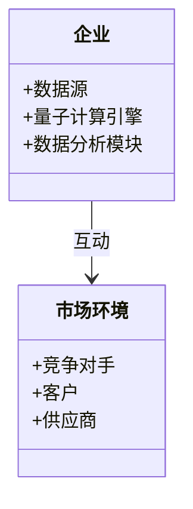
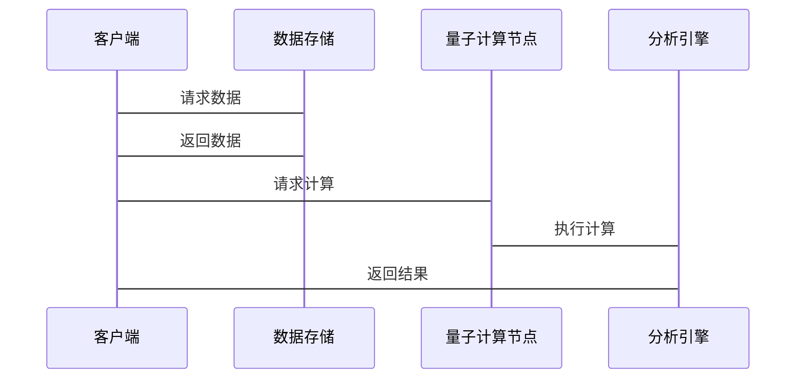

                 


# 巴菲特的护城河理论6.0：量子计算时代的竞争优势

---

## 关键词  
巴菲特, 护城河理论, 量子计算, 竞争优势, 商业战略, 技术驱动, 企业价值

---

## 摘要  
在商业竞争日益激烈的今天，巴菲特的护城河理论依然是企业制定战略的重要依据。然而，随着量子计算等新兴技术的崛起，传统的护城河概念正在发生深刻的变化。本文将从护城河理论的起源与发展出发，分析量子计算对商业环境的影响，并探讨在量子计算时代如何构建新的竞争优势。通过结合数学模型、系统架构设计和实际案例，本文将详细阐述护城河理论在量子计算时代的演变及其对企业价值的深远影响。

---

## 第1章: 护城河理论的起源与发展

### 1.1 巴菲特护城河理论的提出

#### 1.1.1 巴菲特投资理念的形成
巴菲特的投资理念起源于对价值投资的深刻理解。他强调寻找具有持续竞争优势的企业，这些企业能够在长期的竞争中保持高回报率。护城河理论正是这一理念的核心工具之一。

#### 1.1.2 护城河理论的核心概念
护城河理论的核心在于识别那些能够为公司提供长期竞争优势的要素，例如品牌优势、成本优势、网络效应等。这些要素能够防止竞争对手侵蚀公司的市场份额，并确保公司在行业中的领先地位。

#### 1.1.3 从护城河1.0到6.0的演进历程
随着技术的进步和商业环境的变化，护城河理论也在不断进化。从最初的经济护城河到现在的量子计算时代，护城河理论经历了多个版本的更新，每一次升级都反映了时代技术与商业策略的变革。

---

### 1.2 量子计算时代的商业环境

#### 1.2.1 量子计算的基本概念
量子计算是一种基于量子力学原理的计算方式，其核心是利用量子叠加和量子纠缠的特性来处理信息。与传统计算机相比，量子计算机在某些特定问题上具有巨大的优势，例如大数分解和优化问题。

#### 1.2.2 量子计算与经典计算的区别
传统计算机使用二进制位进行计算，而量子计算机使用量子位（qubit）进行计算。量子位可以同时处于多个状态的叠加态，这使得量子计算机在处理复杂问题时具有更高的效率。

#### 1.2.3 量子计算对商业环境的影响
量子计算的应用将彻底改变商业环境。它不仅能够加速药物研发、优化供应链管理，还能在金融领域进行复杂的市场预测和风险评估。这些变化将对企业竞争优势产生深远影响。

---

## 第2章: 护城河理论的核心要素与量子计算的结合

### 2.1 护城河理论的核心要素

#### 2.1.1 经济护城河的定义
经济护城河是指企业在经济活动中形成的独特优势，使其能够在长期竞争中获得超额利润。这种优势可能来自于成本优势、专利保护、网络效应等。

#### 2.1.2 经济护城河的类型
- **成本优势**：企业通过规模经济或技术优势降低生产成本，从而在价格竞争中占据优势。
- **专利保护**：企业通过专利技术获得市场独占权，防止竞争对手进入市场。
- **网络效应**：用户数量的增加会增强产品的价值，形成正反馈效应。

#### 2.1.3 经济护城河的评估标准
评估经济护城河的强弱需要考虑其可持续性、可模仿性和防御性。一个强大的护城河能够有效防止竞争对手的侵蚀，并为企业带来长期的超额收益。

---

### 2.2 量子计算时代的新护城河要素

#### 2.2.1 数据护城河
数据是量子计算时代的核心资源。企业通过收集和分析海量数据，利用量子计算技术进行深度挖掘，能够获得独特的市场洞察力。

#### 2.2.2 技术护城河
量子计算技术本身就是一个强大的护城河。拥有量子计算能力的企业能够在某些领域中获得先发优势，例如密码学、优化问题和药物研发。

#### 2.2.3 计算能力护城河
在量子计算时代，计算能力直接决定企业的竞争优势。拥有更强大的量子计算能力，企业能够更快地解决复杂问题，从而在市场中占据领先地位。

---

### 2.3 量子计算对企业竞争优势的影响

#### 2.3.1 传统护城河的局限性
传统的护城河要素在面对量子计算时显得力不从心。例如，基于经典计算的成本优势可能被量子计算的效率优势所取代。

#### 2.3.2 量子计算时代护城河的新特点
- **技术驱动**：护城河的构建越来越依赖于技术创新，尤其是量子计算、人工智能等前沿技术。
- **数据驱动**：数据成为护城河的核心要素，企业需要通过数据的收集、分析和应用来维持竞争优势。
- **生态驱动**：护城河的构建不再局限于企业内部，而是需要构建一个包含供应商、合作伙伴和用户的生态系统。

#### 2.3.3 量子计算如何重构护城河
量子计算的应用将重新定义护城河的内涵。企业需要将量子计算技术与现有业务相结合，形成新的竞争优势。

---

## 第3章: 量子计算时代的护城河构建

### 3.1 数据驱动的护城河构建

#### 3.1.1 数据收集与处理
企业需要通过多种渠道收集数据，并利用量子计算技术进行高效处理。数据的质量和数量直接决定了护城河的强弱。

#### 3.1.2 数据分析与应用
通过量子计算技术对数据进行深度分析，企业能够发现新的市场机会，并优化现有的业务流程。

#### 3.1.3 数据安全与隐私保护
数据是企业的核心资产，保护数据的安全性和隐私性是构建数据护城河的重要环节。企业需要采用先进的加密技术和安全策略来确保数据的安全。

---

### 3.2 技术驱动的护城河构建

#### 3.2.1 量子计算技术的应用
企业需要将量子计算技术应用于核心业务中，例如优化问题、药物研发和金融建模。通过量子计算，企业能够更快地解决复杂问题，获得竞争优势。

#### 3.2.2 人工智能与量子计算的结合
人工智能和量子计算的结合将极大地提升企业的创新能力。量子计算可以加速机器学习算法的训练过程，提高模型的准确性和效率。

#### 3.2.3 技术创新与专利布局
企业需要积极进行技术创新，并通过专利布局来保护自身的技术优势。这不仅是构建护城河的重要手段，也是防止竞争对手模仿的有效策略。

---

## 第4章: 量子计算时代的护城河数学模型

### 4.1 护城河理论的数学模型

#### 4.1.1 经济护城河的收益函数
$$ \text{收益} = f(\text{价格}, \text{成本}, \text{销量}) $$  
其中，价格和成本受护城河的影响，销量则取决于市场占有率。

#### 4.1.2 量子计算时代的成本函数
$$ \text{成本} = g(\text{计算能力}, \text{数据量}, \text{算法复杂度}) $$  
量子计算的应用可以显著降低某些问题的计算成本。

#### 4.1.3 竞争优势的评估公式
$$ \text{竞争优势} = h(\text{护城河强度}, \text{市场环境}, \text{技术进步}) $$  
竞争优势的评估需要综合考虑护城河的强度、市场环境的变化和技术进步的速度。

---

### 4.2 量子计算的数学基础

#### 4.2.1 量子叠加原理
$$ |\psi\rangle = \alpha|0\rangle + \beta|1\rangle $$  
量子叠加原理是量子计算的基础，它使得量子计算机能够在同一时间处理多个状态。

#### 4.2.2 量子纠缠原理
$$ |\psi\rangle = \frac{1}{\sqrt{2}}(|0\rangle|1\rangle - |1\rangle|0\rangle) $$  
量子纠缠使得量子系统中的粒子之间形成强大的关联性，这在某些计算任务中具有重要应用。

#### 4.2.3 量子算法的复杂度
量子算法的复杂度通常低于经典算法，例如Shor算法在大数分解问题上具有指数级的优势。

---

## 第5章: 量子计算时代的系统架构设计

### 5.1 系统功能设计

#### 5.1.1 领域模型


#### 5.1.2 系统架构


#### 5.1.3 交互序列图


---

### 5.2 系统架构设计

#### 5.2.1 系统功能设计
- 数据采集与处理：通过多种渠道收集数据，并利用量子计算技术进行高效处理。
- 数据分析与应用：利用量子计算技术对数据进行深度分析，生成有价值的洞察。
- 数据安全与隐私保护：确保数据的安全性和隐私性，防止数据泄露和滥用。

#### 5.2.2 系统架构设计
- **数据层**：包括数据存储、数据处理和数据安全模块。
- **计算层**：包括量子计算引擎和经典计算引擎。
- **应用层**：包括数据分析模块和业务应用模块。

#### 5.2.3 系统接口设计
- **数据接口**：用于数据的输入和输出。
- **计算接口**：用于量子计算任务的提交和结果的返回。
- **应用接口**：用于业务应用的调用和数据的展示。

---

## 第6章: 量子计算时代的护城河实战

### 6.1 项目实战

#### 6.1.1 项目背景
假设我们是一家金融公司，希望通过量子计算技术提升市场预测的准确性，构建数据护城河。

#### 6.1.2 项目实施
1. **环境安装**：安装量子计算开发环境和相关工具。
2. **数据准备**：收集市场数据，包括历史价格、成交量、市场情绪等。
3. **算法实现**：利用量子计算技术开发市场预测算法。
4. **模型训练**：对算法进行训练和优化，提高预测准确率。
5. **结果分析**：分析预测结果，评估护城河的效果。

#### 6.1.3 代码实现
```python
import quantum_module

def predict_market(price_data):
    # 数据预处理
    processed_data = quantum_module.preprocess(price_data)
    # 量子计算
    result = quantum_module.quantum_predict(processed_data)
    return result

# 示例运行
data = [...]  # 历史价格数据
prediction = predict_market(data)
print("预测结果:", prediction)
```

---

### 6.2 项目小结

#### 6.2.1 项目总结
通过量子计算技术，我们成功构建了一个数据驱动的护城河，提升了市场预测的准确率，增强了企业的竞争优势。

#### 6.2.2 最佳实践
- 选择合适的量子计算平台和工具。
- 确保数据的质量和安全性。
- 定期优化算法和模型，保持竞争优势。

#### 6.2.3 注意事项
- 数据的隐私和安全问题需要高度重视。
- 量子计算技术的应用需要专业团队的支持。
- 持续关注技术进步和市场变化，及时调整护城河策略。

---

## 第7章: 总结与展望

### 7.1 总结

#### 7.1.1 量子计算时代护城河的核心要素
- 数据驱动
- 技术驱动
- 生态驱动

#### 7.1.2 量子计算对商业环境的影响
量子计算的应用将彻底改变商业环境，为企业提供新的竞争优势。

#### 7.1.3 量子计算时代护城河的构建策略
企业需要结合自身的实际情况，选择合适的技术和方法，构建具有持续竞争优势的护城河。

---

### 7.2 展望

#### 7.2.1 量子计算技术的未来发展
随着量子计算技术的不断进步，其应用领域将更加广泛，为企业提供更多的竞争优势。

#### 7.2.2 护城河理论的未来发展
护城河理论将继续进化，与新兴技术深度融合，为企业提供更加全面的竞争优势。

---

## 作者：AI天才研究院/AI Genius Institute & 禅与计算机程序设计艺术 /Zen And The Art of Computer Programming

