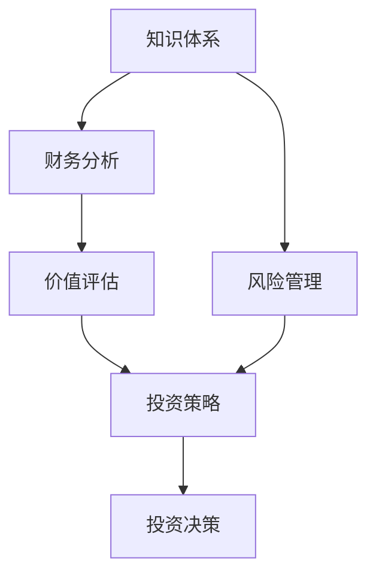

                 

# 巴菲特的读书习惯：投资智慧的来源

## 关键词：巴菲特，阅读习惯，投资智慧，价值投资，投资策略

## 摘要：本文深入探讨了巴菲特的读书习惯及其对投资智慧的影响。通过分析巴菲特的阅读策略、投资理念以及实际案例，揭示了如何通过系统化的方法提升投资决策的准确性。文章结合技术语言，从背景介绍到系统分析，详细阐述了巴菲特的投资智慧，并提供了实践性的建议。

---

# 第1章 巴菲特的生平与投资理念

## 1.1 巴菲特的成长经历

### 1.1.1 早年生活与教育背景

沃伦·巴菲特（Warren Buffett）于1930年8月31日出生于美国堪萨斯州的奥马哈市。他的父亲Howard Buffett是一位成功的股票经纪人和律师，母亲Frances Buffett来自一个富裕的家庭。巴菲特从小就展现出对数字和投资的浓厚兴趣，他在青少年时期就开始研究股票市场，并在高中时期出版了一本关于奥马哈市交通系统的手册。

### 1.1.2 初入职场的经历

巴菲特在内布拉斯加大学学习经济学，但很快对股票投资产生了浓厚兴趣。他曾在纽约证券交易所的场内交易员职位工作，这段经历使他熟悉了股票市场的运作机制。随后，他进入哥伦比亚大学，师从本杰明·格雷厄姆（Benjamin Graham），格雷厄姆的价值投资理念对巴菲特的投资风格产生了深远影响。

### 1.1.3 巴菲特投资理念的形成

巴菲特的投资理念以价值投资为核心，强调寻找具有长期竞争优势的公司，并以合理的价格买入并长期持有。他的投资哲学强调安全边际、内在价值和市场先生的概念。这种理念使他在投资领域取得了巨大的成功。

---

# 第2章 巴菲特的阅读习惯

## 2.1 巴菲特的阅读范围

### 2.1.1 巴菲特喜欢阅读的书籍类型

巴菲特一生阅读的书籍涵盖了广泛的领域，包括金融、经济学、心理学、历史和传记等。他特别喜欢那些能够帮助他理解人类行为、市场运作和企业价值的书籍。例如，他多次提到过本杰明·格雷厄姆的《聪明的投资者》和菲利普斯·费雪的《如何选择成长股》。

### 2.1.2 巴菲特的阅读清单

巴菲特的阅读清单包括以下经典书籍：
- 《聪明的投资者》（The Intelligent Investor）——本杰明·格雷厄姆
- 《如何选择成长股》（Common Stocks and Uncommon Profits）——菲利普斯·费雪
- 《富爸爸穷爸爸》（Rich Dad Poor Dad）——罗伯特·清崎
- 《人性的弱点》（How to Win Friends and Influence People）——戴尔·卡耐基
- 《道德情操与政治哲学》（The Theory of Moral Sentiments）——亚当·斯密

### 2.1.3 巴菲特对书籍的选择标准

巴菲特选择书籍的标准非常严格，他倾向于阅读那些能够提供深刻见解、经过时间验证以及能够帮助他改进投资决策的书籍。他认为，阅读的质量远比数量重要。

## 2.2 巴菲特的阅读方法

### 2.2.1 巴菲特的阅读时间管理

巴菲特每天至少花费5-6小时阅读，他认为阅读是学习和成长的重要途径。他尤其喜欢在早晨阅读，因为这个时间段他的思维最为清晰。

### 2.2.2 巴菲特的笔记技巧

巴菲特的笔记方法非常简单，他喜欢在书籍的空白处做批注，记录下自己的思考和疑问。他认为，笔记不仅是对知识的整理，更是对思想的深化。

### 2.2.3 巴菲特的复盘与反思

巴菲特在阅读后会定期复盘，将书中的关键观点与自己的投资实践相结合。他会思考这些观点如何影响自己的投资决策，并在实践中不断调整和完善。

## 2.3 巴菲特阅读习惯的影响

### 2.3.1 阅读对巴菲特投资决策的影响

巴菲特的阅读习惯使他能够深入理解企业的内在价值和市场动态。他通过阅读学会了如何识别具有长期竞争优势的企业，并在市场波动中保持冷静。

### 2.3.2 阅读对巴菲特风险管理的启示

巴菲特从阅读中学会了如何评估风险和不确定性。他认为，风险管理是投资成功的关键，而阅读帮助他更好地理解风险的本质和应对策略。

### 2.3.3 阅读对巴菲特长期投资策略的塑造

巴菲特的阅读习惯使他形成了长期投资的策略。他认为，短期市场的波动无法预测，而企业的长期价值才是投资的核心。

---

# 第3章 巴菲特的阅读与投资智慧

## 3.1 巴菲特的阅读与投资理念

### 3.1.1 价值投资的核心理念

巴菲特的价值投资理念强调购买具有长期竞争优势的企业，并以合理的价格买入。他认为，市场的短期波动并不能决定企业的长期价值。

### 3.1.2 股票投资的长期视角

巴菲特认为，成功的投资需要耐心和长期视角。他通过阅读不断加深对企业价值的理解，并在长期投资中实现收益最大化。

### 3.1.3 巴菲特的选股标准

巴菲特的选股标准包括企业的财务健康状况、管理层的诚信、企业的竞争优势以及企业的盈利能力。他通过阅读相关书籍和案例，不断完善自己的选股标准。

## 3.2 巴菲特的阅读与投资决策

### 3.2.1 阅读对投资决策的影响

巴菲特的阅读习惯使他能够从多个角度分析企业的价值，包括财务状况、管理层素质、市场地位和竞争优势。他认为，阅读是理解企业内在价值的重要途径。

### 3.2.2 巴菲特的投资策略

巴菲特的投资策略以价值投资为核心，他通过阅读和分析企业基本面，寻找那些具有长期增长潜力的企业。他认为，投资成功的秘诀在于找到那些具有强大护城河的企业，并以合理的价格买入。

### 3.2.3 巴菲特的成功案例

巴菲特的经典投资案例包括可口可乐和苹果公司。他通过阅读和分析这些企业的财务报表和市场地位，成功识别出它们的长期增长潜力。

---

# 第4章 巴菲特的投资策略与智慧

## 4.1 巴菲特的投资策略

### 4.1.1 价值投资的数学模型

价值投资的核心是寻找那些市场价格低于内在价值的企业。巴菲特的数学模型如下：

$$ \text{内在价值} = \frac{\text{净利润} \times (1 + \text{增长率})}{\text{折现率} - \text{增长率}} $$

这个模型帮助投资者估算企业的长期价值，并在市场价格低于内在价值时进行投资。

### 4.1.2 安全边际的重要性

巴菲特认为，安全边际是投资成功的关键。他通过阅读和分析企业的财务数据，确定企业的内在价值，并在市场价格低于内在价值时买入。

### 4.1.3 长期持有与复利效应

巴菲特的投资策略强调长期持有，通过复利效应实现财富的持续增长。他认为，复利是投资的奇迹，而长期持有是实现复利的最佳方式。

## 4.2 巴菲特的智慧

### 4.2.1 投资中的风险管理

巴菲特认为，风险管理是投资成功的关键。他通过阅读和分析企业的财务数据，识别潜在的风险，并在投资决策中考虑这些风险。

### 4.2.2 投资中的心理因素

巴菲特非常重视心理因素在投资中的作用。他认为，投资者的情绪波动是市场波动的主要原因。通过阅读心理学相关的书籍，他学会了如何控制自己的情绪，并在市场波动中保持冷静。

### 4.2.3 投资中的长期视角

巴菲特的投资策略强调长期视角，他认为市场的短期波动无法决定企业的长期价值。通过阅读和分析企业的长期趋势，他能够在市场波动中找到投资机会。

---

# 第5章 巴菲特的阅读习惯对个人投资者的启示

## 5.1 培养阅读习惯的重要性

### 5.1.1 阅读是投资成功的基石

巴菲特的成功离不开他的阅读习惯。他认为，阅读是投资成功的基石，通过阅读可以不断学习和成长。

### 5.1.2 阅读的质量胜过数量

巴菲特强调，阅读的质量远比数量重要。他建议投资者选择那些能够提供深刻见解的书籍，并在阅读后进行深入思考。

### 5.1.3 阅读与实践相结合

巴菲特认为，阅读的目的是为了实践。他通过阅读不断完善自己的投资策略，并在实践中不断调整和完善。

## 5.2 培养投资智慧的步骤

### 5.2.1 确定投资目标

投资者需要明确自己的投资目标，并制定相应计划。通过阅读和学习，可以更好地理解投资的本质。

### 5.2.2 学习投资知识

投资者需要系统地学习投资知识，包括财务分析、价值评估和风险管理等内容。通过阅读相关书籍和案例，可以不断加深对投资的理解。

### 5.2.3 建立投资策略

投资者需要根据自己的知识和经验，制定适合自己的投资策略。通过阅读和实践，可以不断完善自己的投资策略。

---

# 第6章 巴菲特的阅读习惯与投资智慧的局限性

## 6.1 巴菲特投资策略的局限性

### 6.1.1 价值投资的局限性

虽然价值投资在长期中表现优异，但在短期市场波动中可能会面临较大的风险。例如，在2008年金融危机期间，许多价值投资者遭受了重大损失。

### 6.1.2 市场变化的挑战

市场的变化可能会导致价值投资策略失效。例如，科技股的崛起对传统的价值投资策略提出了挑战。

### 6.1.3 个人偏见的影响

巴菲特的投资决策也可能受到个人偏见的影响。例如，他对科技股的投资相对保守，这可能与他过去的经验和阅读习惯有关。

## 6.2 现代市场的挑战

### 6.2.1 科技创新的挑战

现代市场的科技创新对传统投资策略提出了挑战。投资者需要不断学习新技术和新商业模式，以适应市场的变化。

### 6.2.2 全球化与国际化

全球化和国际化的背景下，投资者需要更加关注全球市场和经济趋势。巴菲特的阅读习惯和投资策略需要适应这些变化。

### 6.2.3 数字化与数据驱动的投资

随着大数据和人工智能的兴起，数据驱动的投资策略逐渐成为主流。巴菲特的投资策略需要结合这些新技术，以保持竞争优势。

---

# 第7章 巴菲特的阅读习惯与投资智慧的系统分析

## 7.1 系统架构设计

### 7.1.1 知识体系的构建

巴菲特的阅读习惯构建了一个完整的知识体系，包括财务分析、价值评估、风险管理等方面。这种知识体系帮助他形成了独特的优势。

### 7.1.2 决策流程的优化

巴菲特的阅读习惯优化了他的决策流程，使他在投资决策中更加高效和准确。

### 7.1.3 系统架构的可视化

以下是巴菲特知识体系的mermaid图：

---

# 第8章 巴菲特的阅读习惯与投资智慧的项目实战

## 8.1 环境安装

### 8.1.1 投资知识储备

投资者需要系统地学习投资知识，包括财务分析、价值评估和风险管理等内容。

### 8.1.2 工具准备

投资者需要准备相关的工具，包括财务报表分析工具、股票筛选工具和数据分析工具。

## 8.2 核心实现

### 8.2.1 投资策略的制定

投资者需要根据自己的知识和经验，制定适合自己的投资策略。例如，选择具有长期竞争优势的企业，并以合理的价格买入。

### 8.2.2 投资组合的构建

投资者需要构建一个多元化投资组合，以分散风险并实现长期收益。

### 8.2.3 投资组合的管理

投资者需要定期评估投资组合的表现，并根据市场变化进行调整。

## 8.3 实际案例分析

### 8.3.1 巴菲特的经典投资案例

巴菲特的经典投资案例包括可口可乐和苹果公司。他通过阅读和分析这些企业的财务报表和市场地位，成功识别出它们的长期增长潜力。

### 8.3.2 小结

通过分析巴菲特的经典投资案例，投资者可以更好地理解他的投资策略和阅读习惯对投资决策的影响。

---

# 第9章 巴菲特的阅读习惯与投资智慧的最佳实践

## 9.1 投资者小结

### 9.1.1 阅读的重要性

巴菲特的成功离不开他的阅读习惯。他认为，阅读是投资成功的基石，通过阅读可以不断学习和成长。

### 9.1.2 长期视角的重要性

巴菲特的投资策略强调长期视角，他认为市场的短期波动无法决定企业的长期价值。

### 9.1.3 安全边际的重要性

巴菲特认为，安全边际是投资成功的关键。他通过阅读和分析企业的财务数据，确定企业的内在价值，并在市场价格低于内在价值时买入。

## 9.2 投资者的注意事项

### 9.2.1 风险管理的重要性

投资者需要高度重视风险管理，通过阅读和分析企业的财务数据，识别潜在的风险，并在投资决策中考虑这些风险。

### 9.2.2 心理因素的控制

投资者需要控制自己的情绪，避免因市场的短期波动而做出冲动的决策。

### 9.2.3 持续学习的重要性

投资者需要不断学习投资知识，保持对市场变化的敏感性，并根据市场变化调整自己的投资策略。

## 9.3 投资者的拓展阅读

### 9.3.1 投资相关的书籍推荐

以下是几本与投资相关的书籍推荐：
- 《聪明的投资者》（The Intelligent Investor）——本杰明·格雷厄姆
- 《如何选择成长股》（Common Stocks and Uncommon Profits）——菲利普斯·费雪
- 《富爸爸穷爸爸》（Rich Dad Poor Dad）——罗伯特·清崎
- 《人性的弱点》（How to Win Friends and Influence People）——戴尔·卡耐基
- 《道德情操与政治哲学》（The Theory of Moral Sentiments）——亚当·斯密

### 9.3.2 投资相关的网站和资源

投资者可以参考以下网站和资源，获取更多的投资知识和信息：
- 投资者关系网（Investor Relations）
- 财务报表分析工具（Financial Statement Analysis Tools）
- 股票筛选工具（Stock Screening Tools）
- 数据分析工具（Data Analysis Tools）

---

# 作者：AI天才研究院/AI Genius Institute & 禅与计算机程序设计艺术 /Zen And The Art of Computer Programming

---

这篇文章通过详细分析巴菲特的阅读习惯、投资策略和智慧，为投资者提供了丰富的学习资源和实践指导。从背景介绍到系统分析，再到项目实战，文章全面覆盖了巴菲特的投资哲学，并结合技术语言，为读者提供了深刻的投资洞察。

