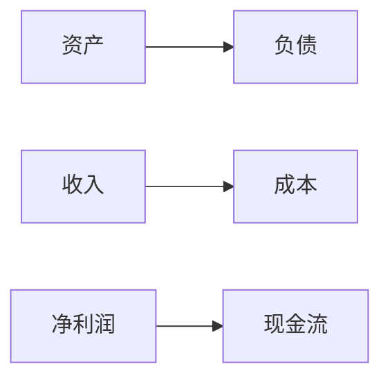

                 

# 巴菲特的财务报表分析：解读数字经济时代的新指标

> 关键词：巴菲特，财务报表分析，数字经济，新指标，投资策略

> 摘要：本文深入探讨了巴菲特的财务报表分析方法在数字经济时代的演变，分析了传统财务指标与新兴指标的区别与联系，并通过实际案例展示了如何在数字经济时代应用新指标进行投资决策。

---

## 第1章：巴菲特的财务报表分析概述

### 1.1 财务报表分析的背景与意义

#### 1.1.1 财务报表分析的基本概念

财务报表分析是通过对公司财务报表（资产负债表、利润表、现金流量表）的解读，评估公司的财务状况、盈利能力和现金流量，从而为投资决策提供依据。传统财务报表分析主要关注企业的财务健康状况，但在数字经济时代，新的指标和方法逐渐崛起。

#### 1.1.2 巴菲特的财务报表分析方法

巴菲特以价值投资闻名，他的财务报表分析方法注重企业的基本面，尤其是ROE（净资产收益率）和毛利率等指标。他倾向于投资那些具有持续盈利能力、良好财务状况和稳定股息支付的公司。

#### 1.1.3 数字经济时代的新指标需求

随着数字经济的发展，数据资产和用户行为对企业价值的影响越来越大。传统财务报表难以全面反映企业的数字资产和数据驱动的盈利能力，因此需要引入新的指标，如用户生命周期价值（CLV）和数据资产价值评估。

---

### 1.2 巴菲特投资理念的核心要素

#### 1.2.1 巴菲特的价值投资理念

巴菲特的价值投资理念强调以低于内在价值的价格买入优质企业。他注重企业的可持续盈利能力、管理层诚信和行业地位。财务报表分析是评估这些因素的重要工具。

#### 1.2.2 财务报表分析在巴菲特投资中的地位

在巴菲特的投资决策中，财务报表分析是核心步骤之一。他通过分析利润表、资产负债表和现金流量表，评估企业的盈利能力和财务健康状况。

#### 1.2.3 巴菲特分析方法的演变

随着数字经济的发展，巴菲特的分析方法也在不断演变。他开始关注数据资产、用户增长和数字化转型对企业价值的影响。

---

### 1.3 传统财务报表分析与新指标的对比

#### 1.3.1 传统财务报表分析的局限性

传统财务报表分析主要关注企业的财务数据，难以反映数据资产的价值和用户行为的影响。此外，传统指标如ROE和毛利率在数字经济时代的重要性相对下降。

#### 1.3.2 数字经济时代的新指标特征

新指标如用户生命周期价值（CLV）和数据资产价值评估，能够更好地反映数字经济时代企业的价值。这些指标结合了用户行为和数据驱动的盈利模式。

#### 1.3.3 新旧指标的融合与创新

新旧指标并非完全割裂，而是可以相互补充。例如，将用户生命周期价值与传统ROE结合，可以更全面地评估企业的价值。

---

## 第2章：财务报表的核心结构与指标

### 2.1 财务报表的基本结构

#### 2.1.1 资产负债表

资产负债表反映了企业在某一特定时点的资产、负债和所有者权益。资产包括流动资产和非流动资产，负债包括流动负债和非流动负债。

#### 2.1.2 利润表

利润表反映了企业在一定会计期间的收入、费用和利润。收入减去费用等于利润，是评估企业盈利能力的重要指标。

#### 2.1.3 现金流量表

现金流量表反映了企业在一定会计期间的现金流入和流出。现金流量分为经营活动、投资活动和筹资活动三部分。

---

### 2.2 核心财务指标分析

#### 2.2.1 资产负债率

资产负债率 = 负债总额 / 资产总额

资产负债率越低，企业的财务杠杆越小，风险越小。但过低的资产负债率可能意味着企业没有充分利用财务杠杆。

#### 2.2.2 净利润率

净利润率 = 净利润 / 收入

净利润率越高，企业的盈利能力越强。但需要注意收入的质量和成本控制。

#### 2.2.3 现金流健康度

现金流健康度 = 现金流入 / 现金流出

健康的现金流是企业持续经营的基础。正现金流意味着企业能够自给自足，负现金流可能需要外部融资。

---

### 2.3 数字经济时代的新指标

#### 2.3.1 用户生命周期价值（CLV）

用户生命周期价值 = 用户在生命周期内为企业带来的总收入 - 获取用户的成本

CLV可以帮助企业评估用户的长期价值，尤其是在订阅制和会员制模式下。

#### 2.3.2 数字资产的评估

数字资产包括数据、算法、用户画像等。数字资产的评估需要考虑数据的规模、质量和应用场景。

#### 2.3.3 数据驱动的预测指标

数据驱动的预测指标包括预测收入、预测成本和预测利润。这些指标基于历史数据和机器学习模型，能够更准确地预测未来表现。

---

### 2.4 核心概念与联系

#### 2.4.1 核心概念原理

传统财务指标和新指标各有侧重，传统指标关注企业的财务健康，新指标关注数据资产和用户价值。两者结合可以更全面地评估企业的价值。

#### 2.4.2 指标对比表格

| 指标名称       | 传统定义                     | 新指标定义                           |
|----------------|------------------------------|--------------------------------------|
| 资产负债率      | 负债总额 / 资产总额           | 数字负债 / 数字资产                  |
| 净利润率        | 净利润 / 收入               | 数据驱动利润 / 收入                 |
| 现金流健康度    | 现金流入 - 现金流出          | 数字现金流健康度                    |
| 用户生命周期价值| 用户在生命周期内为企业带来的总收入 - 获取用户的成本 | 用户在生命周期内为企业带来的总收入 - 获取用户的成本 |

#### 2.4.3 实体关系图

---

## 第3章：巴菲特的财务报表分析方法

### 3.1 财务报表分析的步骤与流程

#### 3.1.1 确定分析目标

明确分析的目标，例如评估企业的盈利能力或财务风险。

#### 3.1.2 收集数据与资料

收集企业的财务报表、行业数据和市场信息，确保数据的准确性和完整性。

#### 3.1.3 数据清洗与预处理

对数据进行清洗，处理缺失值和异常值，确保数据适合分析。

---

### 3.2 巴菲特的分析框架

#### 3.2.1 股东权益变动分析

股东权益变动分析 = 期末股东权益 - 期初股东权益

股东权益变动反映了企业的资本变化，包括净利润、股息分配和资本公积变化。

#### 3.2.2 资产质量评估

资产质量评估需要关注资产的流动性、周转率和减值情况，尤其是在数字经济时代，数据资产的质量尤为重要。

#### 3.2.3 现金流健康度评估

现金流健康度评估需要关注经营活动、投资活动和筹资活动的现金流，确保企业的现金流动性。

---

### 3.3 数字经济时代的新分析方法

#### 3.3.1 数据驱动的预测模型

数据驱动的预测模型基于机器学习算法，通过历史数据预测未来的财务表现。例如，使用线性回归预测收入增长率。

#### 3.3.2 用户行为分析

用户行为分析通过分析用户的行为数据，评估用户的活跃度、留存率和转化率，从而影响企业的用户生命周期价值。

#### 3.3.3 数字资产的评估与定价

数字资产的评估需要考虑数据的规模、质量和应用场景。定价可以通过市场比较法或成本法进行。

---

### 3.4 算法原理讲解

#### 3.4.1 贴现现金流模型（DCF）

贴现现金流模型（DCF）通过预测未来现金流并将其贴现为现值，评估企业的内在价值。

步骤：
1. 预测未来现金流。
2. 选择合适的贴现率。
3. 计算未来现金流的现值。
4. 计算企业价值。

公式：
$$
\text{企业价值} = \sum_{t=1}^{n} \frac{\text{现金流}_t}{(1 + r)^t}
$$

其中，\( r \) 是贴现率。

#### 3.4.2 用户生命周期价值模型

用户生命周期价值（CLV）模型基于用户在生命周期内为企业带来的总收入和获取用户的成本。

公式：
$$
\text{CLV} = \frac{\text{平均收入} \times \text{平均生命周期} - \text{获取成本}}{\text{贴现率}}
$$

---

### 3.5 本章小结

本章介绍了巴菲特的财务报表分析方法，包括分析步骤、框架和数字经济时代的新分析方法。通过结合传统方法和新指标，可以更全面地评估企业的价值。

---

接下来，我将继续按照目录大纲，撰写后续章节的内容，确保每章都详细展开，涵盖所有关键点，并且内容丰富具体。

---

**作者：AI天才研究院 & 禅与计算机程序设计艺术**

