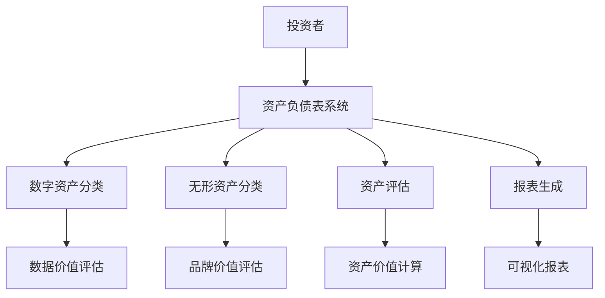
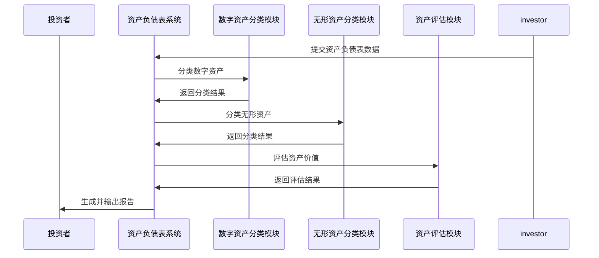

                 

# {{巴菲特的资产负债表分析：数字资产和无形资产的重新定义}}

> 关键词：{{巴菲特, 资产负债表, 数字资产, 无形资产, 投资分析}}

> 摘要：{{本文通过分析巴菲特的资产负债表分析方法，探讨数字资产和无形资产在现代投资分析中的重要性，重新定义这些资产在资产负债表中的价值评估和呈现方式。本文结合理论与实践，提供了一系列创新的分析框架和工具，以帮助投资者更好地理解和应用这些概念。}}

---

# 第1章: 巴菲特的资产负债表分析概述

## 1.1 巴菲特的投资理念与方法
### 1.1.1 巴菲特的生平与投资哲学
- 巴菲特的投资理念：价值投资、长期持有、安全边际
- 巴菲特对资产负债表分析的独特见解
- 巴菲特的“三步走”分析法：行业分析、竞争优势分析、估值分析

### 1.1.2 资产负债表的核心作用
- 资产负债表的定义与作用
- 巴菲特如何通过资产负债表评估企业财务健康状况
- 数字资产与无形资产在现代资产负债表中的重要性

### 1.1.3 数字资产与无形资产的定义与特征
- 数字资产：数据、算法、知识产权等新型资产的崛起
- 无形资产：品牌、专利、商誉等传统资产的重新定义
- 数字资产与无形资产的主要区别与联系

## 1.2 资产负债表分析的局限性
### 1.2.1 传统资产负债表分析的局限性
- 传统资产分类的不足：忽视数字资产和无形资产的动态价值
- 传统估值方法的缺陷：无法准确反映数字资产的未来收益
- 新经济环境下资产负债表分析的挑战

### 1.2.2 数字资产与无形资产的特殊性
- 数字资产的虚拟性与无限复制性
- 无形资产的非实体性和长期性
- 数字资产与无形资产对传统资产负债表的冲击

## 1.3 重新定义资产负债表的必要性
### 1.3.1 数字经济时代对资产负债表的影响
- 数字经济时代下，数字资产和无形资产的价值占比急剧上升
- 传统资产负债表无法反映企业的真正价值

### 1.3.2 巴菲特视角下的资产负债表重构
- 巴菲特如何重新定义数字资产和无形资产的价值
- 新资产负债表框架：如何将数字资产和无形资产纳入核心分析

### 1.3.3 数字资产与无形资产的会计处理创新
- 数字资产与无形资产的会计确认与计量方法
- 巴菲特对数字资产与无形资产的估值模型

---

# 第2章: 数字资产与无形资产的核心要素分析

## 2.1 数字资产的分类与特征
### 2.1.1 数字资产的分类
- 数据资产：数据本身的价值与潜力
- 算法资产：算法的可复制性和高效性
- 知识产权：专利、商标、版权的数字化转型

### 2.1.2 数字资产的特征
- 虚拟性：数字资产的无实体性
- 可扩展性：数字资产的快速复制能力
- 价值波动性：数字资产价格的高波动性

## 2.2 无形资产的分类与特征
### 2.2.1 无形资产的分类
- 品牌资产：品牌的影响力与价值
- 商誉：企业并购中的商誉评估
- 技术资产：技术的先进性和可转化性

### 2.2.2 无形资产的特征
- 非实体性：无形资产的抽象性
- 长期性：无形资产的持续价值
- 难以量化：无形资产的评估难度

## 2.3 数字资产与无形资产的对比分析
### 2.3.1 数字资产与无形资产的属性对比
| 资产类型 | 数字资产 | 无形资产 |
|----------|----------|----------|
| 定义     | 数据、算法、知识产权等数字化资产 | 品牌、专利、商誉等非实体资产 |
| 特征     | 虚拟性、可扩展性、价值波动性 | 非实体性、长期性、难以量化 |
| 评估方法 | 数据驱动、算法模型、市场法 | 品牌价值评估、商誉评估、技术评估 |

### 2.3.2 数字资产与无形资产的相互关系
- 数字资产是无形资产的一部分
- 无形资产是数字资产的延伸

---

# 第3章: 资产负债表分析的创新框架

## 3.1 传统资产负债表分析的局限性
### 3.1.1 传统资产分类的不足
- 传统资产负债表对数字资产和无形资产的忽视
- 传统估值方法对数字资产的误判

### 3.1.2 传统负债与所有者权益分析的局限性
- 传统负债分类无法反映数字负债（如数据债务）
- 传统所有者权益分析忽略数字资产的增值

## 3.2 巴菲特的资产负债表重构方法
### 3.2.1 新资产负债表的核心要素
- 数字资产与无形资产的独立分类
- 数字负债与传统负债的区分

### 3.2.2 新资产负债表的结构优化
- 资产负债表的分层结构：数字资产与无形资产的独立板块
- 负债与所有者权益的重新定义

## 3.3 数字资产与无形资产的评估模型
### 3.3.1 数字资产的评估模型
- 数据价值评估：基于数据的使用价值和潜在价值
- 算法价值评估：基于算法的效率和可扩展性
- 知识产权价值评估：基于知识产权的市场影响力

### 3.3.2 无形资产的评估模型
- 品牌价值评估：基于品牌知名度和市场影响力
- 商誉评估：基于企业并购后的协同效应
- 技术资产评估：基于技术的先进性和市场应用潜力

---

# 第4章: 资产负债表分析的系统实现

## 4.1 系统架构设计
### 4.1.1 系统功能模块
- 资产负债表数据录入模块
- 数字资产与无形资产分类模块
- 资产评估与价值计算模块
- 报表生成与可视化模块

### 4.1.2 系统架构图

## 4.2 系统接口设计
### 4.2.1 系统输入接口
- 资产负债表数据输入接口
- 数字资产与无形资产信息输入接口

### 4.2.2 系统输出接口
- 资产负债表分析结果输出接口
- 数字资产与无形资产价值评估报告输出接口

## 4.3 系统交互流程
### 4.3.1 用户操作流程
- 投资者输入资产负债表数据
- 系统自动分类数字资产与无形资产
- 系统评估资产价值并生成报告

### 4.3.2 系统交互序列图

---

# 第5章: 实战案例分析

## 5.1 案例背景
### 5.1.1 案例公司介绍
- 公司名称：XXX科技公司
- 主营业务：数字产品研发与销售
- 资产负债表数据：2022年年度报告

## 5.2 资产负债表分析
### 5.2.1 数字资产与无形资产分类
- 数字资产：数据、算法、知识产权
- 无形资产：品牌、商誉、技术资产

### 5.2.2 数字资产与无形资产价值评估
- 数据价值：基于数据的使用价值和市场潜力
- 算法价值：基于算法的效率和市场应用
- 知识产权价值：基于专利的市场影响力

### 5.2.3 资产负债表重构
- 新资产负债表结构：数字资产与无形资产独立分类
- 资产负债表的分层结构优化

## 5.3 分析结果与投资建议
### 5.3.1 分析结果
- 数字资产与无形资产的总价值
- 资产负债表重构后的财务健康状况

### 5.3.2 投资建议
- 投资者的决策建议
- 企业优化建议

---

# 第6章: 总结与展望

## 6.1 本章小结
- 巴菲特的资产负债表分析方法的核心要点
- 数字资产与无形资产的重新定义对投资分析的深远影响
- 新资产负债表框架的优势与不足

## 6.2 未来展望
- 数字资产与无形资产的进一步研究方向
- 新资产负债表框架的优化与完善
- 资产负债表分析在数字经济中的未来发展

---

# 作者：AI天才研究院/AI Genius Institute & 禅与计算机程序设计艺术 /Zen And The Art of Computer Programming

