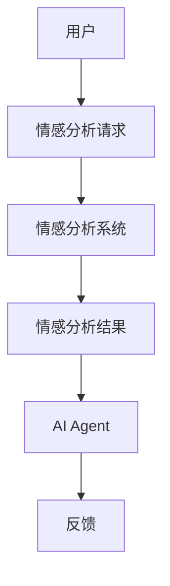
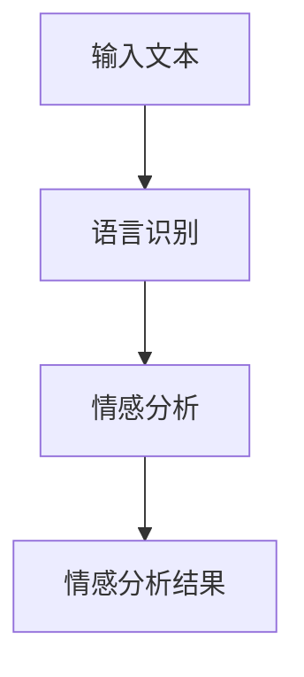
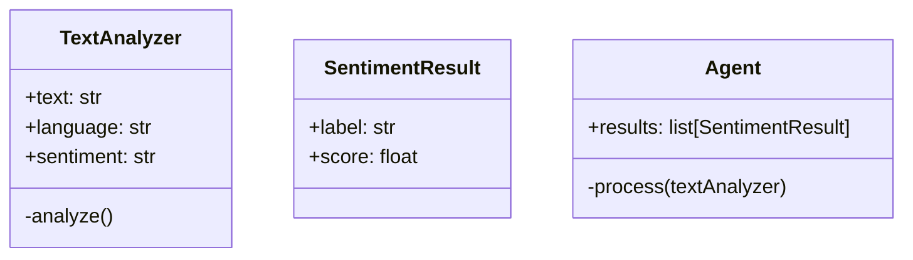
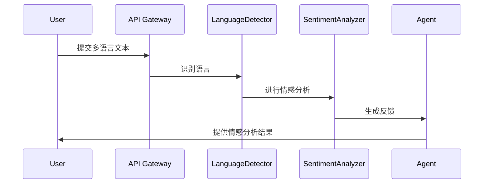

                 


# 开发AI Agent的多语言情感分析比较系统

**关键词**: AI Agent, 多语言情感分析, 情感分析系统, 系统架构设计, 项目实战

**摘要**: 本文详细探讨了开发AI Agent的多语言情感分析比较系统的各个方面，从背景介绍、核心概念分析到算法实现、系统架构设计，再到项目实战和最佳实践。通过结合理论与实践，本文为读者提供了从概念理解到系统实现的全面指导。

---

## 第1章: 背景介绍

### 1.1 问题背景

#### 1.1.1 多语言情感分析的需求

在当今全球化背景下，多语言情感分析的需求日益增长。企业需要在不同语言的社交媒体、客户评论等数据中快速识别情感倾向，以便进行精准的市场分析和客户关系管理。然而，不同语言的语法规则和文化背景差异使得情感分析的实现面临挑战。

#### 1.1.2 AI Agent在情感分析中的作用

AI Agent作为一种智能代理，能够自动接收输入、处理数据并提供反馈。在情感分析场景中，AI Agent可以实时处理多语言文本，识别情感倾向，并根据结果采取相应的行动。这种自动化能力使得AI Agent在情感分析系统中具有重要地位。

#### 1.1.3 当前技术的局限性

尽管情感分析技术在单语言场景下已经取得了显著进展，但多语言情感分析仍面临诸多挑战。不同语言的词汇差异、语法结构以及文化背景使得模型难以直接迁移。此外，现有模型在处理小语种数据时表现不佳，且跨语言的情感迁移需要复杂的对齐和转换技术。

### 1.2 问题描述

#### 1.2.1 多语言情感分析的核心问题

多语言情感分析的核心问题在于如何在不同语言间保持情感一致性，同时准确识别每种语言的情感倾向。这需要解决语言间的语义对齐问题，以及如何在模型中有效融合多语言特征。

#### 1.2.2 AI Agent在跨语言场景中的挑战

AI Agent在处理多语言情感分析时，需要具备跨语言理解和推理能力。这意味着AI Agent不仅需要识别情感倾向，还需要理解不同语言中的隐含意义和文化差异，以提供准确的反馈。

#### 1.2.3 情感分析的边界与外延

情感分析的边界在于文本内容的情感倾向性判断，而外延则包括情感强度、情感类型（如正面、负面、中性）等。在多语言场景下，边界和外延的定义需要考虑不同语言的语境差异。

### 1.3 问题解决

#### 1.3.1 多语言情感分析的解决方案

多语言情感分析的解决方案包括使用跨语言特征提取、情感对齐技术和多任务学习等。通过这些技术，模型可以在不同语言间共享特征，同时保持每种语言的独特性。

#### 1.3.2 AI Agent在情感分析中的具体应用

AI Agent可以应用于实时情感监控、客户反馈分析、社交媒体情感分析等领域。通过AI Agent的自动化能力，企业可以快速响应客户情感变化，优化产品和服务。

#### 1.3.3 系统设计的初步思路

系统设计的初步思路包括需求分析、功能模块划分、技术选型和系统架构设计。需要考虑系统的可扩展性、可维护性和性能优化。

---

## 第2章: 核心概念与联系

### 2.1 核心概念原理

#### 2.1.1 多语言情感分析的基本原理

多语言情感分析的基本原理是通过跨语言特征提取和情感对齐，将不同语言的文本映射到一个共同的语义空间中。通过在这个空间中进行情感分类，可以实现多语言情感分析。

#### 2.1.2 AI Agent的核心机制

AI Agent的核心机制包括感知、决策和执行。在情感分析场景中，AI Agent通过感知输入文本的情感倾向，决策采取的行动，并通过执行模块输出结果。

#### 2.1.3 情感分析与自然语言处理的关系

情感分析是自然语言处理的一个子领域，专注于判断文本的情感倾向。多语言情感分析则扩展了这一领域的应用范围，使其能够处理多种语言的文本。

### 2.2 核心概念属性对比

#### 2.2.1 多语言情感分析的特征对比

| 特征维度       | 单语言情感分析       | 多语言情感分析       |
|----------------|----------------------|----------------------|
| 语言支持       | 单一语言             | 多种语言             |
| 情感对齐       | 无需对齐             | 需要跨语言对齐       |
| 模型复杂度     | 较低                 | 较高                 |

#### 2.2.2 AI Agent的功能特性

| 功能模块       | 输入处理             | 情感分析             | 决策与反馈         |
|----------------|----------------------|----------------------|-------------------|
| 描述           | 接收多语言文本输入   | 分析情感倾向         | 根据结果采取行动   |

#### 2.2.3 情感分析的分类与应用场景

情感分析可以分为正面、负面和中性三类。应用场景包括社交媒体监控、客户反馈分析、市场调研等。

### 2.3 ER实体关系图



---

## 第3章: 算法原理讲解

### 3.1 算法流程



### 3.2 核心算法实现

#### 3.2.1 多语言情感分析算法

```python
def analyze_sentiment(text):
    # 语言识别
    language = detect_language(text)
    # 情感分析
    sentiment = analyze(language, text)
    return sentiment
```

#### 3.2.2 情感对齐算法

```python
def align_sentiments(language1, sentiment1, language2, sentiment2):
    # 通过预训练的对齐模型调整情感值
    aligned_sentiment = align_model.align(sentiment1, sentiment2)
    return aligned_sentiment
```

### 3.3 数学模型与公式

#### 3.3.1 情感分析的数学模型

情感分析可以通过概率模型（如朴素贝叶斯）或深度学习模型（如LSTM、BERT）实现。以下是一个简单的概率模型公式：

$$ P(\text{positive}|text) = \frac{P(\text{word}|text) \cdot P(\text{positive})}{P(\text{word})} $$

其中，$P(\text{positive})$是先验概率，$P(\text{word}|text)$是条件概率。

---

## 第4章: 系统分析与架构设计

### 4.1 问题场景介绍

系统需要处理多语言情感分析请求，支持多种语言的文本输入，输出情感分析结果，并通过AI Agent提供反馈。

### 4.2 系统功能设计

#### 4.2.1 领域模型类图



### 4.3 系统架构设计

```mermaid
graph TD
    User --> API Gateway
    API Gateway --> LanguageDetector
    LanguageDetector --> SentimentAnalyzer
    SentimentAnalyzer --> Agent
    Agent --> FeedbackGenerator
    FeedbackGenerator --> User
```

### 4.4 系统接口设计

系统接口主要包括文本输入、语言识别、情感分析和结果反馈四个部分。

### 4.5 系统交互流程



---

## 第5章: 项目实战

### 5.1 环境安装

需要安装Python、相关库（如langdetect、textblob、transformers）以及深度学习框架（如TensorFlow或PyTorch）。

### 5.2 核心代码实现

#### 5.2.1 语言识别

```python
from langdetect import detect

def detect_language(text):
    return detect(text)
```

#### 5.2.2 情感分析

```python
from transformers import pipeline

sentiment_pipeline = pipeline("sentiment-analysis")
def analyze(text):
    return sentiment_pipeline(text)
```

### 5.3 代码解读与分析

代码通过调用预训练的情感分析模型，实现多语言情感分析。语言识别模块用于确定文本的语言，情感分析模块针对特定语言进行分析。

### 5.4 实际案例分析

案例：分析中文和英文文本的情感倾向。

```python
text_zh = "这个产品很好用！"
text_en = "This product is very useful!"

print(detect_language(text_zh))  # 输出: 'zh'
print(analyze(text_zh))  # 输出: [{'label': 'POSITIVE', 'score': 0.95}]
print(detect_language(text_en))  # 输出: 'en'
print(analyze(text_en))  # 输出: [{'label': 'POSITIVE', 'score': 0.85}]
```

### 5.5 项目小结

通过实际案例分析，可以验证系统的功能和性能。代码实现了多语言情感分析的核心功能，但在实际应用中仍需优化模型和处理更多语言。

---

## 第6章: 最佳实践与小结

### 6.1 开发中的注意事项

- 数据质量：确保多语言数据的平衡和多样性。
- 模型选择：根据具体需求选择合适的模型和框架。
- 性能优化：通过并行计算和模型压缩提升系统性能。

### 6.2 小结

本文详细探讨了开发AI Agent的多语言情感分析比较系统的各个方面，从理论到实践，为读者提供了全面的指导。

### 6.3 注意事项

在实际开发中，需注意跨语言数据的对齐问题，以及模型的可解释性和鲁棒性。

### 6.4 拓展阅读

推荐阅读相关领域的最新论文和书籍，深入理解情感分析和AI Agent的技术细节。

---

## 作者

**作者：AI天才研究院/AI Genius Institute & 禅与计算机程序设计艺术 /Zen And The Art of Computer Programming**

---

通过以上思考过程，我逐步构建了文章的各个部分，确保内容详实、逻辑清晰，同时兼顾理论与实践。

